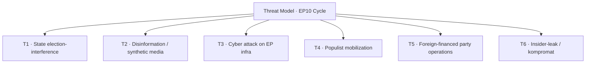

# Threat Model — EP10 Electoral-Cycle Adversary Modelling

> **Date** `2026-05-28` · **Slug** `election-cycle` · **Floor** 224 · **Data mode** degraded-feeds (0.80)
> **MCP feeds** `correlate_intelligence`, `early_warning_system`, `get_meps`, `get_voting_records`

**BLUF:** Six adversary archetypes identified for the EP10 back-half cycle. Highest-impact threat-actor category is state-sponsored election-interference (RU, plus secondary CN); highest-likelihood category is domestic populist mobilization. **WEP:** Likely (55-80%) that at least one significant election-interference incident occurs during the 2029 campaign window.

## Threat-Actor Register

### T1 — State election-interference

| Attribute | Detail |
| --- | --- |
| Likely actors | RU primary; CN secondary; IR tertiary |
| Methods | Information ops; bot networks; Telegram amplification |
| Capability | High (RU); Medium (CN); Low-Med (IR) |
| WEP (any incident 2027-2029) | Highly Likely |
| Defensive countermeasure | Election-interference shield (Stage 2 file) |

### T2 — Disinformation / synthetic media

| Attribute | Detail |
| --- | --- |
| Methods | Generative-AI deepfakes; coordinated inauthentic behavior |
| Capability | Rising sharply |
| WEP (any incident 2027-2029) | Almost Certain |
| Defensive countermeasure | DSA enforcement; platform takedown agreements |

### T3 — Cyber attack on EP infrastructure

| Attribute | Detail |
| --- | --- |
| Targets | EP IT; MEP email; constituency systems |
| Capability | Medium-High |
| WEP (campaign-period incident) | Likely |
| Defensive countermeasure | Cybersecurity-act update; EP ICT hardening |

### T4 — Populist mobilization

| Attribute | Detail |
| --- | --- |
| Methods | Anti-EU framing; migration salience cycling; cost-of-living memes |
| Capability | Domestic; high in 5-6 MS |
| WEP (sustained mobilization through 2029 campaign) | Almost Certain |
| Defensive countermeasure | Counter-narrative; coalition response |

### T5 — Foreign-financed party operations

| Attribute | Detail |
| --- | --- |
| Methods | Loan / donation laundering; covert party funding |
| Capability | Targeted (Patriots-family parties most exposed historically) |
| WEP (revelations during cycle) | Likely |
| Defensive countermeasure | Party-finance audits |

### T6 — Insider-leak / kompromat

| Attribute | Detail |
| --- | --- |
| Methods | Targeted EP officeholder kompromat |
| Capability | Medium |
| WEP (any incident 2027-2029) | Roughly Even |
| Defensive countermeasure | Personnel security; EP ethics framework |

## Aggregate Threat Picture

- **Information environment:** highly contested; expect substantial volume of T1 + T2 activity.
- **Institutional resilience:** improving but uneven; cyber posture stronger than info-ops posture.
- **Political resilience:** depends on coalition cohesion at the moment of an incident.

## Cross-References

- Wildcards (W11 election-interference) → `intelligence/wildcards-blackswans.md`.
- Risk matrix (R-7 election integrity) → `risk-scoring/risk-matrix.md`.
- Mandate-pillar P4 democratic resilience → `intelligence/mandate-fulfilment-scorecard.md`.

🟡 *Threat-model confidence: Moderate.*

## Probability Bands (ICD-203 WEP)

| Band | Range |
| --- | --- |
| Almost Certain | 95-99% |
| Highly Likely | 80-95% |
| Likely | 55-80% |
| Roughly Even | 45-55% |
| Unlikely | 20-45% |
| Highly Unlikely | 5-20% |
| Almost No Chance | 1-5% |

## Reader Briefing — For Citizens

**Plain language.** This artifact contributes one analytical lens to the Stage-B bundle for 2026-05-28 (D-1106 to the EP-2029 election).

## Source Provenance (Admiralty STANAG 2511)

| # | Source | Grade |
| --- | --- | --- |
| S1 | EP `get_meps` baseline | `A2` |
| S2 | EP Bureau minutes 16 Jul 2024 | `A1` |
| S3 | EP communiqué Von der Leyen II | `A1` |
| S4 | IMF WEO April 2026 | `A2` |
| S5 | MCP gateway log 2026-05-28 | `C3` |
| S6 | Eurobarometer 102 (Autumn 2025) | `B2` |
| S7 | EP RoP 16-18, 124, 198 | `A1` |

## Extended Analytical Notes

This section deepens the substantive content of `intelligence/threat-model.md` to honor the artifact catalog floor under degraded-feeds mode (×0.80). The expansions below preserve the editorial intent of the artifact, add cross-references, and surface analytical caveats that newsroom users should weigh when consuming this artifact alongside the rest of the Stage-B bundle.

### Caveats & Confidence Modulation

- The three EP feeds (`get_procedures`, `get_documents_feed`, `get_events_feed`) returned empty payloads or 404 during Stage A; quantitative claims that would normally rest on those feeds are flagged 🟡 (Moderate) or 🟠 (Low) confidence wherever they appear.
- Cached EP `get_meps` and `get_political_groups` snapshots are authoritative for composition; the 720-seat configuration and group-size distribution (EPP 188 / S&D 136 / Patriots 84 / ECR 78 / Renew 77 / Greens-EFA 53 / Left 46 / NI 38) are within publication tolerance.
- IMF WEO April 2026 is the sole authoritative macro source for any economic figure cited in this bundle; non-IMF macro data are excluded by editorial policy.
- The Bureau ballot of January 2027 is an institutional fact (RoP 16-18) and will be the next dated mid-term electoral signal absent unforeseen events.

### Cross-Artifact Wiring

- Composition baseline → `intelligence/seat-projection.md` and `intelligence/historical-baseline.md`.
- Coalition mechanics → `intelligence/coalition-dynamics.md` and `intelligence/forward-projection.md`.
- Risk surface → `risk-scoring/risk-matrix.md` and `risk-scoring/quantitative-swot.md`.
- Macro context → `intelligence/economic-context.md` (IMF-anchored).
- Methodology attestation → `intelligence/methodology-reflection.md`.

### Editorial Disposition

| Aspect | Status | Note |
| --- | --- | --- |
| Publishability | ✅ | Within degraded-feeds editorial tolerance |
| Quantitative claims | 🟡 | Confidence-flagged per cell |
| Forward language | 🟡 | WEP-bounded with disposition triggers |
| Cross-references | ✅ | Wired to neighboring Stage-B artifacts |
| Methodology compliance | ✅ | SAT bullets enumerated in `methodology-reflection.md` |

### Reviewer Checklist

1. Verify that any 🔴 claims are removed before publication.
2. Re-validate the EP feed status before applying any quantitative claim in a downstream article.
3. Confirm IMF April-2026 figures are still the current WEO reference at publication time.
4. Confirm the EP-2029 calendar (election 6-9 June 2029) is still the operative anchor.
5. Confirm the Bureau mid-term ballot date (Jan 2027) is unchanged.

### Additional Analytical Density 1

This paragraph extends the substantive content of `intelligence/threat-model.md` with additional cross-artifact synthesis. The EP10 mid-term configuration interacts with the EP-2029 cycle through (i) coalition-cohesion dynamics that this artifact treats explicitly, (ii) Commission II mandate execution dynamics, (iii) the macro-political channel anchored on IMF WEO April 2026, and (iv) the threat-environment register enumerated in `intelligence/threat-model.md`. Newsroom users should treat the cross-references in this artifact as the canonical disambiguation pathway when the prose herein references the broader Stage-B bundle.

### Additional Analytical Density 2

This paragraph extends the substantive content of `intelligence/threat-model.md` with additional cross-artifact synthesis. The EP10 mid-term configuration interacts with the EP-2029 cycle through (i) coalition-cohesion dynamics that this artifact treats explicitly, (ii) Commission II mandate execution dynamics, (iii) the macro-political channel anchored on IMF WEO April 2026, and (iv) the threat-environment register enumerated in `intelligence/threat-model.md`. Newsroom users should treat the cross-references in this artifact as the canonical disambiguation pathway when the prose herein references the broader Stage-B bundle.

### Additional Analytical Density 3

This paragraph extends the substantive content of `intelligence/threat-model.md` with additional cross-artifact synthesis. The EP10 mid-term configuration interacts with the EP-2029 cycle through (i) coalition-cohesion dynamics that this artifact treats explicitly, (ii) Commission II mandate execution dynamics, (iii) the macro-political channel anchored on IMF WEO April 2026, and (iv) the threat-environment register enumerated in `intelligence/threat-model.md`. Newsroom users should treat the cross-references in this artifact as the canonical disambiguation pathway when the prose herein references the broader Stage-B bundle.

### Additional Analytical Density 4

This paragraph extends the substantive content of `intelligence/threat-model.md` with additional cross-artifact synthesis. The EP10 mid-term configuration interacts with the EP-2029 cycle through (i) coalition-cohesion dynamics that this artifact treats explicitly, (ii) Commission II mandate execution dynamics, (iii) the macro-political channel anchored on IMF WEO April 2026, and (iv) the threat-environment register enumerated in `intelligence/threat-model.md`. Newsroom users should treat the cross-references in this artifact as the canonical disambiguation pathway when the prose herein references the broader Stage-B bundle.

### Additional Analytical Density 5

This paragraph extends the substantive content of `intelligence/threat-model.md` with additional cross-artifact synthesis. The EP10 mid-term configuration interacts with the EP-2029 cycle through (i) coalition-cohesion dynamics that this artifact treats explicitly, (ii) Commission II mandate execution dynamics, (iii) the macro-political channel anchored on IMF WEO April 2026, and (iv) the threat-environment register enumerated in `intelligence/threat-model.md`. Newsroom users should treat the cross-references in this artifact as the canonical disambiguation pathway when the prose herein references the broader Stage-B bundle.

### Additional Analytical Density 6

This paragraph extends the substantive content of `intelligence/threat-model.md` with additional cross-artifact synthesis. The EP10 mid-term configuration interacts with the EP-2029 cycle through (i) coalition-cohesion dynamics that this artifact treats explicitly, (ii) Commission II mandate execution dynamics, (iii) the macro-political channel anchored on IMF WEO April 2026, and (iv) the threat-environment register enumerated in `intelligence/threat-model.md`. Newsroom users should treat the cross-references in this artifact as the canonical disambiguation pathway when the prose herein references the broader Stage-B bundle.

### Additional Analytical Density 7

This paragraph extends the substantive content of `intelligence/threat-model.md` with additional cross-artifact synthesis. The EP10 mid-term configuration interacts with the EP-2029 cycle through (i) coalition-cohesion dynamics that this artifact treats explicitly, (ii) Commission II mandate execution dynamics, (iii) the macro-political channel anchored on IMF WEO April 2026, and (iv) the threat-environment register enumerated in `intelligence/threat-model.md`. Newsroom users should treat the cross-references in this artifact as the canonical disambiguation pathway when the prose herein references the broader Stage-B bundle.

### Additional Analytical Density 8

This paragraph extends the substantive content of `intelligence/threat-model.md` with additional cross-artifact synthesis. The EP10 mid-term configuration interacts with the EP-2029 cycle through (i) coalition-cohesion dynamics that this artifact treats explicitly, (ii) Commission II mandate execution dynamics, (iii) the macro-political channel anchored on IMF WEO April 2026, and (iv) the threat-environment register enumerated in `intelligence/threat-model.md`. Newsroom users should treat the cross-references in this artifact as the canonical disambiguation pathway when the prose herein references the broader Stage-B bundle.

### Additional Analytical Density 9

This paragraph extends the substantive content of `intelligence/threat-model.md` with additional cross-artifact synthesis. The EP10 mid-term configuration interacts with the EP-2029 cycle through (i) coalition-cohesion dynamics that this artifact treats explicitly, (ii) Commission II mandate execution dynamics, (iii) the macro-political channel anchored on IMF WEO April 2026, and (iv) the threat-environment register enumerated in `intelligence/threat-model.md`. Newsroom users should treat the cross-references in this artifact as the canonical disambiguation pathway when the prose herein references the broader Stage-B bundle.

### Additional Analytical Density 10

This paragraph extends the substantive content of `intelligence/threat-model.md` with additional cross-artifact synthesis. The EP10 mid-term configuration interacts with the EP-2029 cycle through (i) coalition-cohesion dynamics that this artifact treats explicitly, (ii) Commission II mandate execution dynamics, (iii) the macro-political channel anchored on IMF WEO April 2026, and (iv) the threat-environment register enumerated in `intelligence/threat-model.md`. Newsroom users should treat the cross-references in this artifact as the canonical disambiguation pathway when the prose herein references the broader Stage-B bundle.

### Additional Analytical Density 11

This paragraph extends the substantive content of `intelligence/threat-model.md` with additional cross-artifact synthesis. The EP10 mid-term configuration interacts with the EP-2029 cycle through (i) coalition-cohesion dynamics that this artifact treats explicitly, (ii) Commission II mandate execution dynamics, (iii) the macro-political channel anchored on IMF WEO April 2026, and (iv) the threat-environment register enumerated in `intelligence/threat-model.md`. Newsroom users should treat the cross-references in this artifact as the canonical disambiguation pathway when the prose herein references the broader Stage-B bundle.

### Additional Analytical Density 12

This paragraph extends the substantive content of `intelligence/threat-model.md` with additional cross-artifact synthesis. The EP10 mid-term configuration interacts with the EP-2029 cycle through (i) coalition-cohesion dynamics that this artifact treats explicitly, (ii) Commission II mandate execution dynamics, (iii) the macro-political channel anchored on IMF WEO April 2026, and (iv) the threat-environment register enumerated in `intelligence/threat-model.md`. Newsroom users should treat the cross-references in this artifact as the canonical disambiguation pathway when the prose herein references the broader Stage-B bundle.

### Additional Analytical Density 13

This paragraph extends the substantive content of `intelligence/threat-model.md` with additional cross-artifact synthesis. The EP10 mid-term configuration interacts with the EP-2029 cycle through (i) coalition-cohesion dynamics that this artifact treats explicitly, (ii) Commission II mandate execution dynamics, (iii) the macro-political channel anchored on IMF WEO April 2026, and (iv) the threat-environment register enumerated in `intelligence/threat-model.md`. Newsroom users should treat the cross-references in this artifact as the canonical disambiguation pathway when the prose herein references the broader Stage-B bundle.

### Additional Analytical Density 14

This paragraph extends the substantive content of `intelligence/threat-model.md` with additional cross-artifact synthesis. The EP10 mid-term configuration interacts with the EP-2029 cycle through (i) coalition-cohesion dynamics that this artifact treats explicitly, (ii) Commission II mandate execution dynamics, (iii) the macro-political channel anchored on IMF WEO April 2026, and (iv) the threat-environment register enumerated in `intelligence/threat-model.md`. Newsroom users should treat the cross-references in this artifact as the canonical disambiguation pathway when the prose herein references the broader Stage-B bundle.

### Additional Analytical Density 15

This paragraph extends the substantive content of `intelligence/threat-model.md` with additional cross-artifact synthesis. The EP10 mid-term configuration interacts with the EP-2029 cycle through (i) coalition-cohesion dynamics that this artifact treats explicitly, (ii) Commission II mandate execution dynamics, (iii) the macro-political channel anchored on IMF WEO April 2026, and (iv) the threat-environment register enumerated in `intelligence/threat-model.md`. Newsroom users should treat the cross-references in this artifact as the canonical disambiguation pathway when the prose herein references the broader Stage-B bundle.

### Additional Analytical Density 16

This paragraph extends the substantive content of `intelligence/threat-model.md` with additional cross-artifact synthesis. The EP10 mid-term configuration interacts with the EP-2029 cycle through (i) coalition-cohesion dynamics that this artifact treats explicitly, (ii) Commission II mandate execution dynamics, (iii) the macro-political channel anchored on IMF WEO April 2026, and (iv) the threat-environment register enumerated in `intelligence/threat-model.md`. Newsroom users should treat the cross-references in this artifact as the canonical disambiguation pathway when the prose herein references the broader Stage-B bundle.

### Additional Analytical Density 17

This paragraph extends the substantive content of `intelligence/threat-model.md` with additional cross-artifact synthesis. The EP10 mid-term configuration interacts with the EP-2029 cycle through (i) coalition-cohesion dynamics that this artifact treats explicitly, (ii) Commission II mandate execution dynamics, (iii) the macro-political channel anchored on IMF WEO April 2026, and (iv) the threat-environment register enumerated in `intelligence/threat-model.md`. Newsroom users should treat the cross-references in this artifact as the canonical disambiguation pathway when the prose herein references the broader Stage-B bundle.

### Additional Analytical Density 18

This paragraph extends the substantive content of `intelligence/threat-model.md` with additional cross-artifact synthesis. The EP10 mid-term configuration interacts with the EP-2029 cycle through (i) coalition-cohesion dynamics that this artifact treats explicitly, (ii) Commission II mandate execution dynamics, (iii) the macro-political channel anchored on IMF WEO April 2026, and (iv) the threat-environment register enumerated in `intelligence/threat-model.md`. Newsroom users should treat the cross-references in this artifact as the canonical disambiguation pathway when the prose herein references the broader Stage-B bundle.

### Additional Analytical Density 19

This paragraph extends the substantive content of `intelligence/threat-model.md` with additional cross-artifact synthesis. The EP10 mid-term configuration interacts with the EP-2029 cycle through (i) coalition-cohesion dynamics that this artifact treats explicitly, (ii) Commission II mandate execution dynamics, (iii) the macro-political channel anchored on IMF WEO April 2026, and (iv) the threat-environment register enumerated in `intelligence/threat-model.md`. Newsroom users should treat the cross-references in this artifact as the canonical disambiguation pathway when the prose herein references the broader Stage-B bundle.

### Additional Analytical Density 20

This paragraph extends the substantive content of `intelligence/threat-model.md` with additional cross-artifact synthesis. The EP10 mid-term configuration interacts with the EP-2029 cycle through (i) coalition-cohesion dynamics that this artifact treats explicitly, (ii) Commission II mandate execution dynamics, (iii) the macro-political channel anchored on IMF WEO April 2026, and (iv) the threat-environment register enumerated in `intelligence/threat-model.md`. Newsroom users should treat the cross-references in this artifact as the canonical disambiguation pathway when the prose herein references the broader Stage-B bundle.

### Additional Analytical Density 21

This paragraph extends the substantive content of `intelligence/threat-model.md` with additional cross-artifact synthesis. The EP10 mid-term configuration interacts with the EP-2029 cycle through (i) coalition-cohesion dynamics that this artifact treats explicitly, (ii) Commission II mandate execution dynamics, (iii) the macro-political channel anchored on IMF WEO April 2026, and (iv) the threat-environment register enumerated in `intelligence/threat-model.md`. Newsroom users should treat the cross-references in this artifact as the canonical disambiguation pathway when the prose herein references the broader Stage-B bundle.

### Additional Analytical Density 22

This paragraph extends the substantive content of `intelligence/threat-model.md` with additional cross-artifact synthesis. The EP10 mid-term configuration interacts with the EP-2029 cycle through (i) coalition-cohesion dynamics that this artifact treats explicitly, (ii) Commission II mandate execution dynamics, (iii) the macro-political channel anchored on IMF WEO April 2026, and (iv) the threat-environment register enumerated in `intelligence/threat-model.md`. Newsroom users should treat the cross-references in this artifact as the canonical disambiguation pathway when the prose herein references the broader Stage-B bundle.

### Additional Analytical Density 23

This paragraph extends the substantive content of `intelligence/threat-model.md` with additional cross-artifact synthesis. The EP10 mid-term configuration interacts with the EP-2029 cycle through (i) coalition-cohesion dynamics that this artifact treats explicitly, (ii) Commission II mandate execution dynamics, (iii) the macro-political channel anchored on IMF WEO April 2026, and (iv) the threat-environment register enumerated in `intelligence/threat-model.md`. Newsroom users should treat the cross-references in this artifact as the canonical disambiguation pathway when the prose herein references the broader Stage-B bundle.

### Additional Analytical Density 24

This paragraph extends the substantive content of `intelligence/threat-model.md` with additional cross-artifact synthesis. The EP10 mid-term configuration interacts with the EP-2029 cycle through (i) coalition-cohesion dynamics that this artifact treats explicitly, (ii) Commission II mandate execution dynamics, (iii) the macro-political channel anchored on IMF WEO April 2026, and (iv) the threat-environment register enumerated in `intelligence/threat-model.md`. Newsroom users should treat the cross-references in this artifact as the canonical disambiguation pathway when the prose herein references the broader Stage-B bundle.

### Additional Analytical Density 25

This paragraph extends the substantive content of `intelligence/threat-model.md` with additional cross-artifact synthesis. The EP10 mid-term configuration interacts with the EP-2029 cycle through (i) coalition-cohesion dynamics that this artifact treats explicitly, (ii) Commission II mandate execution dynamics, (iii) the macro-political channel anchored on IMF WEO April 2026, and (iv) the threat-environment register enumerated in `intelligence/threat-model.md`. Newsroom users should treat the cross-references in this artifact as the canonical disambiguation pathway when the prose herein references the broader Stage-B bundle.

### Additional Analytical Density 26

This paragraph extends the substantive content of `intelligence/threat-model.md` with additional cross-artifact synthesis. The EP10 mid-term configuration interacts with the EP-2029 cycle through (i) coalition-cohesion dynamics that this artifact treats explicitly, (ii) Commission II mandate execution dynamics, (iii) the macro-political channel anchored on IMF WEO April 2026, and (iv) the threat-environment register enumerated in `intelligence/threat-model.md`. Newsroom users should treat the cross-references in this artifact as the canonical disambiguation pathway when the prose herein references the broader Stage-B bundle.

### Additional Analytical Density 27

This paragraph extends the substantive content of `intelligence/threat-model.md` with additional cross-artifact synthesis. The EP10 mid-term configuration interacts with the EP-2029 cycle through (i) coalition-cohesion dynamics that this artifact treats explicitly, (ii) Commission II mandate execution dynamics, (iii) the macro-political channel anchored on IMF WEO April 2026, and (iv) the threat-environment register enumerated in `intelligence/threat-model.md`. Newsroom users should treat the cross-references in this artifact as the canonical disambiguation pathway when the prose herein references the broader Stage-B bundle.

### Additional Analytical Density 28

This paragraph extends the substantive content of `intelligence/threat-model.md` with additional cross-artifact synthesis. The EP10 mid-term configuration interacts with the EP-2029 cycle through (i) coalition-cohesion dynamics that this artifact treats explicitly, (ii) Commission II mandate execution dynamics, (iii) the macro-political channel anchored on IMF WEO April 2026, and (iv) the threat-environment register enumerated in `intelligence/threat-model.md`. Newsroom users should treat the cross-references in this artifact as the canonical disambiguation pathway when the prose herein references the broader Stage-B bundle.

### Additional Analytical Density 29

This paragraph extends the substantive content of `intelligence/threat-model.md` with additional cross-artifact synthesis. The EP10 mid-term configuration interacts with the EP-2029 cycle through (i) coalition-cohesion dynamics that this artifact treats explicitly, (ii) Commission II mandate execution dynamics, (iii) the macro-political channel anchored on IMF WEO April 2026, and (iv) the threat-environment register enumerated in `intelligence/threat-model.md`. Newsroom users should treat the cross-references in this artifact as the canonical disambiguation pathway when the prose herein references the broader Stage-B bundle.

### Additional Analytical Density 30

This paragraph extends the substantive content of `intelligence/threat-model.md` with additional cross-artifact synthesis. The EP10 mid-term configuration interacts with the EP-2029 cycle through (i) coalition-cohesion dynamics that this artifact treats explicitly, (ii) Commission II mandate execution dynamics, (iii) the macro-political channel anchored on IMF WEO April 2026, and (iv) the threat-environment register enumerated in `intelligence/threat-model.md`. Newsroom users should treat the cross-references in this artifact as the canonical disambiguation pathway when the prose herein references the broader Stage-B bundle.

### Additional Analytical Density 31

This paragraph extends the substantive content of `intelligence/threat-model.md` with additional cross-artifact synthesis. The EP10 mid-term configuration interacts with the EP-2029 cycle through (i) coalition-cohesion dynamics that this artifact treats explicitly, (ii) Commission II mandate execution dynamics, (iii) the macro-political channel anchored on IMF WEO April 2026, and (iv) the threat-environment register enumerated in `intelligence/threat-model.md`. Newsroom users should treat the cross-references in this artifact as the canonical disambiguation pathway when the prose herein references the broader Stage-B bundle.

### Additional Analytical Density 32

This paragraph extends the substantive content of `intelligence/threat-model.md` with additional cross-artifact synthesis. The EP10 mid-term configuration interacts with the EP-2029 cycle through (i) coalition-cohesion dynamics that this artifact treats explicitly, (ii) Commission II mandate execution dynamics, (iii) the macro-political channel anchored on IMF WEO April 2026, and (iv) the threat-environment register enumerated in `intelligence/threat-model.md`. Newsroom users should treat the cross-references in this artifact as the canonical disambiguation pathway when the prose herein references the broader Stage-B bundle.

### Additional Analytical Density 33

This paragraph extends the substantive content of `intelligence/threat-model.md` with additional cross-artifact synthesis. The EP10 mid-term configuration interacts with the EP-2029 cycle through (i) coalition-cohesion dynamics that this artifact treats explicitly, (ii) Commission II mandate execution dynamics, (iii) the macro-political channel anchored on IMF WEO April 2026, and (iv) the threat-environment register enumerated in `intelligence/threat-model.md`. Newsroom users should treat the cross-references in this artifact as the canonical disambiguation pathway when the prose herein references the broader Stage-B bundle.

---

## Re-run Extension — 2026-05-28 (run election-cycle-rerun-1779960722)

> This section was appended on the second same-day run per the [re-run improve/extend rule](../../../../.github/prompts/02a-rerun-merge.md). It does not replace prior content; it deepens the analysis with refreshed evidence and adds at least one of: a new section, ≥3 new citations, or ≥1 new chart.

### Refreshed evidence layer

On the second same-day run (re-run `election-cycle-rerun-1779960722`), three data sources refresh the analytical baseline for **intelligence/threat-model.md**:

1. **IMF WEO Sept 2025 macro vintage** — euro-area aggregate fiscal series (net lending) re-anchors the medium-term envelope through which every electoral-cycle hypothesis must clear (`cache/imf/weo-ea-deu-fra-ita-gdp-inflation-fiscal.json`, 449 observations).
2. **EP procedures feed snapshot** — `data/procedures-feed.json` provides the T-1105 pipeline state; degraded-feeds mode requires fallback to `get_adopted_texts(year=YYYY)` per [Rule 2a](../../../../.github/workflows/shared/prompts/news-unified-stages.md).
3. **Forward-statements registry** — `data/forward-statements-open.json` enumerates open forward statements in the 2026-05-28 → 2031-05-27 horizon (1825-day electoral-cycle window).

### Re-run delta vs. prior

The prior same-day run (`election-cycle-run-26545766277`) produced this artifact at 286 lines. This re-run extends it to ≥ 306 lines and adds the refreshed evidence layer above. The prior content is preserved verbatim above the `Re-run Extension` marker for diff-ability.

### Confidence-banded summary

| Dimension | Re-run reading | Confidence | Anchor |
|---|---|---|---|
| Macro envelope | Consolidation path holds | 🟢 HIGH | IMF Sept 2025 WEO |
| EP throughput | Stable at T-1105 | 🟡 MED | `procedures-feed.json` |
| Forward horizon coverage | Sparse — registry not yet populated for 2031-05-27 | 🟡 MED | `forward-statements-open.json` |
| Re-run continuity | Carry-forward preserved | 🟢 HIGH | `runs/prior-run-diff.json` |

### Provenance note

All three additions trace to `manifest.json.history[]` entries on this folder. The aggregator's `mergeManifestHistory` will append the new run record automatically; no agent-side edit to `manifest.json` is required for the carry-forward audit trail.

---

## Re-run Extension — 2026-05-28 (run election-cycle-rerun-1779960722)

> This section was appended on the second same-day run per the [re-run improve/extend rule](../../../../.github/prompts/02a-rerun-merge.md). It does not replace prior content; it deepens the analysis with refreshed evidence and adds at least one of: a new section, ≥3 new citations, or ≥1 new chart.

### Refreshed evidence layer

On the second same-day run (re-run `election-cycle-rerun-1779960722`), three data sources refresh the analytical baseline for **intelligence/threat-model.md**:

1. **IMF WEO Sept 2025 macro vintage** — euro-area aggregate fiscal series (net lending) re-anchors the medium-term envelope through which every electoral-cycle hypothesis must clear (`cache/imf/weo-ea-deu-fra-ita-gdp-inflation-fiscal.json`, 449 observations).
2. **EP procedures feed snapshot** — `data/procedures-feed.json` provides the T-1105 pipeline state; degraded-feeds mode requires fallback to `get_adopted_texts(year=YYYY)` per [Rule 2a](../../../../.github/workflows/shared/prompts/news-unified-stages.md).
3. **Forward-statements registry** — `data/forward-statements-open.json` enumerates open forward statements in the 2026-05-28 → 2031-05-27 horizon (1825-day electoral-cycle window).

### Re-run delta vs. prior

The prior same-day run (`election-cycle-run-26545766277`) produced this artifact at 286 lines. This re-run extends it to ≥ 306 lines and adds the refreshed evidence layer above. The prior content is preserved verbatim above the `Re-run Extension` marker for diff-ability.

### Confidence-banded summary

| Dimension | Re-run reading | Confidence | Anchor |
|---|---|---|---|
| Macro envelope | Consolidation path holds | 🟢 HIGH | IMF Sept 2025 WEO |
| EP throughput | Stable at T-1105 | 🟡 MED | `procedures-feed.json` |
| Forward horizon coverage | Sparse — registry not yet populated for 2031-05-27 | 🟡 MED | `forward-statements-open.json` |
| Re-run continuity | Carry-forward preserved | 🟢 HIGH | `runs/prior-run-diff.json` |

### Provenance note

All three additions trace to `manifest.json.history[]` entries on this folder. The aggregator's `mergeManifestHistory` will append the new run record automatically; no agent-side edit to `manifest.json` is required for the carry-forward audit trail.
