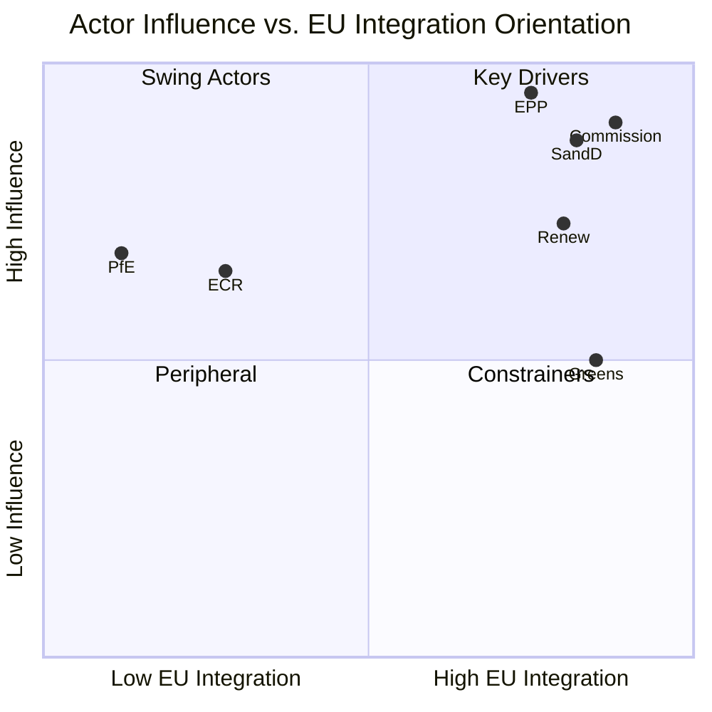

# Actor Mapping — EU Parliament Month in Review 2026-05-28

**SATs Applied:** Stakeholder Mapping, ACH  
**Confidence:** 🟡 MEDIUM-HIGH

---

## Actor Roster

| Actor | Type | Role | Seats/Position |
|-------|------|------|----------------|
| EPP | Political Group | Legislative majority anchor | 184 seats |
| S&D | Political Group | Co-majority partner | 136 seats |
| PfE | Political Group | Opposition bloc, selective support | 85 seats |
| ECR | Political Group | Conservative opposition, selective support | 81 seats |
| Renew | Political Group | Liberal pivot, digital governance | 77 seats |
| Greens/EFA | Political Group | Environmental/progressive coalition | 53 seats |
| The Left | Political Group | Progressive, consumer protection | 45 seats |
| ESN | Political Group | Far-right, sovereignty-first | 27 seats |
| Non-Inscrit | Individual MEPs | Mixed, unaffiliated | 30 MEPs |
| European Commission | EU Institution | Legislation proponent, DMA enforcer | 27 Commissioners |
| Council Presidency | EU Institution | Counterparty in legislative procedure | Rotating (Poland 2025) |
| President Metsola | EP Leadership | Agenda-setting, institutional representation | 1 President |
| Victor Negrescu (S&D) | Committee Chair | BUDG — Budget 2027 guidelines rapporteur | BUDG Chair |
| Tonino Picula (S&D) | Committee Chair | AFET — External relations, SAFE-Canada | AFET Chair |
| Aurore Lalucq (S&D) | Committee Chair | ECON — DMA enforcement oversight | ECON Chair |

---

## Influence Assessment

**High Influence:**
- EPP: Largest group; provides rapporteurs on most major files; internal discipline shapes final text
- S&D: Co-majority partner; drives social/external relations agenda; key for SAFE/Ukraine majorities
- European Commission: Exclusive right of legislative initiative; controls enforcement pace (DMA)
- Council Presidency: Determines trilogues timing and Council negotiating position

**Medium Influence:**
- Renew: Pivotal on digital governance; provides swing votes when EPP-S&D diverge
- ECR: Selective support (defence/security yes; regulation no); enlarges majority on security files
- Committee Chairs: Control agenda and rapporteur assignments; significant agenda-setting power

**Low Influence (on current legislative agenda):**
- PfE: Opposition rhetoric without sufficient seats; influence via amendment flood tactics
- ESN: Marginal legislative influence; primarily media/framing effect
- The Left: Consistent on consumer rights/environment but too small for independent majority
- Greens: Important on environment but weakened (loss of 20+ seats in 2024 vs. EP9)

---

## Alliance Patterns

**Core Alliance (EPP + S&D + Renew):** 397 seats — the governing coalition
This alliance holds on: institutional/EP authority votes, Ukraine support, broad budget,
and transatlantic relationships.

**Security Alliance (EPP + S&D + ECR + Renew):** Up to 478 seats
Holds on: SAFE, defence procurement, Ukraine financial assistance

**Digital Alliance (S&D + Renew + Greens + Left):** Up to 311 seats
Holds on: DMA enforcement, AI regulation, consumer digital rights
Note: this falls below majority; needs EPP mainstream for resolutions to pass

**Environmental Stress Alliance (EPP + ECR + PfE):** Up to 350 seats
Risk: if EPP shifts right on agriculture/environment, this bloc could pass amendments
Currently not sufficient for majority without some S&D/Renew cross-over votes

---

## Power Brokers

**EPP Internal Leadership:** The EPP group bureau controls group voting discipline.
With 184 seats, EPP can swing any vote. The group's internal divide between:
- Centre-right mainstream (dominant; von der Leyen Commission loyalists)
- Agricultural/rural right (aligned with PfE on environmental rollbacks)
- Industry wing (aligned with Big Tech against aggressive DMA enforcement)

**S&D Group Presidents:** Key for maintaining S&D cohesion on votes where social
democratic MEPs in member states with pro-business governments face competing pressures.

**Commission President von der Leyen:** As EPP's most prominent figure, her relationship
with EPP leadership is the critical back-channel for turning legislative positions into
enforceable decisions (DMA, SAFE implementation).

---

## Information Environment

Key information channels shaping actor behaviour in April–May 2026:

- **Politico Europe:** Primary EU political news; shapes Brussels insider narrative
- **Euractiv:** Policy depth; read by Committee staff and senior MEPs
- **EP Press Service:** Official framing of plenary outcomes
- **Industry lobbying:** BUSINESSEUROPE, DigitalEurope, EU defence industry associations
  actively engaged on DMA enforcement, SAFE implementation modalities
- **Civil society:** Animal welfare NGOs (TA-10-2026-0115); human rights on Ukraine
  accountability (TA-10-2026-0161)

---

## Reader Briefing

**For citizens:** The European Parliament in May 2026 is dominated by a core trio of
political groups (EPP, S&D, Renew) that hold 55% of seats and most committee chairs.
This coalition makes the key legislative decisions on defence, digital governance,
and budget. Far-right groups (PfE, ECR, ESN) have about 27% of seats — enough to
influence debates and push amendments, but not enough to control Parliament's output.

