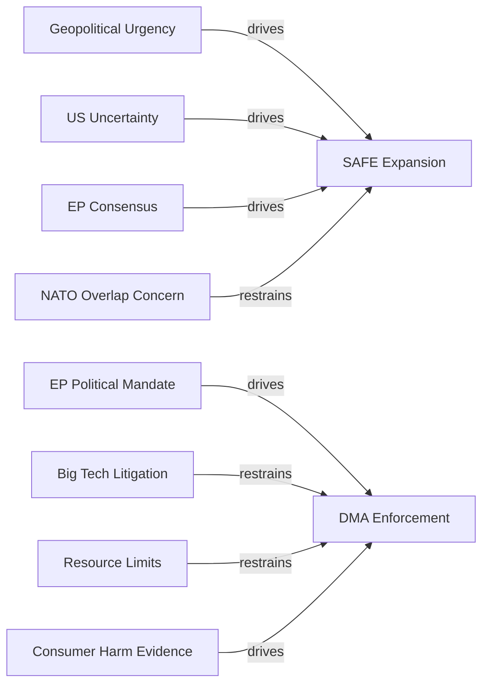

# Forces Analysis — EU Parliament Month in Review 2026-05-28

**SATs Applied:** Force-Field Analysis, Key Assumptions Check  
**Confidence:** 🟡 MEDIUM-HIGH

---

## Issue Frame

This forces analysis examines two central issues from the April 28 – May 28, 2026
European Parliament session:

1. **EU Defence Sovereignty via SAFE** — The SAFE-Canada agreement (TA-10-2026-0180)
   represents the EU's first formal integration of a non-EU country into collective
   defence procurement. The central question: what forces are driving and restraining
   the EU's transition from NATO-dependent to partially autonomous defence architecture?

2. **DMA Enforcement Momentum** — Despite the DMA operating for 26 months, no final
   infringement decision has been issued. The EP's enforcement resolution (TA-10-2026-0160)
   calls for acceleration. What forces drive and restrain enforcement?

---

## Driving Forces

### SAFE — Forces for Expansion
- **Geopolitical urgency (HIGH):** Russia's continued aggression against Ukraine creates
  sustained threat perception that drives political consensus for EU-level defence action
- **US strategic uncertainty (HIGH):** US political signals around NATO commitment create
  hedging incentive for EU member states to build non-US-dependent procurement paths
- **Industrial policy convergence (MEDIUM):** EU single market rationale for defence
  industry consolidation adds economic legitimacy to strategic rationale
- **EP-Council consensus (MEDIUM):** Broad political agreement across EPP, S&D, ECR on
  security spending creates enabling legislative environment
- **CETA legal framework (MEDIUM):** Pre-existing EU-Canada trade agreement reduces
  legal/administrative friction for SAFE extension to Canada

### DMA Enforcement — Forces for Acceleration
- **EP political mandate (HIGH):** TA-10-2026-0160 is an explicit parliamentary demand
  for faster enforcement — creates political accountability for Commission
- **Consumer harm evidence (MEDIUM):** Accumulating evidence of Apple App Store
  exclusion, Google Search self-preferencing provides factual basis for cases
- **Commission institutional interest (MEDIUM):** DG COMP/CNECT professional interest
  in establishing DMA precedents before the next electoral cycle
- **Allied coordination (LOW):** US/UK competition authorities pursuing similar cases
  reduces risk of isolated EU enforcement

---

## Restraining Forces

### SAFE — Forces Against Expansion
- **NATO/US relationship management (MEDIUM):** Concern that aggressive EU defence
  autonomy signals undermine the transatlantic partnership; risk of US perception of
  EU as "going it alone"
- **Member state sovereignty (MEDIUM):** Small neutral states (Austria, Ireland, Malta)
  and some Atlanticist states (Netherlands) resist EU-level defence procurement mandates
- **Budget constraints (MEDIUM):** SAFE requires budget lines; MFF 2021–2027 is in
  final year with limited flexibility; SAFE competes with cohesion, climate, other headings
- **Legal complexity of third-country participation (LOW):** Each bilateral agreement
  requires Council unanimous agreement plus EP consent — slow pipeline

### DMA Enforcement — Forces Against Acceleration
- **Big Tech litigation capacity (HIGH):** Alphabet, Apple, Meta have dedicated legal
  teams capable of mounting CJEU challenges that could overturn infringement decisions
- **Commission resource constraints (HIGH):** DG COMP has ~800 officials for entire
  EU economy; DMA cases are resource-intensive
- **Political economy (MEDIUM):** US bilateral trade relationship considerations;
  Big Tech investment threats in EU member states create political friction
- **Evidence standards (MEDIUM):** CJEU requires Commission to meet high evidentiary
  standards; complex tech architectures require expert technical assessment

---

## Net Pressure

| Issue | Net Force Direction | Momentum Assessment |
|-------|---------------------|---------------------|
| SAFE expansion to UK/Norway/Japan | Towards expansion | 🟢 BUILDING |
| SAFE full implementation (existing) | Towards completion | 🟡 STEADY |
| DMA enforcement acceleration | Towards acceleration | 🟡 BUILDING (slowly) |
| DMA gatekeeper compliance | Towards compliance | 🔴 UNCERTAIN |

**Overall assessment:** Defence sovereignty transition has stronger net driving forces
than DMA enforcement. SAFE expansion is likely (WEP: 60–70%) over 12 months; DMA
final infringement decisions in 2026 are roughly even chance (WEP: 40–50%).

---

## Intervention Points

**High-leverage intervention points for SAFE expansion:**
1. **Council implementing decisions on procurement modalities** — Currently the key
   bottleneck; EP has limited formal leverage but can use oversight and public pressure
2. **EIB guarantee activation for defence industry** — Unlocking EIB lending removes
   the private finance gap in EDTIB scaling
3. **SAFE bilateral agreement pipeline sequencing** — UK first (largest defence
   industry) maximizes impact; Japan/Norway as subsequent priorities

**High-leverage intervention points for DMA enforcement:**
1. **Commission interim measures deployment** — EP resolution specifically calls for
   more frequent use of interim measures (doesn't require final decision)
2. **DG COMP staffing increase** — Budget procedure leverage: EP can condition
   Commission budget on adequate DMA staffing
3. **Technical expert panel** — Commission could establish independent technical panel
   to reduce evidence-gathering burden

---

## Reader Briefing

**For citizens:** Two big questions for EU institutions in May 2026 are: (1) Can Europe
defend itself without always depending on the United States? and (2) Can Europe actually
enforce its own digital market rules against Big Tech? The forces analysis shows that
the EU is making faster progress on defence independence than on tech regulation.

**Key Assumptions Check:**
- Assumption: US political uncertainty is a long-term driver (not temporary) — HIGH confidence
- Assumption: Big Tech litigation will delay DMA enforcement — HIGH confidence
- Assumption: SAFE Canada is a replicable model — MEDIUM confidence (each bilateral is unique)

