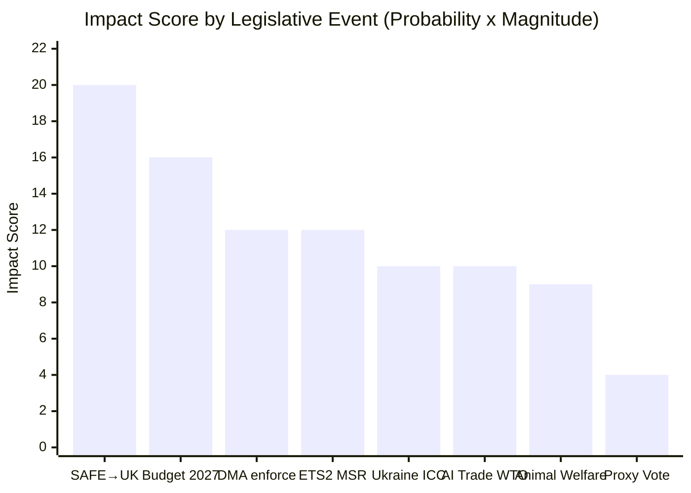

# Impact Matrix — EU Parliament Month in Review 2026-05-28

**SATs Applied:** Stakeholder Mapping, What-If Analysis  
**Confidence:** 🟡 MEDIUM-HIGH

---

## Event List

Key legislative events (adopted texts) in the April 28 – May 28, 2026 period:

| # | Event | Reference | Date |
|---|-------|-----------|------|
| 1 | Budget 2027 guidelines adopted | TA-10-2026-0112 | April 28, 2026 |
| 2 | DMA enforcement resolution | TA-10-2026-0160 | May 2026 |
| 3 | SAFE-Canada agreement consent | TA-10-2026-0180 | May 20, 2026 |
| 4 | Ukraine accountability resolution | TA-10-2026-0161 | May 2026 |
| 5 | AI-trade strategy resolution | TA-10-2026-0183 | May 2026 |
| 6 | Dogs/cats animal welfare regulation | TA-10-2026-0115 | May 2026 |
| 7 | Electoral Act proxy voting amendment | TA-10-2026-0124 | May 2026 |
| 8 | ETS2 MSR carbon market reform | TA-10-2026-0139 | May 2026 |
| 9 | Performance instrument controls | TA-10-2026-0122 | May 2026 |
| 10 | International Claims Commission convention | TA-10-2026-0154 | May 2026 |

---

## Stakeholder Impact Summary

| Stakeholder | SAFE-Canada | DMA Resolution | Budget 2027 | Animal Welfare |
|-------------|-------------|----------------|-------------|----------------|
| EU citizens (all) | Indirect (security) | Direct (tech access) | Direct (programmes) | Direct (consumer) |
| Defence industry (EU) | Very High (+) | Neutral | High (+, EDIP) | Neutral |
| Big Tech (6 gatekeepers) | Neutral | Very High (-) | Neutral | Neutral |
| Canada (government/industry) | High (+) | Neutral | Neutral | Neutral |
| Small farmers/breeders | Neutral | Neutral | Medium (cohesion) | High (-) |
| Civil society (human rights) | Medium (+) | High (+) | Medium (+) | High (+) |
| Ukraine | Medium (+, indirect defence) | Neutral | High (+, instruments) | Neutral |
| EPP MEPs | Medium (+) | Low (split) | High (budget control) | Medium (+) |
| Far-right (PfE/ECR) | Medium (split) | Low (-) | Medium (-) | Low (-) |

---

## Impact Matrix

5×5 Impact Assessment (Probability × Magnitude, scale 1–5):

| Event | Probability (1–5) | Magnitude (1–5) | Impact Score | Horizon |
|-------|------------------|-----------------|--------------|---------|
| SAFE-Canada triggers UK/Norway deals | 4 | 5 | 20 | 12–24 months |
| DMA enforcement accelerates post-resolution | 3 | 4 | 12 | 6–18 months |
| Budget 2027 passed on time | 4 | 4 | 16 | 3–6 months |
| Animal welfare reduces puppy mills 30% | 3 | 3 | 9 | 24–36 months |
| AI-trade shapes WTO AI framework | 2 | 5 | 10 | 36–60 months |
| Electoral Act proxy voting ratified | 2 | 2 | 4 | 18–36 months |
| Ukraine accountability commission operationalised | 2 | 5 | 10 | 36+ months |
| ETS2 MSR stabilises carbon market | 4 | 3 | 12 | 6–12 months |

---

## Heat Map Analysis

**Highest Impact Score:**
1. 🔴 SAFE-Canada → UK/Norway pipeline (score: 20) — highest priority monitoring
2. 🔴 Budget 2027 timely adoption (score: 16) — near-term institutional priority
3. 🟡 DMA enforcement acceleration (score: 12) — medium monitoring
4. 🟡 ETS2 MSR carbon market (score: 12) — medium monitoring
5. 🟡 Ukraine accountability (score: 10) — high magnitude, lower near-term probability
6. 🟡 AI-trade WTO influence (score: 10) — high magnitude, long horizon

**Geographic Heat:**
- Brussels/EU level: ALL events have direct Brussels institutional impact
- UK/Canada: SAFE-Canada and future bilateral agreements
- Digital economy (global): DMA enforcement + AI-trade strategy
- Eastern Europe (Ukraine border): Ukraine accountability + SAFE
- Rural EU (animal breeding industries in CE Europe): Animal welfare regulation

---

## Cascade Effects

**Primary cascades:**

1. **SAFE-Canada → EU defence industrial consolidation**
   SAFE-Canada creates procurement predictability → EDTIB companies invest in capacity
   → Supply chain reconfiguration across EU member states → Employment + R&D effects
   Timeline: 2–5 years

2. **DMA enforcement → Big Tech compliance → Digital market structural change**
   If Commission issues final infringement decisions → Big Tech technical compliance
   → Third-party access to platforms → New EU tech ecosystem development
   Timeline: 3–7 years (if enforcement succeeds)

3. **Budget 2027 → MFF 2028–2034 template**
   EP's 2027 positions (defence increase, climate maintain) → Negotiating anchors for
   next MFF → Long-term EU spending structure for 7 years
   Timeline: 1–3 years

4. **Animal welfare → Industry consolidation**
   Compliance cost → Small breeder exits market → Consolidation to large-scale
   welfare-compliant breeders → Price increase for regulated breeding
   Timeline: 2–4 years

---

## Reader Briefing

**For citizens:** The May 2026 EP decisions will have effects at different time horizons.
Some will be felt within months (budget 2027 determines EU programme spending for 2027).
Others will take years to manifest (SAFE reshaping EU defence industry; DMA enforcement
changing how Big Tech operates in Europe; animal welfare improving conditions for pets).
The biggest long-term impact is likely the SAFE defence instrument and the AI-trade strategy.

**What-If Analysis:**
- If SAFE-Canada fails Council implementing decisions → EU defence autonomy narrative damaged; UK/Norway pipeline stalls
- If DMA enforcement continues slow pace → EP escalates via budget leverage by 2027
- If Budget 2027 negotiations collapse → Provisional twelfths freeze all discretionary spending at 2026 levels

