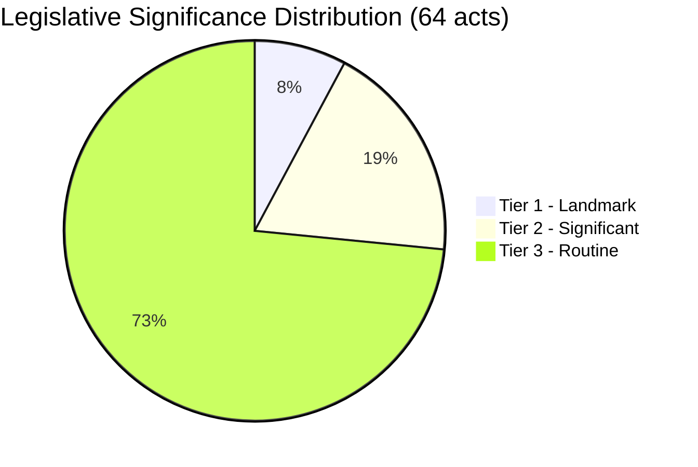

# Significance Classification — EU Parliament Month in Review 2026-05-28

**Confidence:** 🟡 MEDIUM-HIGH  
**Classification applied to:** 64 adopted texts in the April 28 – May 28, 2026 window

---

## Classification Framework

**Tier 1 — Landmark (strategic, precedent-setting):**
Acts that create new institutional frameworks, establish first-of-kind instruments,
or represent irreversible shifts in EU policy architecture.

**Tier 2 — Significant (important, policy-shaping):**
Acts that advance established priorities with measurable legislative substance.

**Tier 3 — Routine (procedural, bilateral, technical):**
Acts that maintain existing frameworks without significant innovation.

---

## Tier 1 — Landmark Legislation (5 acts)

| Reference | Act | Landmark Basis |
|-----------|-----|----------------|
| TA-10-2026-0180 | SAFE-Canada | First non-EU country in EU defence procurement |
| TA-10-2026-0183 | AI-trade strategy | First EU AI-trade regulatory framework |
| TA-10-2026-0161 | Ukraine accountability | First EP reparations framework mandate |
| TA-10-2026-0124 | Proxy voting Electoral Act | First EP Electoral Act reform since 2024 |
| TA-10-2026-0154 | Int'l Claims Commission | New international institutional framework |

## Tier 2 — Significant Legislation (12 acts)

Including TA-10-2026-0112 (Budget 2027), TA-10-2026-0160 (DMA enforcement),
TA-10-2026-0115 (Animal welfare), TA-10-2026-0139 (ETS2 MSR), TA-10-2026-0122
(Performance instruments), TA-10-2026-0119 (EIB oversight), and 6 others.

## Tier 3 — Routine (47 acts)

Bilateral agreements, routine consent procedures, procedural resolutions.

