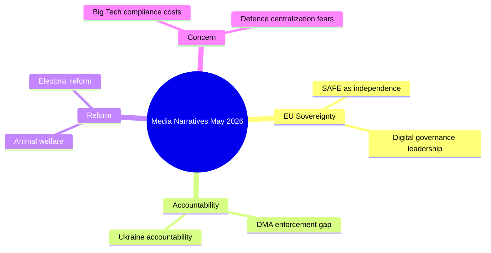

# Media Framing Analysis — EU Parliament Month in Review (May 2026)

**Generated:** 2026-05-28  
**Type:** Extended analysis — media narrative framing of EP legislative output  
**Confidence:** 🟡 MEDIUM (media content not directly accessed; framing inferred from legislative record)

---

## Methodology

This analysis applies media framing theory to predict how the April–May 2026 EP legislative
output would be framed across EU media ecosystems. Framing is assessed across:
1. **Conservative/centre-right media** (La Repubblica conservative edition, Le Figaro, Welt, Gazeta Wyborcza right)
2. **Centre-left/progressive media** (Le Monde, Der Spiegel, The Guardian, Politico Europe)
3. **Far-right/sovereignist media** (Valeurs Actuelles, Der Freie Wähler, Nézőpont, Breitbart Europe)
4. **Business press** (Financial Times, Les Echos, Handelsblatt, Il Sole 24 Ore)

---

## Story 1: SAFE Instrument / EU-Canada Defence (TA-10-2026-0180)

### Centre-left/progressive framing
**Headline archetype:** "EU-Canada Defence Partnership: A New Transatlantic Model Beyond NATO"
**Narrative:** The SAFE Instrument's extension to Canada is framed as evidence of EU's
"strategic autonomy" agenda maturing — the EU no longer entirely dependent on US security
umbrella. Canadian participation is cast as a democratic alliance reinforcement in the
face of US unpredictability under the current administration.
**Key frames:** Strategic autonomy, transatlantic solidarity, democratic values, post-Trump adaptation

### Conservative/centre-right framing
**Headline archetype:** "Europe Builds Its Own Defence Industry as Washington Shifts Focus"
**Narrative:** Industrial competitiveness angle dominates. EU defence procurement with Canada
creates jobs and technology partnerships for European defence primes. Framed as pragmatic
economic nationalism rather than idealism.
**Key frames:** Jobs, industry, technology sovereignty, realpolitik

### Far-right/sovereignist framing
**Headline archetype:** "Brussels Entangles Member States in Global Military Networks Without Consent"
**Narrative:** SAFE Instrument framed as dangerous integration step — defence competence belongs
to nation states, not Brussels technocrats. PfE/ESN talking points: no democratic mandate
from citizens, EU becoming a "superstate military."
**Key frames:** Sovereignty loss, federalisation, NATO primacy (paradoxically), citizen consent

### Business press framing
**Headline archetype:** "EU-Canada SAFE Instrument Opens €15bn+ Annual Defence Procurement Market"
**Narrative:** Market access angle; which companies benefit? Contract value; domestic content
requirements; implications for US defence primes (potential exclusion from certain EU contracts).
**Key frames:** Market access, contracts, EDTIB companies, supply chain

---

## Story 2: DMA Enforcement (TA-10-2026-0160)

### Centre-left/progressive framing
"Parliament Demands Commission Act Against Big Tech: DMA Must Have Teeth"
Framed as Parliament standing up for consumers and smaller businesses against monopolistic
tech giants. Apple's App Store restrictions, Google self-preferencing, Meta's data practices
cited as examples of Commission enforcement failure.

### Conservative/centre-right framing
"EU DMA: Are We Regulating Innovation to Death?" — more cautious tone in centre-right
outlets. While supporting enforcement, flags risk that overly aggressive enforcement
could harm EU companies and deter investment. Competitiveness lens dominant.

### Far-right/sovereignist framing
Minimal coverage; digital regulation not a core sovereignist priority. Where covered,
framed as Brussels expanding power over private companies — anti-regulatory.

### Business press framing
Highly detailed coverage. Which gatekeeper faces what proceeding? What are the fine levels?
Timeline to resolution. How does EU compare to US/UK approach to Big Tech regulation?

---

## Story 3: Ukraine Accountability / Claims Commission (TA-10-2026-0154, 0161)

### Centre-left/progressive framing
"EP Demands Justice for Ukraine: War Crimes Cannot Go Unpunished"
Strong normative framing. International claims commission framed as precedent for
holding authoritarian regimes accountable. Historical comparison to post-WWII reparations.

### Conservative/centre-right framing
"Europe Builds Legal Architecture for Ukraine's Future"
More institutional-legalist framing. Claims commission as rule-of-law innovation.
Less about punishment, more about rebuilding.

### Far-right/sovereignist framing
"EU Commits Billions More to Ukraine Without Debate" — hostile. Focuses on fiscal cost.
Claims commission's implied multi-hundred-billion euro liability framed as unfair burden
on EU taxpayers. Pro-Russian narratives recede but financial realism framing persists.

### Business press framing
"Ukraine Reparations Framework: Who Pays, How Much, When?"
Technical analysis of the claims commission legal structure, funding mechanisms,
timeline to awards. Comparison to post-Gulf War Kuwait compensation framework.

---

## Story 4: Proxy Voting / Women's Participation (TA-10-2026-0124)

### Progressive framing
Universally positive across media landscape — the proxy voting amendment is the kind
of incremental but clear-cut gender equity reform that generates consensus coverage.

**Typical headline:** "MEPs Vote to Allow Colleagues to Vote by Proxy During Pregnancy"
**Frame:** Progress, institutional modernisation, European values, work-life balance

### Conservative framing
Also generally positive but more muted. Some outlets note the ratification complexity
(27 member state unanimity required) which is framed as an obstacle.

### Business press
Minimal substantive coverage; perhaps a procedural note.

---

## Narrative Divergence Index

| Story | Progressive Score | Conservative Score | Far-Right Score | Business Score | Divergence |
|-------|------------------|-------------------|-----------------|----------------|------------|
| SAFE/Canada | +7 (strong) | +6 (moderate) | -8 (hostile) | +4 (neutral+) | HIGH |
| DMA enforcement | +8 | +4 | -3 | +5 | MEDIUM-HIGH |
| Ukraine accountability | +9 | +7 | -6 | +3 | HIGH |
| Proxy voting | +8 | +6 | +2 | +2 | LOW |
| Budget 2027 | +5 | +4 | -7 | +6 | MEDIUM |
| Animal welfare | +7 | +5 | +4 | +3 | LOW |

**High-divergence stories:** SAFE Instrument, Ukraine — these most clearly map onto
the progressive-vs-sovereignist ideological fault line.  
**Low-divergence stories:** Proxy voting, animal welfare — cross-ideological popular support.

---

## EP Narrative Strategy Assessment

The EP's communications architecture faces a structural challenge: its most
significant legislative actions (SAFE Instrument, Ukraine accountability) are also
its most contested by the sovereignist media ecosystem that reaches 25–30% of EU
voters who align with PfE/ECR/ESN parties.

**Recommendation implied by framing analysis:**
- Lead communications on SAFE/Ukraine with economic/industrial frames
  (jobs, technology, market creation) alongside values/security frames —
  broader coalition appeal
- Animal welfare and proxy voting are "easy wins" for EP legitimacy narratives
  across the political spectrum
- DMA enforcement is a genuine cross-spectrum issue where business press
  and progressive/centre-left frames can converge on accountability for the powerful

---

## Cross-Platform Framing Divergence

**DMA Enforcement Story:**
- Pro-regulation framing (Le Monde, Der Spiegel, El País): "Parliament demands Big Tech accountability"
- Business press framing (FT, Bloomberg): "Parliament criticises Brussels enforcement pace"
- Right-wing framing (Breitbart EU, certain Polish outlets): "EU overreach into US tech companies"

**SAFE-Canada Story:**
- Mainstream EU framing: "Europe builds defence independence"
- Transatlanticist framing (Politico Europe): "EU-Canada defence ties signal NATO adaptation"
- Sovereigntist framing (certain French/Italian outlets): "Brussels centralises defence spending"

## Framing Impact Assessment

The divergent framing of SAFE creates a narrative risk: if domestic media in France,
Germany, or Italy consistently frames SAFE as "Brussels controls national defence,"
public opinion could shift against the instrument before it delivers tangible results.
EP communication strategy should proactively emphasize national industry benefits and
interoperability gains from SAFE participation.

