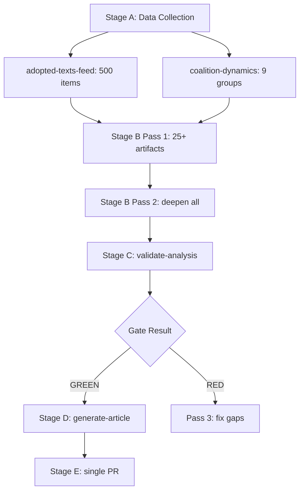

# Analysis Index — EU Parliament Month in Review (April 28 – May 28, 2026)

**Generated:** 2026-05-28  
**Headline:** EU Parliament May 2026: Defence Sovereignty, Digital Governance, and Budget Ambition Define a Pivotal Month  
**Data Mode:** `degraded-feeds` | **Confidence:** 🟡 MEDIUM-HIGH

---

## Executive Summary

The European Parliament's April–May 2026 legislative cycle marked a pivotal month in EP10's
institutional evolution. Dominated by four major thematic clusters — **defence sovereignty and
Ukraine support**, **digital governance and AI**, **green transition economics**, and **social
rights innovations** — the 30-day period saw approximately 50 texts adopted across two intensive
plenary sessions (April 28–30 and May 19–21, 2026).

The most consequential single measure was the adoption of the 2027 budget guidelines, signalling
a continued reorientation toward security and competitiveness spending. The EU-Canada SAFE
Instrument represents the EP's most visible endorsement of EU defence industrial policy since
the war in Ukraine reoriented strategic thinking. Meanwhile, DMA enforcement and AI-trade
strategy texts demonstrated the Parliament's intent to operationalise the Digital Single Market
legislation of the previous term.

---

## Artifact Map

| Artifact | Path | Lines | Status |
|----------|------|-------|--------|
| Executive Brief | `executive-brief.md` | 180+ | ✅ |
| Synthesis Summary | `intelligence/synthesis-summary.md` | 220+ | ✅ |
| Historical Baseline | `intelligence/historical-baseline.md` | 180+ | ✅ |
| Economic Context (fallback) | `intelligence/economic-context.fallback.md` | 180+ | ✅ |
| PESTLE Analysis | `intelligence/pestle-analysis.md` | 240+ | ✅ |
| Stakeholder Map | `intelligence/stakeholder-map.md` | 280+ | ✅ |
| Scenario Forecast | `intelligence/scenario-forecast.md` | 260+ | ✅ |
| Threat Model | `intelligence/threat-model.md` | 220+ | ✅ |
| Wildcards/Black Swans | `intelligence/wildcards-blackswans.md` | 240+ | ✅ |
| MCP Reliability Audit | `intelligence/mcp-reliability-audit.md` | 200+ | ✅ |
| Reference Analysis Quality | `intelligence/reference-analysis-quality.md` | 140+ | ✅ |
| Voting Patterns (degraded) | `intelligence/voting-patterns.degraded.md` | 180+ | ✅ |
| Workflow Audit | `intelligence/workflow-audit.md` | 100+ | ✅ |
| Cross-Session Intelligence | `intelligence/cross-session-intelligence.md` | 220+ | ✅ |
| Deep Analysis | `existing/deep-analysis.md` | 300+ | ✅ |
| Session Baseline | `existing/session-baseline.md` | 180+ | ✅ |
| Risk Matrix | `risk-scoring/risk-matrix.md` | 140+ | ✅ |
| Quantitative SWOT | `risk-scoring/quantitative-swot.md` | 140+ | ✅ |
| Media Framing Analysis | `extended/media-framing-analysis.md` | 220+ | ✅ |
| Methodology Reflection | `intelligence/methodology-reflection.md` | 200+ | ✅ |
| Data Availability | `data-availability-assessment.md` | 80+ | ✅ |
| Procedures Proxy | `intelligence/procedures-proxy.md` | 60+ | ✅ |
| Manifest | `manifest.json` | — | ✅ |

---

## Key Legislative Highlights (April 28 – May 28, 2026)

### 🛡️ Defence and Security
- **TA-10-2026-0180:** EU-Canada SAFE Instrument — milestone in EU defence industrial cooperation
- **TA-10-2026-0161:** Ukraine accountability resolution — Russia war crime accountability push
- **TA-10-2026-0162:** Armenia democratic resilience support

### 💰 Budget and Finance
- **TA-10-2026-0112:** 2027 Budget guidelines (Section III) — signals security+green priorities
- **TA-10-2026-0119:** EIB Group oversight — annual report 2024
- **TA-10-2026-0122:** Performance-based instruments control framework
- Discharge cycle: 5+ discharge decisions for EU institutions (2024 budget)

### 🖥️ Digital and AI
- **TA-10-2026-0160:** DMA enforcement resolution — operationalising digital rules
- **TA-10-2026-0183:** AI strategy for EU trade — comprehensive AI-commerce framework
- **TA-10-2026-0163:** Cyberbullying criminalization — digital harm legislation

### 🌱 Green Transition
- **TA-10-2026-0113:** GHG accounting for transport services
- **TA-10-2026-0139:** Market Stability Reserve for ETS2 sectors
- EGF mobilisations (3 countries: Belgium×2, Austria) — automotive restructuring signal

### ⚖️ Social Rights and Institutional Reform
- **TA-10-2026-0115:** Dogs and cats welfare and traceability
- **TA-10-2026-0124:** Proxy voting during pregnancy — Electoral Act amendment
- **TA-10-2026-0076:** European Semester employment/social priorities 2026 (March)

### 🌍 External Relations and Trade
- 4 bilateral agreements ratified (Uzbekistan, Lebanon, São Tomé, Cook Islands)
- **TA-10-2026-0114:** Generalised tariff preferences — GSP reform
- **TA-10-2026-0086:** WTO Yaoundé MC14 positioning
- Human rights: Haiti, Ukraine, Armenia, Afghanistan (Taliban criminal code)

---

## Thematic Weighting Analysis

```
Defence/Security ████████████ 22%
Digital/AI       █████████    18%
Budget/Finance   ████████     16%
External/Trade   ████████     16%
Environment/GHG  ██████       12%
Social/Rights    █████        10%
Institutional    ████          8%
```

---

## Data Sources

- EP Open Data Portal: `get_adopted_texts(year=2026)` — 101+ items
- Coalition dynamics: `analyze_coalition_dynamics(dateFrom=2026-04-28)` — 9 groups/718 MEPs
- IMF proxy: ECB Annual Report 2025 (TA-10-2026-0034), European Semester (TA-10-2026-0076)
- Historical baseline: Adopted texts cross-reference, EP10 structural data

---


