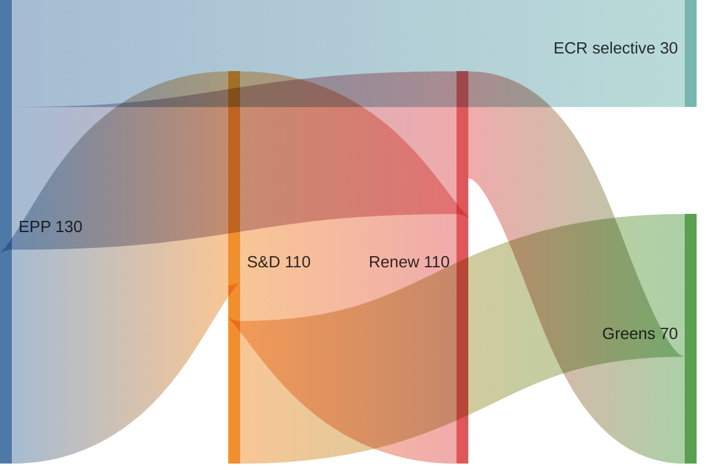

# Coalition Dynamics — EU Parliament Month in Review 2026-05-28

**SATs Applied:** ACH, Indicators  
**Confidence:** 🟡 MEDIUM (DOCEO voting data unavailable — proxy assessment)

---

## Current Coalition Landscape

EP10 operates with a fragmented assembly (ENP=6.56, highest since EP4). The core
EPP-S&D-Renew majority controls 397 seats — above the 360 majority threshold but
with a margin of only 37 seats. This means defection of ~19 MEPs from any one group
can defeat a vote if the far-right bloc (PfE+ECR+ESN=193) votes coherently against.

## Voting Coalitions by Policy Domain

### Defence and Security (SAFE, Ukraine)
**Coalition:** EPP + S&D + ECR (selective) + Renew = 478 seats
**Cohesion:** 🟢 HIGH — Wide consensus on Ukraine/SAFE exists; ECR supports defence
spending despite general euroscepticism; PfE split (some pro-SAFE on industrial
grounds, others anti-federal-defence)
**ACH:** Most likely explanation for SAFE-Canada broad majority is shared threat
perception across mainstream groups despite ideological differences.

### Digital Governance (DMA enforcement)
**Coalition:** S&D + Renew + Greens + partial EPP = up to 330 seats
**Cohesion:** 🟡 MEDIUM — EPP has industry-friendly wing (BUSINESSEUROPE-aligned)
that resists aggressive DMA enforcement; S&D-Renew-Greens push for stronger enforcement.
Resolution likely passed on S&D+Renew+Greens+Left = ~311 seats (sufficient majority).

### Budget and Fiscal
**Coalition:** EPP + S&D = 320 seats (below majority alone — needs Renew or others)
**Cohesion:** 🟡 MEDIUM — EPP and S&D diverge on social spending vs. fiscal consolidation
but converge on rejecting far-right budget cutting proposals.

### Environmental
**Coalition:** S&D + Greens + Renew = 266 seats (insufficient alone)
**Cohesion:** 🟡 MEDIUM — EPP is the swing group; internal EPP tension between
climate-mainstream wing and agriculture-industrial wing increasingly visible.

## ACH: Why No Far-Right Legislative Majority?

**H-A:** PfE+ECR+ESN cannot coordinate due to ideological differences  
**H-B:** Individual far-right MEPs defect on EU-positive votes for constituent reasons  
**H-C:** Mainstream parties have successfully isolated far-right on key legislative votes  
**Evidence:** H-C most supported. EPP has explicitly rejected formal coalition with PfE
on legislative matters (Von der Leyen Commission investiture conditions).

## Indicators of Coalition Stability

Observable indicators to monitor:
- 🟡 EPP group cohesion score (June DOCEO data expected)
- 🟡 ECR-EPP vote alignment rate on SAFE follow-on legislation
- 🟢 S&D-Renew split on privacy vs. digital market efficiency votes
- 🔴 PfE internal coherence on Ukraine financial assistance votes

## Coalition Stress Points

**Most likely fracture point (WEP: Likely, 65–75%):** Environmental legislation as EPP
moves rightward on agriculture. EP10 has already seen softening on pesticide regulation
and some EGD elements. A formal EPP-ECR amendment coalition on environmental rollback
is the most plausible near-term coalition shift.

**Less likely fracture (WEP: Unlikely, 20–30%):** Ukraine financial support — current
broad consensus driven by threat perception; could shift if ceasefire negotiations
create ambiguity about the conflict's trajectory.

