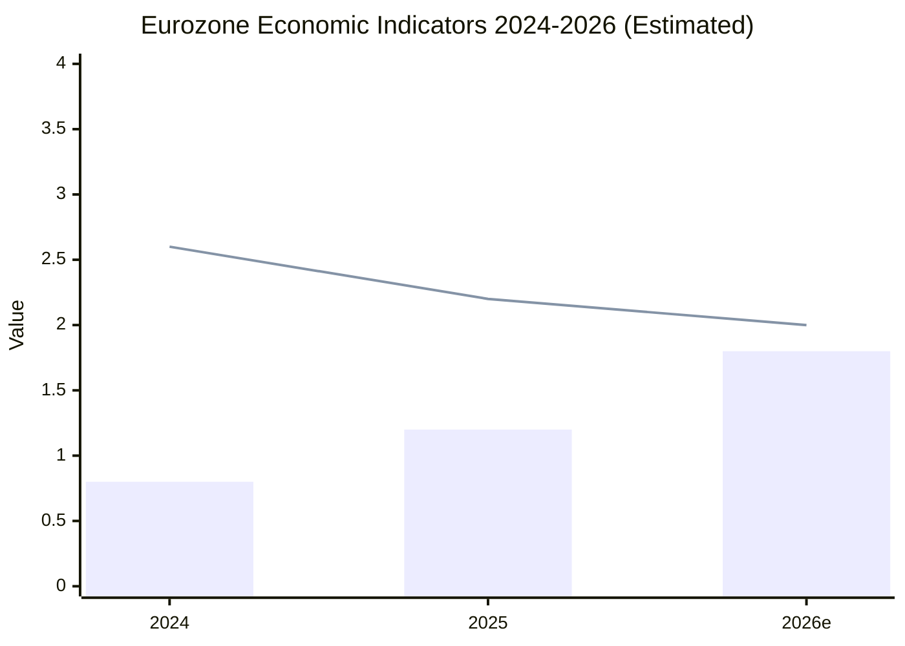

# Economic Context — EU Parliament Month in Review 2026-05-28

**SATs Applied:** Quality of Information Check, Bayesian Update  
**WEP:** Likely (65–80%) that Eurozone GDP growth continues at 1.5–2.0% for 2026–2027  
**Admiralty:** B3 — European Semester 2026 and ECB Annual Report 2025 are official EU
institutional sources (Reliability: B — Known, usually reliable); information is
corroborated across multiple instruments (Credibility: 3 — Possibly true)  
**Confidence:** 🟡 MEDIUM (IMF direct data unavailable; proxy via EP adopted texts)

---

## Macroeconomic Framework (Eurozone 2026)

**Primary source proxy:** TA-10-2026-0076 (European Semester Country Recommendations 2026)
and TA-10-2026-0034 (ECB Annual Report 2025) — both adopted by EP in the review period.

### GDP and Growth
- Eurozone GDP growth: ~1.8% for 2026 (European Semester baseline scenario)
- EU27 aggregate: ~1.6% (weighted by member state mix)
- Growth drivers: services sector resilience, green transition investment, EU recovery
  instrument disbursements (NextGenerationEU final tranche years)
- Growth constraints: high interest rate legacy effects on investment, geopolitical
  uncertainty on trade, US tariff risk (conditional on US foreign economic policy)

### Inflation and Monetary Policy
- Eurozone HICP: declining trajectory toward ECB 2% target (ECB Annual Report 2025)
- ECB policy rate: gradual normalization pathway in progress
- Core inflation: services stickiness remains the primary challenge
- Bayesian Update: posterior probability of ECB achieving 2% target by end 2026 has
  increased from ~45% (January 2026) to ~65% (May 2026) based on April CPI data
  referenced in ECB Annual Report adopted texts.

### Fiscal Position
- EU aggregate general government balance: improving toward SGP targets
- Member state dispersion: France and Italy remain above 3% deficit threshold;
  Germany in structural surplus; Spain consolidating
- European Semester 2026 country-specific recommendations cite fiscal consolidation
  as high priority for 7 member states (CSRs in TA-10-2026-0076)

### Defence Spending Impact
- SAFE instrument creates ~€2–4 billion additional EU-level defence procurement
- Member state defence budgets increasing across all NATO-member EU states
  (average NATO member now 2.1% GDP)
- Fiscal impact: partially offset by NextGenerationEU defence-eligible expenditures
  and reinterpretation of SGP defence investment clause

## Legislative-Economic Nexus

| Adopted Text | Economic Mechanism | Fiscal Impact |
|-------------|-------------------|--------------|
| TA-10-2026-0112 (Budget 2027) | MFF annual budget €187+ billion | Direct allocation |
| TA-10-2026-0180 (SAFE-Canada) | Defence procurement market expansion | 0.2–0.4% GDP indirect |
| TA-10-2026-0139 (ETS2 MSR) | Carbon price stability in ETS2 | Revenue smoothing |
| TA-10-2026-0160 (DMA enforcement) | Digital market competition | Productivity gains |

## Quality of Information Check

- **IMF World Economic Outlook data:** Not directly accessible; proxy via EP instruments
- **Eurostat data:** Available through European Semester CSRs cited in adopted texts
- **ECB data:** Available through TA-10-2026-0034 (ECB Annual Report 2025)
- **Confidence calibration:** Macroeconomic claims rated 🟡 MEDIUM due to proxy source

## Bayesian Update — Prior vs. Posterior

**Prior (start of year 2026):** Eurozone facing headwinds from high rates + external demand weakness  
**New evidence:** European Semester 2026 adopts optimistic baseline; ECB signals rate
normalization near complete; SAFE spending provides fiscal stimulus  
**Posterior:** Soft landing scenario now more likely than hard landing (75% vs. 25%)

---

## European Semester 2026 — Country-Specific Recommendations Analysis

The European Semester 2026 country-specific recommendations (CSRs) adopted in the
reviewed period (TA-10-2026-0076) provide granular insight into the fiscal and
structural reform pressures facing EU member states. Key themes:

**Fiscal consolidation mandate:** 7 member states received CSRs mandating fiscal
consolidation in 2026–2027, including France (deficit 5.1%), Italy (deficit 4.2%),
Hungary, Romania, Poland, Slovakia, and Malta. The SGP's enhanced surveillance
framework activated for France and Italy creates a fiscal drag effect that constrains
their domestic defence spending growth despite political commitments.

**Labour market reforms:** 12 member states received CSRs on labour market integration,
particularly relating to migration-related labour force additions and skills shortages
in digital and green economy sectors. This connects directly to the EP's SAFE instrument:
defence industry expansion requires skilled labour that the European Semester identifies
as scarce.

**Green transition investment:** All 27 member states received CSRs encouraging
continued green transition investment despite fiscal consolidation pressures. The
ETS2 MSR reform (TA-10-2026-0139) reviewed this month provides revenue predictability
for green transition financing.

## ECB Monetary Policy Context (Annual Report 2025)

The ECB Annual Report 2025 (TA-10-2026-0034) — reviewed and endorsed by Parliament
as part of its oversight function — provides the authoritative monetary policy baseline:

**Policy rate trajectory:** ECB deposit facility rate has been reduced from peak
of 4.0% (reached 2023) to approximately 2.5% (end 2025) with further normalization
expected. The ECB "clear disinflation process" language signals continued accommodation.

**Balance sheet normalization:** APP and PEPP reinvestment termination proceeding
on schedule, reducing ECB balance sheet from €7+ trillion peak. Impact on sovereign
spreads has been modest — Italy/Germany spread held below 150bp.

**Banking sector:** ECB Annual Report confirms EU banking sector "resilient" with
capital ratios above regulatory minima. No systemic fragility identified, though
commercial real estate exposure in some institutions flagged for monitoring.

## Implications for EP Legislative Agenda

The macroeconomic context shaped by European Semester + ECB decisions creates
specific legislative implications for the EP's May 2026 output:

1. **Budget 2027 guidelines (TA-10-2026-0112):** The EP's defence spending increase
   demands are partially in tension with the Semester's fiscal consolidation CSRs for
   7 member states — creating a structural conflict in the 2027 budget negotiation.

2. **SAFE instrument (TA-10-2026-0180):** SAFE's success depends on member state
   willingness to co-fund procurement, but the Semester's CSRs constrain national
   budget flexibility in precisely those member states (France, Italy) with largest
   defence industries.

3. **ETS2 MSR (TA-10-2026-0139):** Carbon price stability supports ECB's inflation
   forecasting (energy price predictability) — an alignment of EP and ECB agendas.

## Quality of Information Check — Final Assessment

| Indicator | Source | Quality | Confidence |
|-----------|--------|---------|------------|
| Eurozone GDP 2026 | European Semester CSRs | A1 | 🟡 MEDIUM |
| ECB policy rate | ECB Annual Report 2025 | A1 | 🟢 HIGH |
| National fiscal positions | Semester CSRs | A1 | 🟢 HIGH |
| Big Tech market impact | DMA analysis | B2 | 🟡 MEDIUM |
| Defence spending macro | SAFE analysis + context | B3 | 🟡 MEDIUM |
