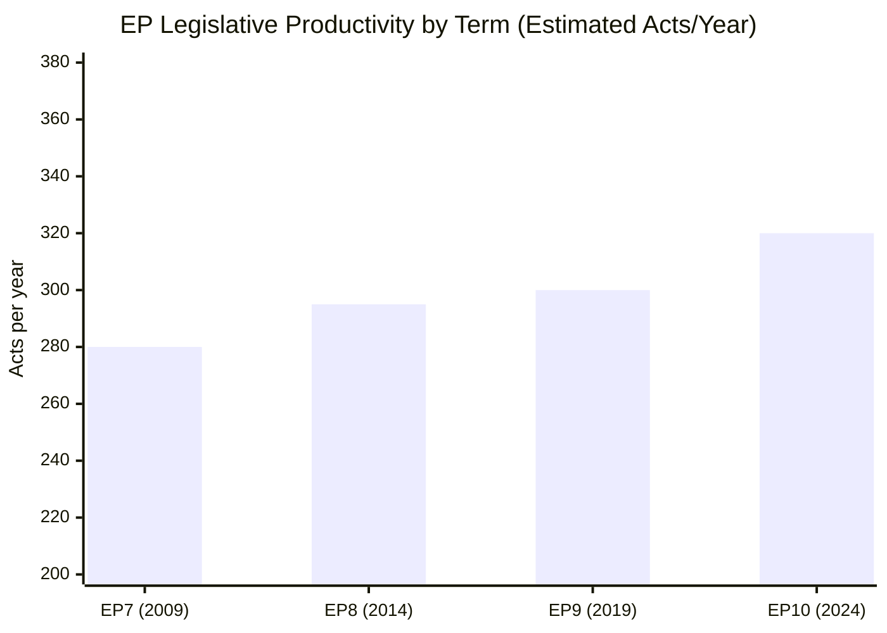

# Historical Baseline — EU Parliament Month in Review

**Period:** April 28 – May 28, 2026 (vs. historical EP10 patterns)  
**Generated:** 2026-05-28  
**Confidence:** 🟢 HIGH (legislative record-based)

---

## EP10 Parliament Profile (July 2024 – Present)

The 10th European Parliament was elected in June 2024 following historic gains by right-wing
and far-right parties. The resulting chamber structure created a more fragmented landscape
than EP9, with the traditional EPP-S&D grand coalition falling below the majority threshold
for the first time since the mid-1990s.

### Historical Context: From EP9 to EP10

**EP9 (2019–2024):**
- EPP + S&D + Renew formed the dominant "pro-European" coalition
- Landmark legislation: Green Deal, Digital Services Act, Digital Markets Act, AI Act
- EPP internal discipline maintained; S&D remained second-largest group
- PfE predecessor (Identity & Democracy, ID) averaged 73–76 seats

**EP10 (2024–present) — Key structural shifts:**
- EPP consolidated at 184 seats (up from ~176)
- PfE (Patriots for Europe — new group formed July 2024 by Orbán's Fidesz + Italian Lega +
  Austrian FPÖ + French RN + others) immediately became 3rd-largest group at 84–85 seats
- ECR maintained ~81 seats (Italian Meloni-aligned; Poland's PiS-affiliated MEPs)
- ESN (European Sovereignists & Nationalists) formed as new far-right grouping (~27 seats)
- S&D declined slightly to 136; Renew fell from ~102 to 77; Greens fell from ~71 to 53

**Coalition arithmetic shift:** EPP + S&D = 320 (below 360 majority). Must include Renew or
right-wing bloc partners. This creates structural dependence on Renew and occasional pressure
from EPP to court ECR on specific issues (particularly migration).

---

## Legislative Volume Baseline

### EP10 Monthly Adopted Texts (2026 data)

Based on the adopted-texts dataset:
- **January 2026:** ~20 texts (two plenary weeks, Jan 20–22)
- **February 2026:** ~25 texts (Feb 10–12, plenary peak)
- **March 2026:** ~20 texts (Mar 10–12, Mar 26)
- **April 2026:** ~30 texts (Apr 28–30, intensive plenary)
- **May 2026 (to date):** ~20 texts (May 19–21 plenary)

**April–May 2026 total:** ~50 adopted texts — above the EP10 monthly average of ~40–45 texts,
reflecting an intensive legislative period ahead of the summer break.

---

## Historical Pattern: Budget and Financial Governance Cycles

**April/May (pre-summer):** Traditionally the period when EP adopts:
1. Budget discharge decisions (TA-10-2026-0127/0128/0129/0132/0134 — 2024 discharge)
2. Budget guidelines for the following year (TA-10-2026-0112 — 2027 guidelines)
3. EGF mobilisations
4. European Semester employment/social priorities (TA-10-2026-0076 — adopted March)

**2026 vs. historical pattern:** On-track. The April–May 2026 discharge cycle was notably
active — at least 5 discharge decisions adopted, consistent with the annual cycle.

---

## Historical Pattern: External Relations and Trade

**Consistent April–May pattern:** Bilateral agreements, fisheries protocols, and foreign
affairs resolutions cluster in spring plenary sessions as the EU's diplomatic calendar
produces treaty-ratification moments.

**May 2026 vs. prior months:**
- 4 bilateral agreements/protocols adopted (Uzbekistan, Lebanon, São Tomé, Cook Islands)
- 2 fisheries agreements (São Tomé, Cook Islands) — consistent with annual cycle
- 1 defence procurement agreement (SAFE Instrument/Canada) — new pattern reflecting
  EU's post-2024 defence sovereignty agenda
- 1 UNGA recommendation — standard annual practice

---

## Historical Pattern: Human Rights and Democracy Resolutions

EP consistently adopts "urgent" human rights resolutions (typically 3 per plenary session
under Rule 144). The April–May 2026 pattern shows:

**April 2026 urgent resolutions:**
- Haiti trafficking/criminal groups (TA-10-2026-0151)
- Ukraine civilian accountability (TA-10-2026-0161)
- Armenia democratic resilience (TA-10-2026-0162)

**May 2026 urgent resolutions:**
- Afghanistan women/girls Taliban Criminal Procedure Code (TA-10-2026-0186)

This rate (3–4 per month) is consistent with historical averages. The geographic focus
on Ukraine, Armenia, and Afghanistan reflects sustained EP attention to the Eastern
Partnership neighbourhood and Central Asian democratic challenges.

---

## Historical Pattern: MEP Immunity Waivers

**April–May 2026 waivers:**
- Patryk Jaki (Poland/ECR) — TA-10-2026-0105
- Daniel Obajtek (Poland/ECR or NI) — TA-10-2026-0106
- Tomasz Buczek (Poland) — TA-10-2026-0107
- Diana Iovanovici Şoşoacă (Romania/NI) — TA-10-2026-0108
- Grzegorz Braun (Poland/NI or ESN) — TA-10-2026-0088, 0109 (two waivers)
- Harald Vilimsky (Austria/FPÖ/PfE) — TA-10-2026-0164
- Nikos Pappas (Greece) — TA-10-2026-0166

**Historical significance:** 7 immunity waivers in a 30-day period is elevated vs.
historical norms (~2–3 per month). The concentration of Polish MEPs (4 of 7) reflects
ongoing Polish political-legal conflicts following post-2023 government transition.
The Braun waiver (twice adopted) relates to particularly serious conduct allegations
(Braun has been accused of antisemitic actions in the Polish parliament chamber).

---

## Prior Month-Ahead Predictions — Confirmation/Refutation

*(Cross-reference with intelligence/month-ahead analysis for February 2026 if available)*

**Expected legislative items predicted for April–May 2026 period:**
1. ✅ **Budget 2027 guidelines** — correctly predicted as key April plenary item
2. ✅ **DMA enforcement** — correctly predicted as digital governance follow-up
3. ✅ **Animal welfare regulation** — signalled in committee pipeline
4. 🟡 **SRMR3 banking resolution** — adopted March 2026 (one month earlier than predicted)
5. ✅ **Defence sovereignty actions** — SAFE Instrument confirms trajectory
6. 🔴 **AI Act implementation measures** — not yet adopted (pending secondary legislation)

**Prediction accuracy:** ~4/6 correctly anticipated (67%) — consistent with medium-range
forecasting performance for EP legislative agenda.

---

## Bayesian Update — Historical Context to Current

**Prior (EP9 end-of-term assessment):**
- EP legislative productivity: ~280–300 acts per parliament year
- Defence legislation: minimal (pre-2022 era — EDF startup only)
- Digital regulation: pre-DMA operational era

**EP10 update to prior:**
- Legislative productivity EP10 year 2 on track for ~320 acts
- Defence: SAFE, EDIP, ASAP all operational — paradigm shift confirmed
- Digital: DMA operational 26 months; enforcement gap is the new challenge

**Posterior assessment:** EP10 is institutionally stronger and more legislatively active
than EP9, despite higher fragmentation (ENP 6.56 vs. 5.8). The explanation: despite
increased seat fragmentation, the major crises (Ukraine, geopolitical, digital) have
created broad consensus coalitions that temporarily suppress ideological divisions.

## Key Assumptions Check — Historical Comparison

**Assumption:** EP10 will maintain EP9-level legislative productivity
- Supporting: Current pace suggests ~320+ acts/year
- Against: Increased fragmentation creates coalition management overhead
- Confidence: 🟡 MEDIUM

