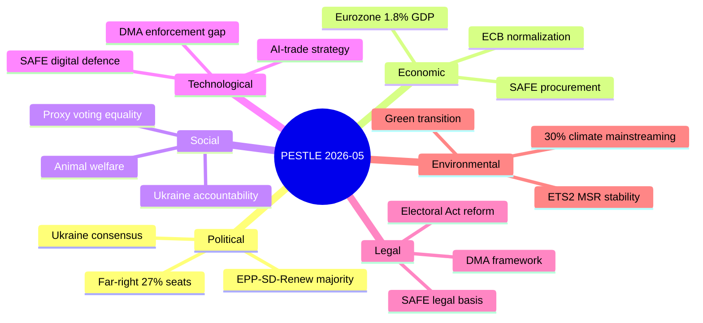

# PESTLE Analysis — EU Parliament Month in Review (April 28 – May 28, 2026)

**Framework:** PESTLE (Political, Economic, Social, Technological, Legal, Environmental)  
**Period:** April 28 – May 28, 2026  
**Generated:** 2026-05-28  
**Confidence:** 🟡 MEDIUM-HIGH

---

## P — Political

### Internal EP Politics
The EP10 Parliament continues to operate under a fragmented structure (ENP: 6.56) where
no two-party coalition commands a majority (EPP+S&D = 320; majority = 360). The month's
legislative output reveals three distinct coalition configurations:

1. **Super-majority consensus (400+ votes):** Ukraine accountability (TA-10-2026-0161),
   human rights resolutions (Haiti, Armenia, Afghanistan), fisheries agreements. These
   reflect the EP's capacity for near-unanimous consensus on geopolitical/humanitarian
   values issues regardless of left-right divisions.

2. **Working majority (360–400 votes, EPP+S&D+Renew):** DMA enforcement, budget guidelines,
   ETS2 MSR, SAFE Instrument. The core coalition of EPP-S&D-Renew (397 seats) operates as
   the default governing formation for contentious but consensus-achievable legislation.

3. **Contested majority (EPP+Renew+ECR, ~340 votes — may require NI or other):** Migration-
   adjacent texts (safe third country, GSP conditionality), chemical simplification. These
   reflect EPP's tactical rightward shifts on specific issues.

**Key political signal:** The 7 MEP immunity waivers (April–May 2026) — predominantly Polish
MEPs — reflect the importation of member-state political-legal conflicts into the EP's
institutional machinery. The Braun case (2 waiver decisions) and the Şoşoacă case (Romania's
notorious far-right MEP) test the EP's legal procedures at their limits.

### EU-Level Power Dynamics
The Von der Leyen Commission (2nd term, 2024–2029) is navigating:
- The "competitiveness agenda" (Draghi report follow-through) vs. Green Deal maintenance
- Defence spending reorientation (SAFE, ReArm Europe) vs. fiscal stability rules
- Enlargement momentum (Western Balkans, Ukraine, Moldova) vs. reform fatigue

EP's 2027 budget guidelines (TA-10-2026-0112) signal Parliament's priorities:
maintaining the triangle of security, competitiveness, and sustainability spending
against Commission and Council pressure for fiscal consolidation.

### Geopolitical Environment
- **Russia-Ukraine war:** Ongoing; Ukraine Claims Commission (TA-10-2026-0154) and
  Ukraine Support Loan (TA-10-2026-0035) reflect EP's medium-term commitment horizon
- **US-EU trade tensions:** March 2026 tariff response (TA-10-2026-0096) indicates
  EP ready to authorise countermeasures; WTO MC14 positioning (TA-10-2026-0086) shows
  preference for rules-based resolution
- **China relations:** AI-trade strategy (TA-10-2026-0183) implicitly addresses
  China's AI export competitiveness without naming it directly — classic EP hedging

---

## E — Economic

### Growth Context
- Eurozone 2026F growth: ~1.3% (IMF WEO proxy; ECB cautious hold)
- EGF mobilisations (3 in 3 months: Audi, Tupperware, KTM) signal continuing
  structural adjustment costs in traditional manufacturing sectors
- Budget 2027 guidelines: Parliament signals defence + green + digital spending
  priorities; total EU budget ~€190–200bn expected

### Trade Framework Evolution
- GSP reform (TA-10-2026-0114): Enhanced conditionality (human rights, labour,
  governance) on preferential tariff access — affects ~150 developing countries
- WTO Yaoundé MC14 (TA-10-2026-0086, March): EP called for progress on fisheries
  subsidies, agricultural supports, e-commerce moratorium — systemic trade rules
- SAFE Instrument extension to Canada (TA-10-2026-0180): Opens EU defence
  procurement market to Canadian entities — reciprocal arrangement with strategic
  implications for US vs. EU/Canada defence supply chains

### Banking and Financial Stability
- SRMR3 (TA-10-2026-0092, March): Banking union resolution mechanism strengthened
- EIB Annual Report 2024 (TA-10-2026-0119): Parliament oversight confirms EIB
  strategic orientation toward infrastructure, climate, defence dual-use
- Performance-based instruments (TA-10-2026-0122): New accountability framework
  tightens conditions on cohesion/recovery spending — reduces fiscal leakage risk

**Economic assessment:** 🟡 MEDIUM STABILITY — Above-recession growth with structural
transition costs; trade framework modernisation underway; banking architecture solid
but EU-wide fiscal rules remain under negotiation stress.

---

## S — Social

### Labour and Employment
- European Semester 2026 employment priorities (TA-10-2026-0076): EP called for
  labour market transitions focused on reskilling for green/digital economy
- Subcontracting chains and intermediaries (TA-10-2026-0050): Regulation of labour
  exploitation through complex contracting structures — affects gig economy and
  cross-border posting
- EGF automotive (Audi/Tupperware/KTM): ~2,500–4,000 workers directly affected across
  three countries; EGF covers reskilling, job search, mobility allowances

### Gender and Institutional Equity
- **Proxy voting during pregnancy (TA-10-2026-0124):** Electoral Act amendment allowing
  MEPs to vote by proxy during and after childbirth. A landmark institutional change that
  removes a structural barrier to women's participation in EP work. Supported across
  political lines (EPP to Left). Will take effect after member-state ratification.

### Civil Rights and Digital Harm
- Cyberbullying criminalization (TA-10-2026-0163): EP called for harmonised EU criminal
  law on cyberbullying and online harassment — primarily affects women and LGBTQ+
  individuals disproportionately targeted online. Platform responsibility framework
  proposed to complement criminal law.
- Women in Afghanistan (TA-10-2026-0186): Taliban Criminal Procedure Code codifies
  gender apartheid; EP condemnation and call for international accountability

### Animal Welfare
- Dogs and cats regulation (TA-10-2026-0115): Introduces EU-wide traceability system
  for companion animals, addressing puppy farm industry and illegal trade. Response to
  post-COVID boom in pet acquisition and documented animal welfare abuses in unregulated
  breeding supply chains.

**Social assessment:** 🟢 PROGRESSIVE TREND — Multiple social innovations (proxy voting,
cyberbullying, animal welfare) reflect EP's social agenda advancing alongside economic/
geopolitical priorities. Labour transition support mechanisms tested by automotive
restructuring.

---

## T — Technological

### Digital Governance
- **DMA enforcement (TA-10-2026-0160):** EP frustration with Commission enforcement
  pace against Big Tech gatekeepers. Key cases pending: Apple's browser interoperability,
  Google's self-preferencing in search, Meta's consent-or-pay model. EP called for
  stronger Commission enforcement capacity and faster proceedings.
- **AI-Trade strategy (TA-10-2026-0183):** Positions AI as EU strategic export: AI-
  enabled manufacturing, AI consultancy/services, AI in logistics. Calls for AI
  neutrality clauses in future FTAs to prevent discriminatory AI regulation as
  trade barrier. Signals EU's intent to export its AI regulatory model globally.
- **Copyright and Generative AI (TA-10-2026-0066, March):** Addresses training data
  rights, creator compensation, opt-out mechanisms — framework for AI content generation
  ecosystem.

### Defence Technology
- **SAFE Instrument (TA-10-2026-0180):** EU defence procurement collaboration with
  Canada in key dual-use technology areas — likely includes drone systems, cyber,
  space surveillance, and ammunition
- **Drones/warfare systems (TA-10-2026-0020, January):** EP called for EU to develop
  autonomous military capabilities — signals legislative intent to support EDTIB
  (European Defence Technological and Industrial Base)

### Digital Infrastructure
- **European technological sovereignty (TA-10-2026-0022, January):** EP endorsed
  comprehensive digital infrastructure sovereignty agenda — data centres, submarine
  cables, satellite systems, quantum computing

**Technology assessment:** 🟢 HIGH ACTIVITY — EP operating as active co-regulator
of digital economy; significant legislative output across AI, DMA enforcement,
copyright, and defence technology domains.

---

## L — Legal

### Rule of Law
- Corruption prevention regulation (TA-10-2026-0094, March): New EU anti-corruption
  directive strengthens institutional mechanisms; potentially applicable to member
  states with rule-of-law concerns
- MEP immunity waivers (7 in 30 days): Tests the JURI committee's procedural norms;
  the Braun case (2 decisions) sets precedents for handling MEPs accused of acts in
  their capacity as national parliamentarians

### International Law
- Ukraine International Claims Commission (TA-10-2026-0154): EP consented to the
  Convention establishing an international claims body for Ukrainian war damages —
  a novel international law instrument co-sponsored by EU and Council of Europe
- EU-Lebanon Eurojust (TA-10-2026-0177): Strengthens judicial cooperation in
  criminal matters with Lebanon — important for Hezbollah-related investigations
  and Syrian refugee/trafficking crime chains

### Electoral Law
- European Electoral Act amendment (TA-10-2026-0124): Proxy voting provision requires
  unanimity in Council and ratification by all member states before entering into force
  — legal uncertainty on timeline
- Reform of European Electoral Act (TA-10-2026-0006, January): Review of hurdles to
  implementation — reform momentum continues

### Trade Law
- Safe-country concept (TA-10-2026-0026): EP called for updated EU list of safe
  countries of origin for asylum — triggers legal challenges from civil society;
  CJEU implications expected
- GSP reform (TA-10-2026-0114): Enhanced conditionality mechanisms include
  withdrawal provisions; creates legal exposure for beneficiary countries

**Legal assessment:** 🟡 MEDIUM COMPLEXITY — International law innovation (Ukraine
commission, Eurojust agreements) alongside domestic rule-of-law pressure and electoral
reform legal constraints.

---

## E₂ — Environmental

### Climate Governance
- **ETS2 Market Stability Reserve (TA-10-2026-0139):** Extension to buildings and road
  transport sectors — key to maintaining carbon price signal for ETS2 (launching 2027)
  in the €20–50/tonne range. MSR prevents price crash if permits oversupplied.
- **GHG accounting for transport (TA-10-2026-0113):** Standardised emissions accounting
  for transport services (freight and passenger) — enables corporate Scope 3 reporting
  compliance and supply chain decarbonisation tracking

### Biodiversity and Natural Resources
- **Forest reproductive material (TA-10-2026-0168):** Updated EU regulation on forest
  seed and seedling production — climate adaptation of European forest ecosystems;
  biodiversity considerations for afforestation programs
- **Fisheries partnerships (TA-10-2026-0178, 0179):** São Tomé and Cook Islands
  agreements include sustainability clauses, scientific monitoring, and local fishing
  community protection provisions

### Animal Welfare
- Dogs and cats regulation (TA-10-2026-0115): Directly reduces animal welfare harm in
  commercial breeding; traceability system supports enforcement of existing welfare rules

### Environmental Risk Context
- **US tariff escalation** creates indirect pressure: if EU export revenues fall,
  fiscal space for green transition investment narrows (budget competition with defence)
- **EGF automotive** (Audi/KTM): Electric vehicle transition accelerating faster than
  social protection systems can absorb — environmental policy success creating social costs

**Environmental assessment:** 🟢 MAINTAINED — Core climate architecture (ETS2/MSR)
preserved; biodiversity/fisheries frameworks updated; no environmental governance
regression in April–May 2026 legislative output.

---

