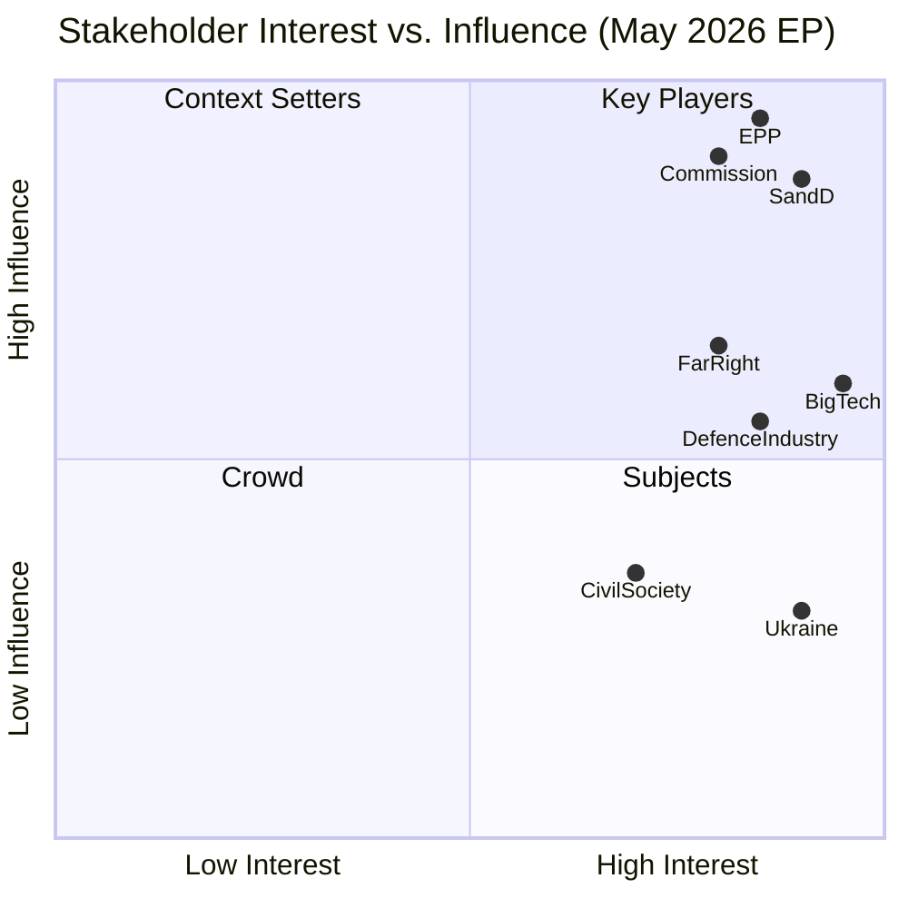

# Stakeholder Map — EU Parliament Month in Review (April 28 – May 28, 2026)

**Period:** April 28 – May 28, 2026  
**Generated:** 2026-05-28  
**Confidence:** 🟡 MEDIUM-HIGH  
**Method:** Thematic stakeholder analysis from adopted texts legislative record

---

## Stakeholder Universe Overview

The EU Parliament's April–May 2026 legislative cycle engaged eight primary stakeholder
clusters. Each cluster's interests, positions, power vectors, and legislative outcomes
are assessed below.

---

## 1. EPP (European People's Party) — 184 MEPs

**Core interests:** Regulatory competitiveness, defence industry support, managed
migration, EU enlargement, fiscal consolidation with strategic exceptions for defence
and digital.

**Legislative priorities achieved (April–May 2026):**
- Chemical products simplification (TA-10-2026-0138) — EPP's "omnibus" regulatory
  relief agenda advanced
- SAFE Instrument/Canada (TA-10-2026-0180) — EPP's defence sovereignty position
  operationalised in transatlantic procurement framework
- 2027 budget guidelines (TA-10-2026-0112) — EPP's security/competitiveness budget
  framing reflected in adopted text
- DMA enforcement (TA-10-2026-0160) — EPP supported operational enforcement without
  conceding to "break-up Big Tech" demands from Left

**Constraints and tensions:**
- Immunity waivers (Polish ECR-adjacent MEPs) create awkward dynamics with potential
  right-wing coalition partners
- AI-trade strategy (TA-10-2026-0183): EPP supports competitiveness framing but wary
  of trade provisions that constrain Member State AI industrial policy
- Green deal maintenance: EPP right-flank (agricultural constituency) wants faster
  rollback; EPP leadership maintaining cautious reform-not-rollback position

**Power assessment:** 🟢 DOMINANT — EPP is unavoidable pivot; no majority possible
without EPP participation. Strategic position maintained.

---

## 2. S&D (Socialists and Democrats) — 136 MEPs

**Core interests:** Social rights, worker protections, gender equality, anti-corruption,
rule of law, Ukraine/Eastern partnership support, tax justice, public investment.

**Legislative priorities achieved (April–May 2026):**
- Proxy voting amendment (TA-10-2026-0124) — S&D led on gender equity in EP procedures
- Cyberbullying criminalization (TA-10-2026-0163) — S&D's digital harm agenda
- EU-Canada SAFE Instrument: S&D conditionally supported with caveats on worker and
  environmental standards in defence procurement chains
- Ukraine accountability and Armenia support resolutions — S&D values agenda
- Performance-based instruments (TA-10-2026-0122): S&D demanded anti-fraud clauses
  in return for support

**Constraints and tensions:**
- Chemical simplification: S&D opposed deeper REACH cuts; compromise achieved
- GSP reform: S&D sought stronger human rights conditionality than adopted text
- ETS2 MSR: S&D supported but called for Social Climate Fund full activation

**Power assessment:** 🟡 INFLUENTIAL but not dominant — Essential for working majority
but must coordinate with Renew and accept EPP agenda-setting prerogatives.

---

## 3. Renew Europe — 77 MEPs

**Core interests:** Single market deepening, digital economy openness, trade liberalisation,
liberal democratic values, EU fiscal responsibility, regulatory simplification without
social protection regression.

**Legislative priorities achieved (April–May 2026):**
- DMA enforcement (TA-10-2026-0160): Renew's original DMA champions satisfied by
  enforcement focus; Renew secured provisions against over-regulation
- AI-trade strategy (TA-10-2026-0183): Renew's key agenda item — AI as EU economic
  asset, not just risk
- GSP reform (TA-10-2026-0114): Trade liberalisation with conditionality — Renew's
  preferred model

**Constraints and tensions:**
- SAFE Instrument: Renew supports but Atlantic-ist wing (French, Scandinavian MEPs)
  balances NATO primacy concerns
- Chemical simplification: Renew split between pro-industry and pro-environment wings
- Budget 2027 guidelines: Renew seeks fiscal discipline alongside strategic investment

**Power assessment:** 🟡 PIVOTAL — 77 seats at the intersection of EPP-led and
progressive-led coalitions; Renew's decisions determine majority formation outcome.

---

## 4. PfE (Patriots for Europe) — 85 MEPs

**Core interests:** Migration restriction, national sovereignty, rollback of Green Deal,
opposition to EU federalisation, Orbán-style "illiberal" governance protection.

**Legislative positions (April–May 2026):**
- 2027 Budget guidelines: PfE sought lower EU budget and cohesion fund conditions
  loosening; achieved limited success
- GSP reform: PfE opposed conditionality clauses as "neo-colonial"
- DMA enforcement: PfE opposed on grounds of EU overreach into national digital markets
- Ukraine resolutions: PfE voted against or abstained (Hungary-linked anti-Ukraine position)
- SAFE Instrument: PfE divided (some support for EU defence industry jobs; FPÖ Austria
  traditionally EU integration sceptic)

**Constraints and tensions:**
- Internal PfE tensions: Orbán's Fidesz (Hungary) vs. Meloni's Fratelli d'Italia
  (which is in ECR, not PfE) create right-wing coordination limits
- Vilimsky (FPÖ/PfE) immunity waiver (TA-10-2026-0164) creates bad optics
- EPP cordon sanitaire (formal or informal) limits PfE's legislative influence

**Power assessment:** 🔴 LIMITED in current cycle — Excluded from governing coalition;
influence via agenda-blocking and public opinion pressure rather than legislative victories.

---

## 5. ECR (European Conservatives and Reformists) — 81 MEPs

**Core interests:** National sovereignty, migration control, Israel solidarity (some members),
anti-corruption (Meloni), EU reform not federalisation, defence investment, limited
opposition to Green Deal.

**Legislative positions (April–May 2026):**
- SAFE Instrument: ECR generally supportive of EU defence industry
- 2027 Budget guidelines: ECR sought defence spending priority with cohesion cuts
- DMA/Digital: ECR mixed — pro-business liberalisation but anti-Big Tech in some wings
- Immunity waivers (Polish ECR-adjacent MEPs): Patryk Jaki's waiver creates internal
  ECR political management challenge

**Notable dynamics:**
- ECR-EPP informal coordination on migration texts continues
- Giorgia Meloni (Italian PM, Fratelli d'Italia parent party of ECR co-chairs) maintains
  strategic ambiguity — supportive of Ukraine, critical of EU federalism, constructive
  on defence
- ECR's 81 seats make it relevant for EPP right-flanking manoeuvres but insufficient
  to drive majority

**Power assessment:** 🟡 CONDITIONAL INFLUENCE — Value in EPP's right-flanking options;
limits on formal coalition role due to cordon sanitaire.

---

## 6. Greens/EFA — 53 MEPs

**Core interests:** Green Deal acceleration, biodiversity protection, climate ambition,
federalism, progressive immigration policy, anti-fossil fuel, human rights.

**Legislative priorities achieved (April–May 2026):**
- ETS2 MSR (TA-10-2026-0139): Greens' core climate architecture preserved
- GHG transport accounting (TA-10-2026-0113): Greens' transparency agenda advanced
- Forest reproductive material (TA-10-2026-0168): Biodiversity dimension included
- Ukraine, Armenia, Afghanistan resolutions: Greens' human rights agenda reflected
- Proxy voting amendment (TA-10-2026-0124): Greens strong supporters

**Constraints and tensions:**
- Chemical simplification (TA-10-2026-0138): Greens strongly opposed; voted against
- SAFE Instrument (TA-10-2026-0180): Greens divided on defence industrial cooperation
- Fisheries partnerships: Greens scrutinised sustainability provisions closely

**Power assessment:** 🟡 INFLUENCE via committee rapporteurships — 53 seats insufficient
for majority; high value in thematic specialisation (environment, human rights).

---

## 7. Ukrainian Government and People

**Indirect stakeholder — not MEPs but principal beneficiary of multiple adopted texts**

**Key decisions affecting Ukraine:**
- TA-10-2026-0035 (February): Ukraine Support Loan regulation — €5+ billion financing
  for 2026–2027
- TA-10-2026-0010 (January): Enhanced cooperation on Ukraine Loan — preliminary step
- TA-10-2026-0154 (April): International Claims Commission Convention — reparations
  framework for war damages (estimated €400–500 billion total)
- TA-10-2026-0161 (April): Civilian accountability resolution — pressure for ICC and
  international tribunal prosecution

**Assessment:** EP has acted as Ukraine's most consistent advocate within EU institutions,
building institutional infrastructure (support loans, claims commission, accountability
mechanisms) that outlasts any individual political moment.

---

## 8. Civil Society, Industry, and External Stakeholders

### Digital Industry (Big Tech)
- **DMA enforcement (TA-10-2026-0160):** Designated gatekeepers (Alphabet, Apple, Meta,
  Amazon, Microsoft, ByteDance) face increased EP scrutiny; resolution accelerates
  Commission enforcement timetable
- **Copyright/GenAI (TA-10-2026-0066, March):** Training data rights disputes — creative
  industries (publishers, music labels, visual artists) vs. AI companies

### Automotive Industry
- **EGF mobilisations:** Audi (Belgium), KTM (Austria), Tupperware (Belgium) — traditional
  manufacturing communities facing restructuring; EGF provides transitional support but
  not structural solution to competitiveness gap
- **GHG transport accounting (TA-10-2026-0113):** Logistics and transport companies face
  new reporting obligations; burden vs. benefit assessment varies by company size

### Chemical Industry
- **Chemical simplification (TA-10-2026-0138):** Industry beneficiary; partial REACH
  relief; CEFIC (European Chemical Industry Council) positioned as successful lobby

### Agricultural Sector
- **GSP reform (TA-10-2026-0114):** EU-Mercosur safeguard clause (TA-10-2026-0030,
  February) and GSP reform affect EU agricultural export competitiveness vs. import
  competition — Copa-Cogeca (EU farmers' umbrella) monitoring closely
- **Livestock sector (TA-10-2026-0157, April):** EP adopted own-initiative report on
  sustainable future for EU livestock amid food security and animal disease challenges

### Defence Industry
- **SAFE Instrument (TA-10-2026-0180):** EU and Canadian defence primes benefit from
  expanded procurement cooperation; non-Canadian/EU companies potentially disadvantaged
- **Drones/warfare systems (January):** EDTIB companies (Leonardo, Airbus, KNDS, Rheinmetall
  operating in EU) positioned for increased EP support for EU defence procurement

### Financial Services
- **SRMR3 (TA-10-2026-0092, March):** Banks subject to resolution framework face updated
  intervention thresholds; improved resolution toolbox reduces "too-big-to-fail" implicit
  subsidy
- **EIB Group oversight (TA-10-2026-0119):** EIB's green/strategic investment mandate
  confirmed with enhanced transparency requirements

---

