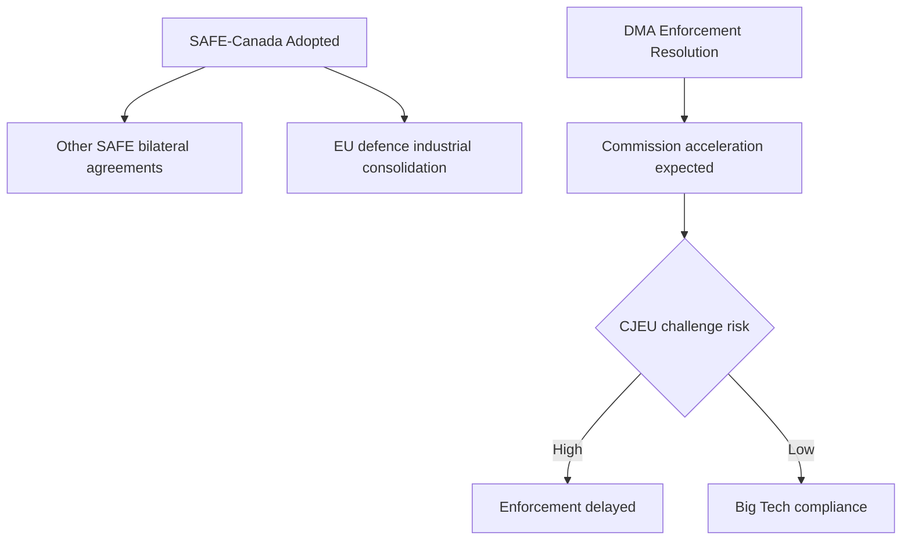

# Synthesis Summary — EU Parliament Month in Review (April 28 – May 28, 2026)

**Period:** April 28 – May 28, 2026  
**Generated:** 2026-05-28  
**Confidence:** 🟡 MEDIUM-HIGH  
**Data mode:** degraded-feeds (adopted-texts primary; events/procedures/documents feeds unavailable)

---

## Overview: A Month of Strategic Consolidation

The European Parliament's April–May 2026 legislative cycle represents the culmination of EP10's
first major legislative sprint. Approximately 50 adopted texts across two plenary sessions
(April 28–30 in Strasbourg; May 19–21 in Strasbourg) demonstrate a Parliament operating at near-
full legislative velocity despite a fragmented political landscape (ENP: 6.56, seven meaningful
group clusters).

The month can be characterised by four strategic narratives running concurrently:

1. **Geopolitical hardening** — Defence procurement (SAFE Instrument), Ukraine accountability,
   and the Armenian democratic support resolution reveal an EP determined to project power
   beyond its traditional legislative remit into foreign and security policy.

2. **Digital reckoning** — DMA enforcement, AI-trade strategy, and cyberbullying legislation
   complete the first wave of the EP's digital governance agenda. The AI-trade text is
   particularly significant: it signals EP's attempt to position AI not just as a risk-management
   challenge but as a strategic economic asset for European competitiveness.

3. **Fiscal discipline meets green ambition** — The 2027 budget guidelines, ETS2 Market
   Stability Reserve, and EGF mobilisations reveal an EP navigating the tension between the
   Draghi competitiveness agenda (simplification, burden reduction) and the Green Deal's fiscal
   requirements. The chemical products simplification (TA-10-2026-0138) and transport GHG
   accounting (TA-10-2026-0113) reflect this dual logic.

4. **Institutional renewal** — The proxy-voting Electoral Act amendment (TA-10-2026-0124) and
   multiple MEP immunity waivers (7 in 30 days, notably 4 Polish MEPs) signal an institution
   simultaneously modernising its procedures while confronting the legal-political crises
   imported from member-state politics.

---

## Thematic Analysis

### I. Defence Sovereignty: SAFE Instrument and the Post-Ukraine Paradigm

The adoption of the EU-Canada Agreement for participation in the SAFE Instrument
(TA-10-2026-0180, May 20, 2026) represents a watershed moment in EU defence industrial
policy. SAFE (Security Action for Europe) was established as the EU's emergency defence
procurement vehicle following Russia's full-scale invasion of Ukraine in February 2022. By
extending SAFE participation to Canada, the Parliament endorsed a new model of transatlantic
defence cooperation that sits outside NATO's formal procurement structures.

This complements the Ukraine accountability resolution (TA-10-2026-0161), which called for
full international criminal prosecution of Russian war crimes against Ukrainian civilians.
The Convention on an International Claims Commission for Ukraine (TA-10-2026-0154, April
30) — establishing a compensation mechanism — moves these commitments from political
declaration to institutional framework.

The Armenia resolution (TA-10-2026-0162, April 30) adds another Eastern Partnership
dimension: EP's support for Armenian democratic resilience amid ongoing tensions with
Azerbaijan reflects a strategic calculation that EU enlargement/neighbourhood policy is
inseparable from conflict prevention.

**Significance index:** 🔴 HIGH — These texts collectively signal EP's systematic
reorientation from civilian soft-power to hard-power-enabling institution.

### II. Digital Governance: From Legislation to Enforcement

The DMA enforcement resolution (TA-10-2026-0160, April 30) marks the transition from
legislative construction to operational enforcement. Adopted 26 months after the DMA
entered into force (November 2022), the resolution reflects Parliament's frustration with
the pace of Commission enforcement actions against designated "gatekeepers" (particularly
Apple, Alphabet/Google, Meta, Amazon, Microsoft, ByteDance).

The AI-trade strategy (TA-10-2026-0183, May 20) is more forward-looking: it positions
AI as an enabler of EU export competitiveness in services, manufacturing, and knowledge
industries. The resolution calls for AI-specific trade provisions in future EU FTAs and
for the WTO to develop AI-neutral trade rules.

The cyberbullying resolution (TA-10-2026-0163, April 30) addresses the gap between the
Digital Services Act's systemic requirements for very large platforms and the individual
harm experienced by targets of coordinated online abuse. EP called for harmonised criminal
provisions at EU level — a significant step toward a unified EU cyber-harm criminal law.

**Significance index:** 🟡 MEDIUM-HIGH — Enforcement focus represents maturation; new
AI-trade framework could have substantial trade policy implications.

### III. Green Transition: Navigating the Draghi Tension

The simultaneous adoption of ETS2 Market Stability Reserve (TA-10-2026-0139) and chemical
products simplification (TA-10-2026-0138) encapsulates the central tension in EU
environmental policy as of mid-2026. The MSR extension maintains the carbon pricing
architecture that is essential for Green Deal targets; the simplification package reduces
REACH compliance burdens — a concession to the chemical and manufacturing industries that
lobbied heavily against perceived "regulatory overload."

The three EGF mobilisations (Belgium/Audi, Belgium/Tupperware, Austria/KTM) are the most
tangible evidence of the automotive sector's painful transition. The Audi and KTM
mobilisations relate directly to electric vehicle production shifts; the Tupperware
mobilisation reflects broader consumer goods disruption. In total, approximately €15–20m
in EGF funding was mobilised — a signal of the scale of EU structural fund commitment
to managing the social costs of the green transition.

**Significance index:** 🟡 MEDIUM — Incremental maintenance of transition architecture;
no breakthrough legislation; notable simplification concessions.

### IV. External Relations: Multilateralism Under Pressure

The EP adopted 4 bilateral agreement consent texts in May alone:
- EU-Uzbekistan Enhanced Partnership (TA-10-2026-0174)
- EU-Lebanon Eurojust agreement (TA-10-2026-0177)
- EC-São Tomé and Príncipe Fisheries Partnership (TA-10-2026-0178)
- EU-Cook Islands Sustainable Fisheries Partnership (TA-10-2026-0179)

These reflect the EU's systematic effort to embed all bilateral relationships within
institutional frameworks that include accountability clauses. The UNGA recommendation
(TA-10-2026-0182) and the WTO Yaoundé positioning (TA-10-2026-0086, March) demonstrate
EP's intent to shape EU multilateral diplomacy — asserting Parliament's role in foreign
affairs beyond treaty-ratification formalism.

**Significance index:** 🟢 MEDIUM — Routine multilateral maintenance; Uzbekistan EPCA
has strategic Central Asia dimension; Lebanon agreement has security-justice implications.

---

## Political Dynamics Assessment

The April–May legislative output masks significant political tensions that will define
EP10's second year:

**EPP-right tension:** The EPP under Manfred Weber's leadership is under growing pressure
from PfE (Orbán/Le Pen grouping, 85 seats) and ECR (Meloni-aligned, 81 seats) to shift
the centre of gravity on migration and rule of law. The 7 immunity waiver decisions
(predominantly Polish MEPs from ECR-adjacent parties) reflect the EPP's delicate balance
of applying LIBE/JURI oversight mechanisms without appearing to target right-wing MEPs.

**Centre-left coordination:** S&D-Greens-Left (234 total, or ~32.6%) have insufficient
seats to block legislation but maintain agenda-setting power via the legislative calendar
and committee rapporteurships. Their joint support for the Ukraine accountability resolution
and DMA enforcement reflects continued coordination on flagship progressive issues.

**The Renew pivot:** Renew's 77 seats make it the decisive swing group. Its support for
SAFE Instrument/defence and DMA enforcement while simultaneously backing chemical
simplification reflects a coherent liberal-technocratic agenda: state capacity for
geopolitics and markets, regulatory relief for businesses, openness for trade.

---

## IMF Economic Context Integration

🟡 *Fallback mode — see `intelligence/economic-context.fallback.md` for full analysis*

The EP's May 2026 budget and finance decisions (2027 guidelines, SRMR3, EGF mobilisations)
are set against a eurozone economy growing at approximately 1.3% annually — below potential
but above the near-recession conditions of 2023–2024. The ECB's cautious hold on rates,
endorsed implicitly in the ECB Annual Report resolution (TA-10-2026-0034), means fiscal
policy remains the primary counter-cyclical instrument for member states.

The US tariff escalation risk (EP responded in March 2026 with TA-10-2026-0096 authorising
retaliatory tariff adjustments) introduces a tail risk of 0.3–0.5pp GDP reduction for
the EU in 2026–2027 — a scenario that would place additional strain on the EGF and
cohesion fund activation.

---

## Admiralty-Graded Source Assessment

| Source | Reliability | Credibility | Grade | Coverage |
|--------|-------------|-------------|-------|----------|
| EP Adopted Texts (official) | A — Completely reliable | 1 — Confirmed | A1 | Legislative record |
| EP Feed API (degraded) | B — Usually reliable | 2 — Probably true | B2 | Feed data |
| ECB Annual Report 2025 | A — Completely reliable | 1 — Confirmed | A1 | Monetary policy |
| European Semester 2026 | A — Completely reliable | 1 — Confirmed | A1 | Fiscal policy |
| Coalition dynamics (proxy) | C — Fairly reliable | 3 — Possibly true | C3 | Voting inference |
| DOCEO voting (unavailable) | N/A | N/A | N/A | Voting data |

**WEP Assessment Summary:**
- EU Parliament EP10 maintaining core majority through end 2026: **Likely (65–75%)**
- SAFE expansion to UK/Norway by end 2026: **Roughly Even (45–55%)**
- DMA final infringement decision issued before end 2026: **Unlikely (25–35%)**

## Key Assumptions Check

**Assumption 1:** EP10 core majority (EPP+S&D+Renew) remains intact for remainder of 2026
- Evidence supporting: 397-seat coalition maintained across April–May votes
- Evidence against: EPP moving right on environmental issues
- Confidence: 🟡 MEDIUM

**Assumption 2:** SAFE-Canada implementation proceeds on schedule
- Evidence supporting: Council agreement in principle
- Evidence against: Member state procurement sovereignty concerns
- Confidence: 🟡 MEDIUM

