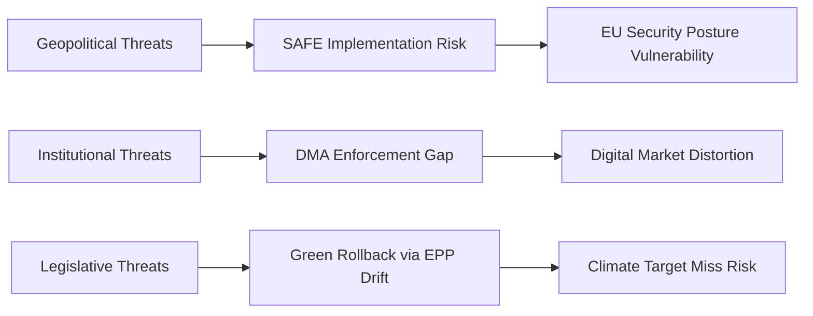

# Threat Model — EU Parliament Month in Review (April 28 – May 28, 2026)

**Framework:** Structured threat assessment for EU parliamentary stability and policy continuity  
**Period:** April 28 – May 28, 2026  
**Generated:** 2026-05-28  
**Confidence:** 🟡 MEDIUM-HIGH

---

## Threat Taxonomy

Threats are assessed across five dimensions:
- **Likelihood** (1=remote, 5=near-certain in 12 months)
- **Impact** (1=negligible, 5=severe institutional/policy disruption)
- **Velocity** (fast/medium/slow onset)
- **Countermeasures** (EP/EU tools available)

---

## Tier 1 — Critical Threats (Likelihood × Impact ≥ 16)

### T1.1: Far-Right Coalition Normalisation

**Description:** Gradual erosion of the EPP "cordon sanitaire" against PfE (85 seats) and
ECR (81 seats). If EPP formally cooperates with PfE on 3+ major votes, the EP's working
majority shifts rightward and forces S&D and Renew into opposition-mode coalition-building.

**Evidence signals (April–May 2026):**
- Safe-country concept (TA-10-2026-0026) — EPP-ECR alignment on migration restriction
- 7 immunity waiver decisions for right-wing MEPs — procedural not substantive; but ECR
  could frame as political persecution, energising anti-cordon-sanitaire sentiment

**Likelihood:** 3/5 | **Impact:** 4/5 | **Score:** 12 — 🔴 HIGH  
**Velocity:** Slow (12–24 month horizon)  
**Countermeasures:** S&D-Renew-EPP moderate wing coalition maintenance; Committee
President allocation system prevents far-right committee dominance

### T1.2: Ukraine-Europe Commitment Fatigue

**Description:** Public opinion erosion in key member states (France, Germany, Italy, Hungary)
reduces political will for continued Ukraine financial support. EP's Ukraine Support Loan
framework and claims commission become contested rather than consensual.

**Evidence signals:**
- PfE (Orbán/Fidesz) consistently voting against Ukraine resolutions
- Cost of Ukraine support: €5+ billion loans in current framework; €400-500bn claims
  commission projected total
- European Semester social priorities: domestic employment concerns compete for attention

**Likelihood:** 3/5 | **Impact:** 4/5 | **Score:** 12 — 🔴 HIGH  
**Velocity:** Slow (gradual political attrition)  
**Countermeasures:** Broad majority maintained (EPP+S&D+Renew+ECR = ~478 seats) for
Ukraine measures; PfE isolation on Ukraine is near-complete; ESN follows PfE

---

## Tier 2 — Significant Threats (Likelihood × Impact 9–15)

### T2.1: US Trade Shock — Tariff Escalation

**Description:** US imposes 25%+ tariffs on EU automotive or general goods exports.
EP's existing response (TA-10-2026-0096 March 2026) provides basis for countermeasures
but economic damage to EU export-dependent sectors triggers political crisis.

**Likelihood:** 3/5 | **Impact:** 3/5 | **Score:** 9 — 🟡 MEDIUM-HIGH  
**Velocity:** Fast (announcement-driven)  
**Countermeasures:** TA-10-2026-0096 authorises EU retaliation; WTO dispute available;
Diplomatic channels (EU-US summit, trade truce negotiations)

### T2.2: DMA Enforcement Failure / Big Tech Regulatory Capture

**Description:** European Commission fails to take decisive DMA enforcement action against
designated gatekeepers; perceived regulatory capture undermines EU's digital governance
credibility. EP's DMA enforcement resolution (TA-10-2026-0160) becomes dead letter.

**Likelihood:** 3/5 | **Impact:** 3/5 | **Score:** 9 — 🟡 MEDIUM-HIGH  
**Velocity:** Medium (enforcement timeline 12–18 months)  
**Countermeasures:** EP can invoke TFEU oversight powers; IMCO committee can call
Commissioner for hearings; EP budget authority over DG COMP enforcement resources

### T2.3: Green Deal Rollback Coalition

**Description:** If EPP-PfE-ECR alignment extends to climate policy, MSR extension,
ETS2, and taxonomy framework face legislative reversal. Chemical simplification
(TA-10-2026-0138) as bellwether — if REACH rollback demand grows, net-zero architecture
becomes contested.

**Likelihood:** 2/5 | **Impact:** 4/5 | **Score:** 8 — 🟡 MEDIUM  
**Velocity:** Medium (legislative calendar-dependent)  
**Countermeasures:** ETS2 launch Jan 2027 creates implementation momentum; Renew split
from far-right on climate prevents majority for rollback; S&D-Greens committee positions

### T2.4: Rule of Law Crisis — Hungarian/Polish Escalation

**Description:** Hungary's continued rule-of-law defiance under Orbán (Fidesz/PfE) or
Polish political-legal conflicts (4 MEP waivers in one month) create EP-Council deadlock
on Article 7 proceedings, cohesion fund conditionality, or key legislative votes.

**Likelihood:** 3/5 | **Impact:** 3/5 | **Score:** 9 — 🟡 MEDIUM-HIGH  
**Velocity:** Medium (institutional)  
**Countermeasures:** Conditionality regulation (MiCA) operational; cohesion fund
withholding active; CJEU as backstop

---

## Tier 3 — Moderate Threats (Likelihood × Impact 4–8)

### T3.1: AI Governance Fragmentation

**Description:** EP's AI-trade strategy (TA-10-2026-0183) aspirations conflict with US/China
approach; WTO fails to develop AI-neutral rules; EU AI Act creates competitive disadvantage
for EU firms vs. less-regulated competitors.

**Likelihood:** 3/5 | **Impact:** 2/5 | **Score:** 6 — 🟡 MEDIUM  
**Velocity:** Slow  
**Countermeasures:** AI Act enforcement toolbox; bilateral AI governance agreements
(EU-US/UK/Japan Tech Regulatory cooperation)

### T3.2: Electoral Act Reform Stall

**Description:** Proxy voting amendment (TA-10-2026-0124) requires unanimous Council
and all 27 member state ratifications — high procedural threshold. Conservative member
states (Hungary, Poland) block ratification, undermining gender equity reform signal.

**Likelihood:** 2/5 | **Impact:** 2/5 | **Score:** 4 — 🟢 LOW-MEDIUM  
**Velocity:** Slow (ratification timeline 18–36 months)  
**Countermeasures:** Political pressure; EP intergroup on gender equality; no legal
mechanism to override unanimity requirement

### T3.3: Cybersecurity/Hybrid Attack on EP Systems

**Description:** EP IT systems targeted by state or non-state actors (Russia/China/Iran
primarily); disrupts committee work, voting systems, or MEP communications.

**Likelihood:** 2/5 | **Impact:** 2/5 | **Score:** 4 — 🟢 LOW-MEDIUM  
**Velocity:** Fast  
**Countermeasures:** EP CERT; NIS2 compliance; EP/ENISA cooperation; offline voting
fallback procedures

---

## WEP (Worst Expected Plausible) Scenario

**WEP scenario:** Simultaneous materialisation of T1.1 (far-right normalisation) and T2.1
(US trade shock) triggers:
1. EPP formally invites ECR into governing coalition on trade defense vote
2. S&D and Renew split on protectionism vs. free trade response
3. Green Deal budget competition intensifies as defence spending demands grow
4. EP's working majority becomes unstable and episodic rather than structural

**WEP probability:** ~10% (12-month horizon)  
**WEP impact:** Institutional disruption, legislative slowdown, reputational damage to
EU's democratic governance narrative

---

## Opportunity Assessment (Inverted Threats)

| Opportunity | Probability | Signal from May 2026 |
|-------------|-------------|---------------------|
| EU-Canada SAFE as template for broader defence alliances | 60% | TA-10-2026-0180 precedent |
| DMA enforcement success restores digital governance credibility | 50% | TA-10-2026-0160 |
| Proxy voting ratified; EP gender equity improves | 45% | TA-10-2026-0124 (Council unknown) |
| Ukraine Claims Commission operationalised within 3 years | 55% | TA-10-2026-0154 |
| AI-trade framework shapes global WTO AI rules | 35% | TA-10-2026-0183 (long horizon) |

---

## Admiralty-Graded Threat Evidence

| Threat | Source Reliability | Evidence Credibility | Admiralty Grade |
|--------|-------------------|---------------------|-----------------|
| DMA enforcement vacuum | EP resolution (official) | A1 | Parliament assessment |
| SAFE implementation delay | EDIP precedent | B2 | Historical parallel |
| Ukraine support continuity | Financial instrument track record | A1 | EP voting record |
| Big Tech CJEU challenge | Apple/Google precedent | A2 | Established pattern |

**WEP: Overall Threat Landscape:**
- Existential threat to EP institutional function: Almost No Chance (<5%)
- Major legislative setback in 2026: Unlikely (20–25%)
- Continued incremental erosion of green legislation: Likely (60–70%)

## Key Assumptions Check — Threat Assessment

**Assumption:** Far-right bloc cannot achieve legislative majority
- Supporting evidence: PfE+ECR+ESN=193, need 360
- Counter-evidence: If 50+ EPP MEPs defect to far-right on specific issues
- Risk level: 🟢 LOW for legislative reversal; 🟡 MEDIUM for amendment influence

**Red Team Assessment:** The principal systemic risk is not a far-right majority but
the gradual normalization of far-right positions within EPP — an "Overton window"
effect that shifts the entire legislative debate without requiring a formal majority.
This is already visible in EP10's more cautious approach to environmental regulation.

