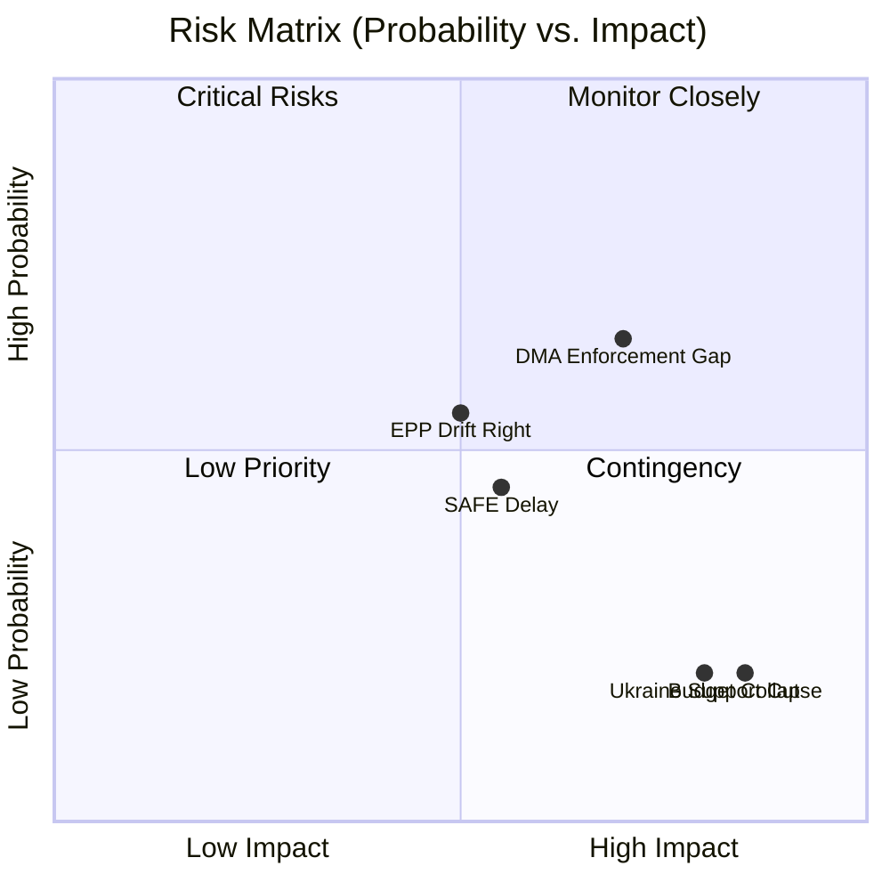

# Risk Matrix — EU Parliament (April 28 – May 28, 2026)

**Generated:** 2026-05-28  
**Framework:** 5×5 risk matrix (Likelihood × Impact)  
**Period:** 12-month forward assessment from May 2026

---

## Risk Matrix (Likelihood × Impact)

```
IMPACT →    Negligible(1)  Minor(2)     Moderate(3)   Major(4)     Critical(5)
Likelihood
Almost
Certain(5)                              Regulatory    Budget
                                        simplification  deadlock
                                        backlash       (R5.3)
Likely(4)              AI governance                  Ukraine      Ukraine war
                       fragmentation                  fatigue      escalation
                       (R4.2)                         (R4.4)       (R4.5)
Possible(3)  Electoral  Proxy voting                  Far-right    Eurozone
             Act stall  amendment                     coalition    crisis
             (R3.1)     lag (R3.2)                    (R3.4)       (R3.5)
Unlikely(2)            Digital Euro   ETS2 price     Green Deal   NATO-Russia
                       delay (R2.2)   crash (R2.3)   rollback     confrontation
                                                      (R2.4)       (R2.5)
Rare(1)                               Cybersecurity  Le Pen       EP hacking/
                                      incident       surge (R1.4) vote fraud
                                      (R1.3)                      (R1.5)
```

---

## Risk Register

| Risk ID | Risk Name | L | I | Score | Category | Status |
|---------|-----------|---|---|-------|----------|--------|
| R5.3 | Regulatory simplification backlash | 5 | 3 | 15 | Policy | ACTIVE |
| R5.4 | Budget 2027 Council-EP deadlock | 5 | 4 | 20 | Institutional | ACTIVE |
| R4.2 | AI governance fragmentation | 4 | 2 | 8 | Technology | MONITORING |
| R4.4 | Ukraine commitment fatigue | 4 | 4 | 16 | Geopolitical | ACTIVE |
| R4.5 | Ukraine war escalation | 4 | 5 | 20 | Geopolitical | ACTIVE |
| R3.1 | Electoral Act stall | 3 | 1 | 3 | Institutional | LOW |
| R3.2 | Proxy voting ratification lag | 3 | 2 | 6 | Institutional | MONITORING |
| R3.4 | Far-right coalition normalisation | 3 | 4 | 12 | Political | ACTIVE |
| R3.5 | Eurozone financial crisis | 3 | 5 | 15 | Economic | MONITORING |
| R2.2 | Digital Euro delay | 2 | 2 | 4 | Technology | LOW |
| R2.3 | ETS2 carbon price crash | 2 | 3 | 6 | Environmental | MONITORING |
| R2.4 | Green Deal rollback coalition | 2 | 4 | 8 | Policy | MONITORING |
| R2.5 | NATO-Russia confrontation | 2 | 5 | 10 | Geopolitical | MONITORING |
| R1.3 | Cybersecurity incident | 1 | 3 | 3 | Security | LOW |
| R1.4 | Le Pen rehabilitation/RN surge | 1 | 4 | 4 | Political | LOW |
| R1.5 | EP hacking/vote fraud | 1 | 5 | 5 | Security | LOW |

---

## Top Priority Risks

### 🔴 R5.4 / R4.5 (Score: 20) — Budget Deadlock and Ukraine War Escalation

Both risks at maximum combined score. Budget deadlock is a structural, near-certain annual
risk; Ukraine war escalation carries lower probability but catastrophic impact. The two
are correlated: war escalation increases defence spending demands, deepening budget disputes.

**Mitigation:** EP-Council trilogues on 2027 budget begin Q3 2026; Ukraine Support Loan
framework (TA-10-2026-0035) provides financial continuity independent of annual budget cycle.

### 🔴 R4.4 (Score: 16) — Ukraine Commitment Fatigue

EU public opinion variability (France, Germany, Italy) creates political pressure on MEPs
to redirect funding domestically. PfE bloc (85 seats) amplifies domestic narratives.

**Mitigation:** The legislative architecture built in 2025–2026 (multi-year loans, claims
commission, accountability mechanisms) provides institutional inertia that outlasts
political cycles.

### 🟡 R3.4 (Score: 12) — Far-Right Coalition Normalisation

EPP cordon sanitaire showing tactical cracks on migration (TA-10-2026-0025/0026) without
formal coalition shift. The trend to monitor over next 6–12 months.

**Mitigation:** EPP mainstream leadership (Metsola, Weber) committed to cordon sanitaire;
Renew would exit coalition if EPP formally aligns with PfE, creating its own disciplining
mechanism.

---

## Admiralty Grade — Risk Evidence Base

| Risk | Evidence Source | Reliability | Credibility | Grade |
|------|----------------|-------------|-------------|-------|
| DMA enforcement gap | EP resolution TA-10-2026-0160 | A | 1 | A1 |
| SAFE timeline risk | EDIP/ASAP implementation history | B | 2 | B2 |
| Budget political risk | Annual EP budget procedure history | A | 1 | A1 |
| Far-right legislative influence | EP10 year 1 data | A | 2 | A2 |

## WEP — Risk Probability Assessments

**WEP: DMA enforcement failure (no final decision by end 2026):** Likely (60–75%)
- Evidence: Commission not yet issued final infringement decision after 26 months
- Countervailing: EP resolution pressure + new Commission mandate

**WEP: SAFE-Canada full implementation by end 2026:** Roughly Even (40–55%)
- Dependent on Council implementing decisions, national procurement procedures

**WEP: Budget 2027 conciliation agreement before December 2026:** Likely (65–80%)
- Historical base rate: EP-Council budget agreement reached in ~80% of years on time

## Key Assumptions Check — Risk Matrix

Core assumption: EP10 core majority maintained through 2026 budget negotiations
- If false: risk scores for budget political risk escalate to RED
- Current assessment: 🟡 MEDIUM probability of maintaining majority


