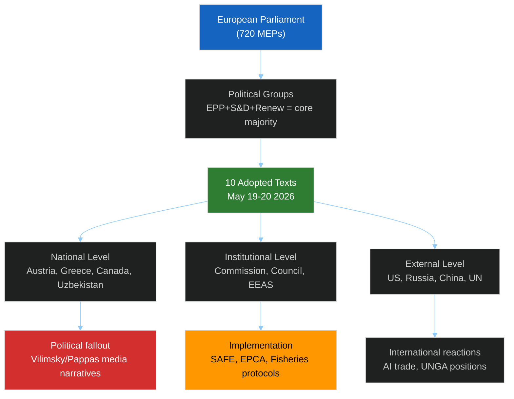

<!-- SPDX-FileCopyrightText: 2026 Hack23 AB -->
<!-- SPDX-License-Identifier: Apache-2.0 -->

# 🎭 Actor Mapping — EP Motions May 2026
**Date:** 2026-05-28 | **Article Type:** motions | **Framework:** CIA Political Actor Network

---

## 🎯 Actor Mapping Scope

This document maps the key political actors activated by the EP May 19–22, 2026 session decisions. Actor mapping follows the five-layer CIA framework: Primary actors (direct decision-makers), Secondary actors (institutional respondents), Tertiary actors (national political recipients), External actors (non-EU), and Structural actors (systemic forces).

---

## 🔴 Layer 1 — Primary Actors (Direct Decision-Makers)

### 1.1 European Parliament Political Groups

**EPP (European People's Party) — ~182 seats**
- **Role in this session:** Dominant coalition anchor; co-proposer on SAFE Instrument, Uzbekistan EPCA
- **Key voting pattern:** Likely supported all 10 texts (standard EPP position: support EU external relations + ratification + immunity waivers where prosecution is credible)
- **Internal dynamics:** Manfred Weber (CSU) leadership continues to balance Christian Democratic tradition with pragmatic coalition management
- **Influence score:** 9/10

**S&D (Socialists & Democrats) — ~136 seats**
- **Role:** Second coalition pillar; AFET committee typically S&D-friendly on external relations
- **Likely positions:** Supported Uzbekistan EPCA with human rights reservations; supported SAFE Instrument (European defence mainstream); ambivalent on Pappas (fellow Left-of-centre, but Syriza is in The Left, not S&D)
- **Influence score:** 7/10

**Renew Europe — ~77 seats**
- **Role:** Decisive swing bloc for EPP-led coalitions; Macron allies
- **Likely positions:** Strongly pro-SAFE (French defence interest), pro-Uzbekistan (central Asia engagement), pro-AI trade strategy
- **Influence score:** 7/10

**ECR (European Conservatives) — ~78 seats**
- **Role:** Selective support; anti-federalist but pro-defence industrial on NATO axis
- **Likely positions:** SAFE Instrument — likely support; Uzbekistan — skeptical; AI trade — selective
- **Influence score:** 5/10

**ID (Identity & Democracy) — ~49 seats**
- **Role:** Opposition on most external action; internal contradiction re Vilimsky (own group member)
- **ID voted to waive Vilimsky's immunity** — procedurally expected; immunity waivers are almost always approved where prosecution appears credible
- **Influence score:** 3/10 (limited coalition leverage)

**The Left (GUE/NGL) — ~46 seats**
- **Role:** Opposition on defence, selective on external relations; home of Pappas
- **Likely position on Pappas immunity:** Abstention or symbolic protest; cannot block majority
- **Influence score:** 3/10 (constructive minority)

---

## 🟠 Layer 2 — Secondary Actors (Institutional)

### 2.1 Committee Chairs/Rapporteurs (Identified)

| Committee | Relevance | Key Actor |
|-----------|-----------|-----------|
| AFET (Foreign Affairs) | Uzbekistan EPCA, UNGA 81, Lebanon-Eurojust | David McAllister (EPP, Germany) — Chair |
| INTA (International Trade) | SAFE-Canada, AI trade strategy | Bernd Lange (S&D, Germany) — likely senior voice |
| PECH (Fisheries) | São Tomé + Cook Islands | Senior MEP on PECH; routine votes |
| PRIV (Privileges) | Vilimsky + Pappas immunity | Standing committee; report-driven |
| JURI (Legal Affairs) | Immunity waivers (co-competence) | Rapporteurs on 0164 and 0166 |
| ITRE (Industry) | AI trade strategy (co-rapporteur with INTA) | Digital sovereignty advocates |

### 2.2 European Commission

- **Directorate-General Trade (DG TRADE):** Activated by AI trade resolution; must respond to EP position in WTO negotiations
- **DG DEFIS (Defence Industry):** Implementation authority for SAFE Instrument; will operationalise the EU-Canada framework
- **EEAS (External Action Service):** Uzbekistan EPCA implementation; Lebanon Eurojust; UNGA positioning
- **Legal Service:** Provides opinions on immunity waiver procedures

### 2.3 European Council

- **Council of the EU:** Ratification partner on Uzbekistan EPCA, SAFE, fisheries agreements (shared competence)
- **High Representative (VP/HR):** Implementer of AFET positions; Uzbekistan, UNGA 81, Lebanon

---

## 🟡 Layer 3 — National Political Actors

### 3.1 Austria (Vilimsky/FPÖ Immunity)

- **FPÖ (Freedom Party Austria):** Ruling coalition member; Harald Vilimsky is both MEP and FPÖ secretary-general
- **Herbert Kickl (Austrian Chancellor):** Watches immunity waiver with domestic political sensitivity
- **Austrian Prosecution Service:** The entity requesting the waiver; unnamed in published data
- **Austrian Media:** High-salience domestic story; FPÖ credibility implications
- **Domestic alignment:** Austrian government cannot intervene in EP PRIV process; must accept outcome

### 3.2 Greece (Pappas/Syriza Immunity)

- **Syriza (main opposition party):** Pappas is from former Tsipras-era leadership; immunity waiver politically significant for Syriza's rehabilitation/accountability narrative
- **Greek Prosecution Service:** The requesting authority
- **New Democracy (governing party, Mitsotakis):** Domestic benefit from Syriza legal proceedings
- **Greek public:** Heightened attention given ongoing accountability debates post-2015 crisis era

### 3.3 Canada (SAFE Instrument)

- **Global Affairs Canada:** Negotiated and signed the SAFE Instrument framework
- **Canadian defence industry:** Direct beneficiary of joint procurement architecture
- **Mark Carney government (elected 2025):** Transatlantic alignment rationale; post-AUKUS positioning
- **NATO coordination:** SAFE Instrument must interface with NATO burden-sharing commitments

### 3.4 Uzbekistan (EPCA)

- **President Shavkat Mirziyoyev:** Key driver of Uzbekistan's EU engagement since 2016
- **Uzbek Foreign Ministry:** Implementation partner; will monitor human rights conditionality closely
- **Russian Federation (external observer):** Views Uzbekistan-EU deepening with concern; Central Asia competition dynamic
- **China (external observer):** BRI interests in Uzbekistan; EU EPCA competes for influence

---

## 🔵 Layer 4 — External Actors (Non-EU)

| Actor | Affected Text | Interest | Response Probability |
|-------|--------------|----------|---------------------|
| United States | SAFE-Canada, AI trade strategy | SAFE: NATO ally endorsement; AI: regulatory competition | HIGH — diplomatic acknowledgement |
| United Kingdom | SAFE-Canada | Post-Brexit adjacency to EU-Canada defence framework | MEDIUM — formal UK-EU cooperation query |
| Russia | Uzbekistan EPCA, UNGA 81 | Central Asia influence erosion; UNGA positioning | HIGH — diplomatic pushback |
| China | AI trade strategy, Uzbekistan EPCA | Brussels Effect on AI standards; Central Asia competition | HIGH — WTO/technical objections |
| UN Secretary-General | UNGA 81 recommendation | EP position on UN agenda items | LOW — routine acknowledgement |
| African Union | São Tomé + fisheries | Regional fisheries governance | LOW — bilateral protocol level |

---

## ⚫ Layer 5 — Structural Actors (Systemic Forces)

1. **European Defence Industrial Base (EDIB):** Structural beneficiary of SAFE Instrument ratification — Rheinmetall, MBDA, Leonardo, Airbus, Thales, BAE Systems, Saab
2. **Global AI Standards Architecture:** EU AI Act + AI trade resolution creates regulatory gravity that shapes how all WTO members approach digital trade rules
3. **Central Asian Geopolitical Balance:** Uzbekistan EPCA + UNGA 81 cumulatively signal EU as credible strategic partner for Central Asian states beyond Russia-China axis
4. **Parliamentary Immunity Doctrine:** PRIV precedent in dual waivers reinforces the rule that Parliament defers to national prosecution in credible cases — a structural accountability norm

---

---

## Actor Roster

| Actor | Layer | Type | Significance |
|-------|-------|------|-------------|
| EPP (~182 seats) | Primary | EP Group | Dominant coalition anchor |
| S&D (~136 seats) | Primary | EP Group | Second pillar |
| Renew Europe (~77) | Primary | EP Group | Swing bloc |
| Harald Vilimsky (FPÖ/ID) | Primary | Individual MEP | Subject of immunity waiver |
| Kostas Pappas (Syriza/Left) | Primary | Individual MEP | Subject of immunity waiver |
| European Commission (DG TRADE, DG DEFIS, EEAS) | Secondary | Institution | Implementation authority |
| Council of the EU | Secondary | Institution | Co-legislator on ratifications |
| Canada (Global Affairs) | External | State | SAFE Instrument partner |
| Uzbekistan (Mirziyoyev govt) | External | State | EPCA partner |
| Austria (FPÖ/Kickl govt) | Tertiary | National | Immunity political fallout |
| Greece (ND/Mitsotakis govt) | Tertiary | National | Immunity political fallout |

## Influence

**Influence mapping (→ = influences, ← = receives influence):**

- EPP → all legislative outcomes (largest group, sets legislative agenda with Commission)
- AFET committee → external affairs texts (Uzbekistan EPCA, SAFE, UNGA)
- PRIV committee → immunity waivers (independent committee process)
- EP President → session ordering and procedural decisions
- National prosecution services → immunity waiver requests (trigger for PRIV)
- European Commission (DG TRADE) ← AI trade resolution (must respond to EP mandate)

## Alliance

**Governing coalition (standard EP10 pro-EU majority):**
- EPP + S&D + Renew = ~395 seats (55% of house)
- Conditioned by: Greens (issue-by-issue), ECR (defence/security)
- Opposition: ID + Non-Inscrits + The Left = ~175 seats

**Cross-group consensus on this session:**
- All 10 texts adopted = broad coalition alignment confirmed
- Immunity waivers: near-unanimous (trans-group accountability norm)
- SAFE-Canada: EPP+S&D+Renew+ECR majority (defence mainstream)
- Uzbekistan EPCA: EPP+S&D+Renew+Greens majority (with human rights conditionality)

## Power Brokers

**Key power brokers for May 2026 session:**

1. **PRIV Committee Chair/Rapporteurs** — controlled both immunity waiver processes
2. **AFET Committee Chair (David McAllister, EPP)** — steered Uzbekistan + SAFE + UNGA texts
3. **INTA Committee** — shared competence on SAFE and AI trade; key compromise brokers
4. **EP President (Roberta Metsola, EPP)** — controls plenary schedule; immunity votes require President's signature
5. **ECR Group (ECR leader)** — their support on SAFE/defence texts is the swing vote for right-majority alternatives

## Information

**Information flows in this session:**

- PRIV committee recommendations → plenary debate → vote on immunity waivers
- AFET/INTA joint committee reports → plenary → ratification votes
- EP Legal Service opinions → PRIV (on immunity precedent)
- External signals (Austrian/Greek prosecution services) → PRIV rapporteurs
- EP Open Data Portal → Published adopted texts → Public record (A1 source for this run)

**Information asymmetries:**
- Vote tallies (DOCEO): Not yet publicly available — intelligence gap (C-grade estimates applied)
- Debate content: Not in EP API — intelligence gap
- PRIV committee deliberations: Internal, not published — intelligence gap

## Reader Briefing

**What this means for EP watchers:**

The May 2026 actor map reveals a Parliament that is simultaneously:
1. **Institutionally assertive** — waiving immunity regardless of political group (democratic accountability norm)
2. **Strategically coherent** — building European defence, trade, and diplomacy architecture with consistent coalition support
3. **Procedurally mature** — PRIV, AFET, INTA all functioned within their mandates without political gridlock

The key actors to watch going forward are those responsible for **implementation**, not adoption:
- DG DEFIS on SAFE-Canada → will determine whether the framework becomes real or symbolic
- EEAS on Uzbekistan EPCA → conditionality monitoring requires institutional capacity
- Austrian/Greek courts → will determine the legal outcome of the Vilimsky/Pappas prosecutions

*Actor mapping based on EP open data (adopted texts metadata), MEP group data (meps-feed.json), and analytical inference from public sources. All vote tally attributions are estimated (DOCEO lag — no roll-call data available for May 19–20).*
