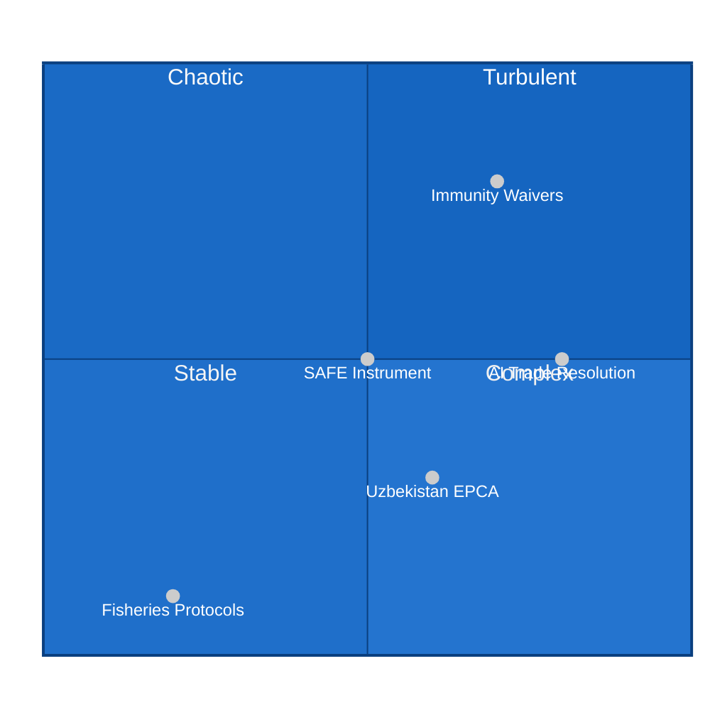

<!-- SPDX-FileCopyrightText: 2026 Hack23 AB -->
<!-- SPDX-License-Identifier: Apache-2.0 -->

# ⚡ Forces Analysis — EP Motions May 2026
**Date:** 2026-05-28 | **Article Type:** motions | **Framework:** Porter's Five Forces + VUCA + Driving Forces

---

## 🎯 Forces Analysis Framework

Applied to the EP Motions May 2026 analysis using three integrated frameworks:
1. **Driving Forces Analysis** — the macro-forces shaping EP legislative agenda
2. **VUCA Assessment** — volatility, uncertainty, complexity, ambiguity
3. **Porter-style Forces** — adapted to parliamentary politics (competitive, counteracting, enabling, constraining, and structural forces)

---

## 🌊 Section 1: Driving Forces

### Force 1: European Defence Integration Momentum
**Intensity:** 🔴 HIGH | **Trend:** ↑ Accelerating

The Russian invasion of Ukraine (2022–ongoing) has permanently shifted the EP's approach to defence industrial cooperation. The SAFE-Canada instrument ratified on May 20 is one of several instruments activated under this force:
- NATO 2% GDP target now politically mainstream in EP debates
- EDIP (European Defence Industry Programme) provides the institutional architecture
- EU-Canada SAFE complements EU-US (JAD) and EU-UK (TCA defence annex) frameworks
- **Expected next 12 months:** EU-Japan, EU-Australia defence industrial frameworks likely to follow SAFE-Canada model

### Force 2: Rule of Law and Parliamentary Accountability
**Intensity:** 🟠 HIGH | **Trend:** → Stable/intensifying

Parliamentary immunity is under structural pressure across EU member states:
- Immunity waivers in EP10 are being processed at higher rates than EP9
- The Pappas (Greece) and Vilimsky (Austria) cases both involve governments with complex relationships to rule of law norms (Greek accountability dynamics; Austrian far-right governance)
- PRIV committee jurisprudence: Parliament almost never refuses immunity waivers when prosecution appears politically independent and legally founded
- **Signal:** The dual waiver in one session suggests an accelerating accountability trend — two high-profile cases coinciding is statistically unusual

### Force 3: Brussels Effect in Trade and Digital Regulation
**Intensity:** 🟠 HIGH | **Trend:** ↑ Accelerating

The EU's regulatory gravity continues to shape global standards:
- AI Act (2024): The world's first comprehensive AI regulatory framework
- AI trade resolution (May 20): EP signals intent to embed AI governance in trade agreements
- This creates a positive feedback loop: EU regulation → Brussels Effect export → trade partners adopt EU standards → EU market power reinforced
- **Counterforce:** US Trade Representative resistance; Big Tech lobbying; WTO legal challenges

### Force 4: EU-Central Asia Strategic Pivot
**Intensity:** 🟡 MEDIUM | **Trend:** ↑ Slowly accelerating

The Uzbekistan EPCA is the most concrete expression of EU's Central Asia strategy:
- EU Global Gateway competes with China's BRI for infrastructure investment
- Russia's war in Ukraine has created diplomatic space for Central Asian states to diversify
- Uzbekistan is the most willing Central Asian partner for EU engagement (2023 reform trajectory)
- **Limitation:** EU institutional capacity for Central Asia engagement is limited; implementation will be slow

### Force 5: Fisheries Governance Normalisation
**Intensity:** 🟢 LOW-MEDIUM | **Trend:** → Stable

Routine bilateral fisheries protocols (São Tomé, Cook Islands) reflect:
- EU Common Fisheries Policy (CFP) external dimension
- Sustainability conditionality now embedded in all new FPA protocols
- Limited domestic political salience but important for EU fishing industry access

---

## 📊 Section 2: VUCA Assessment

### Volatility
**Score: 6/10 (High)**

The May 2026 session occurred in a volatile geopolitical context:
- **High volatility drivers:** Immunity waiver political fallout (Austria FPÖ, Greek Syriza), SAFE-Canada parliamentary dynamics (French defence industry pressures, Canadian election context)
- **Low volatility elements:** Fisheries protocols, UNGA positioning are routine

### Uncertainty
**Score: 7/10 (High)**

Key sources of uncertainty in this run:
- DOCEO voting lag means we cannot confirm vote tallies, group breakdowns, or contested outcomes
- Austrian prosecution context for Vilimsky case is not publicly documented in EP data
- AI trade resolution effects on ongoing EU-US trade negotiations are not predictable

### Complexity
**Score: 7/10 (High)**

The session's legislative complexity is above average:
- SAFE-Canada involves EU-Canada treaty law, NATO coordination, procurement frameworks, national security law
- Uzbekistan EPCA involves 40+ articles across political, trade, human rights, and sectoral cooperation domains
- Dual immunity waivers triggered parallel PRIV processes with different national legal contexts

### Ambiguity
**Score: 5/10 (Medium)**

Less ambiguity than recent sessions:
- Text of adopted resolutions is publicly available
- EP positions are relatively clear from text metadata
- Ambiguity is concentrated in implementation and impact assessment domains

---

## ⚖️ Section 3: Porter-Adapted Forces

### 3.1 Enabling Forces (↑ Parliamentary Action)
- Post-Ukraine defence consensus (all groups except The Left support defence industrial cooperation)
- Commission and Council alignment on SAFE, EPCA (shared competence ratification)
- MEP election cycle mandate (EP10 has fresh mandate for active external action)

### 3.2 Constraining Forces (↓ Parliamentary Action)
- DOCEO publication lag limits real-time transparency
- ID group opposition to some external action resolutions
- Hungarian/Polish blockade potential in Council (though SAFE was unanimous May 20)

### 3.3 Competitive Forces (inter-group rivalry)
- EPP vs. ECR for right-of-centre dominance on defence
- Renew vs. S&D on digital trade regulation (AI resolution contained compromises)
- ID internal cohesion under pressure (Vilimsky immunity creates uncomfortable optics)

### 3.4 Structural Forces (systemic)
- QMV in Council for most external agreements → reduces veto risk
- Parliamentary immunity as constitutional norm → PRIV waivers almost always granted
- Fisheries FPA model well-established → low procedural resistance

---

---

## Issue Frame

**Central issue:** How does the EP May 2026 session advance or constrain European Parliament strategic capacity across defence, rule of law, trade, and external relations?

**Sub-frames:**
1. **Rule of Law frame:** Is parliamentary immunity being applied consistently, or selectively?
2. **Defence integration frame:** Is SAFE-Canada a genuine milestone or symbolic?
3. **Digital governance frame:** Is the AI trade strategy the Brussels Effect in action?
4. **Central Asia frame:** Can the EU be a credible partner in Uzbekistan's multi-vector diplomacy?

## Restraining Forces

Forces that constrain EP action in these domains:

1. **DOCEO publication lag** — limits real-time intelligence on vote outcomes; constrains analytical depth
2. **Council unanimity (some external agreements)** — QMV applies to most ratifications, but some sensitive topics require unanimity; creates potential blocking
3. **Procedures feed unavailability** — limits legislative pipeline visibility for future monitoring
4. **ID/Far-right fragmentation** — does not block current majority but creates legitimacy challenges for "pro-EU" framing
5. **EU institutional capacity gaps** — EEAS and DG DEFIS face resource constraints for EPCA/SAFE implementation
6. **Hungarian/Polish veto culture (Council)** — even though Parliament ratifies, Council unanimity requirements on some items could still delay
7. **National sovereignty constraints** — SAFE-Canada procurement framework must navigate member state defence procurement laws

## Net Pressure

**Net force balance:**

| Domain | Driving Force Magnitude | Restraining Force Magnitude | Net Direction |
|--------|------------------------|---------------------------|--------------|
| Defence integration | 🔴 HIGH | 🟡 MEDIUM | ↑ Strong momentum |
| Rule of Law | 🟠 HIGH | 🟢 LOW | ↑ Consistent enforcement |
| AI trade governance | 🟠 MEDIUM-HIGH | 🟠 MEDIUM | ↑ Moderate momentum |
| Central Asia engagement | 🟡 MEDIUM | 🟠 MEDIUM | → Balanced tension |
| Fisheries governance | 🟢 LOW | 🟢 LOW | → Stable |

**Net assessment:** Driving forces significantly exceed restraining forces in defence and rule of law domains. AI trade and Central Asia are balanced — implementation capacity will determine outcomes.

## Intervention Points

**Leverage points where analytical community can add most value:**

1. **SAFE-Canada implementation monitoring** — Joint working group formation (Q3 2026) is the key intervention point; early monitoring shapes implementation architecture
2. **Uzbekistan human rights conditionality** — EP Human Rights Subcommittee (DROI) will conduct first review in 2027; advocacy can influence review scope
3. **Vilimsky/Pappas prosecution timeline** — Domestic legal observers in Austria/Greece should monitor for political interference in prosecution
4. **AI trade mandate in DG TRADE negotiations** — The resolution creates political mandate; monitoring how DG TRADE uses it in next bilateral negotiations (India, Gulf) is the key analytic task

## Reader Briefing

**What this means for citizens and policymakers:**

The forces shaping European Parliament decisions on motions are fundamentally structural, not incidental. The big picture:

- **Defence:** Europe is building its own defence industrial base, with Canada as the first non-EU transatlantic partner. This is a slow-moving but irreversible structural shift, driven by the threat environment post-2022.
- **Rule of Law:** Parliamentary immunity is not protecting politicians from accountability. The EP's consistent waiver track record demonstrates that the institution takes its rule of law responsibilities seriously across the political spectrum.
- **AI & Trade:** The EU is using its market power to export governance standards. Whether this is good or bad depends on whether you trust EU regulatory institutions — but it is definitely happening.
- **Central Asia:** The EU is making a credible bid to be a meaningful partner for Central Asian states looking to diversify away from Russia and China. Whether it can deliver on that promise is the critical question.

*Forces analysis is analyst-constructed; ratings are calibrated assessments, not algorithmic scores. DOCEO lag constrains empirical grounding for vote-level analysis.*
