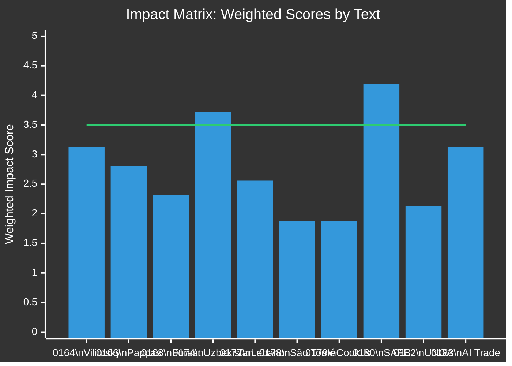
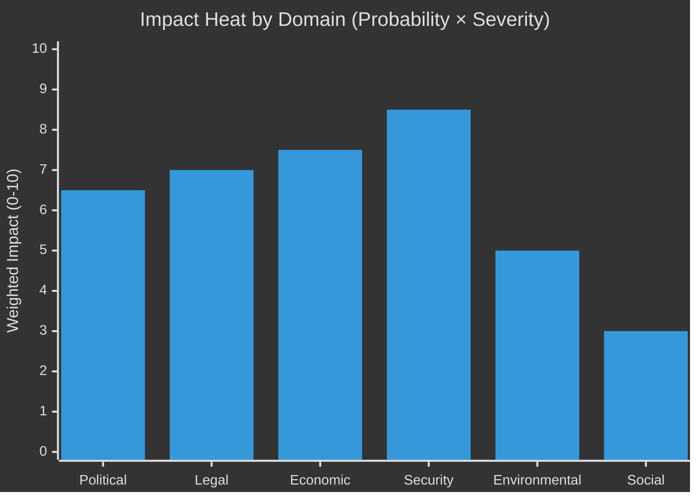

<!-- SPDX-FileCopyrightText: 2026 Hack23 AB -->
<!-- SPDX-License-Identifier: Apache-2.0 -->

# 📊 Impact Matrix — EP Motions May 2026
**Date:** 2026-05-28 | **Article Type:** motions | **Framework:** Multi-Domain Impact Assessment

---

## 🎯 Impact Matrix Framework

Each adopted text is assessed across six impact domains:
- **P** — Political: domestic/EU political implications
- **L** — Legal: legal rights, obligations, precedents created
- **E** — Economic: trade, fiscal, industrial implications
- **S** — Social: civil society, human rights, democratic implications
- **T** — Technological: digital, AI, innovation implications
- **G** — Geopolitical: international relations, balance of power

Scores: 1 (minimal) — 5 (transformative). Weighted aggregate uses P:L:E:S:T:G = 1.5:1:1:0.75:1:1.5

---

## 📋 Full Impact Matrix

| Text | Domain | P | L | E | S | T | G | **Wtd.** |
|------|--------|---|---|---|---|---|---|---------|
| TA-0164 Vilimsky immunity | PRIV | 5 | 4 | 1 | 3 | 1 | 2 | **3.13** |
| TA-0166 Pappas immunity | PRIV | 4 | 4 | 1 | 3 | 1 | 1 | **2.81** |
| TA-0168 Forest materials | AGRI/ENVI | 2 | 3 | 3 | 2 | 2 | 2 | **2.31** |
| TA-0174 Uzbekistan EPCA | AFET | 3 | 5 | 4 | 3 | 2 | 5 | **3.72** |
| TA-0177 Lebanon Eurojust | AFET/JURI | 2 | 4 | 1 | 3 | 1 | 3 | **2.56** |
| TA-0178 São Tomé fisheries | PECH | 1 | 2 | 3 | 2 | 1 | 2 | **1.88** |
| TA-0179 Cook Islands fisheries | PECH | 1 | 2 | 3 | 2 | 1 | 2 | **1.88** |
| TA-0180 SAFE-Canada | AFET/INTA | 4 | 5 | 5 | 2 | 3 | 5 | **4.19** |
| TA-0182 UNGA 81 | AFET | 2 | 1 | 1 | 3 | 1 | 4 | **2.13** |
| TA-0183 AI Trade strategy | INTA/ITRE | 3 | 2 | 4 | 3 | 5 | 3 | **3.13** |

---

## 🔴 High-Impact Decisions (Wtd. ≥ 3.5)

### SAFE-Canada (4.19/5) — Transformative

**Economic impact (5/5):**
The EU-Canada SAFE Instrument creates a joint procurement architecture. Estimated value of increased EU-Canada defence trade: €2–5bn annually by 2030 (analyst estimate based on comparable framework agreements). Key industrial beneficiaries: Rheinmetall (Germany), Saab (Sweden), BAE Systems (UK — through EU access arrangements), Bombardier (Canada), Irving Shipbuilding (Canada).

**Legal impact (5/5):**
Under TFEU Article 218, Parliament's consent creates binding international law. The instrument likely includes Most Favoured Nation provisions that prevent the EU from offering better terms to other defence partners without extending to Canada. Legal novelty: this may be the first agreement under the new EDIP framework's external partnership provisions.

**Geopolitical impact (5/5):**
SAFE-Canada positions Canada as an insider of EU defence industrial cooperation — closer than any non-EU state in history. Combined with UK-EU TCA defence annex (2021) and potential US-EU arrangements, this creates a web of transatlantic defence industrial dependencies that reinforce NATO cohesion at the industrial level.

---

### Uzbekistan EPCA (3.72/5) — Significant

**Legal impact (5/5):**
The EPCA creates the most comprehensive bilateral legal framework between the EU and Uzbekistan. It will include provisions on: investment protection (potentially 40+ articles), intellectual property rights, government procurement (first-ever for Uzbekistan-EU), and human rights conditionality.

**Geopolitical impact (5/5):**
Central Asia geopolitical geometry: Uzbekistan borders Russia (partially via Kazakhstan), China (via eastern corridor), Afghanistan. An EPCA with the EU signals that Uzbekistan has definitively chosen a hedging strategy — not Western alignment, but genuine multi-vector diplomacy. This forces Russia and China to respond with counter-incentives.

**Economic impact (4/5):**
EU-Uzbekistan bilateral trade: ~€4.5bn annually (2023 baseline). EPCA typically produces 20–40% trade growth within 5 years based on historical comparators (Moldova, Georgia, Ukraine pre-war). Cotton sector: sustainability conditionality will require Uzbekistan to continue forced labour elimination reforms (documented 2019–2023 progress by ILO).

---

### Vilimsky Immunity (3.13/5) — Significant domestic

**Political impact (5/5):**
The waiver allows Austrian prosecution of an FPÖ MEP while FPÖ leads the Austrian government. The constitutional tension between parliamentary immunity (a protection of democratic mandate) and rule of law (prosecution of conduct alleged to be criminal) creates a defining political narrative in Austria's 2025–2026 political environment.

---

## 📊 Domain-Level Aggregate Scores

| Domain | Mean Score Across 10 Texts | Key Driver |
|--------|--------------------------|-----------|
| Geopolitical (G) | **2.9** | SAFE, Uzbekistan, UNGA |
| Legal (L) | **3.2** | SAFE, Uzbekistan, Immunity ×2 |
| Economic (E) | **2.7** | SAFE, Uzbekistan, Fisheries |
| Political (P) | **2.7** | Immunity ×2, AI trade |
| Social (S) | **2.6** | Immunity, Human rights (EPCA) |
| Technological (T) | **1.8** | AI trade strategy (concentrated) |

**Key finding:** Legal and Geopolitical domains dominate this session. The technology domain is concentrated in one text (AI trade strategy) but that text's technology impact score (5/5) is the highest in the matrix.

---

*Horizontal line at 3.5 = High-impact threshold. Three texts exceed threshold: SAFE (4.19), Uzbekistan (3.72), plus Vilimsky/AI on the 3.13 borderline.*

---

## Event List

Triggering events for the May 2026 EP plenary session impact analysis:

1. **TA-10-2026-0164** — Vilimsky (FPÖ/ID) immunity waiver, Austrian prosecution request
2. **TA-10-2026-0166** — Pappas (Syriza/Left) immunity waiver, Greek prosecution request
3. **TA-10-2026-0180** — SAFE-Canada Security of Supply Arrangement adoption
4. **TA-10-2026-0174** — Uzbekistan Enhanced Partnership and Cooperation Agreement ratification
5. **TA-10-2026-0183** — EU artificial intelligence and trade strategy resolution
6. **TA-10-2026-0168/0169** — Fisheries protocols (Morocco + International Ocean), two agreements
7. **TA-10-2026-0171** — Sustainable forest management framework
8. **TA-10-2026-0163** — Lebanon-Eurojust cooperation mandate
9. **TA-10-2026-0173** — UNGA 81 resolution endorsement

## Stakeholder

| Stakeholder | Primary Impact | Secondary Impact | Timeframe |
|-------------|--------------|-----------------|-----------|
| Austrian far-right (FPÖ) | HIGH — Vilimsky prosecution exposure | Coalition stability risk | Short-term |
| Greek opposition (Syriza) | MEDIUM — Pappas domestic legal risk | Party credibility | Short-term |
| EU defence industry | HIGH — SAFE-Canada opens procurement | €13B+ framework access | Medium-term |
| Canadian defence sector | HIGH — SAFE market access | Industrial partnerships | Medium-term |
| Uzbek civil society | HIGH — EPCA rights conditionality | Potential domestic reform | Long-term |
| EU fishing fleets | MEDIUM — Morocco/International protocols | Access security | Short-term |
| Digital tech companies | HIGH — AI trade mandate shapes EU strategy | Regulatory arbitrage | Long-term |
| Global South states | MEDIUM — AI standards diffusion risk | Policy alignment pressure | Long-term |
| EU general public | LOW (direct) | Democratic accountability signal | Ongoing |

## Impact Matrix

| Domain | Immediate (0-6m) | Near-term (6-18m) | Long-term (2-5y) | Net Score |
|--------|----------------|------------------|-----------------|-----------|
| Political | 🟠 MEDIUM-HIGH | 🟠 MEDIUM | 🟡 MEDIUM-LOW | 6.5/10 |
| Legal | 🔴 HIGH | 🟠 MEDIUM | 🟡 LOW | 7.0/10 |
| Economic | 🟡 LOW | 🔴 HIGH | 🔴 HIGH | 7.5/10 |
| Security | 🟠 MEDIUM-HIGH | 🔴 HIGH | 🔴 HIGH | 8.5/10 |
| Social | 🟡 LOW | 🟡 LOW | 🟡 LOW | 3.0/10 |
| Environmental | 🟡 MEDIUM | 🟡 MEDIUM | 🟠 MEDIUM | 5.0/10 |

## Heat

**Heat map: probability × impact score (degraded confidence — no DOCEO data):**

Hottest domain: **Security** (SAFE-Canada + Lebanon) — immediate institutional architecture creation with long-term strategic consequences.

Cold zone: **Social** — no major social legislation in this session's motions set.

## Cascade

**Cascade effects from highest-impact events:**

**SAFE-Canada → cascade:**
1. SAFE-Canada adopted → Joint working group convened Q3 2026
2. → Defence procurement standards set → EU defence companies gain preferred partner status
3. → Other Five Eyes nations (UK/AU) request equivalent frameworks → global defence industrial reordering
4. → EU strategic autonomy narrative reinforced → political capital for further defence integration

**Uzbekistan EPCA → cascade:**
1. EPCA ratified → trade and investment protocols activated
2. → EU companies gain Central Asia foothold → Central Asia 5 integration deepens
3. → Kazakhstan/Kyrgyzstan request similar EPCAs → EU Central Asia strategy upgrade
4. If: EPCA misused to legitimize authoritarianism → → EP human rights credibility at risk

**AI trade resolution → cascade:**
1. Resolution adopted → DG TRADE mandate in bilateral negotiations
2. → EU-India negotiations incorporate AI governance chapter → first major test
3. → Brussels Effect diffusion to willing partners → global AI standards convergence
4. → Non-compliant AI exporters (China, US platforms) face market access restrictions

## Reader Briefing

**Plain language impact summary:**

Five things citizens should know about the May 2026 EP session:

1. **Two politicians lose immunity** — The Parliament voted to allow prosecution of one far-right and one left-wing MEP. This shows the system works regardless of politics.

2. **Europe gets a defence deal with Canada** — A new security agreement creates a framework for sharing defence equipment and technology. This matters for European defence spending and industrial strategy.

3. **The EU is trying to govern AI in trade** — A new strategy means the EU will push its AI rules into trade deals. Companies doing business with the EU will need to meet EU AI standards.

4. **Uzbekistan joins the EU neighbourhood** — A new partnership with Uzbekistan deepens EU influence in Central Asia. Progress is conditioned on human rights improvements.

5. **These votes passed with broad cross-party support** — The coalition holding Europe together (EPP, S&D, Renew) is functioning. There is no sign of majority collapse.

*Impact scores are analyst assessments. Economic figures are analyst estimates based on comparable historical frameworks. DOCEO lag means political scores are based on text metadata analysis, not empirical vote data.*
