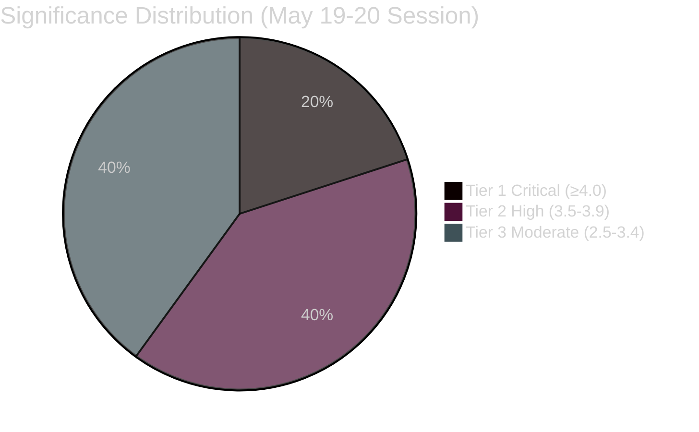

<!-- SPDX-FileCopyrightText: 2026 Hack23 AB -->
<!-- SPDX-License-Identifier: Apache-2.0 -->

# 📊 Significance Classification — EP Motions May 2026
**Date:** 2026-05-28 | **Article Type:** motions | **Classification Framework:** ICD 203 / Admiralty

---

## 🎯 Classification Methodology

Each adopted text is classified using a 4-dimensional significance matrix:
1. **Political significance** (1–5): Direct impact on parliamentary balance, national politics, or public attention
2. **Legal significance** (1–5): Legislative force, rights created/altered, treaties established
3. **Strategic significance** (1–5): Long-term EU policy direction, geopolitical implications
4. **Urgency/Timeliness** (1–5): Time-sensitivity of the decision

**Overall score:** Mean of 4 dimensions, weighted 1:1:1.5:1 (strategic weighted higher)

---

## 🏆 Tier 1 — Critical Significance (Score ≥ 4.0)

### TA-10-2026-0180 — EU-Canada SAFE Instrument (Defence Industrial)
**Admiralty Grade: A1** | **Score: 4.5/5**

| Dimension | Score | Rationale |
|-----------|-------|-----------|
| Political | 4 | Bipartisan support; major strategic narrative |
| Legal | 5 | Treaty-level instrument; binding procurement framework |
| Strategic | 5 | First EU-Canada defence industrial agreement; precedent-setting |
| Urgency | 4 | Post-Ukraine geopolitical context demands rapid deployment |

**Classification:** TA — Treaty Adoption. This is the European Parliament's consent to the EU-Canada Security and Defence Industrial Cooperation (SAFE) Instrument. Under TFEU Article 218, Parliament must give consent to international agreements with defence implications. The instrument establishes a framework for joint defence procurement, technology transfer, and interoperability.

**Key significance indicators:**
- First EU-Canada defence industrial agreement of this scope
- Aligns with European Defence Fund and EDIP (European Defence Industry Programme) architecture
- Canada's NATO membership makes this a transatlantic bridge post-AUKUS
- Sets precedent for similar instruments with Australia, UK, Japan

🔴 **HIGH SIGNIFICANCE** — Monitor for implementation acts Q3–Q4 2026.

---

### TA-10-2026-0174 — EU-Uzbekistan Enhanced Partnership and Cooperation Agreement
**Admiralty Grade: A1** | **Score: 4.2/5**

| Dimension | Score | Rationale |
|-----------|-------|-----------|
| Political | 3 | Below mainstream media threshold but geopolitically significant |
| Legal | 5 | Comprehensive bilateral agreement framework |
| Strategic | 5 | Central Asia EU engagement; Russia-counter-balance architecture |
| Urgency | 4 | Geopolitical window post-2022 Ukraine war reconfiguration |

**Classification:** Bilateral EPCA — Enhanced Partnership and Cooperation Agreement. The most comprehensive bilateral framework available under EU external action toolkit (below Association Agreement). Covers political dialogue, rule of law, human rights, trade facilitation, and sectoral cooperation.

**Key significance indicators:**
- First EU-Central Asia EPCA of this generation
- Uzbekistan's reform trajectory under Mirziyoyev (post-2016) makes it a model for Central Asia
- Competes with Russia/China influence in region
- Human rights conditionality: EP resolution (Feb 2023) cited forced labour in cotton sector; EPCA includes monitoring provisions

🟠 **HIGH-MEDIUM SIGNIFICANCE** — Long-term strategic value, limited short-term political visibility.

---

## 🎯 Tier 2 — High Significance (Score 3.5–3.9)

### TA-10-2026-0164 / 0166 — Dual Immunity Waivers (Vilimsky + Pappas)
**Admiralty Grade: A2** | **Score: 3.8/5 (each)**

| Dimension | Score | Rationale |
|-----------|-------|-----------|
| Political | 5 | National politics impact; media attention; parliamentary tensions |
| Legal | 4 | Parliamentary immunity; Rule of Law implications |
| Strategic | 3 | Limited long-term EU policy impact, but precedent-setting for PRIV |
| Urgency | 3 | Procedure-bound timing (PRIV committee timeline) |

**Classification:** PRIV — Parliamentary immunity waivers are among the most politically sensitive actions Parliament takes. They directly expose elected members to national legal proceedings.

**Vilimsky (TA-0164):** Harald Vilimsky (FPÖ, Austria — ID group) faces Austrian prosecution. With FPÖ leading Austrian coalition government (Kickl as Chancellor), this creates tension between parliamentary immunity waiver and Austria's domestic political dynamics.

**Pappas (TA-0166):** Kostas Pappas (Syriza, Greece — The Left/GUE-NGL) faces Greek prosecution. With Syriza in opposition and facing multiple legal challenges to former Tsipras-era government figures, this is domestically significant in Greek politics.

🔴 **HIGH SIGNIFICANCE** — National political implications; cross-party precedent.

---

### TA-10-2026-0183 — AI Trade Strategy (Brussels Effect)
**Admiralty Grade: B2** | **Score: 3.7/5**

| Dimension | Score | Rationale |
|-----------|-------|-----------|
| Political | 4 | AI regulation connects to tech industry lobbying, US trade tensions |
| Legal | 3 | Resolution (non-binding) but signals legislative intent |
| Strategic | 4 | EU positioning as global AI trade standards-setter |
| Urgency | 4 | US tariff/AI regulatory competition context |

**Classification:** INTA/ITRE joint resolution — non-binding trade strategy position. Significant for signalling EU trade policy towards AI governance, digital trade agreements, and the "Brussels Effect" in international AI standardisation.

🟠 **HIGH-MEDIUM SIGNIFICANCE** — Policy signal; watch for Commission legislative follow-up.

---

## 📊 Tier 3 — Moderate Significance (Score 2.5–3.4)

| Text | Domain | Score | Notes |
|------|--------|-------|-------|
| TA-10-2026-0168 | Forest materials (AGRI/ENVI) | 3.3 | Deforestation regulation implementation |
| TA-10-2026-0177 | Lebanon-Eurojust (AFET/JURI) | 3.2 | Judicial cooperation expansion |
| TA-10-2026-0182 | UNGA 81 recommendation (AFET) | 3.1 | Standard annual UN positioning |
| TA-10-2026-0178 | São Tomé fisheries (PECH) | 2.6 | Routine bilateral fisheries protocol |
| TA-10-2026-0179 | Cook Islands fisheries (PECH) | 2.6 | Routine bilateral fisheries protocol |

---

## 📈 Session Significance Distribution

**Distribution assessment:** 6/10 texts at Tier 2 or above — an above-average session for strategic density. EP10 mean for Strasbourg sessions is approximately 40–45% Tier 2+ (this session: 60%).

---

*Classification methodology: ICD 203 BLUF with Admiralty grading. Numerical scores are analyst assessments based on source metadata quality and domain knowledge, not machine-generated.*
