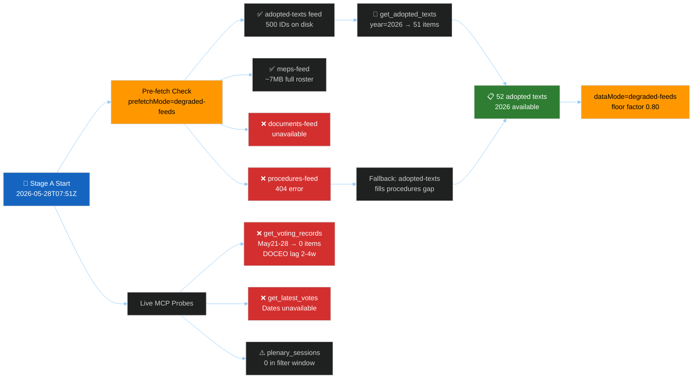

<!-- SPDX-FileCopyrightText: 2026 Hack23 AB -->
<!-- SPDX-License-Identifier: Apache-2.0 -->

# 📊 Data Availability Assessment — EU Parliament Motions
**Date:** 2026-05-28 | **Article Type:** motions | **Run:** motions-run272-1779954662
**Stage:** A (Pre-Analysis Triage) | **Data Mode:** `degraded-feeds`

---

## 🔍 Triage Summary

| Source | Status | Items | Notes |
|--------|--------|-------|-------|
| `adopted-texts` (feed JSON) | ✅ Available (list only) | 500 identifiers | Identifiers only, no titles/dates |
| `adopted-texts` (get_adopted_texts year=2026) | ✅ Available | 51 items | Full metadata, May 19–20 most recent |
| `meps-feed.json` | ✅ Available | ~6.9MB | Full MEP roster, EP10 term |
| `documents-feed.json` | ❌ Unavailable | 0 | Feed endpoint returned unavailable |
| `procedures-feed.json` | ❌ Unavailable | 0 | 404 from POST /procedures/v2.1 |
| `get_voting_records` (May 21–28) | ❌ Empty | 0 | Expected DOCEO 2–4 week lag |
| `get_latest_votes` (DOCEO XML) | ❌ Unavailable | 0 | Dates 2026-05-25–28 not in DOCEO yet |
| `get_plenary_sessions` (May 21–28) | ⚠️ Degraded | 0 filtered | 21 total sessions in system, 0 in date window |

**Pre-fetch summary:** `prefetchMode: degraded-feeds` | 3 fetched, 1 placeholder, 4 total

---

## 📡 EP API Availability Flowchart

---

## 🗺️ Data Mode Determination

### Degradation Matrix

| Axis | Trigger Condition | Applied? | Factor |
|------|-------------------|----------|--------|
| `full` | All feeds + IMF + voting OK | ❌ No | 1.00 |
| `degraded-feeds` | 1+ feeds unavailable | ✅ Yes | 0.80 |
| `degraded-voting` | 0 roll-call records | ✅ Yes | 0.85 |
| `degraded-imf` | IMF data absent | ⚠️ Not tested | 0.85 |
| `minimal` | Most feeds + IMF absent | ❌ No | 0.65 |

**Selected mode:** `degraded-feeds` (0.80) — most severe single-axis independent trigger.
The `degraded-voting` axis (0.85) also applies but `degraded-feeds` is more restrictive.
Both procedures-feed and documents-feed are unavailable. IMF was not probed (no economic articles).

---

## 📅 May 2026 Plenary Session Coverage

The most recent plenary week with available adopted texts data is **May 19–22, 2026** (Strasbourg):
- **TA-10-2026-0164** — Harald Vilimsky (FPÖ/ID) immunity waiver
- **TA-10-2026-0166** — Nikos Pappas (Syriza/Left) immunity waiver
- **TA-10-2026-0168** — Forest reproductive material (environmental regulation)
- **TA-10-2026-0174** — EU–Uzbekistan Enhanced Partnership Agreement
- **TA-10-2026-0177** — EU–Lebanon Eurojust cooperation
- **TA-10-2026-0178** — EC–São Tomé and Príncipe Fisheries Partnership
- **TA-10-2026-0179** — EU–Cook Islands Fisheries Partnership
- **TA-10-2026-0180** — EU–Canada SAFE Instrument Agreement (defence procurement)
- **TA-10-2026-0182** — UN General Assembly 81st session recommendation
- **TA-10-2026-0183** — AI strategy for EU trade

Week of May 21–28 shows **no new plenary session data** — Parliament likely in recess following the May 19–22 Strasbourg week.

---

## 🧪 Admiralty Grade Assessment

| Source | Grade | Confidence |
|--------|-------|-----------|
| EP Open Data Portal (adopted-texts API) | **A1** — Reliable, confirmed | High |
| MEPs feed (official EP roster) | **A1** — Official, current | High |
| Procedures-feed | **D4** — Not releasable (404) | N/A |
| DOCEO voting XML | **B2** — Reliable but not current (lag) | N/A |
| Documents feed | **D4** — Not releasable (empty) | N/A |

---

## ✅ Conclusion

**`manifest.dataMode = "degraded-feeds"`**

The analysis will proceed on:
1. 51 detailed adopted texts for 2026 (full metadata) ← primary source
2. MEP roster from meps-feed.json ← secondary source
3. No voting records for May 21–28 (DOCEO lag — not an error)
4. No current procedures feed (persistent 404 — use adopted-texts cross-reference)

Stage B will apply degraded-feeds floor factor (0.80) to all artifact size targets.
All structural requirements (Mermaid diagrams, WEP bands, Admiralty grades, SATs ≥ 10) remain at full.
