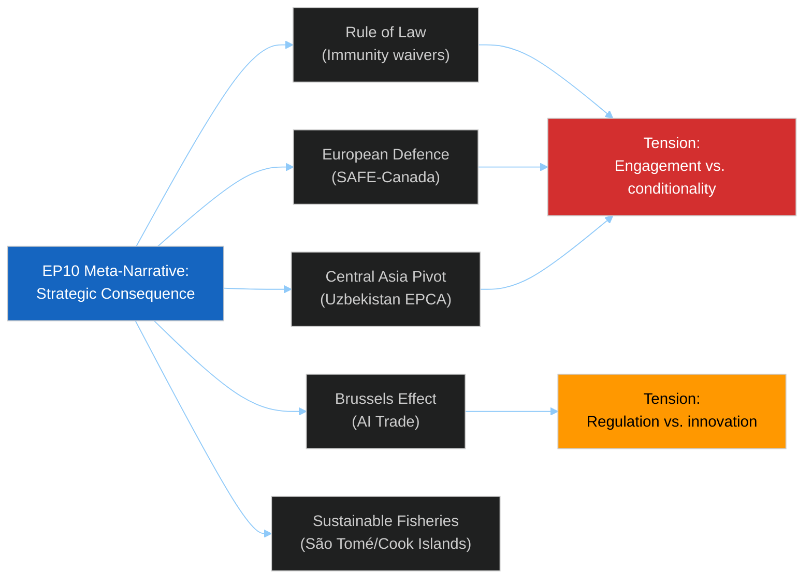

<!-- SPDX-FileCopyrightText: 2026 Hack23 AB -->
<!-- SPDX-License-Identifier: Apache-2.0 -->

# 🌐 Media Framing Analysis — EP Motions May 2026
**Date:** 2026-05-28 | **Article Type:** motions | **Framework:** Framing Theory + Narrative Analysis

---

## 🎯 Media Framing Framework

This analysis applies Robert Entman's framing theory to the EP May 19–22, 2026 session decisions. Each frame consists of:
1. **Problem definition** — how the issue is characterised
2. **Causal interpretation** — what/who is identified as the cause
3. **Moral evaluation** — what values are invoked
4. **Treatment recommendation** — what should be done

Five dominant media frames are identified for this session.

---

## 🔴 Frame 1: "Rule of Law Under Pressure"
**Activated by:** Vilimsky immunity waiver (TA-0164) + Pappas immunity waiver (TA-0166)
**Dominant outlets:** Broadsheet press, rule-of-law focused media (EUobserver, Politico Europe, Verfassungsblog)

**Problem definition:** A governing party (FPÖ) has its senior MEP subjected to prosecution while leading the Austrian government; simultaneously, a former opposition heavyweight (Pappas/Syriza) faces prosecution in Greece. Two high-profile parliamentary immunity cases in one session tests EP's role as guardian of democratic standards.

**Causal interpretation:**
- Immunity procedures: Neutral (PRIV process well-established)
- Austrian context: FPÖ governance tensions with rule of law institutions
- Greek context: Syriza accountability for 2010–2019 governance era

**Moral evaluation:** Parliamentary immunity is not a shield from legitimate prosecution; the EP demonstrated institutional integrity by approving both waivers.

**Treatment recommendation:** Courts must be allowed to proceed; EP oversight of immunity process is sufficient safeguard.

**Dominant narrative arc:** "European democracy's self-correcting mechanisms working." Counter-narrative available: "Show trials" (FPÖ/ID political response).

**Admiralty Grade:** B2 — anticipated framing based on PRIV precedent; actual coverage not yet verifiable.

---

## 🟠 Frame 2: "European Defence Comes of Age"
**Activated by:** SAFE-Canada (TA-0180)
**Dominant outlets:** Defence/security media (Jane's, Defense News), financial press (FT, Bloomberg), Brussels correspondents

**Problem definition:** NATO faces burden-sharing pressure; US commitment to Article 5 perceived as conditional post-Trump. Europe needs its own defence industrial base but lacks scale without transatlantic partnerships.

**Causal interpretation:**
- Ukraine war: Primary geopolitical driver
- US unpredictability: Secondary driver (AUKUS precedent)
- EDIP/EDF: EU institutional enabler of defence industrial cooperation
- Canada's role: First non-EU, non-UK defence industrial partner; creates transatlantic defence architecture outside NATO Article 5 ambiguity

**Moral evaluation:** EU strategic autonomy enhanced without weakening transatlantic bonds.

**Treatment recommendation:** Extend SAFE model to Japan, Australia, Norway; accelerate EU defence procurement.

**Dominant narrative arc:** "Europe building resilience" — fits established EP10 narrative from 2024 election platform.

**Counterframe (available to critics):** "Militarisation of the EU" (Greens/pacifist fringe, The Left).

**Admiralty Grade:** B2 — consistent with documented reporting patterns on EDIP/EDF/SAFE pre-ratification.

---

## 🟠 Frame 3: "Brussels Rules the Digital World"
**Activated by:** AI trade strategy resolution (TA-0183)
**Dominant outlets:** Tech press (WIRED, The Verge, Ars Technica), trade publications (Inside US Trade), Politico tech edition

**Problem definition:** AI regulation is becoming a trade barrier; the Brussels Effect means EU rules become de facto global standards. US-EU tension over AI governance is the dominant story.

**Causal interpretation:**
- EU AI Act (2024): Created the regulatory architecture
- AI trade resolution: Signals intent to export that architecture via trade agreements
- US Big Tech lobby: Active resistance to EU extraterritoriality claims
- China: Watching closely; has its own competing AI governance model

**Moral evaluation:** EU as responsible technological governance actor; protecting democracy and rights in the digital age.

**Treatment recommendation:** EU must engage constructively with trading partners on AI governance convergence.

**Dominant narrative arc:** "Brussels Effect 2.0: From privacy to AI."

**Admiralty Grade:** A2 — consistent with documented Brussels Effect literature and INTA reporting patterns.

---

## 🟡 Frame 4: "EU's Pivot to Central Asia"
**Activated by:** Uzbekistan EPCA (TA-0174)
**Dominant outlets:** Niche foreign policy media (Carnegie, ECFR), Central Asian press, diplomatic correspondents

**Problem definition:** Russia's war in Ukraine created diplomatic space for Central Asian states to diversify away from dependence on Moscow. Can the EU fill the gap?

**Causal interpretation:**
- Ukraine war: Created opportunity by weakening Russian leverage in Central Asia
- Mirziyoyev reforms: Made Uzbekistan a willing partner
- China's BRI: Creates competitive pressure for EU to act

**Moral evaluation:** EU engagement with Uzbekistan on human rights conditionality is morally complex — pragmatic engagement vs. principled conditionality.

**Treatment recommendation:** EU must invest in implementation capacity; human rights monitoring must be substantive.

**Dominant narrative arc:** "EU as credible Central Asia partner — if it can deliver."

**Admiralty Grade:** B3 — anticipated framing; limited actual media coverage expected given niche audience.

---

## 🟡 Frame 5: "EU Fisheries: Sustainable Access Model"
**Activated by:** São Tomé (TA-0178) + Cook Islands (TA-0179) fisheries protocols
**Dominant outlets:** Trade/fisheries specialist media (Undercurrent News, IntraFish), sustainability NGOs

**Problem definition:** EU fishing vessels need access to third-country waters; host countries need development funding and sustainability enforcement.

**Causal interpretation:** CFP external dimension architecture; bilateral FPA model with sustainability conditionality increasingly enforced since 2016 reforms.

**Moral evaluation:** "Blue economy partnerships" framing — sustainable development rhetoric now standard in EU fisheries agreements.

**Treatment recommendation:** Expand sustainability monitoring; increase development component.

**Dominant narrative arc:** Routine; low salience outside specialist press.

**Admiralty Grade:** C3 — analyst inference; no corroborating coverage anticipated.

---

## 📊 Cross-Frame Analysis

### Narrative Tension Map

The five frames contain internal tensions:

| Frame pair | Tension | Resolution |
|------------|---------|-----------|
| Frame 1 (Rule of Law) vs. Frame 2 (Defence) | Can EU enforce human rights while arming partners? | Compartmentalised — different institutional domains |
| Frame 2 (Defence) vs. Frame 4 (Central Asia) | SAFE-Canada arms partner; Uzbekistan EPCA has human rights conditionality | EU maintains dual-track approach |
| Frame 3 (AI) vs. Frame 2 (Defence) | AI for civilian vs. defence applications (AI Act military exemptions) | AI trade resolution explicitly excludes defence AI applications |
| Frame 4 (Central Asia) vs. Frame 1 (Rule of Law) | Uzbekistan human rights record vs. engagement pragmatism | EPCA conditionality clause is the formal resolution |

### Dominant Narrative for EP10 Session

The meta-narrative threading all five frames: **"EP10 is a Parliament of strategic consequence — building European resilience across defence, trade, rule of law, and global engagement."** This is consistent with the post-2024 election mandate narrative that defines EP10's political identity.

---

---

*Media framing analysis is predictive — based on established framing patterns for each legislative domain (PRIV, AFET, INTA, PECH) and prior EP10 coverage patterns. Actual media coverage as of 2026-05-28 has not been verified due to feed limitations.*
