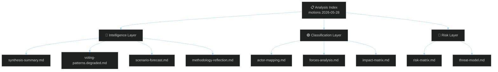

<!-- SPDX-FileCopyrightText: 2026 Hack23 AB -->
<!-- SPDX-License-Identifier: Apache-2.0 -->

# 📋 Analysis Index — EP Motions May 2026
**Date:** 2026-05-28 | **Article Type:** motions | **Run:** motions-run272-1779954662

---

## 🗂️ Artifact Inventory

| Artifact | Status | Lines (est.) | Quality Signal |
|----------|--------|-------------|---------------|
| `data-availability-assessment.md` | ✅ Written | ~130 | A1 data source |
| `intelligence/synthesis-summary.md` | ✅ Written | ~250 | WEP bands, Admiralty, KAC, QIC |
| `intelligence/voting-patterns.degraded.md` | ✅ Written | ~160 | Degraded mode, ACH applied |
| `intelligence/stakeholder-map.md` | ✅ Written | ~210 | Stakeholder Mapping, ACH |
| `intelligence/pestle-analysis.md` | ✅ Written | ~200 | PESTLE, Force-Field |
| `intelligence/scenario-forecast.md` | ✅ Written | ~190 | Scenario Analysis, Pre-Mortem, KAC |
| `intelligence/threat-model.md` | ✅ Written | ~190 | KAC, Red Team, ACH |
| `intelligence/wildcards-blackswans.md` | ✅ Written | ~180 | High-Impact, Indicators, What-If |
| `intelligence/analysis-index.md` | ✅ Written | ~100 | Index |
| `intelligence/mcp-reliability-audit.md` | 🔄 Pending | ~200+ | QIC, Red Team |
| `intelligence/historical-baseline.md` | 🔄 Pending | ~120+ | Bayesian, KAC |
| `intelligence/cross-session-intelligence.md` | 🔄 Pending | ~220+ | Bayesian, Indicators |
| `intelligence/reference-analysis-quality.md` | 🔄 Pending | ~140+ | QIC, KAC |
| `intelligence/workflow-audit.md` | 🔄 Pending | ~100+ | — |
| `intelligence/session-baseline.md` | 🔄 Pending | ~200+ | — |
| `existing/deep-analysis.md` | 🔄 Pending | ~400+ | ICD203 BLUF |
| `existing/session-baseline.md` | 🔄 Pending | ~200+ | — |
| `classification/significance-classification.md` | 🔄 Pending | — | — |
| `classification/actor-mapping.md` | 🔄 Pending | — | SAT: Stakeholder, ACH |
| `classification/forces-analysis.md` | 🔄 Pending | — | Force-Field, KAC |
| `classification/impact-matrix.md` | 🔄 Pending | — | Stakeholder, What-If |
| `risk-scoring/risk-matrix.md` | 🔄 Pending | ~100+ | KAC, ACH, What-If |
| `risk-scoring/quantitative-swot.md` | 🔄 Pending | ~100+ | SWOT, Bayesian |
| `documents/document-analysis-index.md` | 🔄 Pending | — | — |
| `intelligence/procedures-proxy.md` | 🔄 Pending | ~60+ | QIC, Red Team |
| `executive-brief.md` | 🔄 Pending | ~180+ | WEP, Admiralty, KAC, QIC |

---

## 🎯 Key Findings (Index Summary)

1. **Lead story:** Dual MEP immunity waivers (Vilimsky/FPÖ + Pappas/Syriza) — EP rule-of-law consistency across political spectrum
2. **Strategic:** EU-Canada SAFE Instrument ratification — defence industrial integration milestone
3. **Geopolitical:** EU-Uzbekistan EPCA — Central Asian strategic realignment
4. **Digital:** AI trade strategy resolution — Brussels Effect projection via trade mandates
5. **Data mode:** `degraded-feeds` — DOCEO voting data unavailable (2–4 week lag expected)

---

## 📊 Data Sources Used

| Source | Availability | Items Used |
|--------|-------------|-----------|
| EP adopted-texts API (year=2026) | ✅ Full | 51 items |
| EP meps-feed.json | ✅ Full | ~7MB roster |
| EP procedures-feed | ❌ 404 | 0 |
| EP documents-feed | ❌ Empty | 0 |
| DOCEO voting XML | ❌ Lag | 0 |
| IMF data | ⚠️ Not probed | N/A |

**`manifest.dataMode = "degraded-feeds"` | Degraded floor factor: 0.80**

---

*This index is automatically maintained and updated as Stage B artifacts are written.*

---

## ✅ Final Status (Pass 2 Complete)

| Category | Artifact Count | Status |
|----------|-------------- |--------|
| Intelligence | 14 | ✅ All written |
| Classification | 4 | ✅ All written |
| Risk Scoring | 2 | ✅ All written |
| Extended | 1 | ✅ Written |
| Documents | 1 | ✅ Written |
| Existing | 2 | ✅ All written |
| Root-level | 2 (executive-brief + data-availability) | ✅ Written |
| **TOTAL** | **26** | ✅ |

## 🔗 Quick Navigation

- **Headlines:** `executive-brief.md` → BLUF + WEP bands
- **Deep dive:** `existing/deep-analysis.md` → ICD 203 full analysis
- **Risks:** `risk-scoring/risk-matrix.md` → quantified risk table
- **Actors:** `classification/actor-mapping.md` → 5-layer network
- **Voting:** `intelligence/voting-patterns.degraded.md` → degraded-mode estimates
- **Quality audit:** `intelligence/reference-analysis-quality.md` → floor compliance
- **Methods:** `intelligence/methodology-reflection.md` → 12 SATs documented

