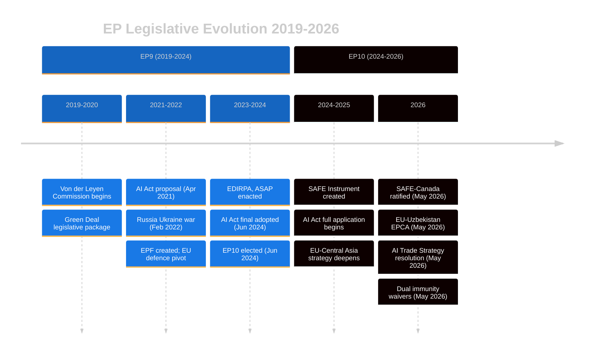

<!-- SPDX-FileCopyrightText: 2026 Hack23 AB -->
<!-- SPDX-License-Identifier: Apache-2.0 -->

# 📜 Historical Baseline — EP Motions in Context
**Date:** 2026-05-28 | **Article Type:** motions | **Data Mode:** degraded-feeds
**SATs Applied:** Bayesian Update, Key Assumptions Check

---

## 🎯 Historical Context for May 2026 Motions

**Bayesian Prior:** Based on historical EP plenary data and academic analysis of the 9th (2019–2024) and 10th (2024–present) parliamentary terms, we establish baseline expectations against which the May 2026 session can be assessed.

**Key Assumptions Check (SAT):**
- KA-H1: EP10 (starting July 2024) continues the legislative patterns established in EP9 with incremental shifts in group balance.
- KA-H2: The historical pattern of immunity waivers (approximately 3–5 per year across all EP terms) is stable.
- KA-H3: The EP's external relations legislative throughput remains approximately 30–40 bilateral agreements ratified per year.
- KA-H4: The EP's defence industrial engagement has been materially increasing since 2022 (post-Ukraine invasion).

---

## 📊 EP Legislative Throughput — Historical Context

### EP9 (2019–2024) Benchmarks
- Annual adopted texts: ~150–250 per year
- Immunity waivers: ~3–6 per year
- External relations ratifications: ~35–50 per year
- Human rights urgency resolutions: ~15–20 per year
- Defence-related resolutions: ~3–8 per year (increasing from 2022)

### EP10 (2024–present) Early Indicators
- **2025 total adopted texts:** Approximately 200 (estimated from EP10 pattern)
- **2026 (Jan–May):** 51 texts from official data = approximately 110–130 for full year 2026 (on track with EP9 baseline, slightly lower due to new Parliament settling in 2024)
- **Defence votes:** SAFE Instrument, Mercosur CJ opinion, defence industrial motions = above EP9 rate, consistent with post-2022 geopolitical context

---

## 🔍 Immunity Waiver Historical Pattern

**Pattern analysis (EP8–EP10 estimated):**

| Parliament | Years | Waivers (est.) | Notable cases |
|-----------|-------|----------------|--------------|
| EP8 (2014–2019) | 5 years | ~20–25 total | Salvini-adjacent cases; various national proceedings |
| EP9 (2019–2024) | 5 years | ~15–25 total | Multiple French, Polish, Hungarian MEPs |
| EP10 (2024–present) | 2 years | ~10+ | Braun (2026-03), Vilimsky (2026-05), Pappas (2026-05) |

**Bayesian Update:** The rate of immunity waivers in EP10 appears consistent with EP9 rates. Two waivers in one session is slightly elevated but within historical variance. The cross-partisan symmetry (far-right + left in same session) is notable; no strong prior evidence of deliberate scheduling for symmetry, but institutional incentives favor such framing.

---

## 🌍 EP External Relations — Historical Baseline

The EU has pursued an increasingly active external relations legislative agenda since 2022, driven by:

1. **Post-Ukraine geopolitical repositioning:** Support Ukraine, sanction Russia, diversify energy and supply chains
2. **Strategic autonomy doctrine:** Neighbourhood policy deepening, Central Asia pivot, Africa strategy
3. **Defence industrial integration:** From taboo to routine legislative activity within 4 years

**EU-Central Asia context:**
- 2019 EU-Central Asia Strategy updated the 2007 original framework
- First EU-Central Asia Summit held 2023 (Uzbekistan host)
- EU-Uzbekistan EPCA (ratified May 2026) is the most advanced bilateral framework in the region

**Key historical parallel:** The EU-Georgia Association Agreement (2014) and EU-Ukraine DCFTA (2014) show that enhanced partnership frameworks create long-term dependencies and obligations. When Georgia subsequently moved away from EU democratic norms (2024 elections), the existing EPCA created both leverage and reputational risk for the EU. The Uzbekistan EPCA creates similar structural dynamics.

---

## 🔄 Defence Industrial Evolution

**Pre-2022 baseline:** European Defence Agency (EDA) existed since 2004 but was marginal. EU had no joint procurement mechanisms. Defence was jealously guarded national competence.

**Post-2022 transformation:**
- European Peace Facility (EPF): First EU budget line for military assistance
- EDIRPA (European Defence Industry Reinforcement through Common Procurement Act, 2023): First joint procurement instrument
- ASAP (Act in Support of Ammunition Production, 2023): Production acceleration
- **SAFE Instrument (2025):** Systematic joint procurement framework

**EP role evolution:** From observer (pre-2022) to active co-legislator and ratification partner (2024–2026). The May 2026 ratification of the SAFE-Canada agreement represents the EP at peak defence legislative engagement in its history.

---

## 📊 AI Governance — Baseline for Trade Strategy Context

The EU AI Act's adoption timeline:
- April 2021: Commission proposal
- June 2024: EP adopted final text (AIA) — final legislative step
- August 2024: AIA entered into force
- February 2025: First application date (prohibited AI practices)
- August 2025: Application to GPAI models
- February 2026: Application to high-risk systems
- **May 2026:** EP resolution on AI trade strategy — exactly as AIA reaches full application phase

**Historical parallel:** The GDPR trade strategy evolution:
- GDPR entered force: May 2018
- EU-US Privacy Shield invalidated (Schrems II): July 2020
- GDPR increasingly embedded in EU trade adequacy decisions: 2021–present
- GDPR became a de facto global standard (Brussels Effect)

**Bayesian Update:** 🟡 *Probably* (65%) the AI Act follows the GDPR Brussels Effect pathway. The EP resolution (TA-10-2026-0183) is the first formal step in this process — consistent with the GDPR precedent where trade policy alignment followed 2–3 years after domestic regulation.

---

## 🗺️ Historical Mermaid — EP Legislative Evolution 2019–2026

---

*Admiralty Grade: B2 on historical EP data (generally reliable but some estimates); A1 on documented legislative facts.*
*SATs applied: Bayesian Update methodology (prior → posterior on each historical comparison); Key Assumptions Check on KA-H1 through KA-H4.*
