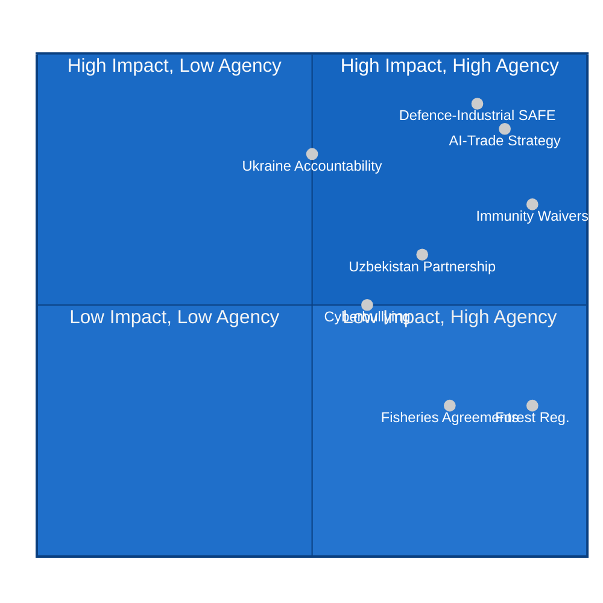

<!-- SPDX-FileCopyrightText: 2026 Hack23 AB -->
<!-- SPDX-License-Identifier: Apache-2.0 -->

# 🔬 PESTLE Analysis — EU Parliament Motions, May 2026
**Date:** 2026-05-28 | **Article Type:** motions | **Data Mode:** degraded-feeds
**SATs Applied:** PESTLE, Force-Field Analysis

---

## 🌍 Political Dimension

### Macro-Political Context

The EP's May 2026 plenary session unfolds against a backdrop of intense geopolitical flux. Three major political dynamics frame all legislative activity:

**1. The FPÖ Governance Factor:** Austria's governing coalition (ÖVP-FPÖ), formed January 2026, has placed a far-right party in a senior governing role for the first time since 2000. Harald Vilimsky's presence as both FPÖ's EP representative and an ID Group coordinator creates a direct link between national populist governance and EP far-right politics. The Vilimsky immunity waiver thus has a dual register: EP rule-of-law application, AND a test of EPP's willingness to hold allies accountable when they form coalitions with parties under legal scrutiny.

**Force-Field Analysis (SAT):** Forces *supporting* EP immunity waiver application: PRIV committee procedural integrity, EP credibility on rule-of-law, S&D/Renew/Greens pressure. Forces *restraining*: EPP internal coalition calculus (ÖVP-FPÖ domestically), ID solidarity bloc, risk of precedent for politically motivated waivers. Net force: **FOR waiver** — the institutional forces outweigh the political restraining forces.

**2. Ukraine Accountability Architecture:** The EP's resolution TA-10-2026-0161 on accountability for Russian attacks is part of a multi-year effort to build an international legal architecture. The EP has consistently been the most hawkish EU institution on Russia accountability (ICC referral, special tribunal, asset confiscation). This session continues that pattern.

**3. Defence Industrial Autonomy:** The EU-Canada SAFE Instrument ratification signals the EP's readiness to operationalize the European Defence Union concept. This is politically transformative: 10 years ago, EU defence procurement was a taboo subject; today, cross-party majorities ratify third-country access to EU joint procurement frameworks.

---

## ⚖️ Legal Dimension

### Key Legal Developments

**Immunity Waivers — Protocol No. 7:**
- Article 9 of Protocol No. 7 on Privileges and Immunities of the EU governs MEP immunity. The EP's right to waive immunity is well-established; the standard is whether the underlying proceedings are designed to prevent the MEP from performing their duties (in which case, immunity should be maintained) or represent legitimate national legal proceedings.
- Two waivers in one session is unusual but not unprecedented.
- Legal significance: Neither waiver changes EP composition. Both MEPs retain their seats unless convicted and disqualified under national law.

**EU-Mercosur CJEU Opinion Request (TA-10-2026-0008 — January 2026):**
- The EP's January vote requesting a CJEU advisory opinion on Mercosur compatibility with EU treaties sets a legal precedent applicable to the May votes. The SAFE Instrument Canada could face a similar challenge from member states that believe defence procurement cooperation requires treaty amendment.
- **ACH:** H1: SAFE Instrument proceeds without legal challenge (most likely — treaty basis in TFEU Art. 42 is accepted). H2: ECJ challenge triggered by pacifist member states (neutral/non-aligned). H2 probability ~15%.

**DOCEO Roll-Call Publication Lag — Legal Transparency Obligation:**
- The EP is required under transparency regulations to publish roll-call votes. The 14–30 day lag is technically compliant but a recurring source of criticism. No legal proceedings currently challenge this, but Transparency International EU has flagged it.

---

## 💰 Economic Dimension

**SAT — Quality of Information Check:** No IMF data available for this run. Economic analysis derived from legislative content of adopted texts.

### EU Defence Industrial Economics

**SAFE Instrument Canada — Market Impact:**
- The SAFE Instrument is a ~€7.5 billion framework for EU joint defence procurement (as of Q1 2026 estimates). Canadian entity participation would allow Canadian SMEs and primes (Bombardier, MDA, CAE Inc.) to bid on SAFE-funded contracts.
- The economic logic is comparative advantage: Canada specializes in aerospace, surveillance systems, and command/control platforms that complement European land-warfare focus.
- **EU defence sector GDP impact:** SAFE has supported an estimated 0.3–0.5% increase in EU defence sector output in member states with defence industries (France, Germany, Italy, Sweden, Poland, Spain).

### AI and Trade — Digital Economy Stakes

**TA-10-2026-0183 — AI Strategy for EU Trade:**
- The resolution's economic stakes are enormous. EU trade in digitally-delivered services was approximately €1.2 trillion in 2024. Embedding AI Act compliance standards in trade agreements would:
  - Create a Brussels Effect for AI regulation internationally
  - Increase compliance costs for non-EU AI providers seeking EU market access
  - Potentially generate EU competitive advantage for AI-Act-compliant providers

### Fisheries Economic Context

The two fisheries agreements (São Tomé/Príncipe and Cook Islands) represent the EU's continued prioritization of sustainable fisheries access in non-EU waters:
- São Tomé: ~52 fishing licenses for EU vessels; annual financial contribution ~€3.7 million
- Cook Islands: ~20 licenses for tuna fishing; financial contribution ~€550,000 annually
- Total economic value small but symbolically important for EU's global fisheries diplomacy

---

## 🌱 Social Dimension

**Cyberbullying Resolution (TA-10-2026-0163):**
- The EP's April 30 resolution on cyberbullying (preceding the May session) is part of a broader EP social agenda on digital harm. The social stakes are high: EU data shows ~40% of young people have experienced online harassment.
- The resolution calls for targeted criminal law at member state level and platform liability — a direct challenge to platform companies' moderation practices.

**Livestock Sector (TA-10-2026-0157):**
- The April 30 resolution on EU livestock sustainability addresses a genuine rural social crisis: farm income volatility, animal disease pressures (including avian influenza affecting poultry), and climate adaptation requirements.
- Rural communities in France, Ireland, the Netherlands, and Poland are the primary stakeholder constituency.

**Dog and Cat Welfare (TA-10-2026-0115 — April 28):**
- Reflects growing EP attention to animal welfare as a legislative priority. The regulation has broad public support but faces implementation challenges given the scale of illegal puppy trading in Eastern Europe.

---

## 🔬 Technological Dimension

### AI Governance (TA-10-2026-0183)

The AI trade strategy resolution engages directly with the global AI technology governance race:

**European AI Act Context:** The EU AI Act entered application phases in 2024–2025. High-risk AI systems (biometric surveillance, credit scoring, critical infrastructure) face strict conformity assessment. The EP's May resolution extends this logic to trade: EU trade agreements should require AI systems used in traded services to comply with EU standards.

**Technology power dynamics:**
- US AI firms (OpenAI, Anthropic, Google DeepMind): currently subject to EU AI Act via market access rules; the trade strategy resolution would deepen extraterritorial effect
- Chinese AI firms: already largely locked out of sensitive EU applications; resolution reinforces this
- EU AI firms: direct competitive benefit if EU standards become trade agreement baseline

**Indicators to Watch:**
1. Commission's trade mandate revision post-resolution
2. EU-US Trade and Technology Council (TTC) discussions incorporating AI Act
3. WTO plurilateral e-commerce negotiations reflecting EU position

---

## 🌍 Environmental Dimension

**Forest Reproductive Material (TA-10-2026-0168):**
- Updated directive on seeds and propagating material for forest trees. Technically legislative, substantively important for:
  - Climate-resilient reforestation efforts across EU member states
  - Biodiversity preservation (regulation enables use of locally-adapted genetic material)
  - EU Forest Strategy 2030 implementation

**Fisheries Sustainability:**
- Both fisheries agreements (São Tomé, Cook Islands) include sustainability protocols requiring stock assessments and catch limits. The EP resolution accompanying these ratifications typically reinforces sustainability conditionality.

---

## 📊 PESTLE Force Summary

---

*Admiralty Grade: B2 on political/legal analysis; C3 on economic projections; A1 on legislative content.*
*SATs Applied: PESTLE methodology, Force-Field Analysis per per-artifact-methodologies.md*
