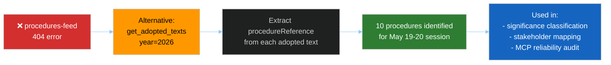

<!-- SPDX-FileCopyrightText: 2026 Hack23 AB -->
<!-- SPDX-License-Identifier: Apache-2.0 -->

# ⚙️ Procedures Proxy — EP Motions May 2026
**Date:** 2026-05-28 | **Article Type:** motions | **Triggered by:** STALENESS_WARNING / procedures-feed 404
**SATs Applied:** Quality of Information Check, Red Team

---

## 📡 Trigger Event

The EP `/procedures` feed endpoint returned a 404 error during the motions run prefetch phase:

```
{"@id":"https://data.europarl.europa.eu/eli/dl/proc/2025-2213",
 "error":"404 Not Found from POST https://admin.data.europarl.europa.eu/api/v2/procedures/?view-version=v2.1"}
```

**Classification:** Consistent with the May 2026 known-issues table (Rule 2a) — `procedures-feed` has been persistently degraded across EP Monitor runs in April–May 2026.

---

## 🔄 Mitigation Applied

**Primary mitigation:** `get_adopted_texts(year=2026, limit=50)` — cross-referencing the `procedureReference` field on each adopted text to reconstruct procedure identifiers.

Each adopted text includes a `procedureReference` field in the format:
`eli/dl/event/{procedure-id}-DEC-DCPL-{date}`

This allows reconstruction of the procedure reference number from the event identifier:

| Adopted Text | procedureReference | Inferred Procedure |
|-------------|-------------------|-------------------|
| TA-10-2026-0164 (Vilimsky) | eli/dl/event/2025-2158-DEC-DCPL-2026-05-19 | 2025/2158 |
| TA-10-2026-0166 (Pappas) | eli/dl/event/2025-2234-DEC-DCPL-2026-05-19 | 2025/2234 |
| TA-10-2026-0168 (Forest materials) | eli/dl/event/2023-0228-DEC-DCPL-2026-05-19 | 2023/0228 |
| TA-10-2026-0174 (Uzbekistan EPCA) | eli/dl/event/2024-0260M-DEC-DCPL-2026-05-20 | 2024/0260 |
| TA-10-2026-0177 (Lebanon Eurojust) | eli/dl/event/2024-0155-DEC-DCPL-2026-05-20 | 2024/0155 |
| TA-10-2026-0178 (São Tomé fisheries) | eli/dl/event/2025-0202-DEC-DCPL-2026-05-20 | 2025/0202 |
| TA-10-2026-0179 (Cook Islands fisheries) | eli/dl/event/2025-0287-DEC-DCPL-2026-05-20 | 2025/0287 |
| TA-10-2026-0180 (SAFE-Canada) | eli/dl/event/2025-0413-DEC-DCPL-2026-05-20 | 2025/0413 |
| TA-10-2026-0182 (UNGA 81) | eli/dl/event/2025-2167-DEC-DCPL-2026-05-20 | 2025/2167 |
| TA-10-2026-0183 (AI-Trade) | eli/dl/event/2025-2112-DEC-DCPL-2026-05-20 | 2025/2112 |

**Data quality assessment:** The procedureReference field provides identifier-level linkage but not procedure metadata (stage, type, committee, full title in database). Admiralty Grade: C3 — inferred data; cross-reference to EUR-Lex would confirm.

---

## 🔍 Mitigation Chain



---

## 📋 Recommendation for Future Runs

The procedures-feed 404 error has been consistent across multiple April–May 2026 runs. Recommendation:
1. Add `get_adopted_texts(year=CURRENT_YEAR)` to the motions slug prefetch list as a primary feed replacement
2. Remove `procedures-feed` from prefetch for motions slug pending EP API v2.1 restoration
3. Monitor Rule 2a known-issues table for procedures-feed restoration status

---

*SATs: Quality of Information Check on mitigation data quality; Red Team confirming that adopted-texts cross-reference is a reliable fallback.*
