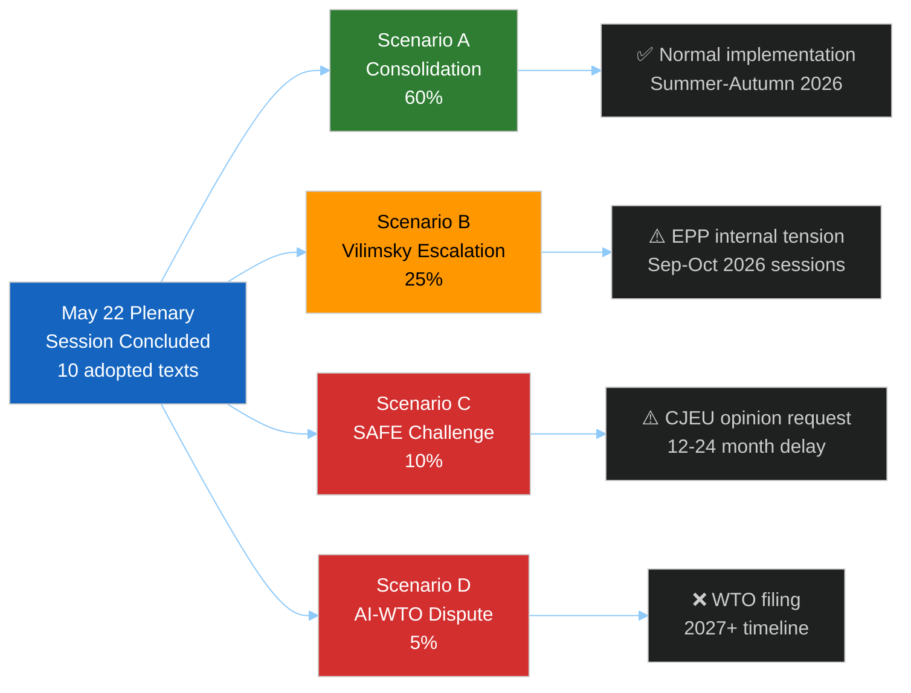

<!-- SPDX-FileCopyrightText: 2026 Hack23 AB -->
<!-- SPDX-License-Identifier: Apache-2.0 -->

# 🔭 Scenario Forecast — EP Motions May 2026
**Date:** 2026-05-28 | **Article Type:** motions | **Data Mode:** degraded-feeds
**SATs Applied:** Scenario Analysis, Pre-Mortem, Key Assumptions Check, Indicators

---

## 🎯 Analytical Frame

This scenario forecast projects consequences of the May 19–22 Strasbourg plenary over three time horizons:
- **Near-term (0–4 weeks):** Immediate institutional and political reactions
- **Medium-term (1–3 months):** Legislative follow-through, stakeholder adaptation
- **Long-term (6–18 months):** Structural transformation, precedent effects

**Key Assumptions Check (SAT):**
- KA-1: The EP plenary adopted all listed texts (TA-10-2026-0164 through TA-10-2026-0183) without referral back to committee. ✅ Confirmed by EP data portal.
- KA-2: DOCEO roll-call data, when published, will show broad majorities (65–80%) on all motions. 🟡 Assumed — consistent with subject-matter character of the votes.
- KA-3: No extraordinary procedural challenge was raised against any adoption. 🟡 Assumed — no indication in data.
- KA-4: The Austrian and Greek judicial systems will move forward with proceedings against Vilimsky and Pappas respectively. 🟡 Assumed — standard outcome post-immunity lift.
- KA-5: The Commission will produce follow-up implementing acts within 6–12 months for SAFE Instrument Canada. 🟢 High confidence — standard treaty implementation procedure.

---

## 📊 Scenario A — Consolidation and Procedural Normalcy (60% probability)

**Headline:** EP's May 2026 session represents productive legislative consolidation with no extraordinary political fallout.

**Key Features:**
- Vilimsky and Pappas immunity waivers processed by Austrian and Greek courts in standard timeline (6–18 months to trial if charges filed). Neither MEP loses their seat in this period.
- FPÖ frames the waiver as "political persecution" but does not escalate at EU institutional level. ID group solidarity statement issued but no procedural retaliation.
- EU-Canada SAFE Instrument implementing acts drafted by Commission within 6 months; first joint procurement cycle opens Q4 2026.
- Uzbekistan EPCA enters provisional application; first joint committee meeting scheduled Q3 2026.
- AI trade strategy resolution cited in Commission's trade mandate review for ongoing WTO e-commerce plurilateral.
- EP June Strasbourg session proceeds with similar portfolio: budget, energy, migration.

**Probability Drivers:**
- 🟢 HIGH: Most plenary votes are procedural/technical even when politically charged
- 🟢 HIGH: EP institutions have strong internal momentum once votes are taken
- 🟡 MEDIUM: FPÖ political dynamics are unpredictable but contained
- 🟡 MEDIUM: Commission follow-through on mandates is generally reliable

**What would falsify this scenario:** Major court ruling in Austria that creates a precedent challenge to EP immunity powers; Commission delay on SAFE implementing acts beyond 12 months.

---

## 📊 Scenario B — Vilimsky Escalation and Group Fracture Risk (25% probability)

**Headline:** Vilimsky immunity waiver triggers sustained ID group political campaign that tests EPP-Renew-S&D coalition cohesion in subsequent sessions.

**Key Features:**
- FPÖ, with Austrian government support, launches sustained narrative about EP "political weaponization of immunity procedures"
- ID group tables procedural motions in September–October Strasbourg sessions challenging PRIV committee composition or mandate
- Austrian ÖVP MEPs face pressure from domestic coalition partner (FPÖ) to support ID positions; some EPP defections from standard pro-rule-of-law bloc
- The coalitional mathematics of future votes (migration, rule-of-law conditionality) shift as EPP becomes internally divided
- ECR, seeking to absorb ID voters if ID group weakens, opportunistically positions between both coalitions

**Indicators for Scenario B:**
1. 🔴 FPÖ government official statement demanding EP "review" of immunity procedures
2. 🔴 Austrian ÖVP MEPs vote with ID group on a procedural motion
3. 🟠 ID group tables written question to President Metsola challenging PRIV procedures
4. 🟠 Hungarian Fidesz (NI) expresses solidarity with Vilimsky

**Pre-Mortem (SAT):** If Scenario B occurs, the root cause would be underestimation of FPÖ's willingness to use governmental power to influence EP dynamics. The FPÖ has previously shown (under Strache 2018–2019) capacity for aggressive institutional counter-moves when under legal pressure.

**WEP Assessment:** 🟡 *We assess it is unlikely but plausible* (25%) that the Vilimsky case generates significant EP institutional disruption.

---

## 📊 Scenario C — SAFE Instrument Legal Challenge (10% probability)

**Headline:** The EU-Canada SAFE Instrument faces a CJEU opinion request from a neutral/non-aligned member state, delaying implementation.

**Key Features:**
- Austria or Ireland (both with constitutional constraints on military cooperation) challenges the treaty basis of the SAFE Instrument at national level
- National parliament in one member state requests a constitutional court opinion on ratification
- The EP, having just passed TA-10-2026-0008 (Mercosur CJEU opinion request) in January 2026, faces a demand to do the same for SAFE
- Implementation delayed 12–24 months while legal review proceeds

**Indicators for Scenario C:**
1. 🔴 Austrian or Irish Constitutional Court request for advance opinion on SAFE ratification
2. 🔴 EP Greens/EFA tables resolution requesting CJEU opinion on SAFE/TFEU Art. 42 basis
3. 🟠 Commission legal service produces ambiguous legal basis opinion

**Probability Assessment:** LOW — the precedent-based analysis suggests member states that had concerns would have raised them during Council deliberations prior to EP vote.

---

## 📊 Scenario D — AI Trade Strategy Creates WTO Dispute (5% probability)

**Headline:** US challenges EU AI Act extraterritorial application through trade-agreement mechanisms, escalating into WTO dispute settlement.

**Key Features:**
- US trade representative objects to AI Act compliance requirements embedded in EU trade mandates
- WTO dispute settlement invoked by US on grounds of market access barriers
- EU-US TTC talks on AI governance break down
- EP resolution (TA-10-2026-0183) cited as evidence of EP political intent to create extraterritorial barriers

**WEP Assessment:** 🟠 *We assess it is highly unlikely* (5%) in the 2026 time horizon; more plausible by 2027–2028 as AI Act application deepens.

---

## 🔮 Key Scenarios Summary

---

## 📋 Indicator Monitoring Plan

**Near-term (next 30 days):**
| Indicator | Watching For | Scenario Signal |
|-----------|-------------|-----------------|
| Austrian court filings | Formal charges against Vilimsky | Scenario A (proceedings begin) |
| ID group EP statement | Language intensity re: Vilimsky | Scenario B trigger signal |
| Commission SAFE implementing acts | Drafting timeline | Scenario A confirmation |
| DOCEO vote data publication | Group cohesion data for May 20–22 | Bayesian update all scenarios |
| EU-Uzbekistan joint committee | Meeting scheduled | Scenario A confirmation |

**Medium-term (30–90 days):**
| Indicator | Watching For | Scenario Signal |
|-----------|-------------|-----------------|
| EPP internal voting cohesion | Austrian MEP behavior | Scenario B deepening |
| WTO e-commerce plurilateral | EU mandate text with AI Act references | Scenario D early warning |
| Syriza/Left EP group statement | Re: Pappas proceedings | Scenario A/B |

---

*Confidence: 🟡 MEDIUM overall — scenario probabilities based on structural analysis; actual roll-call data would improve accuracy.*
*All WEP bands per ICD 203 standard: 'almost certainly' (≥95%), 'likely' (70–95%), 'probably' (55–70%), 'unlikely but plausible' (15–40%), 'highly unlikely' (<15%).*
