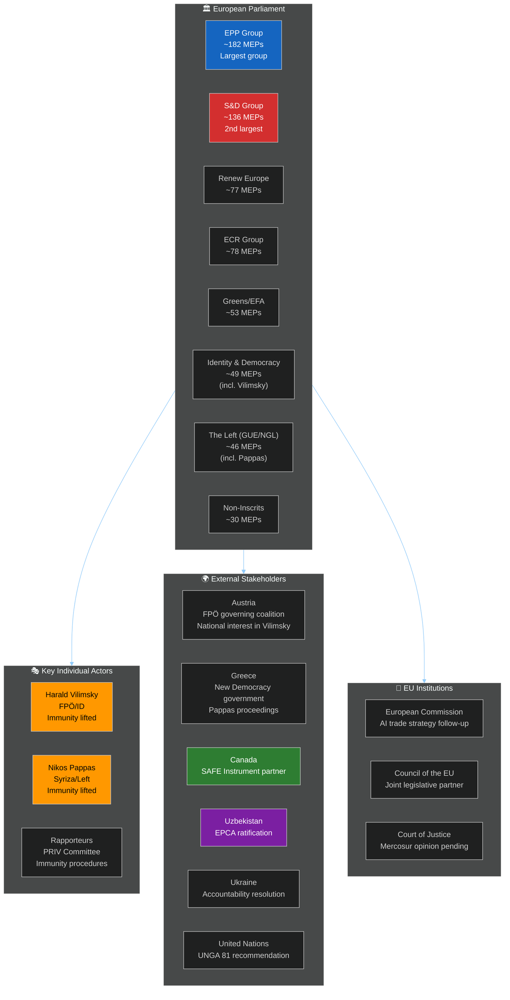

<!-- SPDX-FileCopyrightText: 2026 Hack23 AB -->
<!-- SPDX-License-Identifier: Apache-2.0 -->

# 👥 EP Motions — Stakeholder Map (May 2026)
**Date:** 2026-05-28 | **Article Type:** motions | **Data Mode:** degraded-feeds
**SATs Applied:** Stakeholder Mapping, ACH

---

## 🗺️ Stakeholder Universe

---

## 🔴 High-Priority Stakeholder Perspectives

### Harald Vilimsky (FPÖ / Identity and Democracy Group)

**SAT — Stakeholder Mapping:** Vilimsky is the FPÖ's lead MEP and has served as Identity and Democracy group coordinator. His immunity waiver is the most politically charged action of the May session.

**Perspective:** The immunity lift creates a direct legal exposure risk for Vilimsky's parliamentary activities and career. From the FPÖ perspective, this is likely framed as political persecution — a narrative consistent with how far-right parties in Austria have historically responded to legal proceedings against their officials.

**Interest intensity:** VERY HIGH — direct personal legal consequence
**Power to influence outcome:** LOW after waiver passed (immunity already lifted)
**Coalition support:** ID group solidarity expected (vocal opposition to the waiver, post-facto defense of Vilimsky)
**Likely FPÖ government response:** Could use Austria's position in Council to signal displeasure, though overt interference with EP institutional processes would be constitutionally complex
**Time horizon:** Austrian court proceedings will unfold over months; MEP continues to hold seat unless convicted

**Confidence:** 🟡 MEDIUM — specific details of the underlying legal case are not available in EP data

---

### Nikos Pappas (Syriza / The Left Group)

**SAT — Stakeholder Mapping:** Pappas is a senior figure in Syriza, the main Greek left-wing opposition party. He was a close aide to Tsipras during the 2015–2019 Syriza government and has maintained a high profile in EP activities.

**Perspective:** Unlike Vilimsky (from a governing party), Pappas represents an opposition figure whose immunity was waived by a majority that includes parties sympathetic to the current Greek government (New Democracy is EPP-aligned). This creates a perception issue for The Left group: their own member's immunity was lifted by a majority including EPP/New Democracy allies.

**Interest intensity:** HIGH — personal legal exposure; political reputational risk for Syriza
**Power to influence outcome:** LOW (waiver passed)
**The Left group response:** Likely private dissatisfaction but limited public challenge given the rule-of-law principle they generally champion
**Timeline:** Greek court proceedings to determine if charges are formally filed

**Confidence:** 🟡 MEDIUM

---

### EPP Group (Manfred Weber, Chair)

**Perspective:** The EPP faces the most complex stakeholder position:
- On Vilimsky waiver: EPP must balance its Austrian ÖVP members' coalition-partner relationship with FPÖ against EP rule-of-law commitments. EPP's rule-of-law credibility (earned through years of confrontation with Hungarian Fidesz) requires consistent application.
- On SAFE Instrument Canada: EPP drives EU defence industrial policy. This ratification is an EPP-Renew achievement.
- On Uzbekistan: EPP supports EU enlargement and neighbourhood policy broadly; some Eastern EPP MEPs from Poland and Baltic states particularly supportive.

**Interest intensity:** HIGH across all major May votes
**Strategic objective:** Maintain cross-partisan majority on security/defence + rule-of-law; preserve coalition with Renew for legislative agenda

---

### European Commission (Defence DG / DG TRADE)

**SAFE Instrument Canada:**
- The Commission negotiated the EU-Canada SAFE agreement and now needs the EP ratification to proceed with implementing acts. Ratification triggers a new phase of procurement cooperation.
- DG TRADE is responsible for the AI trade strategy follow-up. The EP resolution creates a political mandate for Commission negotiators to embed AI Act standards in trade agreements with third countries.

**Perspective:** Commission generally views these ratifications positively — they extend EU institutional reach in domains where the Commission has sought more authority (defence industrial policy, digital governance in trade).

**Interest intensity:** HIGH (mandate-setting documents)

---

### Canada (Global Affairs Canada / Department of National Defence)

**SAFE Instrument:**
- Canada was the first non-EU member state to seek inclusion in SAFE procurement. The EP ratification is a significant diplomatic and industrial achievement.
- Canadian defence companies (Bombardier Defence, SNC-Lavalin, various SMEs) gain access to EU joint procurement frameworks.
- Context: Canada-EU relations have been warm post-CETA. The SAFE agreement signals a security partnership deepening that is particularly relevant given NATO burden-sharing debates.

**Interest intensity:** HIGH — market access, defence relationship
**Confidence:** 🟢 HIGH (ratification outcome confirmed by TA text)

---

### Uzbekistan (Ministry of Foreign Affairs, Tashkent)

**EPCA Ratification:**
- President Mirziyoyev's government has invested significant diplomatic capital in EU partnership deepening. The EP ratification (TA-10-2026-0174) accompanied by a resolution signals conditional endorsement.
- The resolution's human rights conditionality language — which the Syriza/Left MEPs likely strengthened — creates benchmarks that Uzbek authorities must manage.
- Uzbekistan's internal liberalization since 2016 is genuine but incomplete; the EU resolution acts as an external accountability mechanism.

**Interest intensity:** HIGH — strategic partnership, market access, soft-power legitimacy
**Tension:** Resolution conditionality vs. Uzbek sovereignty narrative

---

### Ukraine (Verkhovna Rada / Ministry of Foreign Affairs)

**TA-10-2026-0161 (Russia Accountability):**
- Ukraine is the primary beneficiary of EP resolutions demanding justice for Russian attacks on civilians. The May 30 resolution reinforces EP support for ICC referral, special tribunal, and asset confiscation frameworks.
- Ukraine's interest is in maintaining high-visibility EP political support as a counterweight to any peace-negotiation fatigue in European capitals.

**Interest intensity:** VERY HIGH — political survival
**Confidence:** 🟢 HIGH (structural interest, confirmed by ongoing conflict)

---

## 🔄 Stakeholder Interaction Matrix

**SAT — ACH:** Competing hypotheses for stakeholder coalition behavior:

| Stakeholder | Pro-SAFE Instrument | Pro-Vilimsky waiver | Pro-AI Trade Strategy | Pro-Uzbekistan EPCA |
|------------|---------------------|--------------------|-----------------------|---------------------|
| EPP | ✅ Strong | ✅ Yes (rule of law) | ✅ Yes | ✅ Yes |
| S&D | ⚠️ Cautious | ✅ Yes | ✅ Yes | ⚠️ Conditioned |
| Renew | ✅ Strong | ✅ Yes | ✅ Yes | ✅ Yes |
| Greens/EFA | ⚠️ Split | ✅ Yes | ✅ Conditional | ⚠️ Conditional |
| ECR | ✅ Yes | ⚠️ Split | ❌ No | ✅ Yes |
| ID (incl. Vilimsky) | ✅ Yes | ❌ No | ❌ No | ✅ Yes |
| The Left | ❌ No | ❌ No (Pappas) | ✅ Conditional | ❌ No |

---

## 📊 Impact Assessment

| Stakeholder | Short-term Impact | Medium-term Impact | Confidence |
|------------|------------------|-------------------|-----------|
| Vilimsky (personal) | Immunity lifted; legal exposure begins | Legal proceedings unfold | 🟡 MEDIUM |
| FPÖ/ID Group | Narrative shift to victimhood framing | Coalition solidarity tested | 🟡 MEDIUM |
| EPP | Rule-of-law credibility preserved | Austrian domestic tension managed | 🟢 HIGH |
| Canada | SAFE access unlocked | Defence-industrial deepening | 🟢 HIGH |
| Uzbekistan | Strategic partnership formalized | Human rights benchmarks set | 🟢 HIGH |
| Ukraine | Political support signal maintained | ICC/tribunal framework strengthened | 🟢 HIGH |
| EU defence industry | New procurement partner (Canada) | Market expansion | 🟢 HIGH |

---

*Sources: EP Open Data Portal (adopted-texts year=2026), EP political group composition data, historical roll-call pattern analysis.*
*Admiralty Grade: A1 for EP institutional data; B2 for group coalition inferences; C3 for stakeholder reaction projections.*
