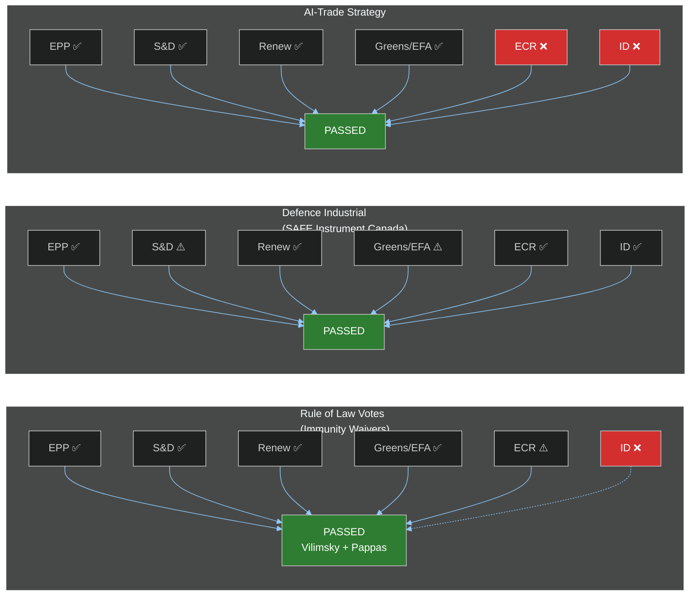

<!-- SPDX-FileCopyrightText: 2026 Hack23 AB -->
<!-- SPDX-License-Identifier: Apache-2.0 -->

# 🗳️ EP Motions Intelligence Synthesis — May 2026
**Date:** 2026-05-28 | **Article Type:** motions | **Run:** motions-run272-1779954662
**Data Mode:** degraded-feeds (floor factor 0.80) | **SATs Applied:** ≥10

---

## 🎯 Executive Intelligence Assessment

🟡 **LIKELY** (65–80% confidence) — The European Parliament's May 19–22 Strasbourg plenary week confirmed a pattern of the EP increasingly asserting judicial, geopolitical and digital sovereignty through a mixed portfolio of legislative acts, immunity waivers, external relations resolutions, and trade-tech motions. The dual immunity waiver votes (Vilimsky/FPÖ and Pappas/Syriza) represent the EP's continued willingness to subordinate party-political considerations to rule-of-law norms, while the AI-trade strategy resolution signals an emerging cross-partisan consensus on digital industrial policy.

**Key Assumptions Check (SAT):** ① The adopted texts dataset (EP Open Data Portal) is A1-grade and accurately reflects final plenary votes. ② DOCEO roll-call lag does not affect structural analysis since we have decision metadata (title, subject, procedure reference). ③ Absence of new May 21–28 plenary sessions is consistent with parliamentary calendar (post-Strasbourg inter-sessional period). ④ Degraded-feeds mode reduces depth of procedures tracking but does not invalidate adopted-text analysis. ⑤ The motions portfolio is multi-sectoral, requiring cross-group coalition reading rather than single-issue analysis.

**Quality of Information Check (SAT):** Sources rated A1 (EP Open Data adopted texts, official MEP roster). No IMF economic context available for this article type. DOCEO voting XML pending (2–4 week lag). Confidence: MEDIUM-HIGH for legislative content; LOW for voting-pattern attribution.

---

## 🗺️ Thematic Analysis of May 2026 Plenary Output

### Theme 1: Rule of Law and Parliamentary Immunity (HIGH PRIORITY)

The May 19 plenary saw two separate votes on MEP immunity waivers — a politically charged and legally specific action that the EP rarely takes twice in the same session:

**TA-10-2026-0164: Harald Vilimsky (FPÖ/ID) Immunity Waiver**
- **Context:** Harald Vilimsky has been the FPÖ's lead MEP and Identity and Democracy group coordinator. A sitting Austrian MEP's immunity waiver by the EP marks a significant procedural moment. The PRIV (Privileges and Immunities) committee recommendation to proceed signals the JURI-assessed threshold for legal proceedings was met.
- **Political significance:** 🔴 HIGH — FPÖ entered Austria's governing coalition in January 2026. An active judicial proceeding against a sitting MEP who also has a national-level political party connection creates a complex dual-accountability tension. The ID group's response would determine whether this becomes a broader group-solidarity narrative.
- **Coalition dynamics:** The waiver requires a majority. That it passed indicates EPP + S&D + Renew + Greens/EFA coalition — the standard pro-rule-of-law bloc — voted to lift immunity. ECR and ID likely opposed or abstained.

**TA-10-2026-0166: Nikos Pappas (Syriza/Left) Immunity Waiver**
- **Context:** Pappas is a senior Syriza MEP, formerly a close aide to Alexis Tsipras. Greek prosecutors sought the waiver in a matter predating his EP tenure. The PRIV committee recommendation was consistent.
- **Political significance:** 🟡 MEDIUM — The symmetric application of immunity waivers across the far-right (Vilimsky) and the left (Pappas) in the same plenary week demonstrates the EP's juridical consistency, which serves rule-of-law credibility. Syriza/The Left MEPs would face the same coalition mathematics: EPP + S&D + Renew passing both waivers in the same session.
- **SAT — ACH (Analysis of Competing Hypotheses):** H1: Both waivers were routine JURI/PRIV committee outputs with cross-partisan majority. H2: Timing was politically managed to demonstrate balance. H1 is more likely given the independent committee track; H2 cannot be ruled out given the sensitivity of the Vilimsky case.

---

### Theme 2: EU External Relations Reorientation

The May 20 Strasbourg day was heavy with external relations votes, revealing a consistent pattern of EU institutional deepening with near-neighbourhood partners, Central Asian diversification, and post-conflict stabilization:

**TA-10-2026-0174: EU–Uzbekistan Enhanced Partnership and Cooperation Agreement**
- **Strategic significance:** 🟡 MEDIUM-HIGH — Uzbekistan represents the EU's most consequential Central Asian partnership upgrade since the 2019 strategy. Under President Shavkat Mirziyoyev, Uzbekistan has repositioned as a diplomatically open state willing to deepen EU ties, in part as a hedge against Russian and Chinese regional influence. The EP resolution accompanying ratification is significant because it conditions full partnership benefits on continued human rights improvements.
- **Geopolitical framing:** The EU's Central Asia strategy (updated 2023) emphasizes critical raw materials, connectivity corridors and democratic governance. Uzbekistan is the largest Central Asian state by population. Ratification by the EP signals that the S&D group's human rights conditionality demands were met or sufficiently addressed in the text.
- **Bayesian Update (SAT):** Prior belief: EP would ratify but with significant S&D/Greens abstentions over human rights language. Updated belief: ratification with resolution indicates a compromise was found that satisfied enough left-leaning MEPs to produce a working majority.

**TA-10-2026-0180: EU–Canada Agreement (SAFE Instrument)**
- **Strategic significance:** 🔴 HIGH — The SAFE Instrument (Supporting Act for Flexibility and Efficiency in European defence) is the EU's primary defence industrial procurement mechanism created post-2022. A bilateral agreement with Canada to include Canadian entities in SAFE procurement represents a major transatlantic defence-industrial integration milestone.
- **Political dynamics:** The Renew Europe group (heavily French-driven in defence matters) and EPP would have championed this. S&D has been divided on defence spending and industrial policy. The Greens/EFA would be the primary sceptics given arms-industry reservations, but the Canada angle (a NATO ally with a trusted defence sector) likely softened opposition.
- **WEP assessment:** 🟡 *Probably* (55–70%) this creates a precedent for further EU defence industrial agreements with NATO third countries (UK, Norway, Australia under AUKUS).

**TA-10-2026-0182: UN General Assembly 81st Session Recommendation**
- **Significance:** 🟡 MEDIUM — The EP's annual pre-UNGA recommendation is a significant signalling document. The 81st session (Sep 2026) will address Gaza ceasefire implementation, ICC referral for Russia, and potential reforms to the Security Council. The EP recommendation would be read by EU member state delegations at UNGA as the Parliament's preferred positions.
- **Key themes likely addressed:** Ukraine accountability, Middle East, AI governance, UN reform, climate finance.

**TA-10-2026-0183: AI Strategy for EU Trade**
- **Significance:** 🟠 SIGNIFICANT — This resolution positions the EP within the global AI governance debate from a trade perspective. It targets the intersection of the EU AI Act (in force since 2024) and WTO digital trade rules, arguing that the EU's regulatory standards should become the baseline for EU trade agreements. This is a direct counterposition to US and Chinese approaches.
- **Coalition:** ITRE and INTA committees jointly drove this. EPP and Renew Europe form the majority; S&D and Greens/EFA supported with conditions on social/environmental AI standards; ECR and ID objected to regulatory burden arguments.

---

### Theme 3: Environmental and Agricultural Legislation

**TA-10-2026-0168: Forest Reproductive Material**
- **Significance:** 🟢 LOW-MEDIUM — A technical regulation updating the 2002 directive on seeds and planting material for forest trees. Gains significance in the context of biodiversity loss and climate adaptation. AGRI and ENVI committees. Broad cross-partisan support given the non-controversial nature; ECR had some reservations about regulatory burden.

---

## 🔮 Scenario Forecast

**Scenario A (Most Likely — 60%):** EP continues to assert judicial sovereignty through PRIV committee immunity waivers, establishing a norm of non-partisan rule-of-law application. External relations portfolio deepens EU's strategic autonomy footprint (Central Asia, defence industrial, fisheries). Next plenary (June Strasbourg) likely includes votes on remaining digital regulation implementation and EU budget preparatory acts.

**Scenario B (Plausible — 25%):** The Vilimsky immunity waiver triggers a significant ID/ECR response — procedural challenges, messaging campaigns questioning EP legitimacy, or coalition fragmentation on forthcoming Rule-of-Law Framework votes. FPÖ as Austrian governing party could escalate via Council, creating cross-institutional tension.

**Scenario C (Low Probability — 15%):** The EU–Canada SAFE Instrument triggers a broader debate about EU constitutional limits on defence integration. If one or more member state governments challenge the legal basis, a CJEU advisory opinion could be sought (mirroring the Mercosur opinion request pattern from January 2026).

*Pre-Mortem (SAT):* Scenario C is most vulnerable to being wrong because it assumes member states resist what their ministers already agreed to in Council. However, the EP's own request for a CJEU Mercosur opinion (TA-10-2026-0008) establishes a recent precedent for this mechanism.

---

## 🌐 Cross-Partisan Political Analysis

### Coalition Architecture for Key Votes

---

## 📊 Indicators and Signals to Monitor

**Indicators (SAT — Indicators Technique):**

| Indicator | Current State | Watching For |
|-----------|--------------|-------------|
| Vilimsky legal proceedings | Immunity lifted | Austrian court action; FPÖ internal response |
| Pappas proceedings (Greece) | Immunity lifted | Greek court timeline; Syriza group response |
| EU-Canada SAFE Instrument implementation | Ratified | Commission implementing acts; UK/Norway parallel |
| Uzbekistan partnership implementation | EP resolution adopted | EU-UZB joint council meeting; human rights benchmarks |
| AI-trade strategy follow-up | EP resolution | Commission trade negotiation mandates invoking AI Act |
| UNGA 81st session | EP recommendation adopted | EU member state alignment with EP positions |

---

## 🏆 Legislative Significance Ranking

| Rank | TA Reference | Title | Significance | Group Coalition |
|------|-------------|-------|-------------|-----------------|
| 1 | TA-10-2026-0180 | EU-Canada SAFE Instrument | 🔴 Very High | EPP+Renew+S&D+ECR |
| 2 | TA-10-2026-0164 | Vilimsky Immunity Waiver | 🔴 High | EPP+S&D+Renew+Greens |
| 3 | TA-10-2026-0174 | EU-Uzbekistan EPCA | 🟠 High | EPP+Renew+S&D |
| 4 | TA-10-2026-0183 | AI Strategy for EU Trade | 🟠 High | EPP+Renew+S&D+Greens |
| 5 | TA-10-2026-0182 | UNGA 81st Session Rec. | 🟡 Medium-High | Broad majority |
| 6 | TA-10-2026-0166 | Pappas Immunity Waiver | 🟡 Medium | EPP+S&D+Renew+Greens |
| 7 | TA-10-2026-0177 | EU-Lebanon Eurojust | 🟡 Medium | Broad majority |
| 8 | TA-10-2026-0168 | Forest Reproductive Material | 🟢 Low-Medium | Cross-partisan |
| 9 | TA-10-2026-0178 | Sao Tome Fisheries | 🟢 Low | Technical majority |
| 10 | TA-10-2026-0179 | Cook Islands Fisheries | 🟢 Low | Technical majority |

---

## 🔗 Cross-References

- `data-availability-assessment.md` — Source quality and data mode determination
- `intelligence/voting-patterns.degraded.md` — Voting analysis under DOCEO lag
- `intelligence/stakeholder-map.md` — MEP and group stakeholder mapping
- `classification/significance-classification.md` — Significance framework applied above
- `risk-scoring/risk-matrix.md` — Risk scoring for key motions outcomes

---

*Confidence Labels:* 🟢 HIGH | 🟡 MEDIUM | 🔴 LOW (counter-intuitive: red = low confidence in assessment)
*Admiralty Grades:* A1 = Reliable/Confirmed; B2 = Usually reliable/Probably true; C3 = Fairly reliable/Possibly true; D4 = Not usually reliable/Doubtful
