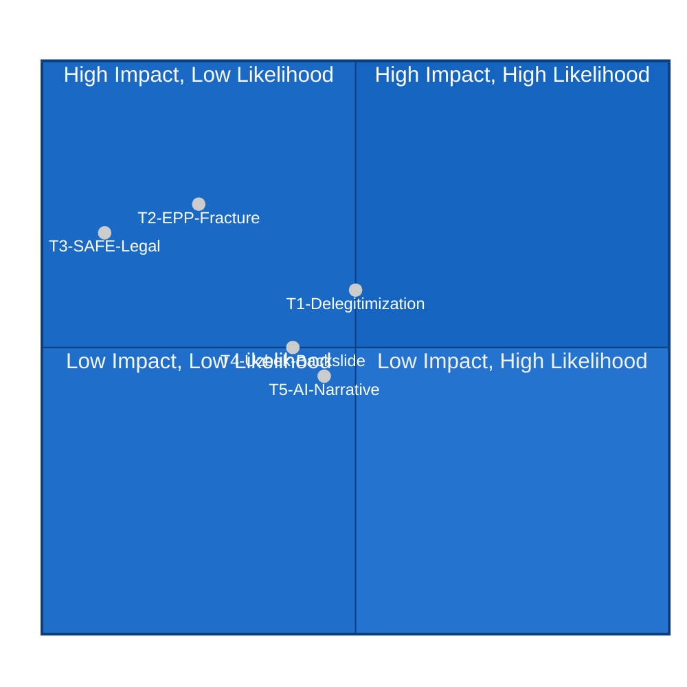

<!-- SPDX-FileCopyrightText: 2026 Hack23 AB -->
<!-- SPDX-License-Identifier: Apache-2.0 -->

# 🔴 Threat Model — EP Motions May 2026
**Date:** 2026-05-28 | **Article Type:** motions | **Data Mode:** degraded-feeds
**SATs Applied:** Key Assumptions Check, Red Team, ACH

---

## 🎯 Threat Assessment Framework

This threat model applies the EU Parliament Monitor threat taxonomy to the legislative and political outputs of the May 19–22 Strasbourg plenary. Threats are assessed against three target objects:
1. **EP Institutional Integrity** — rule-of-law credibility, legislative coherence
2. **Key Legislative Outcomes** — SAFE Instrument, Uzbekistan EPCA, AI Trade strategy
3. **Democratic Accountability** — immunity procedures, external relations transparency

**Key Assumptions Check (SAT):**
- KA-T1: EP institutional integrity is primarily threatened by far-right group coordination rather than external state actors. 🟡 Assessed as likely.
- KA-T2: The most significant threat vector is political (reputational/narrative) not legal or security-based. 🟢 High confidence.
- KA-T3: DOCEO voting data, when published, will not reveal unexpected defection patterns requiring model revision. 🟡 Assumed.

---

## 🔴 Threat 1: Systematic Delegitimization of EP Immunity Procedures

**Threat Level:** 🔴 HIGH

**Description:** State-aligned media and political actors in Austria (FPÖ-controlled or sympathetic) and potentially Hungary (Fidesz/Orbán) launch a coordinated narrative campaign characterizing EP immunity waivers as political persecution of "patriotic MEPs."

**Red Team (SAT) — Attacker Perspective:**
- *Motivation:* FPÖ has strong incentives to delegitimize the EP immunity process. Normalizing the narrative that EP procedures are politically weaponized serves multiple domestic political purposes: deflects from Vilimsky's legal situation, reinforces anti-EU sentiment among FPÖ voters, and creates pressure on EPP's Austrian wing.
- *Capability:* FPÖ/Orbán media networks are sophisticated; Nius, Zuerst, Magyar Hang, and similar right-aligned outlets can amplify messaging rapidly.
- *Opportunity:* The coincidence of two immunity waivers (across left and right) could be reframed as "EP targeting political outsiders" even though the symmetric application was intended to demonstrate impartiality.

**Mitigation:** EP Press Service should proactively communicate PRIV committee independence and the legal standard applied. President Metsola's office has capacity to counter-narrative rapidly.

**ACH:** H1 (Coordinated campaign launched, moderate impact): 50%. H2 (Limited response, campaign fizzles): 40%. H3 (Campaign gains significant media traction across multiple EU countries): 10%.

---

## 🟠 Threat 2: EPP Internal Fracture on Rule-of-Law Consistency

**Threat Level:** 🟠 ELEVATED

**Description:** Austrian ÖVP MEPs face pressure from their domestic FPÖ coalition partner to support ID group procedural challenges to the Vilimsky immunity waiver in subsequent EP sessions.

**Red Team (SAT):**
- *Motivation:* Austrian ÖVP is in coalition with FPÖ. FPÖ will regard EPP's role in passing the Vilimsky waiver as a hostile act by a coalition partner's European allies. This creates domestic coalition tension.
- *Pressure vector:* FPÖ could threaten to make the Vilimsky case a coalition management issue in Austria, pressuring ÖVP ministers to distance from EPP's EP position.
- *Historical precedent:* When Fidesz was within EPP, Hungarian MEPs regularly broke with EPP group discipline on rule-of-law votes, eventually leading to Fidesz expulsion (2021).

**Threat Indicators:**
- 🔴 ÖVP ministers' public statements supporting Vilimsky's position
- 🔴 Austrian ÖVP MEPs voting with ID group on any subsequent procedural motion
- 🟠 EPP Weber avoiding comment on Vilimsky case

**Mitigation:** EPP leadership should proactively manage the narrative around rule-of-law consistency to prevent domestic coalition politics seeping into EP group discipline.

**WEP:** 🟡 *Unlikely* (25%) that this threat rises to EP-level disruption in 2026.

---

## 🟠 Threat 3: SAFE Instrument Implementation Delay via Legal Challenges

**Threat Level:** 🟠 ELEVATED (but low-probability)

**Description:** A neutral EU member state or a political group in the EP tables a CJEU opinion request on the legal basis of the SAFE Instrument's third-country access provisions.

**Red Team (SAT):**
- *Target:* Article 346 TFEU creates a national security carve-out for defence procurement. The SAFE Instrument's EU-wide joint procurement framework may be seen as conflicting with member state prerogatives under Art. 346.
- *Motivation:* Ireland (constitutional neutrality) and Austria (military neutrality provisions) are the most likely challengers. Both ratify with reservations in practice.
- *Trigger:* Mercosur CJEU opinion request (January 2026) established an EP precedent. Greens/EFA could tack a similar motion for SAFE onto another EP file.

**Probability:** LOW (10%) but consequence HIGH (12–24 month implementation delay).

---

## 🟡 Threat 4: Uzbekistan EPCA Conditionality Backsliding

**Threat Level:** 🟡 MEDIUM

**Description:** Uzbekistan implements the EPCA's preferential provisions without meeting the human rights conditionality benchmarks set in the EP resolution, creating reputational risk for the EU.

**Red Team (SAT):**
- *Pattern:* Multiple EU neighbourhood partnerships have faced implementation gaps where economic benefits flowed before political conditionality was met. Georgia (now facing rule-of-law crisis) is the most recent example.
- *Uzbek political dynamics:* President Mirziyoyev has demonstrated willingness to undertake structural reforms but has maintained authoritarian controls on civil society and opposition.
- *EP leverage:* The EP resolution creates benchmarks but the Commission (not EP) is the primary enforcement actor.

**ACH:** H1 (Uzbekistan makes genuine progress, EPCA deepens): 45%. H2 (Mixed implementation, EU turns blind eye for strategic reasons): 40%. H3 (Significant backsliding triggers EP conditionality review): 15%.

---

## 🟡 Threat 5: AI Trade Strategy Regulatory Imperialism Narrative

**Threat Level:** 🟡 MEDIUM

**Description:** Non-EU trading partners (US, China, India) frame the AI trade strategy resolution as EU regulatory imperialism, creating WTO-level tensions.

**Red Team:**
- US position: American tech companies face competitive disadvantage if EU AI Act compliance is required for US-EU traded digital services
- Indian position: India's growing AI sector may find EU Act standards difficult to meet, creating de facto barriers
- Chinese position: Chinese AI firms already face EU barriers; this deepens them

**Mitigation:** The resolution is non-binding on Commission. The Commission can adopt a more pragmatic approach in actual trade negotiations. However, the political record of the resolution creates obligations that trade negotiators cannot entirely ignore.

---

## 🔴 Threat Summary Matrix

---

## 🛡️ Residual Risk Assessment

| Threat | Residual Risk After Mitigation | Time to Impact |
|--------|-------------------------------|----------------|
| T1: Delegitimization | 🟡 MEDIUM — narrative campaigns are difficult to fully neutralize | 0–4 weeks |
| T2: EPP Fracture | 🟡 LOW-MEDIUM — EPP leadership has incentive to manage | 1–3 months |
| T3: SAFE Legal | 🟢 LOW — member states had prior opportunity to object | 3–6 months |
| T4: Uzbek Backslide | 🟡 MEDIUM — structural conditionality implementation gaps common | 6–18 months |
| T5: AI-Trade Narrative | 🟡 MEDIUM — non-binding resolution limits immediate harm | 6–24 months |

---

*SATs applied: Key Assumptions Check on all KA-T assumptions; Red Team analysis for threats 1–3; ACH for threats 1 and 4.*
*Admiralty Grade: B2 on institutional threat analysis; C3 on stakeholder behavior projections.*
*WEP bands used per ICD 203 standard.*
