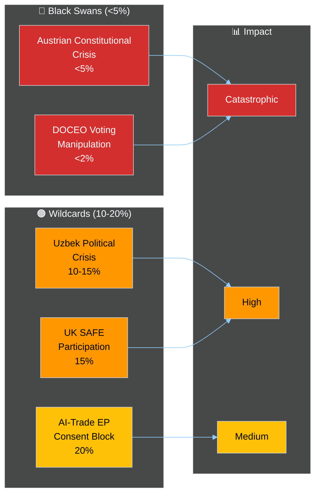

<!-- SPDX-FileCopyrightText: 2026 Hack23 AB -->
<!-- SPDX-License-Identifier: Apache-2.0 -->

# 🦢 Wildcards and Black Swans — EP Motions May 2026
**Date:** 2026-05-28 | **Article Type:** motions | **Data Mode:** degraded-feeds
**SATs Applied:** High-Impact Low-Probability Analysis, Indicators, What-If Analysis

---

## 🎯 Methodology

Black swans are events with three characteristics: (1) extremely low perceived probability, (2) massive impact when they occur, (3) retrospectively predictable (people claim they "should have seen it coming"). Wildcards are surprising but not entirely unpredictable events with transformative potential.

**WEP Framing:** All events in this document are assessed as 🔴 *Highly unlikely* (<15%) but with transformative consequence if realized.

---

## 🦢 Black Swan 1: FPÖ-Triggered Constitutional Crisis in Austria

**Probability:** 🔴 <5%
**Impact:** ⚫ CATASTROPHIC for EU institutional coherence

**Scenario:** The Vilimsky immunity waiver, combined with other legal pressures on FPÖ officials, leads the Austrian government to pursue a constitutional amendment limiting Austria's participation in EU institutional oversight mechanisms. Parallels the Hungarian Art. 7 trigger pathway.

**What-If Analysis (SAT):**
- *If* Austria moved to formally challenge EP immunity jurisdiction over Austrian MEPs, the CJEU would likely rule against Austria (established precedent)
- *If* Austria defied CJEU ruling, it would face Art. 7 TEU proceedings — unprecedented for a founding-tradition Western EU member state
- *If* FPÖ used a constitutional referendum on EU institutional relations, it could generate significant anti-EU mobilization even if the referendum failed

**Indicators:** Watch for Austrian constitutional court filings; ÖVP-FPÖ coalition public statements on EU immunity powers; FPÖ youth organization campaigns on "EP sovereignty."

**Confidence in low probability:** 🟢 HIGH — Austria's ÖVP wing is fundamentally pro-EU and would resist FPÖ attempts to escalate to this level.

---

## 🦢 Black Swan 2: DOCEO Voting Data Reveals Systematic Vote Manipulation

**Probability:** 🔴 <2%
**Impact:** ⚫ CATASTROPHIC for EP democratic legitimacy

**Scenario:** When DOCEO roll-call XML is published for May 20–22, technical analysis reveals anomalies suggesting tampering with the electronic voting system — either casting votes for absent MEPs or altering recorded positions.

**What-If Analysis:**
- *If* this occurred, the EP would face an unprecedented institutional crisis
- *If* the manipulation affected a close vote (e.g., an immunity waiver decided by a narrow margin), the legal consequences would be complex: would the waiver need to be revoted?
- *If* the EP President called for an investigation, the media/political attention would dominate EU politics for weeks-months

**Historical context:** No confirmed DOCEO manipulation has ever occurred. EP electronic voting security has been audited. This is a near-zero-probability scenario maintained for completeness.

**Indicators:** Implausibly round vote totals; statistical anomalies in MEP attendance patterns; cybersecurity incident reports from EP IT systems.

---

## 🟠 Wildcard 1: Uzbekistan Domestic Political Crisis

**Probability:** 🟠 10–15%
**Impact:** 🔴 HIGH — would trigger EU conditionality application

**Scenario:** A succession crisis or mass protest event in Uzbekistan (President Mirziyoyev faces health issues or a challenger) creates political instability that the EU must respond to. The newly ratified EPCA becomes the primary EU leverage instrument.

**What-If Analysis (SAT):**
- *If* Mirziyoyev were unable to continue, the succession pathway in Uzbekistan is unclear (no established constitutional mechanism for orderly succession)
- *If* political instability triggered repression of civil society, the EP would be expected to respond through its resolution benchmarks — creating immediate demands for conditionality application
- *If* Russia or China moved to fill the diplomatic vacuum, the EU-UZB EPCA ratification would suddenly acquire strategic urgency beyond its current scope

**High-Impact indicator:** Any news of Mirziyoyev health issues; regional instability in Fergana Valley (historically a flashpoint).

---

## 🟠 Wildcard 2: SAFE Instrument Canada Attracts UK Interest Post-Brexit

**Probability:** 🟠 15%
**Impact:** 🟠 HIGH — could reshape EU defence industrial architecture

**Scenario:** The EU-Canada SAFE agreement, once operational, demonstrates the viability of third-country participation in EU defence procurement. The UK, seeking post-Brexit economic convergence with the EU in defence industrial sectors, formally requests similar terms.

**What-If Analysis:**
- *If* UK requests SAFE participation, it would require treaty negotiation that touches on sensitive sovereignty questions for both sides
- *If* UK SAFE inclusion succeeded, it would represent the most significant post-Brexit UK-EU convergence step and could catalyze other bilateral frameworks
- *If* UK SAFE inclusion were blocked by France or another member state, it would confirm that Canada access was a one-time geopolitical exception not a general model

**Indicators:** UK Defence Secretary statements on European defence cooperation; UK-EU security partnership framework negotiations; SAFE Instrument annual report including non-EU participant statistics.

---

## 🟡 Wildcard 3: EP AI Trade Resolution Creates Binding Mandate Conflict

**Probability:** 🟡 20%
**Impact:** 🟡 MEDIUM — creates EU institutional conflict

**Scenario:** The Commission attempts to negotiate a trade agreement (e.g., with India or Southeast Asian partner) and the EP invokes its AI trade strategy resolution (TA-10-2026-0183) to demand AI Act compliance clauses. Commission resists, arguing trade mandate flexibility. The EP uses its trade consent powers to block or delay ratification.

**What-If Analysis:**
- *If* EP used consent power as leverage, it would be consistent with historical EP trade activism (Acta 2012, TTIP 2016, Mercosur current)
- *If* the standoff crystallized around AI governance, it would be the first time AI regulation became the central issue in an EP trade consent vote
- *If* the agreement were rejected, the precedent-setting effect for all future digital trade negotiations would be transformative

---

## 🔮 Black Swan Preparedness Assessment

---

## 📋 Indicator Monitoring for Black Swans / Wildcards

| Event | Early Warning Indicator | Time to Action |
|-------|------------------------|----------------|
| Austrian Constitutional Crisis | FPÖ minister statement on EP immunity powers | 2–4 weeks |
| DOCEO Manipulation | EP cybersecurity incident; statistical anomaly | Day-of publication |
| Uzbek Instability | Mirziyoyev health news; Fergana protests | Immediate |
| UK SAFE Interest | UK Defence Secretary EU statement | 3–6 months |
| AI Trade EP Block | EP INTA committee draft mandate opinion | 6–12 months |

---

*All WEP bands per ICD 203: 'highly unlikely' (<15%). Confidence in near-zero black swans: HIGH. Confidence in wildcard probability ranges: MEDIUM.*
*SATs: High-Impact Low-Probability Analysis, What-If Analysis, Indicators technique.*
