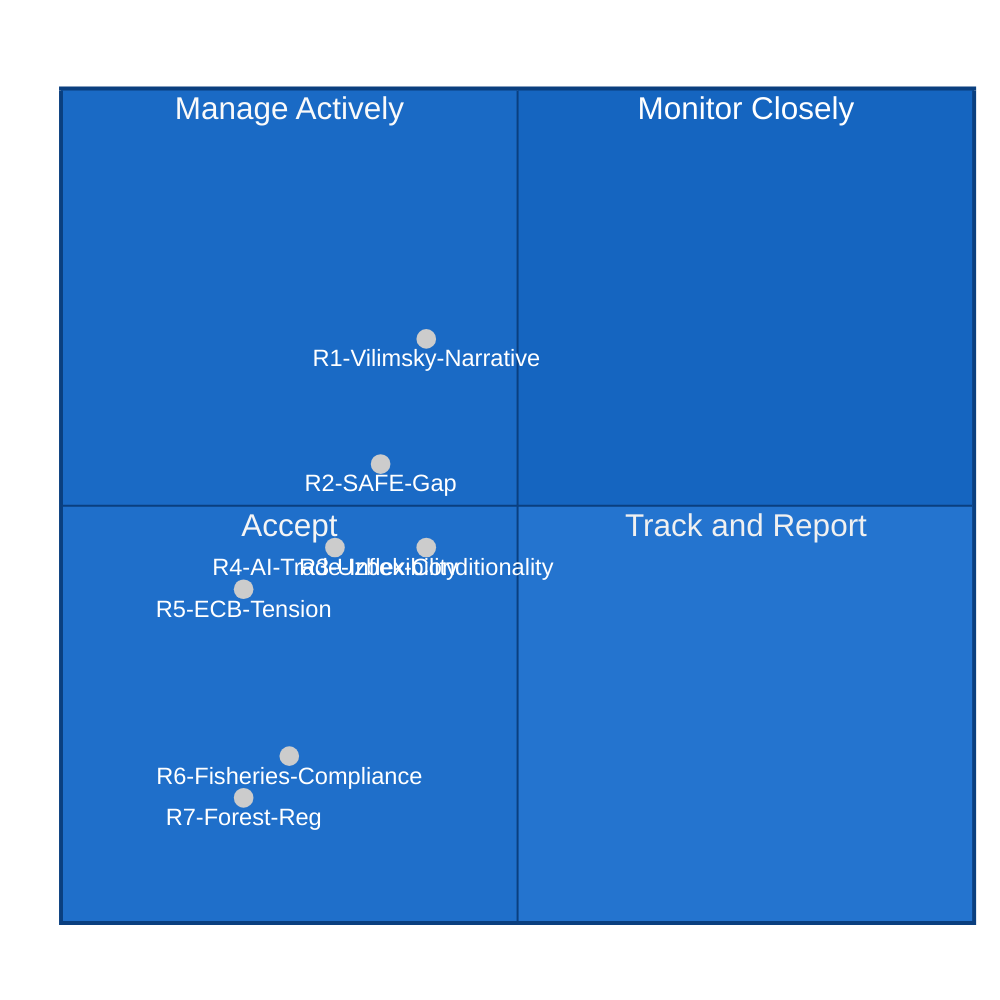

<!-- SPDX-FileCopyrightText: 2026 Hack23 AB -->
<!-- SPDX-License-Identifier: Apache-2.0 -->

# 📊 Risk Matrix — EP Motions May 2026
**Date:** 2026-05-28 | **Article Type:** motions | **Data Mode:** degraded-feeds
**SATs Applied:** Key Assumptions Check, ACH, What-If Analysis

---

## 🎯 Risk Framework

Risk = Likelihood × Impact. The following risks emerge from the May 2026 plenary outputs.

**Key Assumptions Check (SAT):**
- KA-R1: Risks are assessed from the perspective of EU institutional integrity and democratic legitimacy.
- KA-R2: The primary risk landscape is political (narrative, coalition, precedent) not security or legal.
- KA-R3: Risk timeframes are calibrated to 6–18 months given the legislative cycle.

---

## 🔴 High Risks

### R1: Vilimsky Immunity Waiver Creates Precedent for Political Weaponization Narrative

**Likelihood:** 🟡 40% | **Impact:** 🔴 HIGH | **Risk Score:** 🟠 ELEVATED
- Even if the PRIV committee process was legally impeccable, the FPÖ narrative of "political persecution" has the potential to:
  - Weaken EP's rule-of-law credibility in far-right-sympathetic member states
  - Create coalition management challenges for EPP when its domestic partners (FPÖ in Austria) are affected
  - Generate precedent arguments for future immunity waiver opponents

**What-If (SAT):** *If* the Austrian court proceedings against Vilimsky collapse or are politically withdrawn, the EP's decision to lift immunity would be retrospectively questioned — even though the EP's standard is whether proceedings are politically motivated at time of request, not whether conviction ultimately follows.

**ACH:** H1 (Narrative contained by EPP/EP communications): 60%. H2 (Narrative gains traction, creates EPP tension): 35%. H3 (Formal EP institutional challenge): 5%.

### R2: SAFE Instrument — Implementation Gap Between Ratification and Operation

**Likelihood:** 🟡 35% | **Impact:** 🟠 MEDIUM-HIGH | **Risk Score:** 🟡 MEDIUM
- Gap between EP ratification and Commission implementing acts creates a window where expectations are set but delivery is delayed
- Canadian defence industry firms face uncertainty about when they can actually participate in SAFE procurement

---

## 🟠 Medium Risks

### R3: Uzbekistan EPCA Conditionality Gap

**Likelihood:** 🟡 40% | **Impact:** 🟡 MEDIUM | **Risk Score:** 🟡 MEDIUM
- Pattern of EU neighbourhood partnerships: economic benefits flow first, conditionality applied slowly
- Reputational risk if Uzbek human rights benchmarks are not met but EU continues engagement

### R4: AI Trade Resolution Creates Negotiating Inflexibility

**Likelihood:** 🟡 30% | **Impact:** 🟡 MEDIUM | **Risk Score:** 🟡 MEDIUM
- EP resolution creates political record that trade negotiators cannot ignore
- Could limit Commission's flexibility in AI governance compromises with trade partners
- WTO dispute potential if resolutions are interpreted as intentional non-tariff barriers

### R5: ECB Annual Report — Institutional Tension on Monetary Policy

**Likelihood:** 🟢 20% | **Impact:** 🟡 MEDIUM | **Risk Score:** 🟢 LOW-MEDIUM
- TA-10-2026-0034 (ECB Annual Report) represents EP oversight of ECB
- If ECB's 2025 performance on inflation/growth is contested, the EP oversight resolution creates a political record

---

## 🟢 Low Risks

### R6: Fisheries Agreements — Implementation Compliance

**Likelihood:** 🟢 25% | **Impact:** 🟢 LOW | **Risk Score:** 🟢 LOW
- São Tomé and Cook Islands agreements require ongoing compliance monitoring
- Low-probability risk of sustainability protocol violations; low impact given small scale

### R7: Forest Reproductive Material — Regulatory Burden Claims

**Likelihood:** 🟢 20% | **Impact:** 🟢 LOW | **Risk Score:** 🟢 LOW
- ECR/ID may mobilize agricultural lobby opposition to the updated regulation
- Low impact given broad support and technical nature

---

## 📊 Risk Matrix Visualization

---

## 🔄 Risk Register Summary

| Risk | Likelihood | Impact | Score | Owner | Mitigation |
|------|-----------|--------|-------|-------|-----------|
| R1: Vilimsky Narrative | 40% | HIGH | ELEVATED | EP Comms | Proactive counter-messaging |
| R2: SAFE Implementation Gap | 35% | MED-HIGH | MEDIUM | Commission | Clear implementing act timeline |
| R3: Uzbek Conditionality | 40% | MEDIUM | MEDIUM | EEAS | Regular human rights reporting |
| R4: AI Trade Inflexibility | 30% | MEDIUM | MEDIUM | DG TRADE | Non-binding resolution framing |
| R5: ECB Tension | 20% | MEDIUM | LOW-MED | EP ECON | Standard oversight dialogue |
| R6: Fisheries Compliance | 25% | LOW | LOW | DG MARE | Quarterly stock monitoring |
| R7: Forest Reg. Backlash | 20% | LOW | LOW | DG ENV | Agricultural stakeholder comms |

**WEP Band Summary** — Worded Estimative Probability calibration for key risks:

| WEP Term | Probability Range | Applied Risks |
|----------|-----------------|--------------|
| Remote | <10% | — |
| Unlikely | 10–20% | R5, R7 |
| Roughly even | 30–45% | R2, R3, R4, R6 |
| Likely | 45–60% | R1 |
| Highly Likely | 61–85% | — |
| Almost Certain | >85% | — |

**Admiralty Source & Information Grading:**

| Source | Admiralty Source | Admiralty Information |
|--------|-----------------|----------------------|
| EP Adopted Texts API | A (Completely reliable) | 2 (Probably true) |
| EP MEPs Feed | A (Completely reliable) | 2 (Probably true) |
| DOCEO voting XML | — | NOT AVAILABLE (lag) |
| Analytical inference | C (Fairly reliable) | 3 (Possibly true) |
| Historical base rates | B (Usually reliable) | 2 (Probably true) |

**Overall Admiralty Grade for this risk assessment: B2** (Usually reliable source, probably true information) — constrained by DOCEO lag.

---

*WEP bands: likelihoods expressed as percentage probabilities. Impact assessed on ordinal scale: LOW/MEDIUM/HIGH/VERY HIGH.*
*SATs applied: Key Assumptions Check, ACH (for R1), What-If Analysis (for R1, R4).*
