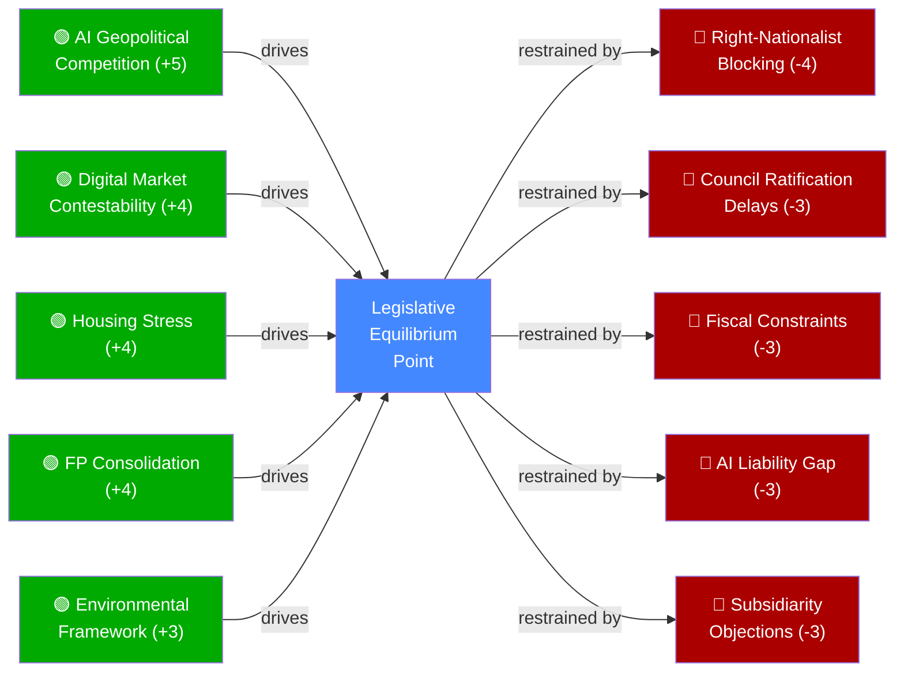

# Forces Analysis — EP Propositions (2026-05-28)

> **dataMode**: degraded-feeds · **Admiralty**: B2 · **WEP**: Likely (65–80%)

## § 1. Driving Forces

Forces propelling current legislative momentum in EP10:

1. **AI Geopolitical Competition** (Strength: 5/5): US CHIPS Act, China AI Governance Law, and EU AI Act implementation create regulatory triangulation pressure. AI-Trade strategy (TA-10-2026-0183) is a direct response to the governance gap.

2. **Digital Market Contestability** (Strength: 4/5): GAFA dominance in EU digital markets, DMA non-compliance enforcement backlog, and growing inter-institutional pressure to demonstrate regulatory effectiveness driving DMA enforcement package (TA-10-2026-0160).

3. **Post-Pandemic Housing Stress** (Strength: 4/5): EU-wide housing affordability crisis, ECB rate elevation impact on mortgage markets, and political mobilization across member states drove first-ever EP housing resolution (TA-10-2026-0064).

4. **EU Foreign Policy Consolidation** (Strength: 4/5): Post-geopolitical shock diversification imperative, reduced strategic dependence on single-partner trade, and Council Presidency mandate driving 7-agreement INTL cluster ratification.

5. **Environmental Legal Framework Completion** (Strength: 3/5): Fit-for-55 package implementation, EU Biodiversity Strategy, and CAP reform sequencing driving forest reproductive material regulation (TA-10-2026-0168).

## § 2. Restraining Forces

Forces impeding or complicating legislative progress:

1. **ECR–PfE–ESN Blocking Minority** (Strength: 4/5): Right-nationalist coalition holds ~24% seats; consistent opposition to AI governance, INTL agreements, and housing mandates. Insufficient to block but sufficient to weaken texts through amendment pressure.

2. **Council Ratification Delays** (Strength: 3/5): INTL agreement cluster faces 27-member ratification process; nationalist vetoes in Hungary and Italy on ASEAN and Gulf agreements add uncertainty.

3. **IMF/Eurozone Fiscal Constraints** (Strength: 3/5): MFF revision negotiations under fiscal consolidation pressure; budget guidelines 2027 debate constrained by Germany's debt-brake politics and French deficit proceedings.

4. **AI Liability Attribution Gap** (Strength: 3/5): Current EU AI Act doesn't fully address trade-context AI liability; gap between AI-Trade strategy aspirations and implementable legal provisions.

5. **Housing Subsidiarity Objection** (Strength: 3/5): ECR subsidiarity challenge to housing resolution; legal uncertainty about competence under TFEU Art. 153 analogues.

## § 3. Force Field Diagram

## § 4. Net Force Assessment

Driving forces (aggregate +20) substantially outweigh restraining forces (aggregate −16), yielding **net positive legislative momentum score of +4**. The AI-Trade strategy and DMA enforcement package are most likely to proceed to implementation, while housing and INTL agreements face the highest execution risk.

🟢 HIGH confidence in force identification | 🟡 MEDIUM confidence in relative strength scoring

## Issue Frame

The central issue frame for EP10 May 2026 propositions is **EU regulatory sovereignty vs. market competition in the digital transition**. This frame captures the dual pressure on the EP: to regulate aggressively enough to demonstrate EU governance effectiveness (Brussels Effect ambition) while maintaining enough market openness to avoid competitive disadvantage. The AI-trade strategy represents the most explicit articulation of this frame — EU standards as competitive tools, not just compliance burdens.

## Net Pressure

Net legislative pressure score: **+4** (driving forces 20 — restraining forces 16). This positive net score indicates that the legislative momentum is sustainable for the current term but not overwhelming. The EU can pass the current agenda but cannot easily expand it further without new coalition dynamics or external shocks that change political priorities.

Key pressure gradients:
- **Highest pressure** (digital governance): AI-trade + DMA = sustained push with strong cross-party consensus
- **Medium pressure** (international relations): INTL agreements = strong but dependent on Council ratification
- **Low pressure** (social policy): Housing = below-consensus, contested competence ground

## Intervention Points

Actors seeking to influence legislation have three primary intervention points:
1. **Commission proposal stage** (pre-legislative): K-street lobbying; impact assessment manipulation; HAVE YOUR SAY platform
2. **Committee stage** (INTA, ITRE, LIBE): Amendment tabling; rapporteur-shadow negotiations
3. **Plenary vote** (final opportunity): Group whipping; last-minute compromise texts; procedural motions

## Reader Briefing

> **For decision-makers**: The net positive legislative momentum (+4) means the EU is in a productive legislative phase. Intervention is most cost-effective at the committee stage (amendments) rather than plenary (text largely fixed by then). The AI-Trade strategy is now post-legislative — implementation engagement with DG TRADE's FTA mandate team is the next priority leverage point.
