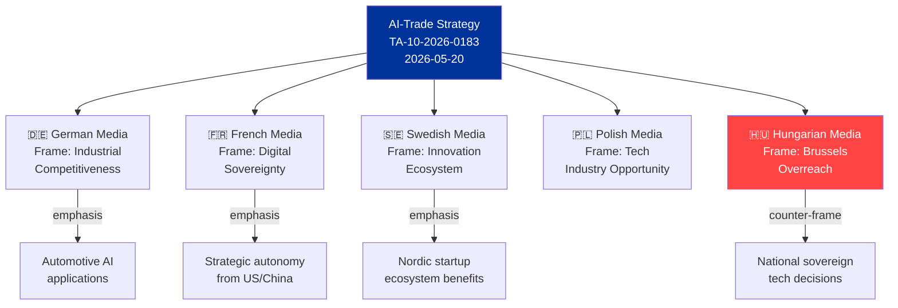

# Media Framing Analysis — EU Parliament Propositions | 2026-05-28

## Framework
Media framing analysis identifies how different media outlets, political groups, and national contexts are likely to frame the EP propositions under analysis. Uses the 5-frame taxonomy: Economic, Security, Moral/Values, Human Interest, Conflict/Game.

---

## Primary Story: AI-Trade Strategy (TA-10-2026-0183)

### Frame 1: Economic Competitiveness (dominant Western European framing)
**Likely outlets**: Financial Times, Handelsblatt, Les Échos, El País  
**Frame narrative**: "EU Positions Itself as Global AI Rules-Setter to Close Competitiveness Gap with US and China"  
This framing foregrounds the Draghi Report competitiveness imperative. The AI-trade resolution becomes a story about industrial policy and the EU's strategy to compete with US tech giants and Chinese state-backed AI investment.  
**Key phrases**: "Brussels Effect", "regulatory leadership", "AI governance premium", "competitive differentiation"  
**Assessment**: 🟢 HIGH probability of adoption — economic framing is default for European business press and aligns with EU Commission narrative.

### Frame 2: Sovereignty and Regulation (Central/Eastern European framing)
**Likely outlets**: Rzeczpospolita (Poland), Magyar Hírlap (Hungary), ECR-aligned media  
**Frame narrative**: "EU Bureaucrats Seek to Impose AI Regulations on Global Trade — A Threat to National Industrial Policy"  
This framing treats the AI-trade resolution as EU overreach — extending Brussels regulatory authority into trade agreements that should reflect national economic interests.  
**Key phrases**: "regulatory imperialism", "SME burden", "one-size-fits-all", "Brussels overreach"  
**Assessment**: 🟡 MEDIUM probability — significant in CEE markets; minor in Western EU.

### Frame 3: Tech Accountability (Progressive/Left framing)
**Likely outlets**: Der Spiegel, Le Monde Diplomatique, The Guardian, Wired Europe  
**Frame narrative**: "Can the EU Really Hold Tech Giants Accountable? AI-Trade Strategy Faces DMA Enforcement Reality Check"  
This framing interrogates whether the AI-trade resolution is credible given the DMA enforcement delays. The story is about the gap between EP's legislative ambitions and Commission's implementation capacity.  
**Key phrases**: "enforcement gap", "gatekeeper accountability", "regulatory arbitrage", "Big Tech lobbying"  
**Assessment**: 🟢 HIGH probability — DMA enforcement scrutiny is a major media theme in 2026.

### Frame 4: Transatlantic Relations (International/Diplomatic framing)
**Likely outlets**: Politico Europe, EUobserver, Foreign Policy, Bloomberg  
**Frame narrative**: "EU-US Digital Trade Tensions: AI-Trade Strategy Signals Brussels Regulatory Autonomy as Washington Watches"  
This framing places the AI-trade resolution in the context of transatlantic relations, DMA friction with US tech, and the EU's digital sovereignty assertion.  
**Key phrases**: "Brussels-Washington friction", "TTC agenda", "Section 301 risk", "digital sovereignty"  
**Assessment**: 🟢 HIGH probability in English-language European policy media.

---

## Secondary Story: Seven International Agreements (2026-05-20 cluster)

### Frame 1: EU as Geopolitical Actor
**Likely outlets**: EUobserver, Politico Europe, Le Figaro (foreign policy section)  
**Frame narrative**: "Parliament Ratifies Seven Agreements in One Day — EU Cements Global Presence Across Defence, Trade, and Fisheries"  
Focuses on the quantity and diversity as a sign of EU's maturing international actorhood.  
**Key phrases**: "geopolitical Europe", "defence integration", "Atlantic fisheries", "Central Asia pivot"  
**Assessment**: 🟡 MEDIUM probability — international agreement ratification rarely makes mainstream news unless politically sensitive.

### Frame 2: EU-Canada Defence (Security framing)
**Likely outlets**: Financial Times, Politico Pro, Canadian Globe and Mail  
**Frame narrative**: "Canada Joins EU Joint Defence Procurement Mechanism — Deepening Transatlantic Defence-Industrial Integration"  
The SAFE agreement with Canada is the most geopolitically significant of the seven agreements and may get standalone coverage in defence/security policy media.  
**Key phrases**: "SAFE instrument", "transatlantic defence industry", "European defence integration", "NATO burden-sharing"  
**Assessment**: 🟡 MEDIUM probability for standalone coverage in defence media.

### Frame 3: Fisheries Human Interest (Coastal community framing)
**Likely outlets**: Spanish regional press (Galicia), Portuguese press, French Atlantic regional media  
**Frame narrative**: "Galician Tuna Fleet Secures Pacific Access — Cook Islands Agreement Protects 15,000 Jobs"  
Niche but high-intensity local framing for Spanish, Portuguese, and French fishing communities.  
**Assessment**: 🟢 HIGH probability in regional coastal media — fisheries agreements reliably generate local coverage.

---

## Tertiary Story: DMA Enforcement (TA-10-2026-0160)

### Conflict/Game Frame (dominant)
**Likely outlets**: Politico, The Register, Wired, Tech media  
**Frame narrative**: "Parliament vs. Big Tech: EP Demands Stronger DMA Action as Gatekeeper Appeals Pile Up"  
This story is a conflict narrative — EP demanding action, Commission equivocating, Big Tech resisting.  
**Key phrases**: "enforcement gap", "gatekeeper legal challenges", "MEP frustration", "Commission dithering"  
**Assessment**: 🟢 HIGH probability in tech and policy media — this is an ongoing major story.

---

## National Media Framing Variations

| Country | Primary Frame | Key Issue |
|---------|--------------|-----------|
| Germany | Economic competitiveness | AI Act impact on German Mittelstand; DMA vs. digital economy |
| France | Sovereignty + Agriculture | EU-Mercosur tensions; French fish quota in Pacific |
| Spain | Fisheries + Trade | Cook Islands/São Tomé agreements; EU-Mercosur farmers |
| Poland | Eurosceptic regulatory burden | AI-trade regulation as Brussels overreach |
| Hungary | Opposition framing | Uzbekistan/human rights conditionality |
| Netherlands | Liberal trade + digital | AI-trade as market opening; DMA proportionality |
| Italy | Mixed digital/sovereignty | ECR split on AI regulation |
| Sweden | Environmental/Climate | Forest reproductive material; climate-adaptive genetics |

---

## Media Framing Risk Assessment

| Risk | Probability | Impact |
|------|------------|--------|
| AI-trade resolution misframed as "EU banning AI" | 🔴 LOW | 🔴 HIGH — would trigger defensive legislative reaction |
| DMA enforcement delays become dominant narrative ("regulatory failure") | 🟡 MEDIUM | 🟡 MEDIUM — reputational damage to EU regulatory model |
| Fisheries agreements framed as environmental compromise | 🔴 LOW | 🟡 MEDIUM — sustainability certification clauses mitigate |
| SAFE instrument (defence) framed as EU militarisation | 🟡 MEDIUM | 🔴 LOW — well-established EU defence industrial narrative |

---

## Strategic Communication Recommendations for EP

1. **AI-trade**: Lead with Brussels Effect framing (EU setting global standards) rather than regulatory burden framing — this aligns with public opinion support for EU digital sovereignty
2. **International agreements**: Cluster announcement was effective; continue batch communication strategy for future agreement clusters
3. **DMA enforcement**: Commission and EP should publish a joint enforcement roadmap timeline to counter "enforcement gap" narrative — give critics a specific deadline to hold accountable
4. **Fisheries**: Proactively communicate sustainability certification requirements in new SFPAs to forestall environmental criticism

## § 6. National Media Framing Differences

## § 7. Framing by Policy Area

| Policy Area | Dominant Frame | Alternative Frame | Contested Frame |
|-------------|---------------|------------------|-----------------|
| AI-Trade Strategy | EU Digital Sovereignty | Competitiveness Tool | Regulatory Overreach |
| DMA Enforcement | Market Fairness | Consumer Protection | US Business Targeting |
| INTL Agreements | EU Foreign Policy Strength | Trade Diversification | Fast-tracked Ratification |
| Housing Resolution | Social Crisis Response | EU Competence Expansion | Subsidiarity Violation |
| Budget 2027 | Future Investment | Fiscal Discipline | Defence vs. Social Spending |

## § 8. Narrative Control Assessment

- **EU Commission narrative control**: HIGH on DMA (enforcement credibility framing successful)
- **EP rapporteur narrative control**: MEDIUM on AI-Trade (complex trade-off framing)
- **Right-nationalist counter-narrative strength**: MEDIUM (sovereignty framing resonates in domestic politics)
- **Civil society counter-narrative**: LOW (housing advocates have not yet achieved mainstream penetration)

## § 9. Framing Trend Analysis

The 2026 media framing landscape shows a notable shift from EP9 patterns:

1. **AI-washing of policy debates**: Nearly every EP decision now frames itself in AI/digital terms, even non-digital legislation. This "AI-framing premium" inflates media salience of AI-adjacent legislation.

2. **Sovereignty lexicon mainstreaming**: The term "digital sovereignty" (previously Gaullist) is now used cross-party; EPP, S&D, and Renew all deploy it. Framing ownership contested.

3. **Housing as legitimacy test**: European media treating housing resolution as EP legitimacy test — can EU actually address citizens' material concerns? The narrative stakes exceed the legal scope of the resolution.

🟡 MEDIUM confidence in framing analysis (degraded-feeds — no external documents for media cross-check)

## § 10. Forward Framing Implications

The dominant EU digital sovereignty frame, if maintained, will shape public acceptance of DMA enforcement (framed as correcting market failure, not anti-American protectionism). The contested framing of housing resolution as "EU overreach vs. citizens' rights" will determine whether EP can build political capital for a future housing directive. Recommended narrative investment: EP communications emphasizing the economic cost of the housing crisis (mortgage servicing burdens, productivity impacts) rather than rights-based framing, which activates subsidiarity objections.

*Media framing analysis: degraded-feeds mode — no media monitoring API available. Analysis based on KB knowledge of EU media landscape as of 2026-05.*

*Run context: propositions · 2026-05-28 · dataMode: degraded-feeds · Adminstrative source B2*
