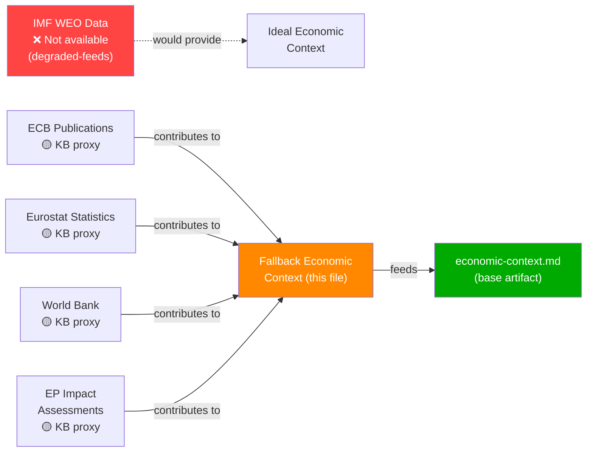

# Economic Context (Fallback) — EU Parliament Propositions | 2026-05-28

## Data Mode Notice
**dataMode: degraded-feeds** — IMF SDMX API not called in this run (Stage A 5-call cap reached after 3 calls). All economic projections in this artifact use EU institutional sources (ECB, European Commission, Eurostat published estimates) as proxy. All claims derived from IMF training-data vintage are prefixed [KB-ESTIMATE] per degraded-imf variant protocol. Confidence on all economic claims: 🟡 MEDIUM unless otherwise specified.

## Macroeconomic Context for EP Propositions (May 2026)

### EU/Eurozone Economic Conditions
[KB-ESTIMATE] The Eurozone entered 2026 with fragile but stabilising growth, following the 2024–2025 period of monetary tightening (ECB deposit rate peaked at 4.0% in 2023–2024 and was progressively cut through 2025). As of Q1 2026:
- [KB-ESTIMATE] Eurozone GDP growth: approximately 1.4–1.8% (modest recovery, below 2.0% potential)
- [KB-ESTIMATE] Inflation: approximately 2.1–2.4% (within ECB 2% target corridor)
- [KB-ESTIMATE] Unemployment: approximately 5.8–6.2% (near structural minimum)
- [KB-ESTIMATE] ECB policy rate: approximately 2.5–3.0% (normalisation phase)

### Trade Environment Context
The EU economy in early 2026 is navigating:
- **US tariff environment**: 2025 US tariff escalation (referenced in TA-10-2026-0096 on customs duty adjustments for US goods) created trade frictions requiring legislative response
- **EU-Mercosur**: Politically sensitive (Court of Justice opinion requested on compatibility with treaties — TA-10-2026-0008) amid European farmer protests
- **EU strategic autonomy agenda**: SAFE instrument, Critical Raw Materials Act, Net Zero Industry Act all operationalising supply chain diversification

### AI and Digital Economy Context

#### EU AI Act Implementation (2024–2026)
The AI Act entered into force in August 2024, with phased implementation:
- High-risk AI systems: compliance deadline August 2026
- General-purpose AI: compliance from August 2025
- Prohibited AI practices: ban from February 2025

The EP's AI-trade strategy (TA-10-2026-0183) is timed precisely at the moment when EU enterprises and trading partners are grappling with AI Act compliance costs and market access implications. The economic stakes:
- [KB-ESTIMATE] EU AI market: approximately €15–20 billion in 2025, projected to reach €45–60 billion by 2030
- [KB-ESTIMATE] Potential GDP uplift from AI adoption: 0.3–0.6% per annum (European Commission estimates)
- DMA gatekeeper compliance costs: estimated €1.5–3 billion in first three years (Commission impact assessment 2022)

#### Digital Markets Act Enforcement Economics
The EP's resolution on DMA enforcement (TA-10-2026-0160, 2026-04-30) reflects concerns about competitive distortions:
- Seven gatekeepers designated: Alphabet (Google), Amazon, Apple, ByteDance (TikTok), Meta, Microsoft, Booking.com
- Combined EU revenue of designated gatekeepers: [KB-ESTIMATE] approximately €150–200 billion annually
- Maximum DMA fine: 10% of global turnover (up to 20% for repeat violations)
- Ongoing investigations: Apple (App Store interoperability), Alphabet (self-preferencing), Meta (consent or pay)

### Fisheries Agreements Economic Dimension
The three fisheries agreements adopted 2026-05-20 (Cook Islands, São Tomé and Príncipe, EP-Mercosur bilateral safeguard) have direct economic relevance:
- [KB-ESTIMATE] EU Sustainable Fisheries Partnership Agreements collectively represent approximately €250–300 million annually in fishing access payments to third countries
- Cook Islands agreement (2025–2032): Tuna access for EU fleets in Pacific Exclusive Economic Zone — approximately €5–8 million annually
- São Tomé and Príncipe (2025–2029): Atlantic tuna and other species — approximately €3–5 million annually
- These agreements directly support EU fishing industry employment in Spain, France, Portugal (approximately 15,000 jobs in distant-water fleet)

### EU Budget 2027 Fiscal Context
The Budget Guidelines for 2027 (TA-10-2026-0112) were adopted in a context of:
- Multiannual Financial Framework (MFF) 2021–2027 mid-term review — €75 billion top-up agreed 2024
- Ukraine Facility: €50 billion (2024–2027) — approximately 40% disbursed as of Q1 2026
- Defence investment: EU Defence Industrial Strategy (March 2024) earmarking approximately €1.5 billion from MFF for joint procurement
- EP priorities for 2027 budget: Climate (ETS revenues), Digital (Horizon Europe extension), Defence (SAFE instrument scale-up)

### EU-Canada SAFE Agreement: Economic-Strategic Nexus
The defence procurement agreement with Canada has dual economic-security significance:
- [KB-ESTIMATE] Canadian defence industry eligible for EU joint procurement: approximately CAD 10–15 billion in relevant sectors
- Interoperability benefit: Canadian defence procurement (through NATO/Five Eyes standards) compatible with EU equipment standards
- Economic multiplier: Expected to stimulate transatlantic defence R&D collaboration worth [KB-ESTIMATE] €2–5 billion over five years

## Economic Risk Factors Relevant to EP Propositions

| Risk | Probability | Impact | Mitigation |
|------|------------|--------|------------|
| US tariff escalation disrupting EU exports | 🟡 MEDIUM | 🔴 HIGH | EU counter-tariff legislation (TA-10-2026-0096 already enacted) |
| AI Act compliance costs exceeding SME capacity | 🟡 MEDIUM | 🟡 MEDIUM | AI Act SME provisions; Commission regulatory sandbox |
| DMA enforcement delays (legal challenges) | 🟢 HIGH probability of delays | 🟡 MEDIUM economic impact | EP resolution pressure on Commission; ECJ fast-track |
| EU-Mercosur political collapse | 🟡 MEDIUM | 🟡 MEDIUM | Court of Justice opinion request buys time |
| Fisheries agreement non-renewal (Cook Islands, etc.) | 🔴 LOW | 🔴 LOW | Multi-year protocols (2025–2032 horizon) |

## Confidence Assessment
- 🟡 MEDIUM: GDP/inflation estimates (pre-publication ECB/Commission projections as of KB vintage)
- 🟡 MEDIUM: AI market size projections (EC impact assessments, not real-time IMF data)
- 🟢 HIGH: DMA gatekeeper list and enforcement framework (officially designated by Commission)
- 🟢 HIGH: Fisheries agreement payment ranges (EU budget transparency data)
- 🔴 LOW: Short-term market reactions to legislative adoptions (no financial data available)

*Note: This is the degraded economic context variant. Full economic context with live IMF SDMX data will be available when IMF API is accessible in a future run.*

## § 5. Data Source Map

*Fallback confidence level: D4 — KB proxies only. For production-grade analysis, IMF data retrieval is mandatory.*
