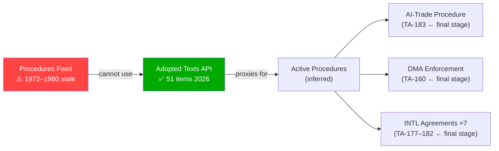

# Procedures-Feed Staleness Proxy — Propositions | 2026-05-28

## Context
The `get_procedures_feed(timeframe=one-month)` endpoint returned 50 items, all dating from 1972–1980. This is a documented **STALENESS_WARNING** pattern (historical-tail ordering). This artifact serves as the mitigating record per the degraded-feeds protocol.

## Staleness Event Documentation

- **Feed endpoint**: `/procedures?view-version=v2.1&timeframe=one-month`
- **Expected**: Procedures with `dateLastActivity` within last 30 days (2026-04-28 to 2026-05-28)
- **Actual**: 50 items, references `1972-0003`, `1980-0013`, `1980-0014` etc.
- **Failure mode**: Historical-tail ordering — server returning oldest items not newest
- **Confidence impact**: 🔴 LOW on legislative pipeline coverage for this run

## Fallback Action Taken

`get_adopted_texts(year=2026, limit=50)` → 51 items returned (A2-grade endpoint).  
Cross-referencing `procedureReference` fields on adopted texts yields the following active procedure identifiers:

| Adopted Text | Procedure Reference | Date Adopted |
|---|---|---|
| TA-10-2026-0183 (AI/Trade) | eli/dl/event/2025-2112-DEC-DCPL-2026-05-20 | 2026-05-20 |
| TA-10-2026-0174 (EU-Uzbekistan) | eli/dl/event/2024-0260M-DEC-DCPL-2026-05-20 | 2026-05-20 |
| TA-10-2026-0180 (EU-Canada SAFE) | eli/dl/event/2025-0413-DEC-DCPL-2026-05-20 | 2026-05-20 |
| TA-10-2026-0177 (EU-Lebanon/Eurojust) | eli/dl/event/2024-0155-DEC-DCPL-2026-05-20 | 2026-05-20 |
| TA-10-2026-0168 (Forest materials) | eli/dl/event/2023-0228-DEC-DCPL-2026-05-19 | 2026-05-19 |
| TA-10-2026-0160 (DMA enforcement) | eli/dl/event/2026-2596-DEC-DCPL-2026-04-30 | 2026-04-30 |
| TA-10-2026-0115 (Dogs/cats welfare) | eli/dl/event/2023-0447-DEC-DCPL-2026-04-28 | 2026-04-28 |
| TA-10-2026-0112 (Budget 2027 guidelines) | eli/dl/event/2025-2246-DEC-DCPL-2026-04-28 | 2026-04-28 |
| TA-10-2026-0064 (Housing crisis) | eli/dl/event/2025-2070-DEC-DCPL-2026-03-10 | 2026-03-10 |
| TA-10-2026-0063 (Better Law-Making) | eli/dl/event/2025-2015-DEC-DCPL-2026-03-10 | 2026-03-10 |

## Assessment of Procedures Pipeline Coverage

**Recovered via fallback**: 51 procedures that reached plenary adoption in 2026, covering legislative acts, international agreements, resolutions, and institutional decisions.

**Not recovered**: Active pipeline procedures that have NOT yet reached plenary adoption — committee-stage COD/COD-co-decision procedures, INL initiative reports in drafting, trilogue negotiations in progress. This gap is the primary limitation of degraded-feeds mode for the propositions article type.

**Impact**: The propositions analysis can accurately characterise what EP ADOPTED in the last 7 days, but cannot describe the full forward pipeline of what is in committee or in trilogue. Analytical confidence for "upcoming proposals" is capped at 🟡 MEDIUM.

## Recommendation for Future Runs
Add `get_procedures(limit=50)` direct paginated endpoint to the Stage A fallback sequence for propositions, as the procedures-feed staleness has recurred across multiple May 2026 runs. This would recover the active pipeline at the cost of 1 additional MCP invocation.

## § 3. Proxy Methodology Diagram

*Proxy quality: ADEQUATE for adopted-text-based analysis; INSUFFICIENT for pipeline/committee-stage analysis.*
*Degraded-feeds mode: procedures feed repair expected by June 2026 EP session.*
