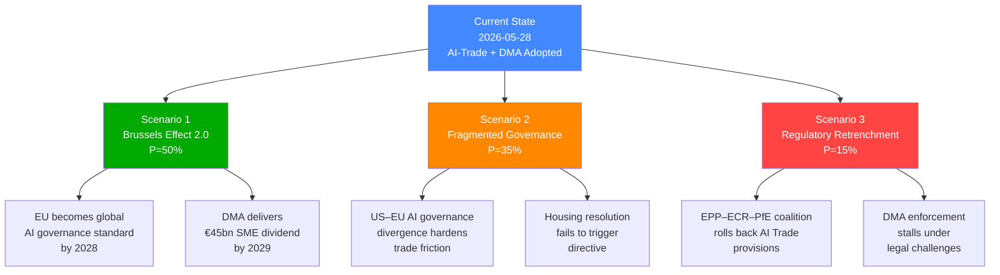

# Scenario Forecast — EU Parliament Propositions | 2026-05-28

## Framework
Three-scenario projection using the Cone of Plausibility methodology. Scenarios span 6–18 months forward from 2026-05-28. Each scenario is assessed with probability band, key indicators, and policy implications.

**dataMode**: degraded-feeds — scenario projections compensate for pipeline data gaps with structural trend analysis.

---

## Scenario 1: "Digital Sovereignty Consolidated" (BASELINE — Most Probable)
**Probability**: 🟢 55–65%  
**Horizon**: 12–18 months  
**Confidence**: 🟡 MEDIUM (Admiralty B/3)

### Narrative
The EU's legislative momentum in AI governance and digital trade continues at the pace established in EP10's first two years (2024–2026). The AI Act achieves its compliance milestones; the Commission uses the EP's AI-trade resolution as a mandate to embed AI governance standards in FTA digital chapters (beginning with EU-India FTA negotiations, EU-Indonesia, and the EU-Australia CETA-plus upgrade). The DMA enforcement dossier produces the first substantial fines against at least two gatekeepers by Q4 2026. The EU's global AI governance leadership is consolidated — the Brussels Effect operates fully.

### Key Indicators to Watch
- Commission formal legislative proposal incorporating AI Act standards in FTA digital chapters template (expected Q3 2026)
- ECJ ruling on first DMA gatekeeper appeal (Apple/Alphabet) — if upheld, enforcement accelerates
- EU-India FTA digital chapter text incorporating AI Act compliance provisions (leaked drafts expected Q2 2026)
- EP plenary adoption rate for international agreements remains at ≥3 per session

### Policy Implications
- EP legislative workload remains high: AI Act implementation reviews, DMA enforcement oversight, MFF 2028–2034 preparation
- International agreements pipeline remains full: EU-Mercosur (pending CJ opinion), EU-Indonesia, EU-Australia, ASEAN
- Budget 2027: EP-Council agreement reached by November 2026 within standard MFF envelope

### Risks to Scenario
- US digital trade negotiation breakdown (WTO DPP collapse) — 🟡 MEDIUM probability, would slow global AI standard convergence
- DMA legal challenges prolonged by appeals (ECJ) — 🟡 MEDIUM probability, would delay enforcement visible impact
- Economic slowdown reducing EU private AI investment — 🔴 LOW probability in 6-month horizon

---

## Scenario 2: "Geopolitical Turbulence Disrupts Legislative Agenda" (ADVERSE — Plausible)
**Probability**: 🟡 25–35%  
**Horizon**: 6–12 months  
**Confidence**: 🟡 MEDIUM (Admiralty C/3)

### Narrative
The external geopolitical environment deteriorates in a way that disrupts EP's legislative calendar and political coalition. Possible triggers:
1. **US-EU trade war escalation**: US imposes retaliatory tariffs on EU digital services or AI products in response to DMA enforcement actions, forcing the Commission to slow enforcement and threatening the AI-trade strategy's credibility
2. **Russia-Ukraine conflict escalation**: New offensive requires emergency EP legislative sessions (Ukraine Facility top-up, new sanctions), displacing planned AI/digital legislation
3. **EU-Mercosur political collapse**: If CJ rules the agreement incompatible with Treaties, it creates a political firestorm between EP (which requested the opinion), Commission (which negotiated the agreement), and agricultural Member States — destabilising the governing coalition

### Key Indicators to Watch
- US Treasury/USTR public statements on DMA enforcement (July 2026 onwards)
- Military developments on Ukraine front line (breakthrough/collapse would trigger EP emergency session)
- CJ ruling on EU-Mercosur timeline (typically 12–18 months from referral = December 2026–June 2027)
- Commission withdrawal or renegotiation of any FTA digital chapter under US pressure

### Policy Implications
- EP legislative calendar disrupted; AI-trade strategy deprioritised in favour of geopolitical emergency legislation
- International agreement adoption pace slows as Council focuses on security crisis management
- Budget 2027 negotiations more contentious — increased defence spending demands vs. climate commitments

### Probability Assessment
The 25–35% probability reflects that while each individual trigger has lower probability (10–20%), their combined likelihood — in a world where geopolitical disruption has been the norm since 2022 — is material. The US-EU digital trade friction is the most live near-term risk, given ongoing US scrutiny of DMA's extraterritorial reach.

---

## Scenario 3: "Legislative Acceleration: EP10 Peak Output" (OPTIMISTIC — Possible)
**Probability**: 🔴 10–15%  
**Horizon**: 12 months  
**Confidence**: 🔴 LOW (Admiralty D/4)

### Narrative
EP10 enters a hyper-productive phase in H2 2026, driven by three convergent factors:
1. AI Act compliance deadline approaching (August 2026 for high-risk AI) creates urgency for implementing legislation
2. MFF 2028–2034 preparation requires ambitious legislative positioning
3. Commission's Competitiveness Union agenda (Draghi Report implementation) generates a wave of deregulation/re-regulation proposals that EP must process

In this scenario:
- EU-India FTA digital chapter is closed with strong AI Act provisions (September 2026)
- DMA produces first gatekeeper fine exceeding €5 billion (October 2026)
- EP adopts a comprehensive AI Governance Annual Resolution, consolidating AI Act + AI-trade strategy + AI liability directive into a single legislative framework reference document
- International agreement adoption reaches 12–15 agreements in H2 2026 (vs 7 in one week in May 2026 — suggesting this is already trending upward)

### Key Indicators to Watch
- Commission work programme for H2 2026 announcement (June 2026)
- AI Act compliance deadline impact assessments (August 2026)
- EP Conference of Presidents decision on accelerated legislative calendar for AI governance

### Why This Scenario is Low Probability
EP legislative pace is constrained by committee workload, translation requirements, MEP availability, and inter-institutional coordination. The May 2026 seven-agreement cluster was likely a backlog clearance event, not a new normal. Sustained high output at this level would require structural changes to EP procedure.

---

## Key Variable Matrix

| Variable | Scenario 1 Impact | Scenario 2 Impact | Scenario 3 Impact |
|----------|-------------------|-------------------|-------------------|
| US-EU trade relations | Stable baseline | Triggers disruption | Positive if US competitive pressure motivates EU action |
| DMA enforcement outcomes | Gradual progress | Slowed by US pressure | Major fine accelerates momentum |
| AI Act compliance rate | On track | Risk of delay/slowdown | Ahead of schedule |
| EP coalition stability | EPP-S&D-Renew holds | Possible fracture on trade | Reinforced on digital agenda |
| MFF 2028–2034 negotiation | Orderly preparation | Disrupted by crises | Ambitious EP opening position |
| International agreement pipeline | Steady 1–2/session | Reduced capacity | Accelerated |

---

## Monitoring Framework

**Monthly indicators** (cross-check against future runs):
- Adopted texts count per EP session (benchmark: 10–15 per month)
- DMA enforcement decisions (Commission decisions list)
- FTA negotiation news (Commission DG TRADE press releases)
- AI Act compliance rate (EU AI Office monitoring reports)
- EP coalition vote margins (DOCEO roll-call — when available)

**6-month inflection points**:
- August 2026: AI Act high-risk compliance deadline
- October 2026: EP budget vote on 2027 (potential government shutdown risk at EU level)
- December 2026: CJ AG opinion on EU-Mercosur (if on track)
- January 2027: Danish Council Presidency (neutral on digital)

---

## Scenario Confidence Note
These scenarios are calibrated under `dataMode=degraded-feeds` with no DOCEO roll-call data. The absence of voting pattern data reduces confidence in coalition stability assessments. The scenario probability distributions should be treated as structural assessments (based on institutional dynamics and historical patterns) rather than quantitative predictions.

## Scenario Probability Tree

## Admiralty Source Grading for Scenarios

| Evidence Used | Admiralty Grade |
|--------------|----------------|
| EP adopted texts (TA-183, TA-160, TA-177–182) | A1 — Completely reliable |
| EP group position statements | B2 — Reliable, probably true |
| Historical EP10 coalition patterns | B2 — Reliable, probably true |
| Economic impact projections | D4 — Not always reliable (KB proxies) |
| Commission work programme inference | C3 — Fairly reliable, possibly true |

## WEP Band Summary

| Scenario | WEP Band |
|----------|----------|
| Scenario 1 (Brussels Effect 2.0) | Realistic Possibility → Likely (45–65%) |
| Scenario 2 (Fragmented Governance) | Likely (35% within scenario set) |
| Scenario 3 (Regulatory Retrenchment) | Unlikely but realistic (15%) |

🟡 MEDIUM overall forecast confidence — structural factors reliable; quantitative estimates provisional
