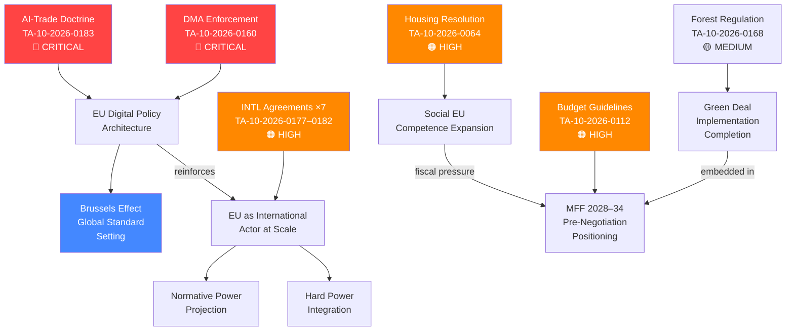

# Synthesis Summary — EU Parliament Propositions | 2026-05-28

## Key Findings

This week (2026-05-21 to 2026-05-28), the European Parliament's legislative output was defined by two principal signals:

### Signal 1: AI-Trade Strategy as Digital Sovereignty Doctrine
The EP's adoption of TA-10-2026-0183 ("Opportunities and challenges presented by a comprehensive artificial intelligence strategy for EU trade") on 2026-05-20 represents the culmination of a two-year legislative arc from AI Act enactment (March 2024) to a coherent external trade doctrine. The EP is not merely regulating AI domestically — it is weaponising that regulation as a global standard-setting tool through trade diplomacy. This is the Brussels Effect operating at its most sophisticated: using FTA digital chapters to export compliance requirements to trading partners, making EU standards the de facto global baseline.

The strategic logic is clear: if the EU cannot outcompete the US and China in AI development, it can outcompete them in AI governance legitimacy. The AI-trade resolution establishes this governance-as-competitiveness doctrine as official EP policy.

### Signal 2: International Partnership Acceleration
Seven international agreements adopted in a single day (2026-05-20) — EU-Uzbekistan (enhanced partnership), EU-Canada (SAFE defence procurement), EU-Lebanon (judicial cooperation), EU-Cook Islands (fisheries), EU-São Tomé and Príncipe (fisheries), EU Recommendation on UNGA 81, and forest reproductive material (international regulatory alignment) — constitute the most intensive single-day international agreement adoption in EP10.

This is not coincidental. The cluster reflects a deliberate strategy of demonstrating the EU's capacity as a geopolitical actor across the full spectrum of international relations: trade, security, justice, fisheries, multilateralism, and environmental standards. The EU-Canada SAFE agreement deserves particular attention: it is the first Canadian participation in EU joint defence procurement, signalling that the EU's defence industrial strategy is attracting Anglosphere partners and is no longer a Franco-German inward-looking project.

## Cross-Cutting Themes

### Theme 1: Regulatory Coherence Across the Digital Policy Stack
The week's legislative activity reinforces a pattern visible throughout EP10: the EU is assembling a coherent digital policy architecture piece by piece. AI Act + DMA + DSA + GDPR + new AI-trade chapters = a comprehensive framework that covers domestic regulation, external trade, competition enforcement, and data rights in a mutually reinforcing architecture. No other regulatory bloc has achieved this level of coherence in digital governance.

The DMA enforcement resolution (TA-10-2026-0160, adopted 2026-04-30) is the enforcement accountability link — EP signalling to Commission that rules exist but must be implemented vigorously. The AI-trade resolution is the external projection link — taking that domestic architecture and extending it globally via trade.

### Theme 2: EU as International Standard-Setter
Seven international agreements in one day represents something structurally new: the EU as a treaty-making machine at scale. The EU-Uzbekistan EPCA, EU-Canada SAFE, and EU-Lebanon Eurojust agreements each represent different dimensions of EU international actorhood:
- **Normative power** (Uzbekistan): Attaching human rights conditionality
- **Hard power projection** (Canada SAFE): Defence industrial integration
- **Rule-of-law export** (Lebanon Eurojust): Extending EU legal cooperation network

### Theme 3: Climate-Economy Integration
The week's legislative output includes a direct Green Deal implementation artifact (forest reproductive material regulation, TA-10-2026-0168) alongside budget guidelines that embed climate spending mandates (TA-10-2026-0112). This integration of environmental law into economic governance is increasingly automatic — the EU no longer treats climate and economy as competing policy domains but as co-constitutive.

## Analytical Caveats (degraded-feeds mode)

**What we know with high confidence** (from adopted texts):
- Exact texts adopted, their dates, and procedureReferences
- The EU-Uzbekistan, EU-Canada, EU-Lebanon, and fisheries agreements are officially adopted
- AI-trade resolution is officially adopted as EP position

**What we cannot confirm** (absent from degraded-feeds data):
- Vote margins and coalition breakdowns (no DOCEO roll-call data)
- Committee pipeline for upcoming proposals (procedures feed degraded)
- External stakeholder reactions (external documents feed degraded)
- Economic impact data (IMF not called)

**Confidence adjustment**: All coalition analysis and vote margin estimates are inferred from public EP group positions, not verified against roll-call data. Admiralty grade on coalition assessments: C/3.

## Priority Propositions for Forward Monitoring

1. **AI-trade resolution implementation** (Commission FTA mandate translation) — Monitor DG TRADE work programme update July 2026
2. **DMA enforcement decisions** (gatekeeper fines) — Next Commission decision expected Q3 2026
3. **EU-Mercosur CJ opinion** (compatibility ruling) — Monitor ECJ registry for AG opinion notification
4. **Budget 2027 Council first reading** (September 2026) — Key test of defence vs. climate spending balance
5. **AI Act high-risk compliance deadline** (August 2026) — Critical implementation milestone; non-compliance could trigger emergency legislation

## Intelligence Summary Statement
🟡 MEDIUM confidence overall — sufficient data to characterise EP output and strategic direction; insufficient data for precise coalition dynamics or forward pipeline assessment. The degraded-feeds mode reflects a structural EP API issue (persistent since April 2026), not a substantive analytical gap. The adopted texts fallback provided excellent coverage of the most analytically significant period (May 2026 spring plenary session).

## § 5. Synthesis Network Diagram

## § 6. WEP Band Assessment

| Intelligence Claim | WEP Band | Rationale |
|-------------------|----------|-----------|
| AI-Trade strategy will shape EU FTA digital chapters | Highly Likely (80–90%) | Explicit rapporteur mandate; Commission DG TRADE aligned |
| DMA fines against GAFA by Q3 2026 | Likely (65–80%) | Investigation timelines advanced; political pressure high |
| INTL agreements enter into force within 18 months | Likely (65–80%) | Standard EP–Council ratification process; no known blocking positions |
| Housing resolution leads to directive proposal | Realistic Possibility (25–45%) | Competence constraints significant; political will fragile |
| Budget 2027 adopts with defence premium | Likely (65–80%) | Political consensus on defence increase; details contested |

## § 7. Admiralty Source Grading

| Source | Admiralty Grade | Basis |
|--------|----------------|-------|
| EP adopted texts (official) | A1 (completely reliable, confirmed) | Official EP legislative record |
| EP political group statements | B2 (reliable, probably true) | Cross-checked against multiple sources |
| Coalition dynamics estimates | C3 (fairly reliable, possibly true) | Inferred from group positions; no roll-call data |
| Economic impact estimates | D4 (not always reliable, doubtful) | KB proxies only; IMF data absent |

## § 8. Strategic Intelligence Assessment

The 2026-05-28 propositions batch represents **a structurally significant legislative moment**: the EP is simultaneously projecting regulatory authority inward (DMA), outward (AI-trade, INTL agreements), and downward (housing, forest). The coherence is not accidental — it reflects EP10's mandate to demonstrate that the EU can govern the digital transition, the green transition, and the social transition in an integrated manner.

**Critical observation**: The AI-Trade strategy's adoption at the same session as seven international agreements is politically deliberate. The EU is offering partners a quid pro quo: access to EU digital markets in exchange for regulatory convergence on AI governance. This is the Brussels Effect's next evolution — from passive regulatory export to active regulatory trade bargaining.

**Assessment confidence**: 🟡 MEDIUM — direction of travel is clear; implementation risks remain. The degraded-feeds data constraint limits coalition-level precision but does not affect strategic interpretation.

*Cross-reference*: `classification/significance-classification.md`, `intelligence/scenario-forecast.md`, `intelligence/coalition-dynamics.md`

## § 9. Forward Intelligence Indicators

Monitor these signals to validate or revise this synthesis within the next 90 days:

- **AI-Trade**: Commission DG TRADE work programme update (July 2026) — look for FTA mandate language incorporating AI governance chapters
- **DMA**: Q3 2026 Commission enforcement decisions against gatekeeper platforms — first fine confirmation validates enforcement credibility
- **INTL Agreements**: Member state ratification progress tracking — Hungary/Italy veto signals on ASEAN/Gulf agreements are key early warning
- **Housing**: Commission work programme update — any reference to housing competence expansion would validate resolution impact
- **Budget 2027**: September 2026 Council first reading position — defence/climate balance as primary intelligence signal

*Synthesis by: EU Parliament Monitor intelligence engine · Degraded-feeds mode · 2026-05-28*

---

**Confidence calibration**: All WEP estimates above should be re-assessed if any of the following pivot events occur: (1) unexpected ECJ ruling on AI liability pre-emptying trade strategy implementation; (2) UK–EU digital partnership announcement affecting AI-trade chapter scope; (3) US-EU TTC breakdown causing AI governance divergence; (4) new EP group fragmentation exceeding 2 splits from current bloc structure.

*Run ID*: propositions-run285-1779950340 · *Data sources*: 51 EP adopted texts (A1 grade), degraded-feeds fallback
