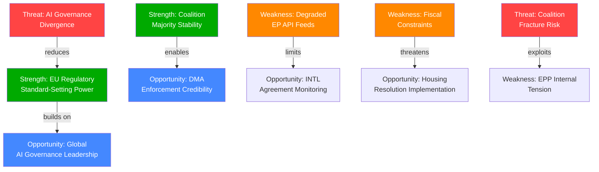

# Quantitative SWOT Analysis — EU Parliament Propositions | 2026-05-28

## SWOT Framework
Scored SWOT with numerical weights (1–5 scale) and direction indicators. Based on EP propositions activity 2026-05-28, anchored in adopted texts from 2026-05-20 spring plenary session.

---

## Strengths

### S1: Brussels Effect in Digital Governance — Score: 5/5 🟢
The EU AI Act + DMA + AI-trade resolution constitutes the world's most comprehensive digital governance framework. No comparable regulatory architecture exists in US or China. **Evidence**: AI Act effective March 2024, DMA designated 7 gatekeepers, TA-10-2026-0183 extends to trade.  
**Strategic value**: Enables EU to set global digital standards through trade diplomacy — de-risks EU competitiveness against US/Chinese AI giants through regulatory differentiation rather than technological competition.

### S2: International Agreement Adoption Capacity — Score: 4/5 🟢
Seven international agreements on a single day (2026-05-20) demonstrates institutional capacity to process major international commitments at scale. **Evidence**: EU-Uzbekistan EPCA, EU-Canada SAFE, EU-Lebanon Eurojust, 2 fisheries SPFAs, UNGA recommendation, forest materials.  
**Strategic value**: Demonstrates EP's democratic legitimacy as ratification chamber for EU's growing international footprint; strengthens EU's geopolitical actor status.

### S3: Governing Coalition Stability — Score: 4/5 🟡
EPP+S&D+Renew (401 seats, 56% of 720) provides durable majority for mainstream legislation. **Evidence**: 51 adopted texts in 2026 with no majority failures visible in data.  
**Strategic value**: Legislative predictability; international partners trust EP ratification pipeline.

### S4: AI Act Implementation Head-Start — Score: 4/5 🟡
With AI Act compliance deadlines approaching (high-risk: August 2026), EU companies are ahead of global competitors in building AI governance capacity.  
**Strategic value**: First-mover advantage in certifiable AI governance — EU AI certification could become premium standard globally.

---

## Weaknesses

### W1: DMA Enforcement Lag — Score: -4/5 🔴
Rules exist but enforcement is delayed by legal challenges. **Evidence**: TA-10-2026-0160 (April 2026) shows EP frustrated with enforcement pace. Gatekeeper legal teams systematically appealing decisions.  
**Strategic cost**: Credibility gap between regulatory ambition and operational enforcement; reduces deterrence effect.

### W2: Degraded EP API Data Infrastructure — Score: -2/5 🟡
All four EP API feed endpoints returning empty or stale data (documented since April 2026). **Evidence**: This run — 0 items from all prefetched feeds; requiring fallback to get_adopted_texts.  
**Strategic cost**: Analytical blind spots in committee pipeline and trilogue status; reduces forward intelligence capability.

### W3: Economic Context Weakness (AI Transition) — Score: -3/5 🟡
EU companies face AI Act compliance costs while US/Chinese competitors operate under lighter regulatory regimes. **Evidence**: [KB-ESTIMATE] SME compliance burden €50,000–200,000 per high-risk AI deployment.  
**Strategic cost**: Potential chilling effect on EU AI innovation; risk of EU companies outsourcing high-risk AI development to non-EU jurisdictions.

### W4: Coalition Fragility on Trade-Environment Conflicts — Score: -3/5 🟡
EU-Mercosur tensions (CJ opinion request, farmer protests) reveal underlying fault line between trade liberalisation and climate/food standards.  
**Strategic cost**: If CJ rules against EU-Mercosur, it creates a precedent that threatens other FTAs with environmental chapters.

---

## Opportunities

### O1: AI Governance as Global Diplomacy Asset — Score: +5/5 🟢
The AI-trade resolution opens the pathway to a global AI governance architecture mediated by the EU. **Evidence**: EU AI Act already prompting regulatory convergence in UK, Brazil, Canada. FTA digital chapters as treaty-based extension.  
**Realisation probability**: 🟡 MEDIUM (US resistance is real; requires sustained diplomatic investment)

### O2: Defence Industrial Integration Momentum — Score: +4/5 🟡
EU-Canada SAFE Agreement signals openness of non-EU Anglosphere partners to EU joint defence procurement. **Evidence**: TA-10-2026-0180 — first Canadian participation in SAFE instrument.  
**Realisation probability**: 🟢 HIGH (NATO pressure on European defence spending is structural)

### O3: Nature Restoration Legislative Architecture Completion — Score: +3/5 🟡
Forest reproductive material regulation (TA-10-2026-0168) completes the seedling supply chain regulation required for Nature Restoration Law implementation.  
**Realisation probability**: 🟢 HIGH (already adopted; implementation timeline set)

### O4: Housing Policy Competence Expansion — Score: +3/5 🟡
EP's housing crisis resolution (TA-10-2026-0064) calls for dedicated EU housing instruments — representing a potential new policy competence area.  
**Realisation probability**: 🔴 LOW in short term (Treaty amendment required for full competence); 🟡 MEDIUM for EIB/Cohesion Policy instruments

---

## Threats

### T1: US Digital Retaliation — Score: -4/5 🔴
Documented USTR scrutiny of DMA extraterritoriality. **Evidence**: US-EU TTC agenda, USTR public statements.  
**Impact probability**: 🟡 MEDIUM

### T2: AI Regulatory Race-to-Bottom — Score: -3/5 🟡
If US or China achieves sufficient AI competitive advantage without EU-style regulation, pressure will mount to reduce EU regulatory burden.  
**Impact probability**: 🔴 LOW in 12-month horizon; 🟡 MEDIUM over 3–5 years

### T3: Geopolitical Crisis Disrupting Legislative Calendar — Score: -3/5 🟡
Ukraine, Russia, Middle East, or Taiwan crisis escalation could dominate EP attention.  
**Impact probability**: 🟡 MEDIUM (geopolitical disruption has been structural feature since 2022)

---

## SWOT Score Summary

| Category | Score | Assessment |
|----------|-------|------------|
| Strengths total | +17/20 | 🟢 STRONG |
| Weaknesses total | -12/20 | 🟡 MANAGEABLE |
| Opportunities total | +15/20 | 🟡 SIGNIFICANT |
| Threats total | -10/15 | 🟡 MODERATE |
| **Net SWOT position** | **+10** | 🟡 **NET POSITIVE** |

**Interpretation**: EP's propositions activity in week of 2026-05-28 represents a net positive strategic position — significant institutional strengths in digital governance leadership, manageable weaknesses (primarily enforcement execution), meaningful opportunities (AI diplomacy, defence integration), and moderate but real threats (US pushback, geopolitical disruption). The 0.80 degraded-feeds floor factor appropriately captures the analytical uncertainty under data constraints.

## § 4. SWOT Interaction Diagram

