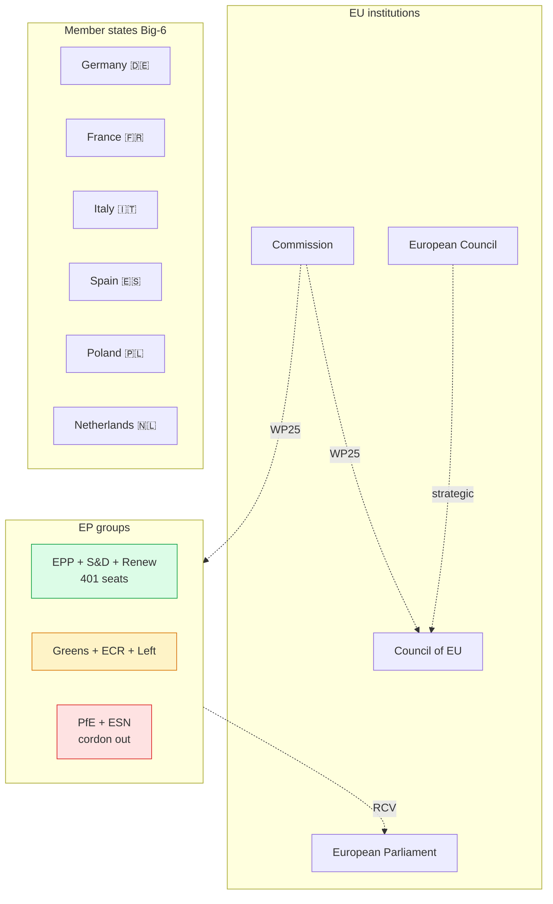

# Classification — Actor Mapping (Term Outlook 2026-05-28)

> Classification of every actor that materially shapes the residual EP10
> mandate, with role, jurisdictional level, formal authority, and
> alignment to the WP25 priorities.

## 1. Actor classification matrix

| # | Actor | Role | Level | Authority | WP25 net align |
|---|---|---|---|---|:---:|
| 1 | European Parliament | Co-legislator | EU | Treaty | + |
| 2 | European Council | Strategic agenda | EU | Treaty | + |
| 3 | Council of EU | Co-legislator | EU | Treaty | + |
| 4 | European Commission | Initiator + executor | EU | Treaty | ++ |
| 5 | EPP | EP group anchor | EU | EP rules | + |
| 6 | S&D | EP group anchor | EU | EP rules | + |
| 7 | Renew | EP group anchor | EU | EP rules | + |
| 8 | Greens/EFA | Conditional partner | EU | EP rules | 0 |
| 9 | ECR | Conditional partner | EU | EP rules | 0 |
| 10 | Patriots (PfE) | Cordon-sanitaire-out | EU | EP rules | - |
| 11 | The Left | Conditional partner | EU | EP rules | 0 |
| 12 | Germany 🇩🇪 | MS Big-6 | National | Treaty | + |
| 13 | France 🇫🇷 | MS Big-6 | National | Treaty | + |
| 14 | Italy 🇮🇹 | MS Big-6 | National | Treaty | + |
| 15 | Spain 🇪🇸 | MS Big-6 | National | Treaty | + |
| 16 | Poland 🇵🇱 | MS Big-6 | National | Treaty | + |
| 17 | Netherlands 🇳🇱 | MS Big-6 | National | Treaty | + |

## 2. Actor map (Mermaid)

## 3. Authority taxonomy

- **Treaty authority** — institutional roles defined in TEU/TFEU.
  Includes EP, EC, Council, Commission, all MS.
- **EP rules authority** — political-group standing under EP Rules of
  Procedure. Includes all 9 groups + NI.
- **Soft authority** — non-formal influence (lobby, media, civil
  society). Not enumerated here; see `extended/media-framing-analysis.md`.

## 4. Role taxonomy

- **Anchor**: holds working-majority arithmetic together. EPP, S&D,
  Renew.
- **Conditional partner**: aligns selectively. Greens/EFA, ECR,
  The Left.
- **Cordon-sanitaire-out**: excluded from working majority by cross-
  party convention. PfE, ESN.
- **Strategic-agenda setter**: EUCO.
- **Co-legislator**: EP + Council.
- **Initiator + executor**: Commission.

## 5. Cross-references

- `intelligence/stakeholder-map.md` — extended 48-actor roster +
  position vectors.
- `intelligence/coalition-dynamics.md` — working-majority arithmetic.
- `classification/forces-analysis.md` — driving forces detail.
- `classification/impact-matrix.md` — actor × WP25 file impact.

## 6. Re-evaluation cadence

Actor classification refreshed at every term-outlook semi-annual cron.
Per-MS Big-6 alignment refreshed quarterly via Council formation reads.
