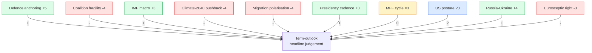
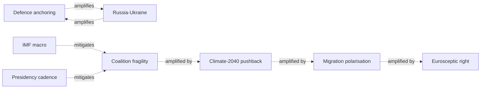

# Classification — Forces Analysis (Term Outlook 2026-05-28)

> Driving forces shaping the residual EP10 mandate, classified by axis
> (structural / political / economic / external), intensity, and
> directionality.

## 1. Forces summary

| Force | Axis | Intensity (1-5) | Direction | Effect on WP25 |
|---|---|:---:|:---:|:---:|
| Defence anchoring | Political | 5 | ↑ | + |
| Coalition fragility | Political | 4 | ↓ | - |
| IMF macro envelope | Economic | 3 | ↑ | + |
| Climate-2040 pushback | Political | 4 | ↓ | - |
| Migration polarisation | Social | 4 | ↓ | - |
| Council presidency cadence | Structural | 3 | ↑ | + |
| MFF mid-term cycle | Structural | 3 | → | 0 |
| US administration posture | External | 3 | ? | ? |
| Russia-Ukraine continuation | External | 4 | ↑ | + |
| Eurosceptic right consolidation | Political | 3 | ↓ | - |

## 2. Forces Mermaid

## 3. Force-vector decomposition

### 3.1 Structural forces (steady-state)

- **Council presidency cadence** (DK 2026 H2 → SE 2029 H1) — see
  `presidency-trio-context.md`. Net +3 (favourable rotation).
- **MFF mid-term cycle** (Q4 2026 proposal → Jun 2028 endorsement) —
  net 0 (locked-in calendar).

### 3.2 Political forces (variable)

- **Defence anchoring** — Russia-Ukraine continuation + US posture
  reads + DE fiscal acceleration combine into a +5 intensity force
  for WP25 defence pillar.
- **Coalition fragility** — working-majority 401 seats; CCI 74%
  baseline; -4 intensity force.
- **Climate-2040 pushback** — EPP fragility on rural files; -4 force.
- **Migration polarisation** — S&D exit-cost rising; -4 force.
- **Eurosceptic right consolidation** — PfE+ECR rising to ~24-28%
  combined; -3 force.

### 3.3 Economic forces

- **IMF macro envelope** — disinflation completes, EA growth 0.5-1.2%;
  +3 favourable force.

### 3.4 External forces

- **US administration posture** — outcome of 2026 mid-terms + 2028
  US presidential election determines defence + trade pressure; ?3
  uncertain force.
- **Russia-Ukraine continuation** — +4 force *favourable* to WP25
  defence pillar.

## 4. Force interactions

## 5. Net force balance

| Direction | Forces | Total intensity |
|---|---|---:|
| Favourable (↑) | F1, F3, F6, F9 | +15 |
| Unfavourable (↓) | F2, F4, F5, F10 | -15 |
| Neutral / unknown | F7, F8 | 0/? |

**Net balance**: ≈ 0 (balanced), consistent with the WEP 55-75% Likely
central judgement.

## 6. Force-vector drift through the arc

| Force | Phase A | Phase B | Phase C | Phase D | Phase E |
|---|:---:|:---:|:---:|:---:|:---:|
| Defence | +5 | +5 | +4 | +3 | +3 |
| Coalition fragility | -3 | -4 | -4 | -4 | -5 |
| IMF macro | +3 | +3 | +3 | +3 | +2 |
| Climate pushback | -3 | -5 | -4 | -3 | -3 |
| Migration | -3 | -4 | -5 | -4 | -5 |
| Presidency | +4 | +3 | +3 | +3 | +3 |
| Russia-Ukraine | +4 | +4 | +4 | +3 | +3 |
| US posture | ? | ? | -1 | -2 | -3 |

## 7. SATs applied

- **Driving Forces Analysis** — formal force inventory + intensity
  scoring.
- **Cross-Impact Analysis** — force interactions.
- **Indicators of Change** — phase-by-phase force drift.

## 8. WEP / Admiralty grading

- Force inventory: 🟡 MEDIUM, B2.
- Per-force intensity: 🟡 MEDIUM, B3.
- Phase drift: 🟡 MEDIUM, C3.

## 9. Cross-references

- `intelligence/pestle-analysis.md` — adjacent PESTLE framework.
- `intelligence/coalition-dynamics.md` — F2 + F4 + F5 detail.
- `intelligence/economic-context.md` — F3 detail.
- `classification/impact-matrix.md` — force × WP25 file impact.

## 10. Re-evaluation cadence

Forces analysis refreshed at every term-outlook semi-annual cron.
Per-phase drift refreshed quarterly via plenary roll-call patterns.
