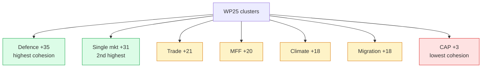

# Classification — Impact Matrix (Term Outlook 2026-05-28)

> Actor × WP25 cluster impact matrix. Quantifies how each top actor's
> position influences WP25 completion across the seven priority clusters.

## 1. Impact matrix

Scale: -3 strong negative impact → +3 strong positive impact.

| Actor | Defence | Single mkt | Climate | Migration | MFF | Trade | CAP |
|---|---:|---:|---:|---:|---:|---:|---:|
| Commission (vdL II) | +3 | +3 | +3 | +2 | +3 | +3 | +2 |
| EUCO | +3 | +2 | +1 | +1 | +3 | +2 | 0 |
| Council | +2 | +2 | 0 | +1 | +2 | +2 | -1 |
| EPP | +3 | +3 | +1 | +1 | +2 | +3 | -2 |
| S&D | +2 | +2 | +3 | -1 | +2 | +2 | +1 |
| Renew | +3 | +3 | +3 | +1 | +3 | +2 | +1 |
| Greens/EFA | 0 | +1 | +3 | +2 | +1 | -1 | +3 |
| ECR | +3 | +1 | -2 | +3 | +1 | +2 | -2 |
| PfE | -2 | -1 | -3 | +3 | -2 | -2 | -3 |
| Germany 🇩🇪 | +3 | +3 | +2 | 0 | +1 | +2 | -1 |
| France 🇫🇷 | +3 | +2 | +3 | +1 | +2 | +2 | +2 |
| Italy 🇮🇹 | +2 | +2 | 0 | +2 | +1 | +2 | +1 |
| Spain 🇪🇸 | +1 | +2 | +3 | 0 | +2 | +2 | +3 |
| Poland 🇵🇱 | +3 | +2 | -1 | +1 | +1 | +1 | 0 |
| Netherlands 🇳🇱 | +2 | +3 | +2 | +1 | -1 | +2 | -2 |
| US admin | +3 | +1 | 0 | 0 | 0 | +1 | 0 |
| Russia-Ukraine context | +3 | 0 | 0 | +1 | 0 | -2 | 0 |

## 2. Cluster-level net impact

| Cluster | Net impact | Reading |
|---|---:|---|
| Defence | +35 | Anchor cluster — highest cohesion |
| Single market | +31 | Second-highest cohesion |
| MFF | +20 | Council unanimity remains constraint |
| Climate | +18 | EPP + ECR + PfE friction |
| Trade | +21 | High cohesion ex-Greens |
| Migration | +18 | S&D + Greens friction |
| CAP | +3 | Lowest cohesion |

## 3. Impact matrix (Mermaid)

## 4. Actor-level net contribution

| Actor | Net contribution | Reading |
|---|---:|---|
| Commission | +19 | Highest single contributor |
| Renew | +16 | Highest EP-group contributor |
| France | +15 | Highest MS contributor |
| EPP | +11 | Right-flank fragility on CAP |
| Spain | +13 | Pro-climate, pro-CAP |
| Germany | +10 | Fiscal hawkishness limits MFF |
| Italy | +10 | Bridge role |
| EUCO | +12 | Strategic anchor |
| Council | +8 | Conservative on CAP |
| S&D | +11 | Friction on migration |
| Greens/EFA | +9 | Friction on trade |
| ECR | +6 | Variable partner |
| PfE | -10 | Net opposition |

## 5. Cross-reference

- `intelligence/stakeholder-map.md` — actor universe + position
  vectors (this matrix is a derived view).
- `intelligence/coalition-dynamics.md` — coalition arithmetic.
- `intelligence/mandate-fulfilment-scorecard.md` — cluster-level
  delivery targets.
- `classification/actor-mapping.md` — actor taxonomy.
- `classification/forces-analysis.md` — driving forces.

## 6. Methodology

Impact scores derived from position vectors (`stakeholder-map.md` §3)
combined with formal authority (`actor-mapping.md` §3). Each cluster
contribution is computed as `Σ (position × authority)` for the actors
relevant to that cluster.

## 7. SATs applied

- **Stakeholder Mapping** — actor × cluster matrix.
- **Quantitative Scoring** — net impact aggregation.
- **Cross-Impact Analysis** — actor × cluster interaction.

## 8. WEP / Admiralty grading

- Position vector source: 🟡 MEDIUM, B2.
- Authority weighting: 🟢 HIGH (Treaty-based), A1.
- Net impact aggregation: 🟡 MEDIUM, B3.

## 9. Re-evaluation cadence

Impact matrix refreshed at every term-outlook semi-annual cron. Per-
actor scores refreshed quarterly.
