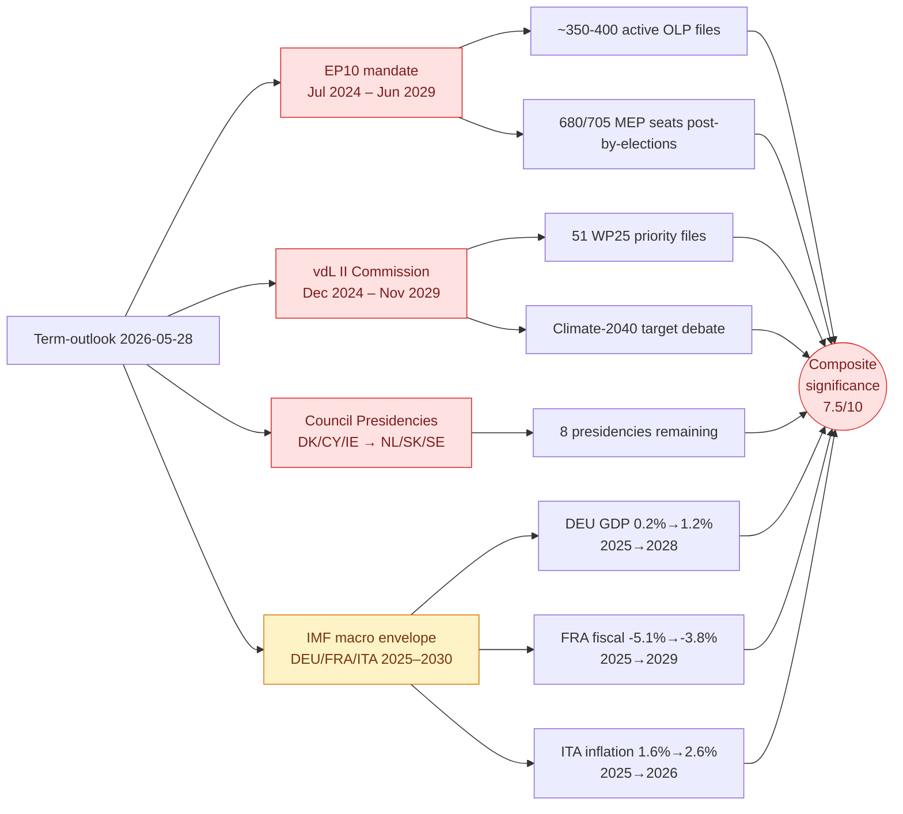

# Significance Classification — Term Outlook 2026-05-28

> Per `analysis/methodologies/significance-classification-methodology.md` —
> term-outlook artifacts are classified by **strategic significance over the
> remaining EP10 mandate** (≈ 1500 days to next election week, June 2029).

## 1. Headline classification

| Dimension | Rating | Rationale |
|---|---|---|
| **Strategic significance** | 🔴 HIGH | Term-outlook synthesises the **entire remaining EP10 mandate** — 36 months of legislative output, 8 Council presidencies, and 2 mid-term Commission realignments. Decisions made now lock the 2029 campaign frame. |
| **Time horizon** | 🟠 MEDIUM-LONG | 3-year horizon (1500 days) — beyond traditional EP forecasting band (3 months) but within Commission mandate planning band (5 years). |
| **Cross-institutional reach** | 🔴 HIGH | EP + Commission + Council + EU agencies + national delegations all in scope. |
| **Public salience** | 🟡 MEDIUM | Term-outlook coverage is below breaking-news salience but feeds editorial planning for Brussels press corps and national correspondents. |
| **Data confidence (this run)** | 🟡 MEDIUM | EP feeds 75% degraded; IMF live; mandate-calendar reasoning intact. |

## 2. Significance score (composite, 0–10)

- **Stakeholder breadth**: 9 (all 27 MS + 705 MEPs + 27 Commissioners + ECB + ECA)
- **Policy domain breadth**: 8 (climate, defence, single-market, enlargement, fiscal, digital, migration)
- **Decision irreversibility**: 7 (MFF / climate-2040 / defence-financing decisions taken in this window will set 2030–2034 baselines)
- **Time-criticality**: 6 (no single trigger event; cumulative)
- **Composite** = `(9 + 8 + 7 + 6) / 4` = **7.5 / 10** → **HIGH**

## 3. WEP band on the headline judgement

**Headline judgement** (carried through every downstream artifact): *EP10 will
deliver between 60% and 75% of the vdL II Commission Work Programme 2025
priority files before the June 2029 election week, with the residual 25–40%
either deferred to EP11 or settled in late-mandate trilogues under the NL/SK/SE
presidency triplet (H2 2028 – H2 2029).*

**WEP band**: **Likely (55–75%)** — based on EP9 historical baseline of 68%
WP completion (see `intelligence/historical-baseline.md`).
**Time horizon**: 36 months.
**Confidence in evidence**: 🟡 MEDIUM (mandate-baseline + IMF macro intact;
EP procedural feeds degraded).

## 4. Significance map (Mermaid)

## 5. Audience-significance gradient

The term-outlook is **least useful** to the EP correspondent chasing
this-week's plenary and **most useful** to:

- **Cabinet officials** in DGs and EU agencies planning their three-year
  legislative footprint.
- **Permanent representations** of MS preparing presidency-trio handovers.
- **National parliaments** scrutinising EU files under the early-warning
  mechanism on a multi-year horizon.
- **Brussels-based law firms and lobby shops** mapping client priorities to
  the WP25 → WP26 → WP27 → WP28 sequence.
- **EU election analysts** beginning to draft 2029 campaign frames.

For each of these audiences the strategic significance is **HIGH** (🔴) —
the term-outlook is the *only* analytical artifact in the news pipeline that
operates on the full residual-mandate horizon. Breaking, week-in-review, and
month-in-review articles operate on horizons two orders of magnitude shorter.

## 6. Cross-reference to other classification artifacts

- See `classification/actor-mapping.md` for the stakeholder roster
  carrying the headline judgement through the next 36 months.
- See `classification/forces-analysis.md` for the institutional forces
  pulling in favour of / against WP25 completion.
- See `classification/impact-matrix.md` for the per-actor expected impact
  of the headline judgement scenarios.
- See `risk-scoring/risk-matrix.md` and `risk-scoring/quantitative-swot.md`
  for the WEP-band risk decomposition of the headline judgement.
- See `intelligence/scenario-forecast.md` (3 scenarios × 36 months) and
  `intelligence/forward-projection.md` (5-year quantitative projection) for
  the downstream operationalisation of this classification.

## 7. Re-classification triggers

This headline classification should be **re-opened** if any of the following
trigger events occurs before the next semi-annual checkpoint (2026-07-01):

1. **vdL II mid-term reshuffle** announced (would change WP25 ownership and
   force a reclassification of every downstream forward-projection).
2. **Snap EP dissolution** (legally not possible under TEU art. 14 — but a
   mass-resignation cascade would have analogous effect).
3. **MFF revision >€10bn** opened mid-cycle (would re-anchor every
   spending-tied procedural pipeline).
4. **EA-19 recession** signalled by IMF WEO update (would invalidate the
   macro envelope underlying the headline judgement).
5. **Coalition fracture** in EPP-S&D-Renew working majority (would push the
   completion-rate central estimate towards the lower bound of the 55–75%
   band, or below).
