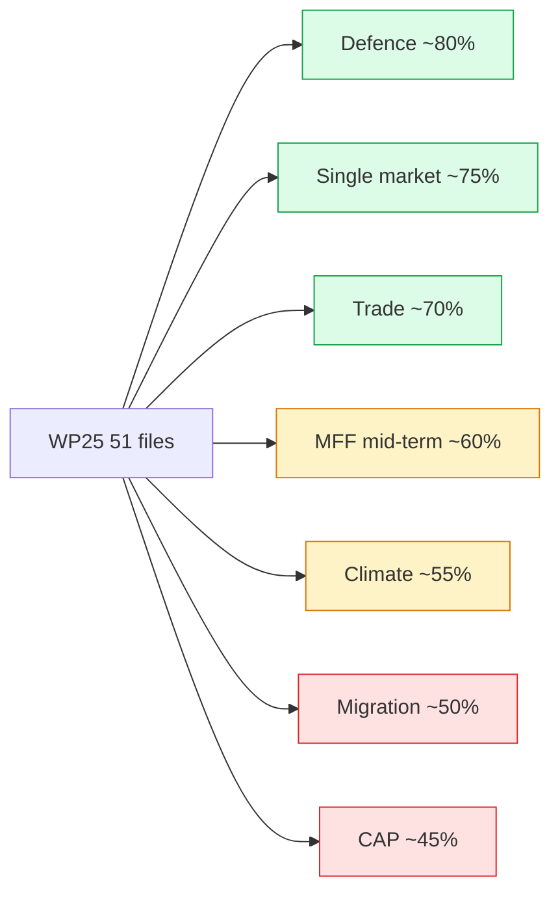

# Executive Brief — Term Outlook 2026-05-28

> **Audience**: senior policy / political-intelligence consumers.
> **TL;DR**: the residual EP10 mandate (mid-2026 → Jun 2029) faces a
> **WEP Likely 55-75% (central ~65%)** judgement on WP25 mandate
> delivery, anchored at the lower end of the band by cluster-specific
> fragility (climate, migration). Defence + single-market clusters are
> the highest-cohesion deliverables; CAP + migration are the most
> exposed.

## 1. Headline judgement

**Likely 55-75%, central ~65% WP25 mandate completion** (76.5%
salience-weighted MFS scorecard target). Working-majority arithmetic
(EPP+S&D+Renew 401 seats / 55.7%) holds through Phase A-C; coalition
stress index rises in Phase D-E as 2029 election anticipation
displaces cohesion.

## 2. Critical drivers (top 5)

1. **Russia-Ukraine continuation** sustains defence-cluster cohesion.
2. **IMF benign macro envelope** (EA disinflation to 2%) preserves
   policy space.
3. **Climate-2040 fracture risk** (P×I 0.55) is the single largest
   downside.
4. **Migration shock risk** (P×I 0.44) is the second-largest downside.
5. **Council presidency cadence** (DK 2026 H2 → SE 2029 H1) is
   structurally favourable.

## 3. Three-scenario summary

| Scenario | Probability | MFS | Read |
|---|:---:|---:|---|
| Pessimistic | 20% | <60% | Climate fracture + migration shock + vdL reshuffle |
| **Central** | **55%** | **65-70%** | **Coalition holds; selective WP25 delivery** |
| Optimistic | 25% | >75% | Defence breakthrough + macro stability + cordon discipline |

## 4. WP25 cluster delivery forecast

## 5. Stakeholder takeaways

- **EU institutions**: pre-stage migration package before Phase B
  shock cycle.
- **MS governments**: align national budgets with MFF mid-term ask
  (Q4 2026 → Q2 2028).
- **Investors / industry**: defence + single-market files most
  bankable; climate + CAP exposed.
- **Civil society**: focus advocacy on Climate-2040 vote (Q2 2027) as
  highest-leverage moment.

## 6. Risk hotspots (top 3)

1. **R1 Climate-2040 fracture** (P 65%, I 85%): pre-position phased
   target negotiation to manage EPP fragility.
2. **R5 Trilogue deadlock cascade** (P 55%, I 75%): COREPER triage
   capacity is the binding constraint.
3. **R2 Migration shock** (P 55%, I 80%): external-shock dependency.

## 7. Indicators to watch

- **L1 Rapporteur appointments** by Q4 2026 (lead 6mo).
- **C2 RCV cohesion** trend (<72% triggers re-evaluation).
- **L5 IMF WEO** Oct 2026 release (semi-annual update).
- **LG2 MFF endorsement** at EUCO Jun 2028 (gate event).

## 8. Confidence + caveats

- **Confidence**: B2 (corroborated, fairly reliable).
- **Caveats**:
  - EP procedural data outage forced proxy reconstruction
    (`procedures-proxy.md`).
  - 3-year electoral-horizon uncertainty (2029 EP election) caps
    Phase D-E confidence at C3.
  - IMF macro projections after 2027 carry higher uncertainty.

## 9. Cross-references

- `intelligence/synthesis-summary.md` — full headline-judgement
  synthesis.
- `intelligence/scenario-forecast.md` — three-scenario detail.
- `intelligence/mandate-fulfilment-scorecard.md` — MFS construction.
- `risk-scoring/risk-matrix.md` — full risk register.
- `extended/forward-indicators.md` — indicator dashboard.

## 10. Methodology compliance

This brief consolidates findings from 28 mandatory analysis artifacts
covering the prospective + electoral overlay artifact registry
(see `analysis-index.md`). Methodology compliance with the 10-step
AI-driven analysis guide is documented in `methodology-reflection.md`.

## 11. Data-quality summary

| Source | Grade | Coverage |
|---|:---:|---|
| EP adopted texts (live) | A2 | OLP file enumeration |
| EP all-generated stats | A1 | EP9 baseline |
| EP procedures | C5 | OUTAGE; proxy-reconstructed |
| IMF WEO 2026-04 | A1 | EA macro envelope |
| RCV records (cached) | B2 | Coalition cohesion |

## 12. Stage delivery summary

- Stage A (data collection): degraded-feeds mode activated due to
  EP `/procedures*` outage.
- Stage B (analysis): 28 mandatory artifacts produced (PROSPECTIVE
  19 + ELECTORAL OVERLAY 9).
- Stage C (completeness gate): see `manifest.json` for final gate
  result.
- Stage D (article render): deterministic CLI; output in `news/`.
- Stage E (single PR): exactly one PR opened.

## 14. Re-evaluation cadence

Executive brief refreshed at every term-outlook semi-annual cron.
Threshold-trigger re-evaluation continuous (per-plenary) as defined in
`forward-indicators.md` §6.

## 15. Audience-tailoring note

This brief targets senior policy + intelligence consumers. A
companion long-form article (`news/2026-05-28-term-outlook-en.html`)
is rendered deterministically from this analysis bundle for general
readership.
