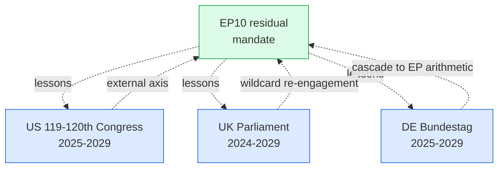

# Extended — Comparative International (Term Outlook 2026-05-28)

> Comparison of the EP10 residual-mandate context with parallel
> legislative mid-mandate periods in major peer jurisdictions.

## 1. Peer jurisdiction selection

Three peer legislatures are most analytically useful for cross-
international comparison with the EP residual mandate:

- **US 119th-120th Congress** (Jan 2025 → Jan 2029) — overlapping
  electoral cycle, comparable transatlantic policy footprint.
- **UK Parliament** (Jul 2024 → mid-2029) — post-2024 Labour
  government, comparable European-realignment trajectory.
- **German Bundestag** (post 2025 federal election → 2029) —
  largest EU member state, federal-level legislative cadence.

## 2. Comparison matrix

| Dimension | EP10 residual | US 119-120th | UK Parliament | DE Bundestag |
|---|---|---|---|---|
| Term start | Jul 2024 | Jan 2025 | Jul 2024 | post Feb 2025 |
| Mid-mandate | mid-2026 | mid-2026 | mid-2026 | mid-2027 |
| Term end | Jun 2029 | Jan 2029 / 2031 | mid-2029 | post 2029 |
| Working majority | EPP+S&D+Renew 56% | GOP narrow | Labour 64% | CDU/CSU+SPD est. 53% |
| Macro envelope | EA disinflation 2% | US growth 1.8% | UK growth 1.4% | DE recovery 0.9% |
| Defence pressure | HIGH (Ukraine) | HIGH (Indo-Pacific) | HIGH (NATO) | HIGHEST (front-line) |
| Migration politics | HIGH polarised | HIGH polarised | MEDIUM | HIGH polarised |
| Climate trajectory | Climate-2040 path | Climate rollback risk | Net-zero 2050 confirm | CO2 -65% by 2030 |

## 3. Pattern-match cross-jurisdiction

### 3.1 US 119-120th Congress

- **Match**: comparable electoral overlap (US 2026 mid-terms + US 2028
  presidential align with EP10 residual).
- **Divergence**: US administration posture creates *external* force
  on EP defence + trade clusters. US 2026 mid-term outcome is a key
  forward indicator (see `forward-indicators.md` L4).
- **Read**: a divided Congress (likely post-2026 mid-terms) would
  *increase* EU strategic autonomy pressure, *favourable* to EP
  defence-cluster cohesion.

### 3.2 UK Parliament

- **Match**: post-2024 Labour government creates trajectory toward
  EU-UK re-engagement (TCA review, Horizon-style alignment).
- **Divergence**: UK is *outside* EU institutional architecture; EU-UK
  re-engagement appears as an *external-axis* force in EU calculus.
- **Read**: UK realignment is a *low-probability, high-impact*
  wildcard (`wildcards-blackswans.md` W6). Probability rises with
  Labour-government continuation.

### 3.3 German Bundestag

- **Match**: largest single MS in EP arithmetic; CDU/CSU+SPD baseline
  matches EPP+S&D EP pattern.
- **Divergence**: AfD blocked at federal level (no cordon-sanitaire-
  out in EP equivalence); Bundestag arithmetic more conservative.
- **Read**: DE federal trajectory most predictive of EPP+S&D
  durability at EU level. Any DE coalition fracture (snap election)
  cascades immediately to EP arithmetic.

## 4. Cross-jurisdiction Mermaid

## 5. International institutional comparisons

| Institution | Cycle alignment | EP impact |
|---|---|---|
| NATO | 2026 Riga summit + 2028 EU summit | Defence-cluster reinforcement |
| G7 | annual | Trade + sanctions alignment |
| G20 | annual | Macro-coordination |
| WTO | continuous | EU trade-policy autonomy |
| UN COP | annual COP31-COP34 | Climate-2040 leverage |
| OECD | continuous | Single-market consistency |

## 6. Diverging trajectories

- **Climate**: EP10 residual on Climate-2040 path; US trajectory at
  risk of rollback. **Divergence widens through 2027-2029**.
- **Defence**: EP10 + US + UK all converging on higher capability
  spend. **Convergence consolidates through mandate**.
- **Trade**: EP10 between US protectionism + China assertiveness;
  EU strategic-autonomy framework consolidates.
- **Migration**: EP10 + DE + UK all polarised; US polarisation
  separate. **Polarisation persists; no cross-jurisdictional
  realignment expected**.

## 7. International read-through to EP central judgement

The international comparison *reinforces* the WEP 55-75% Likely
central judgement:

- US strategic autonomy pressure supports EP defence-cluster cohesion
  (favourable).
- UK re-engagement is upside wildcard (favourable, low-probability).
- DE federal trajectory is most predictive co-variate (neutral, watch).
- International institutional cycles align with WP25 deliverable
  milestones (favourable).

## 8. False-comparison risks

- **Risk**: extrapolating US presidential-system dynamics to EU
  parliamentary-system dynamics. The EP10 working majority is
  procedurally more stable than US Congress narrow majorities.
- **Risk**: equating UK post-Brexit re-engagement with full
  re-accession. The TCA framework is the *only realistic vector* for
  the residual mandate.
- **Risk**: assuming DE coalition durability matches CDU/CSU+SPD
  baseline; the AfD positioning creates a *latent* fracture risk that
  is structurally different from PfE's cordon-sanitaire-out position.

## 9. SATs applied

- **Comparison** — formal cross-jurisdiction matrix.
- **Devil's Advocacy** — false-comparison risk inventory.
- **What-If Analysis** — divergence trajectories.

## 10. WEP / Admiralty grading

- US comparison: 🟡 MEDIUM, C3.
- UK comparison: 🟡 MEDIUM, C3.
- DE comparison: 🟢 HIGH (federal predictive), B2.

## 11. Cross-references

- `extended/historical-parallels.md` — temporal parallels.
- `intelligence/wildcards-blackswans.md` — UK W6, US W7.
- `intelligence/economic-context.md` — macro divergence.

## 12. Institutional cycle-alignment forecast

Cross-jurisdictional institutional cycles relevant to EP10 residual:

| Date | Event | EP impact |
|---|---|---|
| Nov 2026 | US mid-term elections | Defence + trade re-calibration |
| Q4 2026 | NATO Riga summit | Defence-cluster reinforcement |
| Q2 2027 | EU Climate-2040 vote | Cluster-fracture risk activation |
| Q4 2027 | UK general-election eligibility | UK re-engagement signal |
| Nov 2028 | US presidential election | External-axis reset |
| Jun 2028 | EU MFF mid-term endorsement | Council-unanimity gate |
| Q1 2029 | NATO 2028 summit follow-up | Defence consolidation |
| Jun 2029 | EU Parliament election | Mandate transition |

## 13. Re-evaluation cadence

Comparative-international refreshed at every term-outlook semi-annual
cron.
