# Extended — Forward Indicators (Term Outlook 2026-05-28)

> Observable indicators to track to update the WEP central judgement
> (55-75% Likely, central ~65%) before the next semi-annual term-
> outlook refresh.

## 1. Indicator framework

Indicators are bucketed by **lead time** (lead, coincident, lag) and
by **WP25 cluster**. Each indicator carries a **trigger threshold**
that would prompt re-evaluation of the central judgement.

## 2. Lead indicators (3-6 month lead)

| # | Indicator | Source | Cadence | Threshold | Cluster |
|---|---|---|:---:|---|---|
| L1 | Commission rapporteur appointments | EP procedures | Per-file | First-rapporteur lock-in (>70%) | All |
| L2 | EPP+S&D+Renew leadership statements | Press releases | Weekly | Joint statement frequency | All |
| L3 | Council formation calendar | Council site | Monthly | Defence + migration formations scheduled | Defence, migration |
| L4 | EUCO 4-quarter agenda | EUCO conclusions | Quarterly | Strategic agenda alignment with WP25 | All |
| L5 | IMF WEO disinflation profile | WEO releases (Apr+Oct) | Semi-annual | Core inflation <2.5% by 2027 | Economic envelope |
| L6 | National-budget MFF positioning | National budgets | Annual | DE / NL / SE net-contributor signals | MFF |

## 3. Coincident indicators (0-3 month lead)

| # | Indicator | Source | Cadence | Threshold | Cluster |
|---|---|---|:---:|---|---|
| C1 | Trilogue success rate (rolling 12mo) | Adopted texts | Monthly | <60% triggers trilogue-deadlock alert | All |
| C2 | RCV cohesion EPP+S&D+Renew (rolling 12mo) | RCV records | Monthly | <72% triggers coalition-fragility alert | All |
| C3 | Plenary defection rate (right-flank EPP) | RCV records | Per-plenary | >12% triggers right-flank fracture alert | Climate, CAP |
| C4 | Plenary defection rate (left-flank S&D) | RCV records | Per-plenary | >12% triggers left-flank fracture alert | Migration |
| C5 | WP25 milestone delivery (Phase A) | Commission tracker | Quarterly | <60% by end-Q1 2027 = pessimistic branch | All |

## 4. Lag indicators (post-event)

| # | Indicator | Source | Cadence | Reading | Cluster |
|---|---|---|:---:|---|---|
| LG1 | OLP files completed (semi-annual) | Adopted texts | Semi-annual | Volume + cluster mix | All |
| LG2 | MFF mid-term review outcome | EUCO conclusions | Once (Jun 2028) | Endorsed / blocked | MFF |
| LG3 | 2029 EP election seat distribution | EP election results | Once (Jun 2029) | Working-majority continuity | All |
| LG4 | Commission delegated-act adoption rate | Commission register | Quarterly | Implementation health | All |

## 5. Indicator dashboard (Mermaid)

```mermaid
flowchart TB
    A[Term-outlook<br/>central judgement<br/>55-75% Likely]

    L[Lead indicators 6mo] --> A
    C[Coincident indicators 3mo] --> A
    LG[Lag indicators post-event] --> A

    L --> L1[Rapporteur appointments]
    L --> L2[Joint statements]
    L --> L3[Council formations]
    L --> L4[EUCO agenda]
    L --> L5[IMF WEO]
    L --> L6[National budgets]

    C --> C1[Trilogue success]
    C --> C2[RCV cohesion]
    C --> C3[Right-flank defection]
    C --> C4[Left-flank defection]
    C --> C5[WP25 Phase A delivery]

    LG --> LG1[OLP files]
    LG --> LG2[MFF endorsement]
    LG --> LG3[2029 election]
    LG --> LG4[Delegated acts]
```



## 6. Threshold-trigger update logic

```
IF (C1 < 60% OR C2 < 72%) for 2 consecutive months
  THEN downgrade central from 65% to 55-65%
  AND raise weight on pessimistic scenario from 15% to 30%

IF (C3 > 12% OR C4 > 12%) on Climate-2040 vote
  THEN activate climate-fracture branch
  AND downgrade Phase B WEP from Likely to Toss-up

IF (L5 disinflation profile drifts above 3% core)
  THEN downgrade economic envelope from +3 to 0
  AND raise EA-recession risk from 25% to 40%

IF (LG1 OLP volume <55 files for 2026 OR <55 for 2027)
  THEN activate slow-delivery branch
  AND downgrade overall WEP from Likely to Toss-up
```

## 7. Surprise-detection triggers

- **External shock**: a major terror attack in a Big-6 capital (Phase
  A-B) triggers a migration-cluster re-evaluation.
- **External shock**: a Russia ceasefire / peace deal triggers a
  defence-cluster re-evaluation (decreased urgency could *lower*
  cohesion).
- **External shock**: a US administration change of posture on defence
  / trade triggers an external-axis re-evaluation.
- **MS election shock**: an unexpected outcome in a major MS election
  (DE 2027, FR 2027 leg, IT mid-mandate) triggers a Council-formation
  re-evaluation.

## 8. Indicator update cadence

| Indicator | Refresh |
|---|:---:|
| L1, L2, C3, C4 | Per-plenary |
| L3, L4, C1, C2 | Monthly |
| L5 (IMF WEO) | Semi-annual (Apr, Oct) |
| L6 | Annual (national budgets Q4) |
| C5, LG4 | Quarterly |
| LG1 | Semi-annual (at term-outlook refresh) |
| LG2, LG3 | Once (event-driven) |

## 9. SATs applied

- **Indicators of Change** — formal indicator inventory.
- **Surprise-Detection** — triggers list.
- **What-If Analysis** — threshold-trigger logic.

## 10. WEP / Admiralty grading

- Lead indicators: 🟢 HIGH (observable), A2.
- Coincident indicators: 🟢 HIGH (RCV records), A1.
- Lag indicators: 🟢 HIGH (post-event verifiable), A1.

## 11. Cross-references

- `intelligence/synthesis-summary.md` — central judgement.
- `intelligence/scenario-forecast.md` — branch probabilities.
- `intelligence/coalition-dynamics.md` — RCV cohesion source.
- `risk-scoring/risk-matrix.md` — risk → indicator mapping.

## 12. Indicator-reliability assessment

| Indicator | Reliability | Notes |
|---|:---:|---|
| L1 Rapporteur appointments | HIGH | EP procedures (when available) |
| L2 Joint statements | HIGH | Press-release archive |
| L3 Council formations | HIGH | Council calendar |
| L4 EUCO agenda | HIGH | Conclusions document |
| L5 IMF WEO | HIGH | Authoritative source |
| L6 National budgets | MEDIUM | Annual cadence limits responsiveness |
| C1 Trilogue success | HIGH | Adopted-texts feed |
| C2 RCV cohesion | HIGH | DOCEO RCV records |
| C3, C4 Defection rates | HIGH | Per-vote granularity |
| C5 WP25 delivery | MEDIUM | Commission tracker availability |
| LG1-LG4 | HIGH | Authoritative post-event sources |

## 13. False-signal protection

Some indicators are vulnerable to false signals:

- **C2 RCV cohesion**: technical files (e.g., budgetary
  resolutions) can artificially inflate cohesion. Filter to
  political-priority votes only.
- **C3, C4 Defection rates**: individual MEP absences distort small-N
  measurements. Apply minimum-quorum filter (≥ 80% group attendance).
- **L1 Rapporteur appointments**: shadow-rapporteur dynamics matter
  as much as lead-rapporteur appointments; track both.

## 14. Re-evaluation cadence

Forward-indicators dashboard refreshed at every term-outlook semi-
annual cron. Threshold-trigger evaluation continuous (per-plenary).
