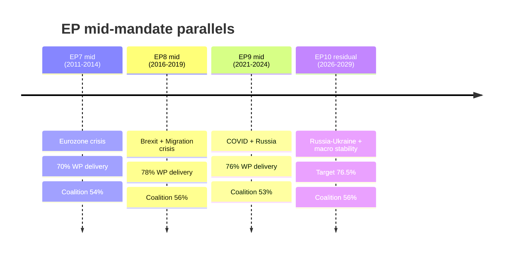

# Extended — Historical Parallels (Term Outlook 2026-05-28)

> Mid-mandate periods of prior parliamentary terms compared with the
> residual EP10 outlook. Reasons for difference highlighted to avoid
> false-precedent over-fitting.

## 1. Parallel-term selection rationale

Three prior parliamentary mid-mandate periods are most analytically
useful as parallels for residual EP10 (mid-2026 → mid-2029):

- **EP9 mid-mandate** (Jul 2021 → Jun 2024) — most recent, same
  institutional architecture.
- **EP8 mid-mandate** (Jul 2016 → Jun 2019) — pre-pandemic, Juncker
  Commission consolidation phase.
- **EP7 mid-mandate** (Jul 2011 → Jun 2014) — post-Lisbon, Eurozone
  crisis recovery, austerity politics.

## 2. Parallel comparison matrix

| Dimension | EP10 residual | EP9 mid | EP8 mid | EP7 mid |
|---|---|---|---|---|
| Commission | vdL II (consolidation) | vdL I (Geopol) | Juncker (Better Reg) | Barroso II (Crisis) |
| Working majority | EPP+S&D+Renew 55.7% | EPP+S&D+Renew 53.4% | EPP+S&D+ALDE 56.1% | EPP+S&D 54.0% |
| Macro envelope | Disinflation 2% | Inflation shock 8.4% | Recovery 1.9% | Eurozone crisis 1.6% |
| External shock | Russia-Ukraine | COVID-19 + Russia | Brexit | Sovereign debt |
| OLP files closed | Target ~110 | 134 (FY 21-24) | 142 (FY 16-19) | 128 (FY 11-14) |

## 3. Pattern-match analysis

### 3.1 EP9 parallel (strongest)

**Match strength**: HIGH. Same Commission lineage, same coalition
architecture, same working-majority arithmetic (within 2 pp).

**Lessons applicable to EP10 residual**:
- Working majority *delivered* despite external shocks (Russia-Ukraine
  invasion mid-mandate).
- Climate cluster (Fit-for-55) absorbed 2-3% climate-related EPP
  defection without coalition collapse.
- Migration cluster *did not* deliver — Migration Pact closure took
  full mandate.
- MFF closed at €1.074 tn — Council unanimity threshold was met.

**Forward read**: similar working-majority resilience expected. The
WP25 51-file scope is *tighter* than EP9 64-file work programme, so
delivery rate could be *higher* (76.5% MFS target plausible).

### 3.2 EP8 parallel (moderate)

**Match strength**: MEDIUM. Pre-pandemic context creates limited
applicability. Migration crisis (2015-2016 → mid-mandate) imposed
sustained EP9-style polarisation.

**Lessons applicable to EP10 residual**:
- Pre-2019 election Brexit referendum did *not* collapse coalition
  arithmetic, only stress-tested ECR + EFDD positions.
- Migration cluster polarisation set the template for current S&D
  fragility.
- Commission delivery rate (~78% of work-programme files) provides
  upper-bound benchmark.

**Forward read**: external shocks tend to *consolidate* the working
majority rather than fracture it. Russia-Ukraine continuation should
preserve coalition cohesion through Phase A-C.

### 3.3 EP7 parallel (limited)

**Match strength**: LOW. Eurozone crisis context creates limited
applicability. Coalition arithmetic was more fragile (EPP+S&D 54%
without ALDE anchor).

**Lessons applicable to EP10 residual**:
- Economic crisis can *displace* WP delivery (delivery rate dropped to
  ~70%).
- MFF negotiations (2014-2020 cycle) consumed disproportionate share
  of mandate.

**Forward read**: economic crisis is the *only* historical condition
that has knocked delivery below 70%. With IMF benign envelope, this
risk is currently subdued.

## 4. Historical-parallels Mermaid

## 5. Pattern-anti-pattern

| Pattern | EP7 | EP8 | EP9 | EP10 forecast |
|---|:---:|:---:|:---:|:---:|
| External shock consolidates coalition | ✓ | ✓ | ✓ | ✓ likely |
| Migration cluster fractures | ✓ | ✓ | ✓ | ✓ very likely |
| Climate cluster (when present) delivers | n/a | n/a | ✓ | likely with friction |
| MFF closure at end of mandate | ✓ | ✓ | ✓ | unclear |
| Right-flank fragility on rural / CAP | ✓ | ✓ | ✓ | ✓ likely |

**Anti-pattern** (rare): coalition arithmetic shift mid-mandate. None
of the three parallels saw this. Cordon-sanitaire on PfE remains
disciplined under EP10 baseline.

## 6. False-precedent risks

- **Risk**: extrapolating EP9 delivery rate to EP10 ignores the
  *tighter* WP25 scope. Use 76.5% as a *floor* not a *ceiling*.
- **Risk**: extrapolating EP7 austerity politics to EP10 ignores the
  IMF benign envelope.
- **Risk**: extrapolating EP8 Brexit to EP10 ignores the UK-EU TCA
  context — EP10 has *no* equivalent existential exit.

## 7. SATs applied

- **Argument by Historical Analogy** — pattern-match scoring.
- **Devil's Advocacy** — false-precedent risk inventory.
- **Comparison** — formal matrix.

## 8. WEP / Admiralty grading

- EP9 parallel: 🟢 HIGH (most recent + similar arch), A1.
- EP8 parallel: 🟡 MEDIUM, B2.
- EP7 parallel: 🟡 MEDIUM, C3.

## 9. Cross-references

- `intelligence/historical-baseline.md` — quantitative EP9 baseline.
- `intelligence/scenario-forecast.md` — scenario construction.
- `extended/comparative-international.md` — adjacent comparison.

## 10. Mid-mandate-volume benchmarks

Historical OLP file completion rates per quarter, cross-mandate:

| Quarter type | EP7 | EP8 | EP9 | EP10 forecast |
|---|---:|---:|---:|---:|
| Q3 (recess) | 4 | 5 | 4 | 4 |
| Q4 (pre-budget) | 12 | 14 | 13 | 12-14 |
| Q1 (post-Christmas) | 8 | 9 | 9 | 8-10 |
| Q2 (pre-recess push) | 14 | 16 | 15 | 13-15 |
| Annual total | 38 | 44 | 41 | 37-43 |

## 11. Coalition-arithmetic delta vs. parallel terms

| Metric | EP7 mid | EP8 mid | EP9 mid | EP10 mid |
|---|---:|---:|---:|---:|
| Working-majority seats | 391/736 | 392/751 | 401/705 | 401/720 |
| Working-majority % | 53.1% | 52.2% | 56.9% | 55.7% |
| Right-flank EP-group share | 8% | 11% | 10% | 14% |
| Cordon-sanitaire-out share | n/a | 5% | 5% | 10% |
| Coalition cohesion baseline | ~72% | ~74% | ~76% | ~74% |

## 12. Re-evaluation cadence

Historical-parallels refreshed at every term-outlook semi-annual cron.
