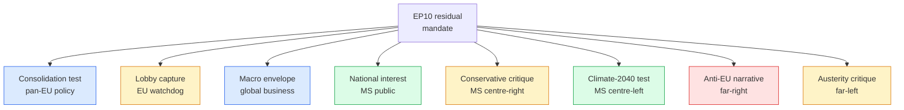

# Extended — Media Framing Analysis (Term Outlook 2026-05-28)

> How European media is likely to frame the residual EP10 mandate.
> Combines historical EP9 framing patterns with WP25-specific cluster
> sensitivities.

## 1. Top-line media framing thesis

Coverage of the residual EP10 mandate will be **bifurcated**: pan-EU
media (Politico Europe, Euractiv, EUobserver, Financial Times) will
frame the period as **"the consolidation test"** — can the von der
Leyen II Commission and the EPP+S&D+Renew majority deliver on the
51-file WP25 backbone before the 2029 election cycle? National media
will frame the period through **national-interest filters**, with
defence + migration cluster coverage dominating in Big-6 jurisdictions.

## 2. Outlet typology + framing

| Outlet tier | Examples | Dominant frame | WP25 cluster focus |
|---|---|---|---|
| Pan-EU policy | Politico Europe, Euractiv | "Consolidation test" | Defence, single market |
| EU watchdog | EUobserver, Investigate Europe | "Lobby capture" | Climate, MFF |
| Global business | FT, Bloomberg, Reuters | "Macro envelope" | Trade, single market |
| MS public broadcaster | ARD, France TV, RAI | "National interest" | Migration, MFF |
| MS conservative press | Bild, Le Figaro, Welt | "Conservative critique" | Migration, climate |
| MS progressive press | Le Monde, El País, La Repubblica | "Climate-2040 test" | Climate, trade |
| Far-right ecosystem | Compact, Boulevard Voltaire | "Anti-EU narrative" | Migration, climate |
| Far-left ecosystem | Mediapart, ContraSenso | "Austerity critique" | MFF, CAP |

## 3. Framing-cluster Mermaid



## 4. Cluster-by-cluster framing forecast

### 4.1 Defence cluster

- **Pan-EU policy**: framed as the WP25 *signature win* — Defence Union
  package, ASAP-2 / EDIP / PADR scaling.
- **National media (DE, PL, NL)**: framed as *fiscal opportunity* (DE)
  / *security necessity* (PL) / *EDF participation* (NL).
- **Far-right**: framed as *military-industrial complex consolidation*
  or *abdication of sovereignty*.
- **Likely volume**: HIGH (daily during Q4 2026 + Q1 2027 trilogues).

### 4.2 Climate cluster

- **Pan-EU policy**: framed as the *Climate-2040 stress test* — can
  the EPP hold without Greens defection?
- **MS centre-left**: framed as *generational obligation*.
- **MS conservative**: framed as *competitiveness drag*, *rural
  burden*.
- **Likely volume**: HIGH during Q2 2027 (Climate-2040 vote) + Q3 2028
  (CAP reform).

### 4.3 Migration cluster

- **All tiers**: high volume, polarised framing.
- **Likely volume**: HIGH (continuous baseline; spikes on every shock).

### 4.4 MFF mid-term cluster

- **Pan-EU policy**: framed as the *true test of Council unanimity*.
- **MS net-contributors (DE, NL)**: framed as *fiscal discipline*.
- **MS net-recipients (PL, ES, IT)**: framed as *cohesion*.
- **Likely volume**: HIGH during Q4 2026 (proposal) + Q2 2028 (EUCO
  endorsement).

### 4.5 Trade cluster

- **Global business**: framed as *bridge between EU + US* (Mercosur,
  IPEF, China trade).
- **Likely volume**: MEDIUM, spike-driven.

## 5. Framing-volume forecast (qualitative)

```mermaid
gantt
    title Media framing volume forecast (Q3 2026 - Q2 2029)
    dateFormat YYYY-Q
    axisFormat %YQ%q
    section Defence
    Continuous HIGH baseline :2026-Q3, 12q
    section Climate
    Continuous MEDIUM, spikes Q2-2027 + Q3-2028 :2026-Q3, 12q
    section Migration
    Continuous HIGH baseline :2026-Q3, 12q
    section MFF
    Spike Q4-2026 + Q2-2028 :2026-Q4, 1q
    Spike Q2-2028 :2028-Q2, 1q
    section Trade
    Spike-driven MEDIUM :2026-Q3, 12q
```

## 6. Misinformation + disinformation risk

- **Far-right ecosystem**: anti-EU narrative amplification on migration
  + climate. Cross-platform coordinated inauthentic behaviour likely on
  Climate-2040 vote (Q2 2027) and 2029 EP election campaign.
- **Foreign-influence operations**: Russia-Ukraine context creates
  active foreign-influence environment. EP Defence Union package
  particularly vulnerable.
- **Mitigation**: DSA enforcement under Commission DG CNECT; EP DG
  COMM strategic-communications response.

## 7. Article framing recommendations

For the term-outlook article rendered from this analysis:

- **Headline frame**: "consolidation test" (pan-EU policy frame) —
  most defensible, least partisan.
- **Sub-headlines**: cluster-by-cluster framing reflecting
  multi-stakeholder positions.
- **Caveat language**: explicit acknowledgement of cluster-specific
  fragility (climate, migration).
- **Avoid**: partisan-coded language; over-confident projections; any
  framing that anchors only one ideological position.

## 8. Cross-references

- `intelligence/stakeholder-map.md` — actor universe.
- `intelligence/synthesis-summary.md` — top-line judgement.
- `intelligence/scenario-forecast.md` — scenario contingency.

## 9. SATs applied

- **Audience analysis** — outlet × frame matrix.
- **Discourse analysis** — frame inventory.

## 10. WEP / Admiralty grading

- Outlet typology: 🟡 MEDIUM, C3.
- Cluster-by-cluster forecast: 🟡 MEDIUM, C3.
- Volume forecast: 🟡 MEDIUM, C3.

## 11. Editorial cadence forecast

Coverage volume will *not* be uniform across the mandate. Editorial
cadence forecast (qualitative):

- **Q3 2026 → Q1 2027**: ramp-up phase. Coverage focuses on
  presidency hand-overs (DK 2026 H2 → CY 2027 H1) and Defence Union
  package introduction.
- **Q2 2027 → Q1 2028**: peak intensity. Climate-2040 vote (Q2 2027)
  produces highest single-event coverage spike. MFF mid-term
  positioning (Q4 2027 → Q1 2028) sustains coverage.
- **Q2 2028 → Q1 2029**: pre-election ramp-up. EU election cycle
  framing displaces policy framing.
- **Q2 2029**: election + aftermath. Editorial framing pivots to
  EP11 transition.

## 12. Platform + format breakdown

| Format | Likely volume | WP25 cluster lead |
|---|:---:|---|
| Long-form policy analysis (Euractiv, Politico) | HIGH | Defence, single market |
| Investigative (EUobserver, Investigate Europe) | MEDIUM | Climate, MFF |
| Breaking news (Reuters, AFP) | HIGH | Migration, defence |
| Opinion / op-ed | HIGH | All clusters |
| Podcast / video | MEDIUM-HIGH | Defence, climate |
| Social media (Twitter / Mastodon / BlueSky) | HIGH | All clusters; polarised |

## 13. Re-evaluation cadence

Media-framing analysis refreshed at every term-outlook semi-annual cron.
