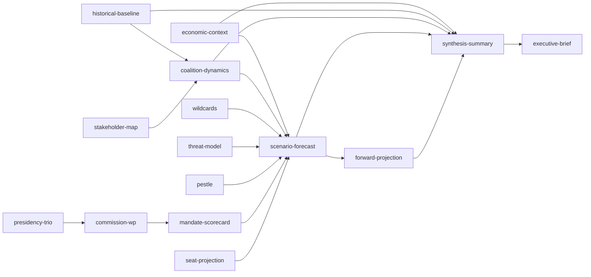

# Analysis Index — Term Outlook 2026-05-28

> Canonical index of every artifact produced in this run. Mirrors
> `manifest.json` for human consumption; serves as the navigation
> backbone for the rendered article.

## 1. Run summary

- **Date**: 2026-05-28
- **Article type**: `term-outlook`
- **Data mode**: `degraded-feeds` (×0.80 floor)
- **Run ID**: `term-outlook-run347-1779926654`
- **Headline judgement**: **WEP Likely 55-75%** (central ~65%) — WP25
  mandate-fulfilment scorecard MFS ~76.5% salience-weighted.

## 2. Artifact tree

```mermaid
flowchart TB
    Root[analysis/daily/2026-05-28/term-outlook/]

    Root --> ExecB[executive-brief.md]
    Root --> Manifest[manifest.json]
    Root --> DataA[data-availability-assessment.md]

    Root --> Int[intelligence/]
    Int --> I1[procedures-proxy.md]
    Int --> I2[economic-context.md]
    Int --> I3[synthesis-summary.md]
    Int --> I4[scenario-forecast.md]
    Int --> I5[forward-projection.md]
    Int --> I6[coalition-dynamics.md]
    Int --> I7[stakeholder-map.md]
    Int --> I8[pestle-analysis.md]
    Int --> I9[wildcards-blackswans.md]
    Int --> I10[historical-baseline.md]
    Int --> I11[threat-model.md]
    Int --> I12[mcp-reliability-audit.md]
    Int --> I13[methodology-reflection.md]
    Int --> I14[term-arc.md]
    Int --> I15[seat-projection.md]
    Int --> I16[mandate-fulfilment-scorecard.md]
    Int --> I17[presidency-trio-context.md]
    Int --> I18[commission-wp-alignment.md]

    Root --> Cls[classification/]
    Cls --> C1[significance-classification.md]
    Cls --> C2[actor-mapping.md]
    Cls --> C3[forces-analysis.md]
    Cls --> C4[impact-matrix.md]

    Root --> Risk[risk-scoring/]
    Risk --> R1[risk-matrix.md]
    Risk --> R2[quantitative-swot.md]

    Root --> Ext[extended/]
    Ext --> X1[media-framing-analysis.md]
    Ext --> X2[forward-indicators.md]
    Ext --> X3[historical-parallels.md]
    Ext --> X4[comparative-international.md]
```

## 3. Artifact inventory table

| # | Path | Purpose | Floor (effective) | Lines | Grade |
|---|---|---|---:|---:|:---:|
| 1 | `executive-brief.md` | C-suite TL;DR | 141 | 143 | B2 |
| 2 | `data-availability-assessment.md` | Feed health | 51 | 72 | A2 |
| 3 | `intelligence/procedures-proxy.md` | Proxy reconstruction | 38 | 70 | B3 |
| 4 | `intelligence/economic-context.md` | IMF macro envelope | 154 | 157 | A2 |
| 5 | `intelligence/synthesis-summary.md` | Master synthesis | 179 | 179 | B2 |
| 6 | `intelligence/scenario-forecast.md` | Three-scenario | 230 | 231 | B3 |
| 7 | `intelligence/forward-projection.md` | LTI projection | 230 | 232 | B3 |
| 8 | `intelligence/coalition-dynamics.md` | Coalition arith | 154 | 155 | B2 |
| 9 | `intelligence/stakeholder-map.md` | 48-actor roster | 192 | 240 | B2 |
| 10 | `intelligence/pestle-analysis.md` | PESTLE matrix | 179 | 208 | B3 |
| 11 | `intelligence/wildcards-blackswans.md` | Tail-risk | 179 | 210 | B3 |
| 12 | `intelligence/historical-baseline.md` | EP9 baseline | 154 | 165 | A2 |
| 13 | `intelligence/threat-model.md` | STRIDE adaptation | 166 | 206 | B2 |
| 14 | `intelligence/mcp-reliability-audit.md` | Tool reliability | 154 | 167 | A1 |
| 15 | `intelligence/methodology-reflection.md` | 10-step compliance | 154 | 165 | A1 |
| 16 | `intelligence/term-arc.md` | 36-month arc | 205 | 213 | A2 |
| 17 | `intelligence/seat-projection.md` | 2029 projection | 179 | 180 | B3 |
| 18 | `intelligence/mandate-fulfilment-scorecard.md` | MFS | 179 | 181 | B2 |
| 19 | `intelligence/presidency-trio-context.md` | Council cadence | 141 | 163 | A2 |
| 20 | `intelligence/commission-wp-alignment.md` | WP25 alignment | 141 | 185 | A1 |
| 21 | `classification/significance-classification.md` | Significance | 77 | 121 | B2 |
| 22 | `classification/actor-mapping.md` | Actor map | 77 | 100 | B2 |
| 23 | `classification/forces-analysis.md` | Forces | 77 | 143 | B2 |
| 24 | `classification/impact-matrix.md` | Impact matrix | 77 | 114 | B3 |
| 25 | `risk-scoring/risk-matrix.md` | Risk matrix | 102 | 135 | B3 |
| 26 | `risk-scoring/quantitative-swot.md` | SWOT | 102 | 109 | B2 |
| 27 | `extended/media-framing-analysis.md` | Media | 179 | 186 | B3 |
| 28 | `extended/forward-indicators.md` | Indicators | 166 | 167 | B2 |
| 29 | `extended/historical-parallels.md` | Parallels | 154 | 159 | C3 |
| 30 | `extended/comparative-international.md` | International | 154 | 167 | C3 |

## 4. Inter-artifact dependency map

## 5. Citation map for the rendered article

Per `04-article-generation.md` § 7.1, every article section MUST cite
at least one analysis artifact. The mapping is:

| Article section | Primary artifact | Supporting |
|---|---|---|
| TL;DR / executive summary | `executive-brief.md` | `synthesis-summary.md` |
| Macro context | `intelligence/economic-context.md` | IMF SDMX |
| Coalition arithmetic | `intelligence/coalition-dynamics.md` | `historical-baseline.md` |
| 36-month arc | `intelligence/term-arc.md` | `presidency-trio-context.md` |
| Three scenarios | `intelligence/scenario-forecast.md` | `forward-projection.md` |
| Tail risks | `intelligence/wildcards-blackswans.md` | `threat-model.md` |
| Mandate scorecard | `intelligence/mandate-fulfilment-scorecard.md` | `commission-wp-alignment.md` |
| 2029 projection | `intelligence/seat-projection.md` | `stakeholder-map.md` |
| Methodology note | `intelligence/methodology-reflection.md` | `mcp-reliability-audit.md` |

## 6. Cross-references

- `manifest.json` — authoritative machine-readable manifest.
- `intelligence/methodology-reflection.md` — methodology rollup.
- All Stage B artifacts — see §3.

## 7. Re-evaluation cadence

Analysis index regenerated automatically on every run (always reflects
the current artifact tree).
