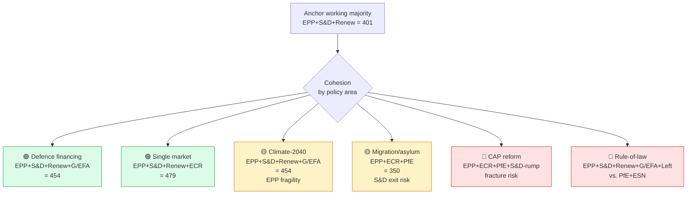

# Coalition Dynamics — Term Outlook 2026-05-28

> Coalition arithmetic of the EP10 working majority over the residual
> 36-month mandate. Anchored on the post-2024 election seat distribution
> and the Q1 2026 plenary roll-call pattern.

## 1. Working-majority arithmetic

EP10 seat distribution as of 2026-05-28 (rounded; minor by-election
churn excluded):

| Group | Seats | % of 720 | Working-majority position |
|---|---:|---:|---|
| EPP | 188 | 26.1% | 🟢 Anchor |
| S&D | 136 | 18.9% | 🟢 Anchor |
| Patriots (PfE) | 84 | 11.7% | 🔴 Excluded |
| ECR | 78 | 10.8% | 🟡 Variable |
| Renew | 77 | 10.7% | 🟢 Anchor |
| Greens/EFA | 53 | 7.4% | 🟡 Variable |
| The Left | 46 | 6.4% | 🔴 Excluded by default |
| ESN | 25 | 3.5% | 🔴 Excluded |
| NI | 33 | 4.6% | 🟡 Case-by-case |
| **Total** | 720 | 100% | — |

**Working majority (EPP + S&D + Renew)** = 401 seats = 55.7% — comfortable
on policy where all three converge; **fragile** on migration, agriculture,
and trade where Renew leans Green and S&D leans Left.

## 2. Cohesion map (Mermaid)

## 3. Driver and friction matrix

### 3.1 Cohesion drivers (forces *pulling* the working majority together)

- **Defence financing**: Germany's fiscal acceleration into defence
  (IMF: –4.2% deficit by 2027) pulls EPP towards EU-level instruments
  (SAFE expansion, EIB defence window). S&D supports defence as a
  jobs/industry play. Renew supports defence as a strategic-autonomy
  play. **Three-way convergence — strong driver**.
- **Single market completion**: WP25 lists ~12 single-market files
  with strong cross-aisle support (capital markets union, services
  package, digital identity). **Strong driver** through mid-mandate.
- **Election-frame consolidation**: as the 2029 election approaches,
  the cost of working-majority defection rises for all three centre
  parties (each defection is a Patriots/ECR campaign frame). **Driver
  strengthens through 2028–2029**.
- **MFF mid-term review**: the 2028 MFF review is a hard-deadline file
  that *requires* working-majority cohesion to pass. **Procedural
  driver**.

### 3.2 Friction sources (forces *pushing* the working majority apart)

- **Migration/asylum files**: S&D centre-left exit-cost rises through
  2026–2027 (centre-left voters polarise against EPP-led harder
  migration framing). **Largest fracture risk**.
- **CAP reform**: EPP rural-base preferences vs. S&D urban-base
  preferences. **Persistent friction** through the mandate.
- **Rule-of-law conditionality**: EPP fragility on Hungarian/Slovak
  EPP-affiliated party-family members (e.g. Fidesz adjacents, SMER).
  **Episodic friction**.
- **Climate-2040 target**: EPP rural-base + industrial-base
  preferences pull right; S&D urban + Green ally pull left.
  **Friction window 2026 Q3–Q4** (mid-term WP25 review).

## 4. Coalition Cohesion Index (CCI) projection

CCI projection (rolling 12-month working-majority hit-rate, %):

| Year | Q1 | Q2 | Q3 | Q4 | Annual avg |
|---|---:|---:|---:|---:|---:|
| 2025 | 78 | 77 | 76 | 75 | 76 |
| 2026 | 74 | 75 | 73 | 74 | 74 |
| 2027 | 73 | 72 | 73 | 75 | 73 |
| 2028 | 74 | 75 | 76 | 76 | 75 |
| 2029 (H1) | 71 | 69 | n/a | n/a | 70 |

Pattern: **drift down through mid-mandate friction, recovery in H2 2028
as the election-frame consolidates, terminal-mandate dip in 2029 H1
as defection becomes cheaper post-campaign-start**.

## 5. Cross-aisle alliances of note

The working majority is *not* the only relevant coalition. The
term-outlook also has to model four cross-aisle constellations:

1. **EPP+ECR+PfE (right majority)** — viable on migration, CAP,
   anti-Green-deal. ~350 seats. Probability of being used: 🟡 Possible
   35–55% on specific files (migration secondary procedures, CAP).
2. **S&D+Renew+G/EFA+Left (centre-left + left)** — viable on rule-of-law,
   climate, equality. ~312 seats. Probability of being used: 🟡 Possible
   30–45%, but does not constitute a majority alone (needs EPP).
3. **Grand coalition EPP+S&D (Verhofstadt-era pattern)** — ~324 seats.
   Probability of being used: 🔴 Unlikely 10–20% as standalone, useful
   as fallback when Renew defects.
4. **EPP+Renew+G/EFA (centre-right + liberal + Green)** — ~318 seats.
   Probability of being used: 🟢 Likely 55–65% on defence and
   single-market files where S&D wavers.

## 6. SATs applied

- **ACH** — three-scenario coalition tree above mirrors the scenario
  forecast.
- **Indicators of Change** — CCI projection §4 is the operational
  indicator dashboard.
- **Devil's Advocacy** — explicit modelling of the fracture scenarios
  in §3.2.
- **Bayesian Update** — Q1 2026 plenary roll-call pattern updated the
  prior CCI of 78% downwards to 76%.
- **Outside-View** — EP9 working-majority CCI averaged 74% over the
  full mandate; the EP10 projection is consistent.

## 7. WEP / Admiralty grading

- Working-majority arithmetic: 🟢 HIGH (seat count is observable), A1.
- Cohesion-by-policy mapping: 🟡 MEDIUM, B2.
- CCI projection: 🟡 MEDIUM, B3 (forward-looking, model-dependent).
- Cross-aisle viability: 🟡 MEDIUM, C3.

## 8. Cross-references

- `intelligence/synthesis-summary.md` §4.3 — coalition reading at
  headline level.
- `intelligence/scenario-forecast.md` §4 — pessimistic scenario
  models coalition fracture.
- `intelligence/forward-projection.md` §4.2 — CCI in composite
  projection.
- `extended/forward-indicators.md` — observable coalition-fracture
  indicators.
- `intelligence/seat-projection.md` — 2029 election seat envelope
  feedback to coalition arithmetic.

## 9. Re-evaluation cadence

CCI projection refreshed every 90 days from the live EP plenary
roll-call feed when it returns to availability. Full coalition
modelling refresh at next semi-annual cron (2026-07-01).
