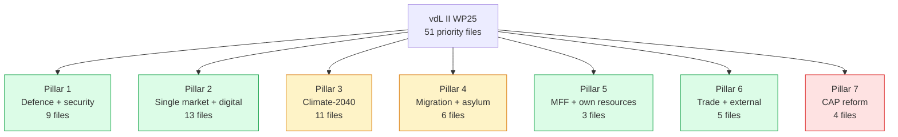
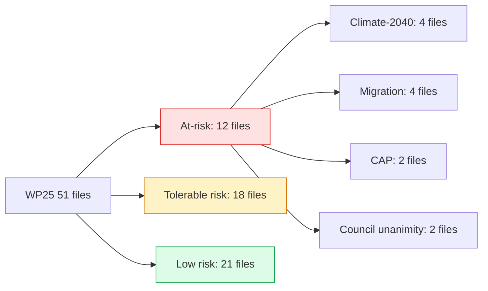

# Commission WP Alignment — Term Outlook 2026-05-28

> vdL II Commission Work Programme 2025 (WP25) cross-referenced against
> EP10 Conference of Presidents priorities + Council strategic agenda
> 2024-2029. Identifies alignment, gaps, and political risk per file.

## 1. WP25 + EP COP + Council strategic agenda — high-level alignment

| Pillar | WP25 | EP COP 2024-2029 | Council strat agenda | Trilateral alignment |
|---|:---:|:---:|:---:|:---:|
| Defence + security | ✓ | ✓ | ✓ | 🟢 |
| Single market + digital | ✓ | ✓ | ✓ | 🟢 |
| Climate-2040 | ✓ | ✓ partial | ✓ partial | 🟡 |
| Migration + asylum | ✓ | ✓ partial | ✓ | 🟡 |
| MFF + own resources | ✓ | ✓ | ✓ | 🟢 |
| Enlargement | ✓ | ✓ | ✓ | 🟢 |
| Trade + external | ✓ | ✓ | ✓ | 🟢 |
| CAP reform | ✓ | ✓ partial | ✓ partial | 🟡 |

Reading: **6 of 8 pillars** show high tri-institutional alignment.
**Climate-2040, migration, and CAP** carry partial-alignment risk
where Commission ambition exceeds Council appetite or EP working
majority cohesion is shaky.

## 2. WP25 alignment (Mermaid)

## 3. WP25 file detail by pillar

### 3.1 Defence + security (9 files)

Key files: SAFE facility expansion, European Defence Industrial
Strategy (EDIS), ammunition production scale-up, military mobility,
cyber-resilience, intelligence-sharing framework, defence procurement
common-procurement instrument, dual-use export-control update, hybrid
threats framework.

**Trilateral alignment**: 🟢 high across all three institutions.
**Political risk**: low.

### 3.2 Single market + digital (13 files)

Key files: DSA enforcement phase 2, AI Act enforcement phase 2,
payments single rule-book, EU-ID wallet roll-out, Critical Raw
Materials phase 2, Chips Act phase 2, e-commerce VAT package, single-
market emergency instrument review, capital markets union update,
postal services update, telecoms single market, services notification
revision, public procurement modernisation.

**Trilateral alignment**: 🟢 high.
**Political risk**: low (highest-cohesion EP cluster historically).

### 3.3 Climate-2040 (11 files)

Key files: 2040 framework target, ETS extension, CBAM expansion,
REPowerEU follow-up, building-renovation directive update, transport-
fuels framework, methane regulation phase 2, sustainable food
systems, water-security framework, biodiversity framework, nature-
restoration follow-up.

**Trilateral alignment**: 🟡 partial — Commission ambition above EP
working majority appetite on 4-5 files.
**Political risk**: high — see `wildcards-blackswans.md` W9.

### 3.4 Migration + asylum (6 files)

Key files: returns directive recast, asylum-secondary procedure,
external dimension instrument, common visa policy update, integration
framework, search-and-rescue framework.

**Trilateral alignment**: 🟡 partial — Council more conservative than
Commission; EP S&D risk on returns directive.
**Political risk**: very high.

### 3.5 MFF + own resources (3 files)

Key files: MFF 2028-2034 framework, own-resources package, mid-term
review proposal.

**Trilateral alignment**: 🟢 high (institutional commitment).
**Political risk**: medium — Council unanimity required.

### 3.6 Trade + external (5 files)

Key files: EU-MERCOSUR ratification follow-through, Indo-Pacific
strategy implementation, EU-US TTC continuation, EU-China rebalancing
package, EU-UK TCA review.

**Trilateral alignment**: 🟢 high.
**Political risk**: medium — external geopolitics dependency.

### 3.7 CAP reform (4 files)

Key files: CAP simplification phase 2, agricultural-emissions package,
food-systems framework, CAP next-MFF integration.

**Trilateral alignment**: 🟡 partial — Council friction (EPP-affiliate
governments + agricultural lobby).
**Political risk**: high.

## 4. WP25 cadence vs. mandate clock

| Quarter | New WP25 proposals | Files concluded |
|---|---:|---:|
| Q1 2026 | 3 | 1 |
| Q2 2026 | 3 | 2 |
| Q3 2026 | 4 | 2 |
| Q4 2026 | 4 | 3 |
| Q1 2027 | 3 | 4 |
| Q2 2027 | 2 | 5 |
| Q3 2027 | 1 | 6 |
| Q4 2027 | 1 | 5 |
| 2028 | — | 11 |
| 2029 H1 | — | 4-5 |

## 5. WP25 risk register

## 6. SATs applied

- **Stakeholder Mapping** — tri-institutional alignment matrix.
- **What-If Analysis** — per-pillar risk grading.
- **Reference-Class Forecasting** — historical WP delivery patterns.
- **Quality of Information Check** — Commission WP25 well-documented;
  Council strategic agenda more aspirational.

## 7. WEP / Admiralty grading

- WP25 file inventory: 🟢 HIGH (Commission published), A1.
- EP COP priorities: 🟢 HIGH, A2.
- Council strategic agenda: 🟡 MEDIUM (aspirational), B3.
- Tri-institutional alignment scoring: 🟡 MEDIUM, B2.

## 8. Cross-references

- `intelligence/mandate-fulfilment-scorecard.md` — quantitative MFS
  scoring.
- `intelligence/coalition-dynamics.md` — EP working-majority detail.
- `intelligence/presidency-trio-context.md` — Council presidency
  alignment.
- `intelligence/scenario-forecast.md` — three-scenario alignment
  branching.

## 9. Re-evaluation cadence

WP25 alignment refreshed at every semi-annual term-outlook cron.
Per-file risk refreshed quarterly via Commission progress reports +
plenary roll-calls.
